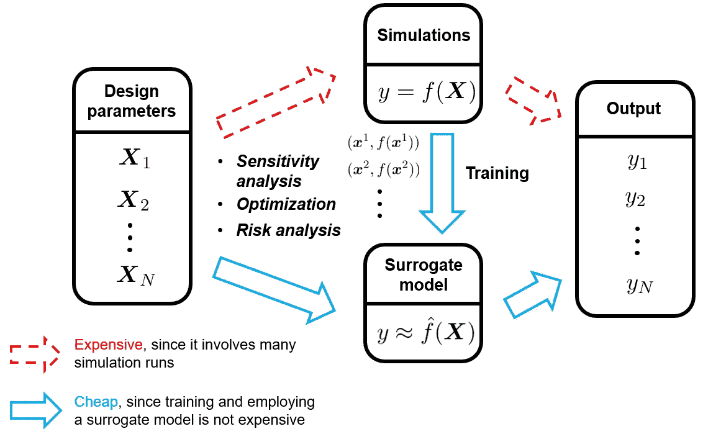
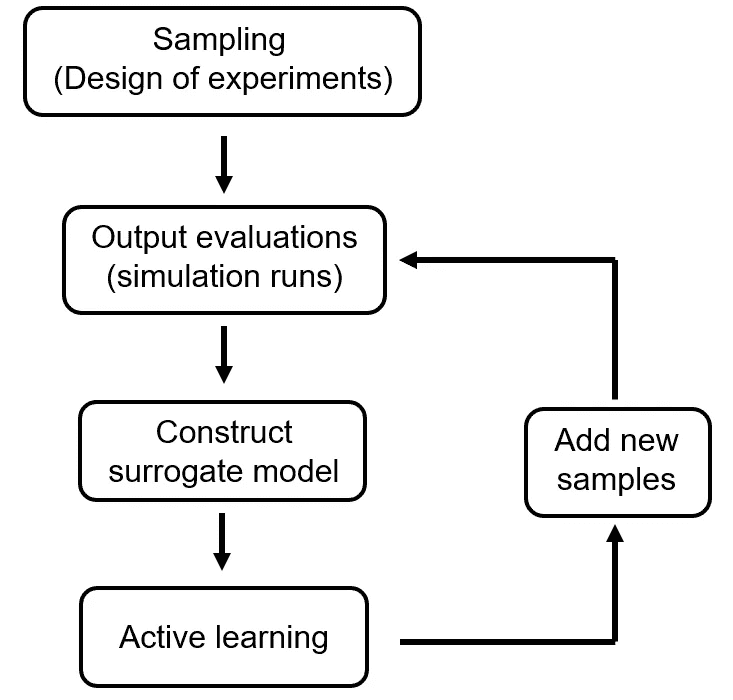

# 代理建模介绍，第一部分:基础知识

> 原文：<https://towardsdatascience.com/an-introduction-to-surrogate-modeling-part-i-fundamentals-84697ce4d241?source=collection_archive---------2----------------------->

## [代理建模](https://towardsdatascience.com/tagged/surrogate-modeling)

## 加速工程设计的机器学习方法

由[卢克·切瑟](https://unsplash.com/@lukechesser?utm_source=medium&utm_medium=referral)在 [Unsplash](https://unsplash.com?utm_source=medium&utm_medium=referral) 上拍摄的照片

在工程中，产品设计很大程度上依赖于在各种设计参数下对产品性能的全面分析。这些分析大多是通过高保真、耗时的计算机模拟进行的。

为了更快地将产品推向市场，加速这些基于模拟的分析是关键。为此，一种叫做*代理建模*的数据驱动方法最近在各个工程领域越来越受欢迎。

在本博客的第一部分，我们将通过以下几个方面来关注这种方法的基本原理:

*   动机:为什么我们需要一种方法来加速计算机模拟？
*   解决方案:代理建模对这种情况有什么帮助？
*   细节:如何实际应用代理建模？

本文末尾列出了第一部分的要点。

在[第二部分](/an-introduction-to-surrogate-modeling-part-ii-case-study-426d8035179e)中，我们将通过一个案例研究来演示实际代理建模的关键步骤。

在[第三部分](/an-introduction-to-surrogate-modeling-part-iii-beyond-basics-a60125767271)中，我们将简要介绍一些高级概念，以进一步增强代理建模能力。

**目录**
[1。需要加速的计算机模拟](#79b4)
[2。代理造型](#91b2)
∘ [2.1 创意](#9f6c)
∘ [2.2 特征](#6552)
[3 .代理建模的工作流程](#bedb)
∘ [3.1 采样](#422c)
∘ [3.2 输出评估](#ba05)
∘ [3.3 构造代理模型](#7dac)
∘ [3.4 主动学习](#1845)
∘ [3.5 充实训练数据集](#3d67)
[4 .关键要点](#7d9a)
[延伸阅读](#d369)
[关于作者](#65b7)

# 1.加速计算机模拟的需要

计算机模拟被设计成通过求解相应的物理过程的数学方程来预测物理系统的行为。例如，工程师使用空气动力学模拟来计算飞机的阻力和升力，并使用结构动力学模拟来确定飞机机翼的强度。

这些模拟是有价值的，因为它们为工程师提供了对产品性能的丰富见解，而无需实际构建产品，因此在虚拟原型中起着至关重要的作用。

为了促进高效可靠的设计流程，工程师通常需要执行:

*   **灵敏度分析**，探索设计参数变化时的产品行为；
*   **优化**，找到产生最高性能和/或最低成本的最佳设计参数；
*   **风险分析**(或**不确定性量化**)，计算设计参数不确定时产品失效的风险。

上述分析有一个共同点，即它们都需要*大量的模拟运行*，其中每次运行都采用不同的设计参数组合作为输入。(注:关于为什么风险分析需要多次模拟运行，可以查看我之前的帖子:**[**管理计算科学与工程中的不确定性**](/managing-uncertainty-in-computational-science-and-engineering-5e532085512b)**)****

****不幸的是，计算机模拟通常不便宜:在工业中，在集群上运行的单个模拟通常需要几天才能完成。因此，需要许多模拟运行的分析将导致令人望而却步的计算成本，从而使它们在实践中不可行。****

****那么我们如何解决这个问题呢？代理建模可能会对此有所启发。****

# ****2.代理建模****

## ****2.1 理念****

****代理建模是如何做到这一点的:它构建一个*统计模型*(或*代理模型*)来精确地逼近模拟输出。随后，这种经过训练的统计模型可以被部署来代替原始的计算机模拟，以执行敏感性分析、优化或风险分析。****

********

****图 1 使用替代模型来代替昂贵的计算机模拟是提高分析效率的一种方式。(图片由作者提供)****

****由于训练统计模型的单次评估通常比原始模拟的单次评估快得多，所以在给定各种设计参数组合的情况下，执行成百上千次输出评估不再是问题。总之，代理建模技术使得那些昂贵的分析变得可以承受。****

## ****2.2 特征****

****代理模型，也称为元模型或模拟器，使用数据驱动的方法进行训练。它的训练数据是通过在设计参数空间中几个智能选择的位置探测模拟输出而获得的。在这些位置中的每一个，进行完全模拟以计算相应的模拟输出。****

****通过将成对的输入(设计参数)和它们相应的输出组合成训练数据集，我们可以基于获得的数据集建立统计模型。****

****嗯，根据标记的训练数据集训练预测模型，这听起来像有监督的机器学习吗？确实是的！代理建模是监督机器学习应用于工程设计领域的一个特例。那些流行的机器学习技术，如多项式回归、支持向量机、高斯过程、神经网络等。，也被广泛采用为代理模型，以加速产品设计和分析过程。****

****由于这种联系，工程师可以方便地利用机器学习中的既定实践来构建、验证和选择代理模型，并有效地解决相关的欠拟合/过拟合问题。****

# ****3.代理建模的工作流程****

********

****图 2 代理建模工作流程(图片由作者提供)****

## ****3.1 取样****

****我们从生成初始训练数据开始。为了实现这一点，我们从参数空间中仔细选择设计参数的样本。这种做法也被称为 [*设计实验*](https://en.wikipedia.org/wiki/Design_of_experiments) *。*****

****在这个阶段，最好让样本均匀分布在参数空间中。这是有益的，因为我们可以从所研究的参数空间的所有区域获得近似输入-输出关系的代表。通常，*空间填充采样方案*用于产生具有上述性质的样本。这一类中最著名的是 [**拉丁超立方体方案**](https://en.wikipedia.org/wiki/Latin_hypercube_sampling) 。****

## ****3.2 产出评估****

****一旦我们确定了初始训练样本，我们需要通过运行它们来计算它们相应的输出值。在组合成对的选定训练样本及其相应的输出值之后，我们现在有了初始训练数据集。****

## ****3.3 构建代理模型****

****在这一步中，我们通过使用上一步中收集的训练数据来构建代理模型。这里，应该采用模型验证和选择的已建立的机器学习实践来指导模型训练过程。此外，高级机器学习技术，如 bagging 和 boosting，可以进一步增强代理模型的性能。****

## ****3.4 主动学习****

****一般来说，分析师无法预见建立一个准确的替代模型所需的样本数量。这是由近似输入-输出关系的复杂性决定的。因此，随着训练的进行，丰富训练数据集更有意义。这种做法被称为*主动学习*。****

****为此，我们可以使用特制的*学习函数*来帮助我们识别下一个具有最高信息价值的样本。这些学习功能被设计成将样本分配到****

*   ****代理模型被认为是不准确或不确定的，****
*   ****或者应用于设计参数的特别感兴趣的组合所在的区域，例如可能包含设计参数的全局最优值的区域。****

## ****3.5 丰富训练数据集****

****一旦识别出新的样本，就执行新的模拟运行来计算其相应的输出值。随后，在丰富的训练数据集上重新训练代理模型。我们重复这个过程，直到我们对代理模型的准确性感到满意。****

# ****4.关键要点****

****在这篇博客中，我们介绍了代理建模的基本思想:****

*   ****产品设计依靠**计算机模拟**来评估产品性能和探索新的设计理念。****
*   ****许多模拟运行在计算上可能过于昂贵，从而严重限制了产品设计和分析的效率。****
*   ******代理建模技术**，构建评估成本低廉的统计模型来精确逼近模拟输出，可以规避这个问题。****
*   ****代理建模是**监督机器学习**应用于工程设计领域的一个特例。****
*   ****代理模型不是在预先固定的数据集上进行训练，而是使用**主动学习**来随着训练的进行丰富训练数据，这大大提高了训练的效率和准确性。****

****在下一篇博客中，我们将通过一个工业实例来了解如何利用代理建模来促进依赖性可视化和加速不确定性量化分析。那里见！****

# ****延伸阅读:****

****[1] Alexander I. J. Forrester，András Sóbester，Andy J. Keane，*通过代理建模进行工程设计:实用指南*，2008 年。****

# ****关于作者****

> *****我是一名博士研究员，致力于航空航天应用的不确定性量化和可靠性分析。统计学和数据科学是我日常工作的核心。我喜欢分享我在迷人的统计世界中学到的东西。查看我以前的帖子以了解更多信息，并在* [*中*](https://shuaiguo.medium.com/) *和*[*Linkedin*](https://www.linkedin.com/in/shuaiguo16/)*上与我联系。*****