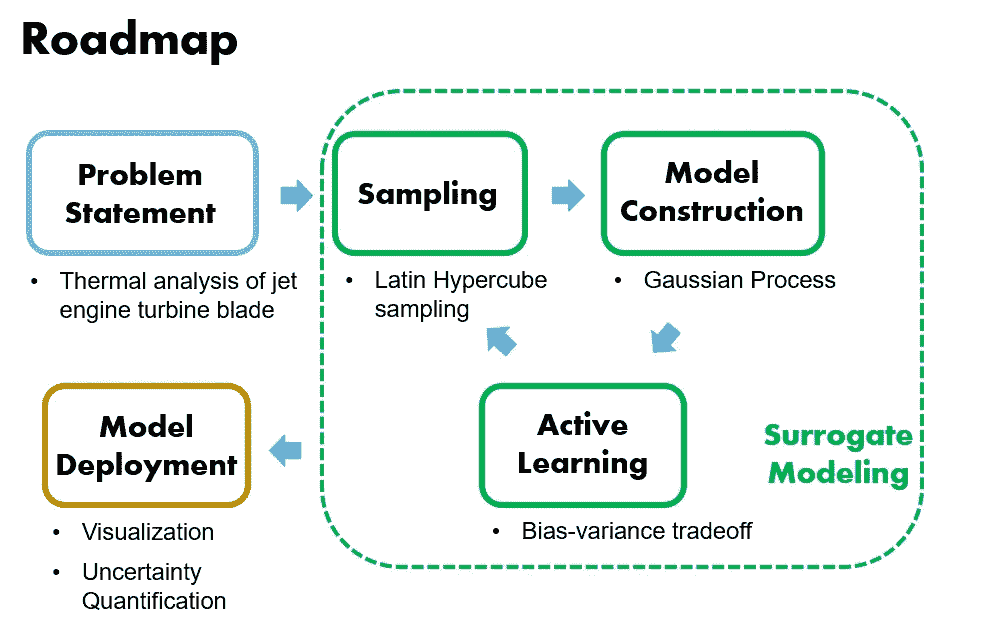
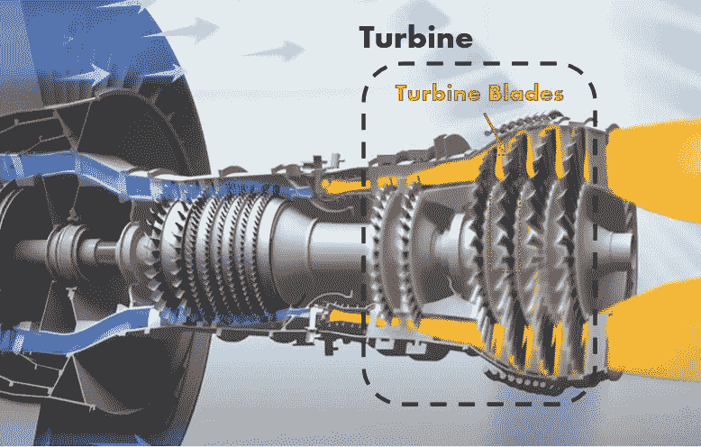
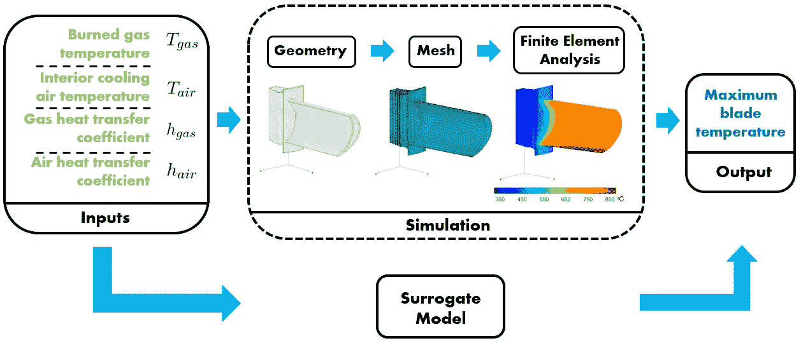
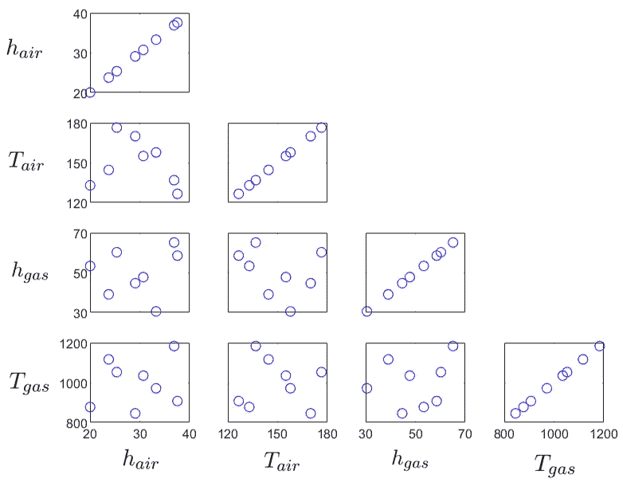
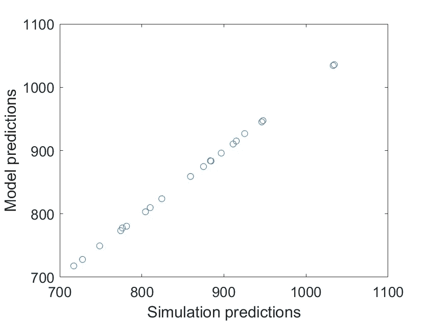
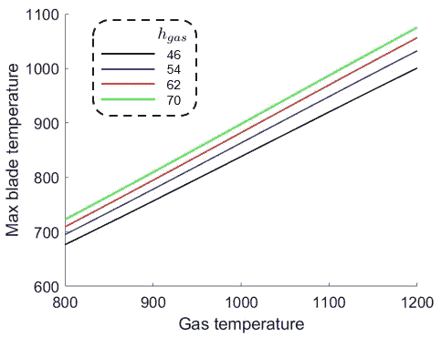
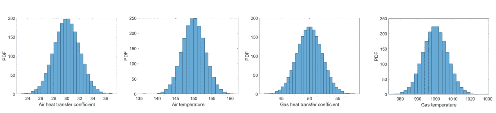
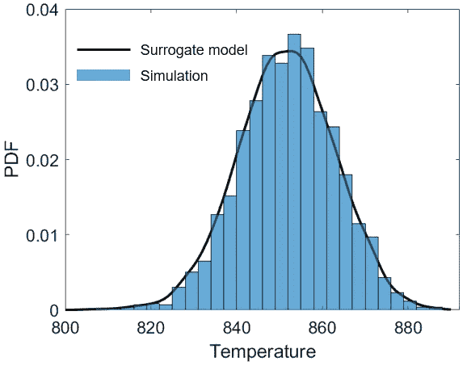

# 代理建模介绍，第二部分:案例研究

> 原文：<https://towardsdatascience.com/an-introduction-to-surrogate-modeling-part-ii-case-study-426d8035179e?source=collection_archive---------14----------------------->

## [代理建模](https://towardsdatascience.com/tagged/surrogate-modeling)

## 加速工程设计的机器学习方法

由[维克多·福加斯](https://unsplash.com/@sonance?utm_source=medium&utm_medium=referral)在 [Unsplash](https://unsplash.com?utm_source=medium&utm_medium=referral) 上拍摄的照片

在本系列的第一部分中，我们介绍了使用代理模型来加速基于模拟的产品设计过程的想法。这是通过训练一个统计模型来实现的，该模型在执行各种设计任务时充当模拟的廉价而精确的*替代物*，从而显著提高分析效率。

在第二部分中，我们将通过一个案例研究来演示如何在实践中使用代理模型。本案例研究的路线图如下所示:

图 1 路线图。(图片由作者提供)

我们将首先介绍问题的物理背景，然后将代理建模技术应用到问题中。最后，我们将说明如何使用经过训练的代理模型来执行两种类型的分析。

在本系列的第三部分中，我们将简要讨论一些进一步增强代理建模能力的高级概念。

我们开始吧！

## 目录

∘ [代理建模](#0700)
[1。背景](#2ce5)
[2。代理建模](#d5a5)
∘ [2.1 采样](#7621)
∘ [2.2 模型训练](#027a)
∘ [2.3 主动学习](#9b03)
∘ [2.4 测试](#2671)
[3 .模型部署](#5afe)
∘ [3.1 可视化](#19bb)
∘ [3.2 不确定性量化](#8958)
[4 .](#0b24)
概要 [5。延伸阅读](#a086)
[关于作者](#f6c5)

# 1.背景

图 2 涡轮和涡轮叶片([来源](https://www.youtube.com/watch?v=x8DK4rM6Y90))

涡轮是喷气发动机的关键部件。来自燃烧室的燃烧气体冲击涡轮叶片，推动涡轮旋转产生推力。

涡轮叶片直接面对高温废气，因此工作环境极其恶劣。极端的温度会熔化叶片材料，危及喷气发动机的可靠运行。

因此，热分析是涡轮叶片设计的必要条件。为此，通常构建物理模型来模拟叶片内的温度场，将燃烧气体和叶片内部冷却空气的温度作为边界条件。

在当前的案例研究中，我们采用以下分析管道(图 3)。我们将燃烧气体和冷却空气的温度及其相关的传热系数作为输入变量。我们感兴趣的是在给定输入值的情况下预测叶片的最高温度(输出)。在我的个人电脑上，图 4 中的单次模拟运行需要大约 4 秒钟。

详细的物理建模不是主要关注点(更多信息可在[这里](https://se.mathworks.com/help/pde/ug/thermal-stress-analysis-of-jet-engine-turbine-blade.html)找到)。从概念上讲，您可以将模拟视为一个黑盒，只关注输入-输出关系。

图 3 将建立一个替代模型来近似模拟输出。(图片由作者提供)

# 2.代理建模

叶片设计可能需要多次运行模拟(图 3 ),以了解最高叶片温度如何响应不同的气体温度值、冷却空气温度及其各自的传热系数。加速这一过程的一种方法是通过训练一个代理模型来精确地近似“慢”模拟。这就是我们在本案例研究中要做的事情。

## 2.1 取样

首先，我们为代理模型训练生成一些初始训练样本。在这个阶段，让样本均匀分布在输入参数空间是有益的。为了实现这一点，我们采用拉丁超立方体采样方案。这个抽样方案更多的技术细节可以在我之前的帖子里找到:**[**如何量化我的模型的预测误差？**](/how-to-quantify-the-prediction-error-made-by-my-model-db4705910173)**(第 4.1 节)****

****如图 2 所示，我们总共生成了 8 个初始样本。现在我们可以进入下一步了。****

********

****图 4 通过拉丁超立方体方法生成的训练样本。(图片由作者提供)****

## ******2.2 模型训练******

****基于最初生成的样本，我们可以训练一个代理模型。这里我们选择*高斯过程* (GP) 作为我们的代理模型。****

****选择 GP 模型的一个主要动机是，与许多其他监督机器学习技术不同，GP 模型提供测试样本的预测，并估计相关的预测不确定性。这个特性是实现主动学习的关键，这将在下面讨论。****

## ****2.3 主动学习****

****我们希望用更多的训练样本来改进最初训练的代理模型。我们迭代地进行，在每次迭代中，我们只生成一个样本添加到现有的训练数据集中。****

****为了确定生成哪个样本，我们在输入参数空间中寻找当前代理模型具有最大*预期预测误差*的位置。这也是当前代理模型“感觉”对其预测准确性最没有信心的位置。****

****通过在模型预测产生最大误差的位置提供样本，代理模型可以最快地“学习”。这个模型训练方法的更多技术细节将在本系列的第三部分中讨论。****

****最后，我们添加了 14 个额外的训练样本，使得最终预测误差下降到初始预测误差的 1%以下。总之，我们使用了 22 个样本来训练当前的代理模型。****

********

****图 5 昂贵的模拟和经过训练的替代模型对温度预测的比较。(图片由作者提供)****

## ****2.4 测试****

****为了测试模型的准确性，我们生成了一个包含 20 个测试样本的测试数据集。从图 5 中，我们可以看到，经过训练的替代模型达到了非常高的精确度，因为所有的预测都与模拟结果完全匹配。****

# ****3.模型部署****

****现在我们已经训练了我们的代理模型，并评估了它的预测精度。是时候部署模型来执行我们期望的分析任务了。****

## ****3.1 可视化****

****替代模型可用于以可忽略不计的成本可视化投入产出函数的“景观”。这有助于分析师快速识别输出和各种输入之间的重要依赖关系。****

********

****图 6 不同气体传热系数下叶片温度与气体温度的关系(图片由作者提供)****

****例如，图 6 展示了在不同气体传热系数值下气体温度和最大叶片温度之间的关系。我们可以看到，叶片温度几乎是气体温度的线性函数:随着气体温度升高，叶片温度成比例增加，这很直观。****

****同时，我们看到叶片温度和气体传热系数之间的关系稍微呈非线性，尤其是在高气体温度区域。当气体温度固定时，假定传热系数增加相同的量，最大叶片温度的增加量减少。****

## ****3.2 不确定性量化****

****实际上，涡轮机的运行条件是不断变化的。这意味着我们不确定气体和冷却空气温度的准确值及其相关的传热系数。因此，我们需要评估由不确定的操作条件引起的产品性能变化。这正是*不确定性量化*分析试图实现的目标。****

****通常，我们使用蒙特卡罗方法来进行不确定性量化。对于这一点，我有专门的文章来解释技术细节:**[**如何量化我的模型的预测误差？**](/how-to-quantify-the-prediction-error-made-by-my-model-db4705910173)******

****简而言之，蒙特卡罗方法从给不确定的输入变量分配概率分布开始(这些变量代表我们当前对它们不确定程度的了解)。随后，我们从输入分布中抽取大量随机样本(~o(10⁴)，并计算它们对应的输出值。基于输出结果的集合，我们可以绘制输出的直方图，该直方图在统计上完全描述了输出的不确定性。****

****我们按照上述程序来做蒙特卡洛。这里我们假设我们的四个输入是独立的，并且遵循正态分布(如图 7 所示)。我们抽取了总共 10000 个随机样本来进行不确定性量化。****

********

****图 7 四个输入遵循独立的正态分布。(图片由作者提供)****

********

****图 8 替代模型准确量化了叶片最高温度的不确定性。(图片由作者提供)****

****图 8 给出了由替代模型预测的叶片最高温度的分布。此外，我们将该结果与通过将蒙特卡罗程序直接应用于原始模拟而获得分布进行了比较。我们可以看到，代理模型已经精确地量化了由不确定的输入参数引起的叶片最高温度的变化。****

****在计算成本方面，基于代理模型的蒙特卡罗在我的个人电脑上花费了 0.01 秒，而基于模拟的蒙特卡罗花费了大约 11 个小时。这就是一个训练有素的代理模型可以实现的加速程度。****

# ****4.摘要****

****在本文中，我们研究了如何采用代理建模技术来加速喷气发动机涡轮叶片的热分析。我们演示了代理建模流程中的关键步骤:****

*   ******初始采样**:生成“空间填充”样本的拉丁超立方体方法；****
*   ******模型训练**:高斯过程****
*   ******主动学习**:依次丰富训练样本，最大化模型训练效率****
*   ******模型测试**:使用测试数据集进行基准测试****
*   ******模型部署**:依赖关系可视化和不确定性量化分析****

****在本系列的下一部分中，我们将简要讨论一些高级概念，以进一步增强代理建模能力。****

# ****5.进一步阅读****

****[1] Alexander I. J. Forrester，András Sóbester，Andy J. Keane，*通过代理建模进行工程设计:实用指南*，2008 年。****

# ****关于作者****

> *****我是一名博士研究员，致力于航空航天应用的不确定性量化和可靠性分析。统计学和数据科学是我日常工作的核心。我喜欢分享我在迷人的统计世界中学到的东西。查看我以前的帖子以了解更多信息，并在* [*中*](https://shuaiguo.medium.com/) *和*[*Linkedin*](https://www.linkedin.com/in/shuaiguo16/)*上与我联系。*****