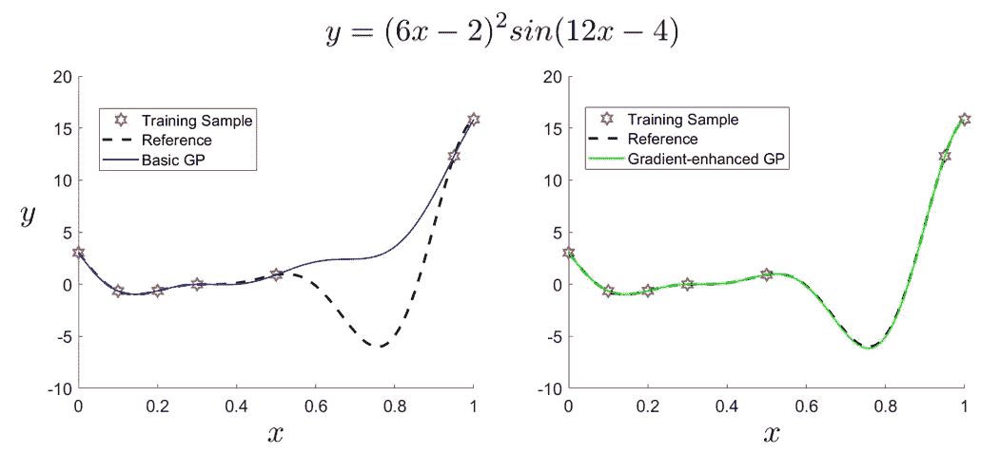
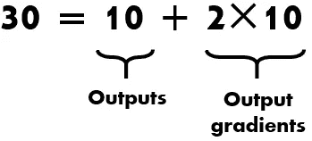
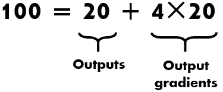
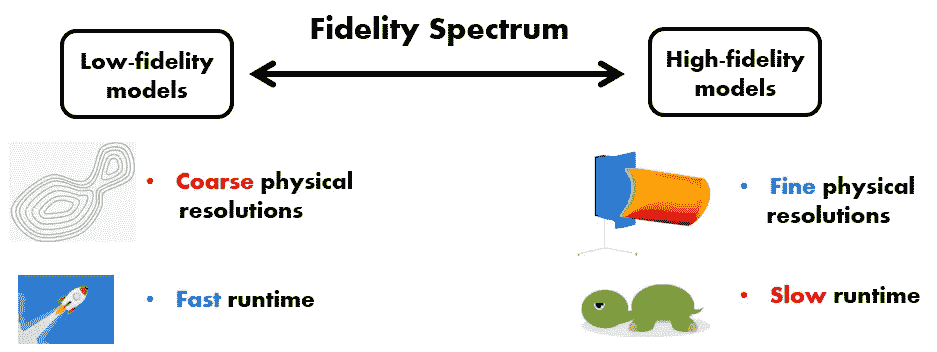
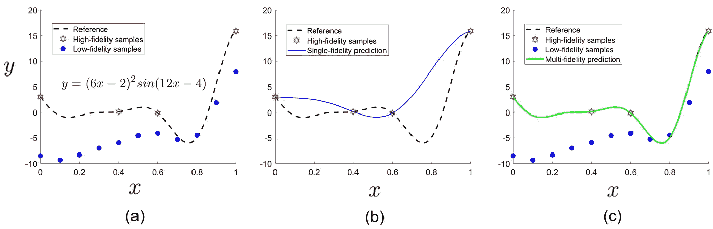
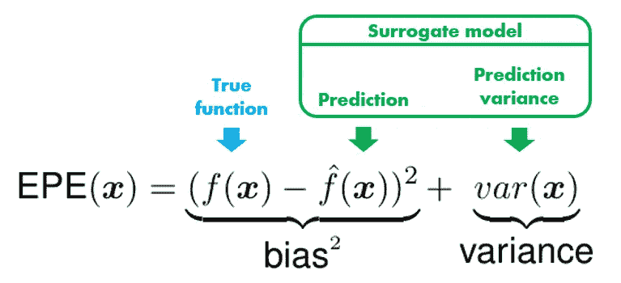

# 代理建模介绍，第三部分:超越基础

> 原文：<https://towardsdatascience.com/an-introduction-to-surrogate-modeling-part-iii-beyond-basics-a60125767271?source=collection_archive---------20----------------------->

## [代理建模](https://towardsdatascience.com/tagged/surrogate-modeling)

## 加速工程设计的机器学习方法

由[托马什·弗兰科斯基](https://unsplash.com/@sunlifter?utm_source=medium&utm_medium=referral)在 [Unsplash](https://unsplash.com?utm_source=medium&utm_medium=referral) 上拍摄的照片

在本系列的第一部分中，我们已经介绍了代理建模的基本概念。在[第二部分](https://shuaiguo.medium.com/an-introduction-to-surrogate-modeling-part-ii-case-study-426d8035179e)中，我们已经通过一个展示完整分析管道的案例研究看到了代理建模的作用。

总的来说，代理建模技术训练一个便宜但精确的统计模型，作为计算昂贵的模拟的代理，从而显著提高产品设计和分析的效率。

在第三部分中，我们将简要讨论代理建模研究和应用中出现的以下三个趋势:

*   *梯度增强代理建模*:在训练样本中加入梯度，提高模型精度；
*   *多保真度代理建模*:同化各种保真度的训练数据，达到更高的训练效率；
*   *主动学习*:通过主动选择下一个训练数据，智能训练代理模型。

**目录**
[1。渐变增强代理模型](#5ccc)
∘ [1.1 基本思路](#ce80)
∘ [1.2 举例](#b4ed)
∘ [1.3 挑战](#d5ed)
[2。多保真代理模型](#dcf2)
∘ [2.1 基本思想](#6fcd)
∘ [2.2 举例](#bf5b)
[3 .主动学习](#354e)
∘ [3.1 基本思想](#05cd)
∘ [3.2 预期预测误差【EPE】](#4b60)
[4 .关键要点](#e5f2)
[延伸阅读](#7898)
[关于作者](#ab70)

# 1.梯度增强代理模型

## 1.1 基本理念

梯度被定义为输出相对于输入的灵敏度。由于诸如[伴随方法](https://en.wikipedia.org/wiki/Adjoint_state_method)和[自动 differentiation](https://en.wikipedia.org/wiki/Automatic_differentiation) 等技术的快速发展，现在工程模拟代码不仅可以在给定输入向量*的情况下计算输出*f*(***x***)，还可以计算梯度∂*f*(***x****

***因此，我们可以将我们的训练数据对( ***x*** *ᵢ* ，*f*(***x****ᵢ*)扩展为训练数据三元组( ***x*** *ᵢ* ，*f*(***x****ᵢ*)、∂通过利用额外的梯度信息，与仅在( ***x*** *ᵢ* ，*f*(***x****ᵢ*)上训练的模型相比，训练的代理模型可以达到更高的精度，假定两个模型使用相同数量的训练数据点。***

***我们也可以用一种等价的方式来陈述包含梯度的好处:它允许减少数据点的数量来达到给定的精度。这是实践中期望的特征。回想一下，生成每个训练数据点需要运行一次昂贵的模拟代码。如果我们可以减少训练数据点的总数，我们就可以用较小的计算预算来训练代理模型，从而提高训练效率。***

## ***1.2 示例***

***让我们用一个例子来看看梯度增强的代理模型如何进一步提高预测精度。在本例中，我们使用*高斯过程*及其梯度增强版本作为替代模型来逼近图 1 所示的函数。***

***两个代理模型使用相同的训练样本。对于梯度增强的高斯过程，在那些训练样本上的 *y* 相对于 *x* 的梯度也被提供用于训练。***

******

***图 1 给定相同数量的训练样本，替代模型的梯度增强版本比基本版本更准确。(图片由作者提供)***

***从图 1 中显示的预测结果，我们可以清楚地看到，替代模型的梯度增强版本比其基本版本具有更好的准确性。尤其是在大约 *x* =0.8 的区域中:即使在该区域中没有分配训练样本，梯度增强模型仍然能够正确地捕捉趋势。***

## ***1.3 挑战***

****数据爆炸*构成了阻碍梯度增强代理建模实施的主要问题。***

***首先，随着输入参数数量的增加，可用的信息呈指数增长。例如，假设有 2 个输入参数，我们使用 10 个训练样本来训练代理模型。在这种情况下，我们的总训练数据由 30 条信息组成:***

******

***现在，假设我们必须考虑总共 4 个输入参数。随着输入数量的增加，我们需要更多的样本来进行模型训练。假设我们使用 20 个样本。现在，我们的总训练数据将由 100 条信息组成:***

******

***因此，当输入参数增加时，总的训练数据增长非常快。拥有丰富的训练数据不一定是一件好事，因为它会减慢模型调整过程(即模型超参数优化)。在极端情况下，训练代理模型甚至比运行模拟需要更多的时间。***

***第二，理论上，高阶导数也可以纳入代理模型训练。这也导致了数据爆炸:模型训练中使用的导数数量随着导数阶数的升高而呈指数级增长。例如，给定 2 个输入参数 *x* ₁和 *x* ₂，一阶导数只包含 2 项(即∂ *f* /∂ *x* ₁和∂ *f* /∂ *x* ₂)，而二阶导数包含额外的 3 项(即:*f*/*x****

***面对训练数据爆炸的问题，我们需要更加小心地决定哪些样本的哪些导数进入训练数据集。找到合适的梯度，以减少整体训练的努力，这是一个活跃的研究领域。***

# ***2.多重保真代理模型***

## ***2.1 基本理念***

***在跨计算工程的许多实例中，具有不同保真度和评估成本的多个仿真代码可用于相同的输出。***

***高保真仿真考虑了底层物理过程的更精细的空间/时间分辨率。虽然结果更符合实际，但计算成本也很高。在光谱的另一端，我们有低保真度模拟，通常具有较粗糙的空间/时间分辨率，并嵌入较粗糙的物理细节。然而，它们比高保真度的同类产品跑得快得多。***

******

***图 2 物理模型通常有不同的保真度。(图片由作者提供)***

***自然，我们希望我们的代理模型具有与高保真模拟相同的保真度。然而，纯粹从高保真仿真中产生样本是相当昂贵的。那么如何才能在代理模型训练中获得足够的精度，却又不付出太多的代价呢？***

***我们可以做的一种方法是只生成少量的高保真样本，但同时生成大量的低保真度样本(因为它们生成起来很便宜)。通过聚集来自两个真实度的样本，我们可以最大化代理模型的准确性，同时最小化相关的训练成本。***

***这正是多保真策略试图实现的目标。更具体地，该策略利用丰富的低保真度样本来探索参数空间，并获得对近似输入-输出关系的一般趋势的定性(但还不是定量)正确描述。同时，该策略利用可用的高保真样本有效地提炼低保真度结果，从而保证训练好的代理模型的定量正确性。***

## ***2.2 示例***

***让我们来看一个使用多保真度方法来实现目标模型准确性的例子，只需要几个高保真训练样本。***

***在本例中，我们的低/高保真度训练样本以及我们想要逼近的真实函数如图 3(a)所示。我们可以看到，低保真度样本是不准确的，因为它们远离真实的函数曲线。然而，它们与真实函数的总体趋势相匹配，这可以被多保真度方法利用来提高模型训练效率。***

******

***图 3 (a):低和高保真度训练样本；(b)完全建立在高保真度样本基础上的单一保真度模型；(c):建立在低保真度和高保真度样本基础上的多保真度模型。(图片由作者提供)***

***在图 3(b)中，我们看到高保真训练样本的数量远远不够，因为拟合的代理模型不能捕捉基础函数的特征。然而，在图 3(c)中，通过用大量定性正确的低保真度样本来扩充少数高保真度样本，多保真度方法可以产生好得多的预测，其与真实函数完全一致。***

# ***3.主动学习***

## ***3.1 基本理念***

> ***付出少，收获多。***

***在构建代理模型时，我们希望使用尽可能少的训练样本来达到目标模型的预测精度。回想一下，生成训练样本需要运行昂贵的计算机模拟。因此，较少的训练样本意味着获得代理模型的效率更高。***

***以前，人们倾向于在整个参数空间中均匀分布训练样本，以保证模型的准确性。然而，这种实践也可能导致计算资源的大量浪费:一般来说，近似的输入-输出关系在参数空间的不同区域中并不同样“复杂”,因此，不值得相同数量的训练数据。***

***相反，一个更聪明的方法是随着训练的进行，丰富训练数据集。通过这种方式，代理模型可以主动探索近似输入-输出关系的前景，并在模型“认为”其预测不准确的区域添加样本。***

*****学习函数**在主动学习中起着关键作用，因为它决定将哪个样本添加到现有的训练数据集中。构建学习功能是一个活跃的研究领域。一般来说，学习功能在追求的目标方面各不相同。***

***在下文中，我们讨论一个特定的学习函数，其目的是建立一个在参数空间各处都准确的代理模型。当经过训练的替代模型稍后用于执行参数研究、灵敏度分析和输入-输出关系的可视化时，这种学习功能是期望的。***

## ***3.2 预期预测误差(EPE)***

***该学习函数将下一个训练样本分配到代理模型具有最大预期预测误差的位置。这很直观，因为这是代理模型学习最快的方式。***

***在机器学习中，预期预测误差可以写成一个*偏差*项和一个*方差*项的组合。这就是著名的[偏差-方差分解](/understanding-the-bias-variance-tradeoff-165e6942b229):***

******

***偏差-方差分解。(图片由作者提供)***

***为了实现这种学习功能，一个要求是所采用的替代模型能够估计其预测不确定性(即方差)。满足这一要求的一种替代模型是高斯过程。***

***显然，我们不会提前知道真正的函数值*f*(***x***)(否则，我们就不需要建立一个代理模型来近似它了！).因此，必须估计上式中的偏差项。一种方法是通过交叉验证。刘等*【1】讨论了具体实现。****

# ****4.关键要点****

****在这篇博客中，我们讨论了代理建模的一些高级概念:****

*   ****梯度增强的代理建模，它在训练模型时合并了输出对输入的梯度，以提高模型预测的准确性。****
*   ****多保真代理建模，其将一些定量正确的高保真训练数据与许多定性正确的低保真训练数据聚合，以用最小的计算努力训练高度准确的代理模型。****
*   ****主动学习，它鼓励代理模型主动探索参数空间，并在它可以学习最多的区域添加训练样本。****

# ****延伸阅读:****

****[1]刘汉忠、蔡俊杰和宋永祥。*一种通过最大化预期预测误差进行克里金元建模的自适应采样方法。*计算机&化学工程，106(2):171–182，2017 年 11 月。****

****[2] Alexander I. J. Forrester，András Sóbester，Andy J. Keane，*通过代理建模进行工程设计:实用指南*，2008 年。****

# ****关于作者****

> ****我是一名博士研究员，研究航空航天应用的不确定性量化和可靠性分析。统计学和数据科学是我日常工作的核心。我喜欢分享我在迷人的统计世界中学到的东西。查看我以前的帖子以了解更多信息，并在 [*中*](https://shuaiguo.medium.com/) *和*[*Linkedin*](https://www.linkedin.com/in/shuaiguo16/)*上与我联系。*****