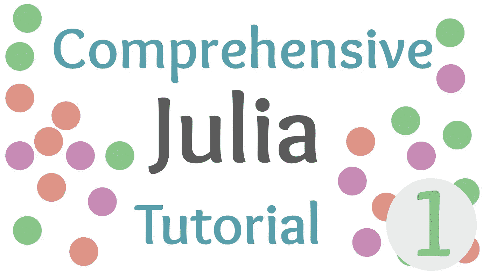

# 茱莉亚和 PKG 回复的介绍

> 原文：<https://towardsdatascience.com/an-introduction-to-the-julia-and-pkg-repls-7f61f5ff75ff?source=collection_archive---------33----------------------->

## 朱莉娅综合教程

## 熟悉茱莉亚的魔法世界进行科学编程！



(图片由作者提供)

> 本文视频:

# 介绍

编程语言的世界可能会非常混乱，尤其是对于一个希望尝试一下的新的有抱负的开发者或科学家来说。应该先学什么语言？要回答这个问题，你当然应该始终衡量你的个人兴趣和职业目标。虽然像 Python 和 Java-script 这样的选项可以在 web 开发等方面为您提供潜在的帮助，但是在处理更多面向软件的问题时，例如编译可执行文件，您肯定会在这些语言方面有所欠缺。

这才是朱莉娅真正闪光的地方。尽管 Julia 肯定保留了其作为未来科学编程语言的主要目的，但它也是当今拥有开源许可的最通用的高级通用语言之一。在这一领域，Julia 比大多数竞争对手都有许多优势:

*   与软件工程中常用的 Java 或 C++等语言相比，Julia 的读写简单得多——这使得用一种语法类似于 Python 的语言开发复杂的应用程序变得快速而简单。虽然 Julia 肯定不是编译二进制文件最容易的语言，但事实上这是可能的！如果您想了解更多关于这样做的内容，请查看这篇文章，我正是在这篇文章中探索了这一点！：

[](/creating-my-first-julia-executable-53e0f6bd0db5) [## 创建我的第一个 Julia 可执行文件

### 用 C 编译 Julia！(这一点也不好玩。)

towardsdatascience.com](/creating-my-first-julia-executable-53e0f6bd0db5) 

*   “作为范例的多重分派”——你没听错，Julia 以戏剧性的、改变语言的方式使用参数多态性，这使它变得非常通用。前一秒钟，您可能纯粹是在函数上使用 Julia，下一秒钟，您可能使用带有数据的调度函数来有效地创建一个类。如果你想了解更多，你也可以点击这里！：

[](/turn-julia-into-python-and-duck-type-in-a-statically-typed-language-119f708936ff) [## 用静态类型语言将 Julia 转换成 Python 和 Duck-Type

### 通过结合 Julia 富有表现力的语法和令人敬畏的调度，将 Julia 变成 Python。

towardsdatascience.com](/turn-julia-into-python-and-duck-type-in-a-statically-typed-language-119f708936ff) 

*   元编程和宏——谁不喜欢元编程？嗯，也许喜欢简单调试的人..不管 meta 有什么问题，Julia 有这个能力！这里有一个介绍！：

[](/a-swift-introduction-to-metaprogramming-in-julia-5eef529f5a8a) [## Julia 中元编程的快速介绍

### 在 Julia 中使用 Julia 的元包进行编程的基础。

towardsdatascience.com](/a-swift-introduction-to-metaprogramming-in-julia-5eef529f5a8a) 

> 我已经到了什么都有文章的地步了。

# 获得正确的 Julia 安装

每当我第一次被介绍给 Julia 时，我犯了一个致命的错误，从我的软件包管理器安装了这种语言。虽然这将为您提供一个稳定且完全可用的 Julia 版本 1.1，并提供长期支持，但您将无法获得自那时以来所取得的所有进步的好处。特别是多线程是我在 1.4 +中更喜欢的东西，很快就连车床也将使用 spawn 宏，并且将与 1.1–1 . 3 . 9 不兼容。

记住这一点，不要通过 Brew、Apt、Pacman 或 Yum 安装 Julia，而是直接进入

[](https://julialang.org) [## 朱莉娅语言

### 丰富的科学计算生态系统 Julia 从一开始就被设计为非常擅长数字和…

julialang.org](https://julialang.org) 

并下载官方和最新的二进制文件。之后，您可以按照下面列出的适用于您各自平台的安装说明进行操作:

# Linux(或其他非 Mac 类 Unix)

首先，从 Julia mirror 下载 tarball。您可以通过您的网络浏览器或 wget:

```
wget https://julialang-s3.julialang.org/bin/linux/x64/{{stable_release_short}}/julia-1.5.1-linux-x86_64.tar.gz 
```

接下来，您将需要提取 tarball。这可以通过双击您的文件管理器(取决于您的文件管理器，但我知道这在 Nautilus 和 Dolphin 中也能工作)或使用 tar zxvf 来完成:

```
tar zxvf julia-1.5.1-linux-x86_64.tar.gz
```

现在只需在任一路径下创建一个到 Julia 可执行文件的链接。巴沙尔或者。bash_profile 与您最喜欢的文本编辑器:

```
nano ~/.bash_profile**export** PATH="$PATH:/path/to/<Julia directory>/bin"
```

> 我建议使用您的 bash_profile，这样您就不会覆盖 PATH！

# Windows 操作系统

至于在 Windows 上安装，过程相当简单。下载安装程序并安装 Julia。接下来，您需要将 Julia 添加到您的路径中，就像我们在 Linux 上所做的那样。首先按下 Windows 键+ R，这将打开“运行”之后，输入`undll32 sysdm.cpl,EditEnvironmentVariables`

按 enter 键，然后在“用户变量”部分，找到行“路径”并单击“编辑”单击新建，然后粘贴到您的 Julia 目录中。这通常在 app-data 中，可以通过在搜索栏中键入%appdata%并按回车键来访问。

# 马科斯

要安装 Julia for Mac，请使用。朱莉娅网站上提供的 DMG 文件。接下来，导航到`/usr/local/bin`并删除`julia`文件。然后使用以下命令链接它:

```
ln -s /Applications/Julia-1.5.1.app/Contents/Resources/julia/bin/julia /usr/**local**/bin/julia
```

> 唷！

# 熟悉朱莉娅·REPL

朱莉娅 REPL 是一个快速和方便的方式来测试和执行朱莉娅代码。这也是访问 Pkg 来激活新环境和添加新包的好方法。REPL 是“读取评估打印循环”的首字母缩写，这正是它所表达的意思。

阅读—表示阅读输入文本。

评估—意味着评估文本内部的逻辑

打印—表示显示退货

循环——这意味着在应用程序的整个生命周期中都有一个 while 循环。

如果你需要从朱莉娅 REPL 打开 Pkg REPL，你只需按

```
]
```

这将允许您使用命令而不是 Julian 语法来处理您的 Julia 包。有几个不同的命令可供您使用，但是最重要的命令是

*   增加
*   状态
*   例示
*   建设
*   空间
*   使活动

Add 当然会添加新的包。状态将报告。toml 文件，我们将在未来的版本中对它更加熟悉。实例化将更新所有项目依赖项。Build 将构建一个选定的包，当包或包的组件不能正常工作时，它会很有用。Rm 是 add 的逆运算，将删除提供的包。最后，activate 将激活一个虚拟环境，并将一个名称作为参数。

# 基本朱莉娅

虽然不一定是 Julia 特有的，但在全面了解计算机编程之前，您可能需要了解一些事情。编程简单来说就是数据的移动或者数据的处理。从低级汇编代码一直到最高级别的编程都是如此。

重要的是要记住你正在使用什么语言，以及它将如何处理类型。如果你想了解更多关于语言和它们如何处理类型的知识，以及 Julia 属于哪一类，我也有一篇文章:

[](/all-about-typing-explicit-vs-implicit-and-static-vs-dynamic-980da4387c2f) [## 关于类型:显式与隐式，静态与动态

### 快速浏览类型以及它们如何与语言交互。

towardsdatascience.com](/all-about-typing-explicit-vs-implicit-and-static-vs-dynamic-980da4387c2f) 

# 结论

Julia 是一种非常棒的编程语言，我很高兴能与您分享更多关于它的内容！这个系列教程将带你从计算机编程的基础开始，以你自己的方式成为一名伟大的程序员。在下一个教程中，我们将复习基本函数的编写，并熟悉不同的类型。接近尾声时，我们将触及条件句！如果你已经是一个有经验的程序员，向前跳一点可能是一个好主意，但我试图保持步调一致，以便每个人都可以从每个教程中获得某种知识——因此，反馈是受欢迎的！感谢您的阅读、观看，并感谢您慷慨捐赠的时间！