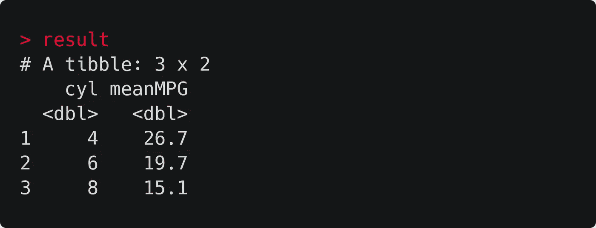

# R 中的管道介绍

> 原文：<https://towardsdatascience.com/an-introduction-to-the-pipe-in-r-823090760d64?source=collection_archive---------6----------------------->

## r 基础知识

## r 对数据处理最重要的运算符，解释道。


照片由 [Erlend Ekseth](https://unsplash.com/@er1end?utm_source=medium&utm_medium=referral) 在 [Unsplash](https://unsplash.com?utm_source=medium&utm_medium=referral) 上拍摄

数据分析通常包括许多步骤。从原始数据到结果的典型过程可能涉及筛选案例、转换值、汇总数据，然后运行统计测试。但是，我们如何将所有这些步骤联系在一起，同时保持代码的有效性和可读性呢？

输入管道，R 对数据处理最重要的操作符。

# 管子是做什么的？

管道操作符写为`%>%`，是 r 的[magritter](https://cran.r-project.org/web/packages/magrittr/vignettes/magrittr.html)包的一个长期特性。它接受一个函数的输出，并将其作为参数传递给另一个函数。这使我们能够将一系列分析步骤联系起来。

为了形象化这个过程，想象一个工厂，不同的机器沿着传送带放置。每台机器都是一种功能，执行我们分析的一个阶段，比如过滤或转换数据。因此，管道就像传送带一样工作，将一台机器的输出传输到另一台机器进行进一步处理。


一个美味的分析程序。图片:Shutterstock

我们可以在使用 mtcars 数据集的真实示例中看到这是如何工作的。这个数据集带有 base R，包含各种汽车的规格和燃油效率的数据。

下面的代码根据每辆车的气缸数对数据进行分组，然后返回每组的平均每加仑英里数。确保在运行这段代码之前安装好 [tidyverse](https://tidyverse.tidyverse.org/articles/paper.html) 套件，因为它既包括管道又包括`group_by`和`summarise`函数。

```
library(tidyverse)
result <- mtcars %>% 
    group_by(cyl) %>% 
    summarise(meanMPG = mean(mpg))
```

管道操作员将 mtcars 数据帧送入`group_by`功能，然后将`group_by`的输出送入`summarise`。该过程的结果存储在 tibble `result`中，如下所示。



mtcars 数据集中车辆的平均每加仑英里数，按发动机气缸数量分组。

尽管这个例子非常简单，但它演示了基本的管道工作流。为了更进一步，我鼓励用这个来玩。也许交换和添加新的功能到“管道”中，以获得对数据的更多了解。这样做是了解如何使用管道的最佳方式。

但是我们为什么要首先使用它呢？

# 为什么要用管子？

与 R 中处理数据的任何其他方法相比，管道有一个巨大的优势:它使进程易于阅读。如果我们将`%>%`读作“then ”,上一节的代码很容易理解为一组简单的英语指令:

```
Load tidyverse packagesTo get our result, take the mtcars dataframe, THEN
    Group its entries by number of cylinders, THEN
    Compute the mean miles-per-gallon of each group
```

这比我们用另一种方式来表达这个过程更具可读性。下面的两个选项是前面代码的不同表达方式，但两者都更糟糕，原因如下。

```
# Option 1: Store each step in the process sequentially
result <- group_by(mtcars, cyl)
result <- summarise(result, meanMPG = mean(mpg))

# Option 2: chain the functions together
> result <- summarise(
                group_by(mtcars, cyl), 
                meanMPG = mean(mpg))
```

选项 1 完成了工作，但是在每一行覆盖我们的输出数据帧`result`是有问题的。首先，对于包含许多步骤的过程来说，这样做是没有效率的，并且会在代码中产生不必要的重复。在某些情况下，这种重复也使得准确识别每一行上的变化变得更加困难。

选项 2 更不实际。嵌套我们想要使用的每个函数变得很快，特别是对于长过程。很难阅读，更难调试。这种方法还使得很难看到分析中的步骤顺序，如果您希望以后添加新功能，这是个坏消息。

显而易见，使用管道可以极大地改进大多数 R 脚本。它使分析更具可读性，消除了重复，并简化了添加和修改代码的过程。有什么是它做不到的吗？

# 管道的局限性是什么？

尽管它非常方便，但管道并不是在所有情况下都有用。以下是它的一些局限性:

*   因为它以线性顺序链接函数，所以管道不太适用于包含多方向关系的问题。
*   管道一次只能传输一个对象，这意味着它不太适合需要多个输入或产生多个输出的函数。
*   它不适用于使用当前环境的函数，也不适用于使用惰性求值的函数。Hadley Wickham 的书《数据科学的 R》中有几个这样的例子[。](https://r4ds.had.co.nz/pipes.html)

这些事情是意料之中的。就像你想用一个工具建造一座房子一样，没有一个单独的特性可以解决你所有的编程问题。但是不管怎样，这种管子还是很通用的。虽然这篇文章关注的是基础，但是有足够的空间以高级或创造性的方式使用管道。我在各种各样的脚本中使用过它，无论是面向数据的还是非面向数据的，它都让我的生活变得更加轻松。

# 额外管道提示

谢谢你读到这里。作为奖励，这里有一些奖金管道提示和资源:

*   厌倦了笨拙地打字`%>%`？稍微简单一点的键盘快捷键`CTRL + SHIFT + M`会在 RStudio 中打印一个管道！
*   需要关于如何格式化管道的样式指导？看看哈德利·威克姆的《R 风格指南》中这一有用的章节。
*   想了解更多关于 R 中管道的历史吗？查看阿道夫·Á·阿尔瓦雷斯的博客文章[。](http://adolfoalvarez.cl/plumbers-chains-and-famous-painters-the-history-of-the-pipe-operator-in-r/)

烟斗很棒。它将您的代码转换成一系列可读的指令，并有许多其他的实际好处。现在您已经了解了管道，使用它，并看到您的代码变成了一个故事。

想阅读我所有关于编程、数据科学等方面的文章吗？在[这个链接](https://medium.com/@roryspanton/membership)注册一个媒体会员，就可以完全访问我所有的作品和媒体上的所有其他故事。这也直接帮助了我，因为我从你的会员费中得到一小部分，而不需要你额外付费。

你也可以通过[订阅这里](https://roryspanton.medium.com/subscribe)让我的所有新文章直接发送到你的收件箱。感谢阅读！