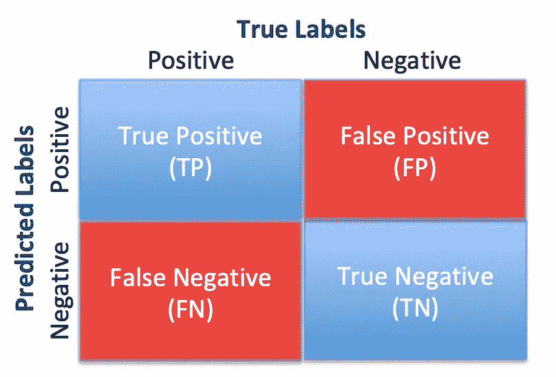
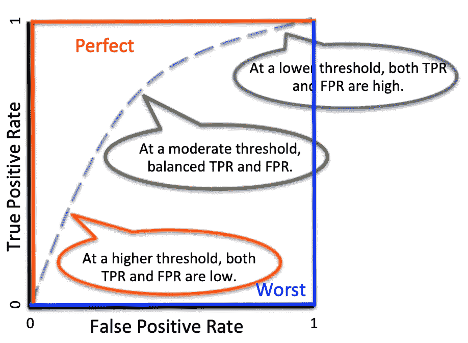
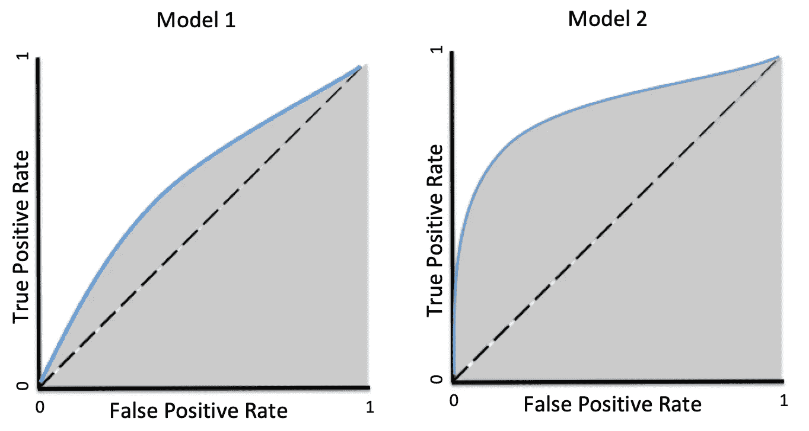

# 分类任务中 ROC-AUC 的介绍

> 原文：<https://towardsdatascience.com/an-introduction-to-the-roc-auc-in-classification-tasks-94c2a147dd04?source=collection_archive---------41----------------------->

## 曲线是什么意思？

弗朗西斯科·温加罗在 [Unsplash](https://unsplash.com?utm_source=medium&utm_medium=referral) 上拍摄的照片

在机器学习中，一个基本的学习目标是将数据分类成组。虽然分类可以包括无监督学习(例如，聚类)，但在大多数情况下，我们的任务涉及已知的标签，因此我们正在进行监督学习来分类我们的数据。您的模型将生成预测标签，这将允许我们比较我们的预测是否准确。当预测的标签和真实的标签匹配时，我们说预测是正确的，显然当它们不匹配时，我们说预测是错误的。

为了将我们的讨论放在上下文中，假设我们有一些糖尿病诊断已知的受试者的临床数据。在我们继续之前，只是一个快速的免责声明——这些数据不是真实的数据，它们不构成任何医疗建议。

基于这些数据，我们建立了一个逻辑回归模型，根据人们的空腹血糖水平来预测他们是否患有糖尿病。在下表中，空腹血糖水平表示为 mg/dL。diabetic_clinical 列显示临床诊断，diabetic_predicted 列显示逻辑回归模型的预测结果。根据临床和预测的结果，我们可以简单地知道预测是否正确，如最后一列所示。

空腹血糖水平与糖尿病

## 混淆矩阵

基于这种与真实标签相关的二元评估结果(正确对错误)，我们可以构建 2 x 2 混淆矩阵，如下所示。

困惑矩阵(作者)

**正确预测:**

*   **真阳性(TP)** :预测和真标签均为阳性。在上面的例子中，这些人患有糖尿病，根据他们的空腹血糖水平预测他们会患糖尿病。
*   **真阴性(TN)** :预测和真标签均为阴性。这些是非糖尿病受试者，他们被预测为非糖尿病患者。

**错误预测:**

*   **假阳性(FP)** :预测标签为阳性，真实标签为阴性。这些人被预测为糖尿病患者，但实际上他们不是。
*   **假阴性(FN)** :预测标签为阴性，真实标签为阳性。那些糖尿病患者被预测为非糖尿病患者。

我们可以导出许多对分类模型评估至关重要的度量。下面列出了一些常用的指标，您可以在 [Wikipedia](https://en.wikipedia.org/wiki/Confusion_matrix) 页面找到生成的指标的完整列表。

*   **准确率**:正确预测数除以预测总数:`***(TP + TN) / (TP + TN + FP + FN)***`。在示例中，我们的模型的精度是 0.7(即 7 / 10)。
*   **真阳性率(TPR、灵敏度或召回率)**:真阳性标签数除以阳性标签数:`***TP / (TP + FN)***`。我们模型的 TPR 是 0.8(即 4 / 5)。
*   **假阳性率(FPR，脱落)**:假阳性标记数除以阴性标记数:`***FP / (FP + TN)***`。我们模型的 FPR 是 0.4(即 2 / 5)。
*   **真阴性率(特异性)**:真阴性标记数除以阴性标记数:`***TN / (FP + TN)***` *。*你可以注意到`***specificity = 1 — FPR***`。我们模型的特异性是 0.6(即 3 / 5)。

## 接收机工作特性

接收器操作特性曲线**是一个图表，显示您的分类模型在所有阈值下的表现**。下图是一条假设的 ROC 曲线。

ROC 示例图(按作者)

*   在 ROC 曲线图中，x 轴是 FPR，而 y 轴是 TPR。
*   对于一个完美的模型，它的 FPR 是 0，它的 TPR 是 1。相比之下，对于最差的模型，其 FPR 为 1，TPR 为 0。图中显示了这两种极端情况的 ROC 曲线。
*   在一个典型的模型中，我们应该看到真实的曲线。**具体来说，通过改变阈值，我们的模型将产生不同的 TPR 和 FPR，并且这些点可以绘制在该图上。连接这些点，我们可以生成一个 ROC 曲线。**

为了将 ROC 曲线放入糖尿病诊断示例的上下文中，让我们假设我们可以有不同的阈值来预测糖尿病诊断。如你所料，如果我们有一个极低的阈值，我们会将所有受试者归类为糖尿病患者。虽然我们可以得到 1 的 TPR，但是 FPR 也会变成 1。考虑一些适中的阈值，我们应该能够找到 TPR 和 FPR 的许多不同组合。

因为显示的数据很小，如果您有更多的数据点，通过改变阈值，您应该创建更多的点作为 TPR 和 FPR 的函数。如果我们连接所有这些点并平滑曲线，我们就得到我们正在构建的特定模型的 ROC 曲线。

## ROC 曲线下面积

我们如何量化模型的性能？如上所述，我们说 ROC 是为了显示我们的模型性能，但是我们如何用 ROC 曲线准确地评估性能呢？

如果你比较这两种极端情况(完美与最坏)，你可能会注意到曲线下的区域似乎意味着什么。你的猜测完全正确。假设您考虑一个典型的模型，在大多数情况下，您的模型的 TPR 应该大于各种阈值的 FPR。在这种情况下，您将看到图表对角线上方的 ROC 曲线。

更重要的是，如果你的模型更好，你应该看到 TPR 和 FPR 之间更大的差异，这将曲线推向完美的模型状态。下图显示了您在使用真实模型时可能遇到的一些情况。

ROC 曲线的 AUC(按作者)

*   灰色区域表示 ROC 曲线下的区域。
*   模型 2 的 AUC 大于模型 1 的 AUC。我们通常认为模型 2 优于模型 1。换句话说，我们可以粗略地将分类模型的性能等同于它们各自的 AUC。
*   对角线描绘了用于二元分类任务的随机分类器。这里是[关于为什么 TPR 和 FPR 的随机猜测的 AUC 都是 0.5 的附加讨论](https://datascience.stackexchange.com/questions/31872/auc-roc-of-a-random-classifier)。

## 在你走之前

虽然 ROC 和 AUC 经常用于评估分类任务的性能，但它们并不总是首选。最主要的原因是它没有考虑实际的问题。例如，不同的模型可以具有相似的 AUC，但是它们可以具有不同的形状，这意味着模型具有 TPR 和 FPR 的不同组合。

因此，我们应该考虑其他因素来选择理想的模型。问自己的问题可以包括。你更关心正确识别阳性病例吗？还是更在乎正确识别负面案例？

这里有[关于 ROC 和 AUC 的一个简单讨论](https://developers.google.com/machine-learning/crash-course/classification/roc-and-auc)，我觉得对初学者很有用。