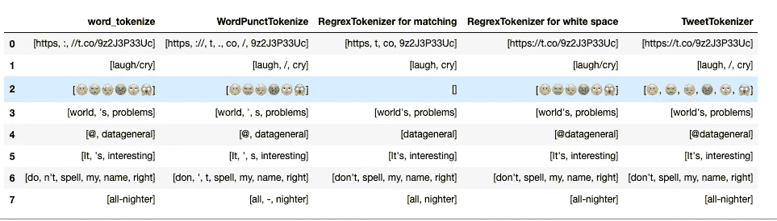

# 如何用 Python 对 Tweets 进行标记

> 原文：<https://towardsdatascience.com/an-introduction-to-tweettokenizer-for-processing-tweets-9879389f8fe7?source=collection_archive---------4----------------------->

## 我们应该选择 TweetTokenizers 还是其他 4 种常见的 Tokenizers？

# 什么是标记化？

记号是整体的一个片段，所以单词是句子中的记号，句子是段落中的记号。记号化是将一个字符串分割成一系列记号的过程**。**

如果你对标记化有点熟悉，但不知道文本使用哪种标记化，本文将使用 Twitter 上的原始 Tweets 来展示不同的标记化及其工作原理。

本文将介绍如何用以下语句将句子标记成单词:

*   `word_tokenize`
*   `WordPunctTokenizer`
*   `RegrexTokenizer`
*   `TweetTokenizer`

标记化是预处理原始文本的第一步，所以我希望您对掌握这个重要的概念感到兴奋！


照片由 [Eric Prouzet](https://unsplash.com/@eprouzet?utm_source=medium&utm_medium=referral) 拍摄于 [Unsplash](https://unsplash.com?utm_source=medium&utm_medium=referral)

# 要处理的数据

Twitter 是一个社交平台，每天都会发布许多有趣的推文。因为与正式文本相比，tweets 更难标记，所以我们将使用 tweets 中的文本数据作为示例。

```
"https://t.co/9z2J3P33Uc FB needs to hurry up and add a laugh/cry button 😬😭😓🤢🙄😱 Since eating my feelings has not fixed the world's problems, I guess I'll try to sleep... HOLY CRAP: DeVos questionnaire appears to include passages from uncited sources [https://t.co/FNRoOlfw9s](https://t.co/FNRoOlfw9s) well played, Senator Murray Keep the pressure on: [https://t.co/4hfOsmdk0l](https://t.co/4hfOsmdk0l) @datageneral thx Mr Taussig It's interesting how many people contact me about applying for a PhD and don't spell my name right."
```

上面的句子里有很多信息。在对整个句子进行记号化之前，我们先挑选一些我们有兴趣比较的句子。这个列表将用于比较不同令牌化器之间的性能。

```
compare_list = ['[https://t.co/9z2J3P33Uc'](https://t.co/9z2J3P33Uc'),
               'laugh/cry',
               '😬😭😓🤢🙄😱',
               "world's problems",
               "[@datageneral](http://twitter.com/datageneral)",
                "It's interesting",
               "don't spell my name right",
               'all-nighter']
```

# word_tokenize

将句子标记成单词时最流行的方法是使用`word_tokenize.`和**空格和标点符号将单词分开。**

```
from nltk.tokenize import word_tokenizeword_tokens = []
for sent in compare_list:
    print(word_tokenize(sent))
    word_tokens.append(word_tokenize(sent))
```

结果:

```
['https', ':', '//t.co/9z2J3P33Uc']
['laugh/cry']
['😬😭😓🤢🙄😱']
['world', "'s", 'problems']
['@', 'datageneral']
['It', "'s", 'interesting']
['do', "n't", 'spell', 'my', 'name', 'right']
['all-nighter']
```

我们希望`laugh/cry`被拆分成 2 个单词。所以我们应该考虑另一个记号赋予器选项。

# 单词标点符号化器

`WordPunctTokenizer` **将所有标点符号**拆分成单独的记号。所以这可能就是我们想要的？

```
from nltk.tokenize import WordPunctTokenizerpunct_tokenizer = WordPunctTokenizer()punct_tokens = []
for sent in compare_list:
    print(punct_tokenizer.tokenize(sent))
    punct_tokens.append(punct_tokenizer.tokenize(sent))
```

结果:

```
['https', '://', 't', '.', 'co', '/', '9z2J3P33Uc']
['laugh', '/', 'cry']
['😬😭😓🤢🙄😱']
['world', "'", 's', 'problems']
['@', 'datageneral']
['It', "'", 's', 'interesting']
['don', "'", 't', 'spell', 'my', 'name', 'right']
['all', '-', 'nighter']
```

嗯，这个分词器成功地把`laugh/cry`拆分成两个单词。但是缺点是:

*   链接`‘[https://t.co/9z2J3P33Uc'](https://t.co/9z2J3P33Uc')`被分成 7 个单词
*   `world's`被`"'"`字符拆分成两个单词
*   `@datageneral`分为`@`和`datageneral`
*   `don't`被拆分为`do`和`n't`

既然这些单词应该被认为是一个单词，那么这个分词器也不是我们想要的。有没有一种方法可以根据空格来拆分单词？

# 再氧化器

由于没有分词器专门根据空格拆分单词，我们可以使用`RegrexTokenizer`来控制如何对文本进行分词。有两种方法可以避免根据标点符号或缩写来拆分单词:

*   在代币上匹配
*   匹配分隔符或间隙

## 在代币上匹配

`RegexpTokenizer`类通过**编译我们的模式**，然后在我们的文本上调用`re.findall()`来工作。我们可以利用这个函数来匹配字母数字标记和单引号

```
from nltk.tokenize import RegexpTokenizer
match_tokenizer = RegexpTokenizer("[\w']+")match_tokens = []
for sent in compare_list:   
    print(match_tokenizer.tokenize(sent))
    match_tokens.append(match_tokenizer.tokenize(sent))
```

如果您不熟悉正则表达式语法，`\w+`匹配一个或多个单词字符(字母数字&下划线)

结果:

```
['https', 't', 'co', '9z2J3P33Uc']
['laugh', 'cry']
[]
["world's", 'problems']
['datageneral']
["It's", 'interesting']
["don't", 'spell', 'my', 'name', 'right']
['all', 'nighter']
```

虽然像`'world’s', 'It’s', 'don’t’`这样的单词如我们所愿被保留为一个实体，但是`‘[https://t.co/9z2J3P33Uc'](https://t.co/9z2J3P33Uc')`仍然被拆分成不同的单词，并且我们失去了`“datageneral”`之前的`“@”`字符。也许我们可以根据空白分割？

## 空白匹配

`RegexpTokenizer`也可以通过**匹配缺口**来工作。当添加参数`gaps=True`时，匹配模式将被用作分隔符。`\s+`匹配一个或多个空格。

```
space_tokenizer = RegexpTokenizer("\s+", gaps=True)space_tokens = []
for sent in compare_list:

    print(space_tokenizer.tokenize(sent))
    space_tokens.append(space_tokenizer.tokenize(sent))
```

结果:

```
['https://t.co/9z2J3P33Uc']
['laugh/cry']
['😬😭😓🤢🙄😱']
["world's", 'problems']
['@datageneral']
["It's", 'interesting']
["don't", 'spell', 'my', 'name', 'right']
['all-nighter']
```

不错！现在我们将链接`‘https://t.co/9z2J3P33Uc'`解释为一个单词！但是看起来表情符号组合成了一个单词。由于不同的表情符号在情感分析中可能是有意义的，我们可能希望将它们分成不同的单词。所以我们需要考虑另一种正则表达式模式来实现这一点。

好消息！有一个标记器可以在不使用正则表达式的情况下有效地拆分 tweets。

# TweetTokenizer

是的，对 tweet 进行标记的最好方法是使用标记器来标记 tweet

```
from nltk.tokenize import TweetTokenizer
tweet_tokenizer = TweetTokenizer()tweet_tokens = []
for sent in compare_list:
    print(tweet_tokenizer.tokenize(sent))
    tweet_tokens.append(tweet_tokenizer.tokenize(sent))
```

结果:

```
['https://t.co/9z2J3P33Uc']
['laugh', '/', 'cry']
['😬', '😭', '😓', '🤢', '🙄', '😱']
["world's", 'problems']
['@datageneral']
["It's", 'interesting']
["don't", 'spell', 'my', 'name', 'right']
['all-nighter']
```

厉害！推文被标记成我们想要的样子！

# 把所有东西放在一起

我们可以把所有东西放在一个`pd.dataframe`中进行快速准确的解释，而不是花时间去分析每个分词器的结果。

```
import pandas as pdtokenizers = {'word_tokenize': word_tokens,
             'WordPunctTokenize':punct_tokens,
             'RegrexTokenizer for matching':match_tokens,
             'RegrexTokenizer for white space': space_tokens,
             'TweetTokenizer': tweet_tokens }df = pd.DataFrame.from_dict(tokenizers)
```



不同标记器之间的比较

根据对上表的观察，`TweetTokenizer`似乎是最佳选择。所以我们可以继续用这个来标记我们的句子:

```
tweet_tokenizer.tokenize(sent)
```

# 结论

恭喜你！您已经从 nltk 库中学习了不同的分词器来将句子分词。似乎标记 Twitter 原始文本的赢家是`TweetTokenizer`。但情况并非总是如此，你的选择可能会根据你分析的文本而改变。重要的一点是，您知道这些标记器的功能差异，这样您就可以做出正确的选择来标记您的文本。在这个 [Github repo](https://github.com/khuyentran1401/Data-science/blob/master/nlp/tweets_tokenize.ipynb) 中，您可以随意使用本文的代码。

我喜欢写一些基本的数据科学概念，并尝试不同的算法和数据科学工具。你可以在 [LinkedIn](https://www.linkedin.com/in/khuyen-tran-1401/) 和 [Twitter](https://twitter.com/KhuyenTran16) 上和我联系。

如果你想查看我写的所有文章的代码，请点击这里。在 Medium 上关注我，了解我的最新数据科学文章，例如:

[](/step-by-step-tutorial-web-scraping-wikipedia-with-beautifulsoup-48d7f2dfa52d) [## 用美丽的声音抓取维基百科

### 关于如何使用 Beautiful Soup 的分步教程，这是一个用于 web 抓取的简单易用的 Python 库

towardsdatascience.com](/step-by-step-tutorial-web-scraping-wikipedia-with-beautifulsoup-48d7f2dfa52d) [](/find-common-words-in-article-with-python-module-newspaper-and-nltk-8c7d6c75733) [## 用 Python 模块 Newspaper 和 NLTK 查找文章中的常用词

### 使用 newspaper3k 和 NLTK 从报纸中提取信息和发现见解的分步指南

towardsdatascience.com](/find-common-words-in-article-with-python-module-newspaper-and-nltk-8c7d6c75733) [](/python-tricks-for-keeping-track-of-your-data-aef3dc817a4e) [## 跟踪数据的 Python 技巧

### 如何用列表、字典计数器和命名元组来跟踪信息

towardsdatascience.com](/python-tricks-for-keeping-track-of-your-data-aef3dc817a4e) [](/maximize-your-productivity-with-python-6110004b45f7) [## 使用 Python 最大化您的生产力

### 你创建了一个待办事项清单来提高效率，但最终却把时间浪费在了不重要的任务上。如果你能创造…

towardsdatascience.com](/maximize-your-productivity-with-python-6110004b45f7) [](/timing-the-performance-to-choose-the-right-python-object-for-your-data-science-project-670db6f11b8e) [## 高效 Python 代码的计时

### 如何比较列表、集合和其他方法的性能

towardsdatascience.com](/timing-the-performance-to-choose-the-right-python-object-for-your-data-science-project-670db6f11b8e)