# Unity ML-agent 简介

> 原文：<https://towardsdatascience.com/an-introduction-to-unity-ml-agents-6238452fcf4c?source=collection_archive---------0----------------------->

## [Unity-ML 代理课程](http://www.simoninithomas.com/unitymlagentscourse/)

## 训练一个强化学习代理跳过墙。

**我们推出了新的免费、更新、** [**深度强化学习课程从初学者到专家，用拥抱面对🤗**](https://huggingface.co/deep-rl-course/unit0/introduction?fw=pt)

👉新版教程:[https://huggingface.co/deep-rl-course/unit0/introduction](https://huggingface.co/deep-rl-course/unit0/introduction?fw=pt)

**下面的章节是以前的版本**，新版本在这里👉[https://huggingface.co/deep-rl-course/unit5/introduction?fw=pt](https://huggingface.co/deep-rl-course/unit5/introduction?fw=pt)

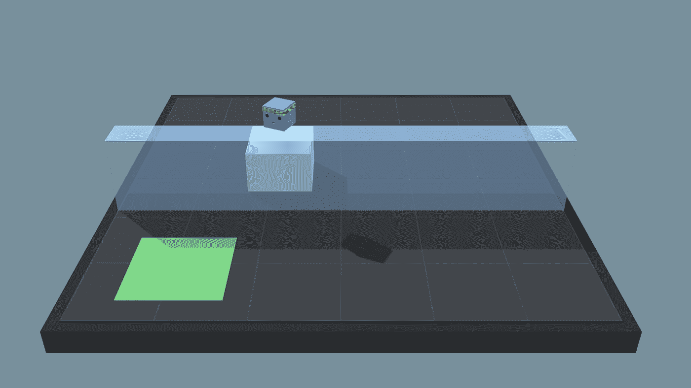

**我们推出了新的免费、更新、** [**从初学者到专家的深度强化学习课程，用拥抱面对🤗**](https://huggingface.co/deep-rl-course/unit0/introduction?fw=pt)

👉新版教程:[https://huggingface.co/deep-rl-course/unit0/introduction](https://huggingface.co/deep-rl-course/unit0/introduction?fw=pt)

下面的章节是以前的版本，新版本在这里👉[https://huggingface.co/deep-rl-course/unit5/introduction?fw=pt](https://huggingface.co/deep-rl-course/unit5/introduction?fw=pt)

过去的几年见证了强化学习的突破。从 2013 年深度学习模型首次成功使用 [RL 从像素输入学习策略](https://deepmind.com/blog/article/deep-reinforcement-learning)到 2019 年 [OpenAI 灵巧程序](https://openai.com/blog/learning-dexterity/)，我们生活在 RL 研究的一个激动人心的时刻。

因此，作为 RL 研究人员，我们需要**创造越来越复杂的环境**，Unity 帮助我们做到这一点。Unity ML-Agents toolkit 是一个基于游戏引擎 Unity 的新插件，允许我们使用 Unity 游戏引擎作为环境构建器来训练代理。

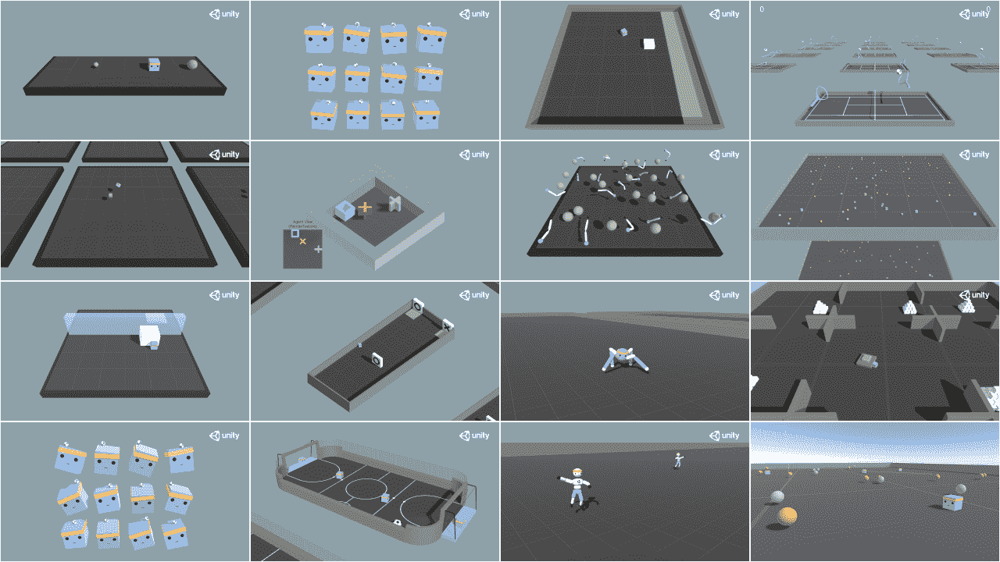

*来源:Unity ML-Agents Toolkit Github 存储库*

从踢足球、学习走路、跳过高墙，到训练一只可爱的小狗去抓棍子，Unity ML-Agents Toolkit 提供了大量令人惊叹的预制环境。

此外，在这个免费课程中，我们还将创造新的学习环境。

现在，我们将学习 Unity ML-Agents 是如何工作的，在文章的最后，您将训练一个代理学习翻墙。


但是首先，有一些要求:

*   **这不是强化学习入门课程**，如果你之前没有深度强化学习的技巧，需要查看免费课程【Tensorflow 深度强化学习。
*   而且这不是一门关于 Unity 的课程，所以**你需要有一些 Unity 基本功。如果不是这样，你绝对应该看看他们为初学者开设的令人惊叹的课程:[用代码创造。](https://learn.unity.com/course/create-with-code)**

所以让我们开始吧！

# Unity ML-Agents 如何工作？

## 什么是 Unity ML-Agents？

Unity ML-Agents 是游戏引擎 Unity 的一个新插件，它允许我们**创建或使用预先制作的环境来训练我们的代理。**

它是由 Unity Technologies 开发的，Unity 是有史以来最好的游戏引擎之一。这是 Firewatch，Gone Home，Cuphead 和许多 AAA 游戏的创作者使用的。

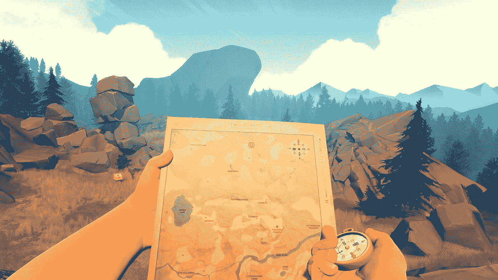

*Firewatch 是用 Unity 做的*

## 三个组成部分

使用 Unity ML-Agents，您有三个重要的组件。

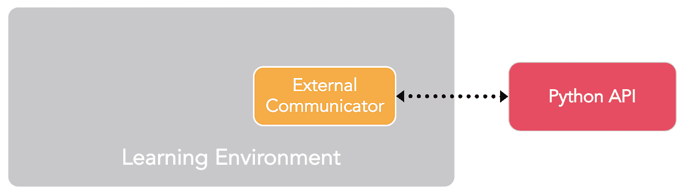

*来源:Unity ML-Agents 文档*

第一个是*学习组件(关于 Unity)，*即**包含 Unity 场景和环境元素。**

第二个是 *Python API* 包含 **RL 算法**(比如 PPO 和 SAC)。我们使用这个 API 来启动培训、测试等。它通过*外部通信器与学习环境通信。*

## 在学习组件内部

在学习组件中，我们有不同的元素:

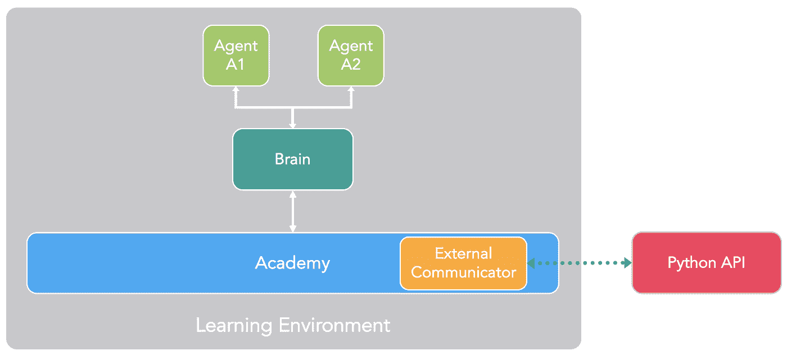

*来源:Unity ML-Agents 文档*

首先是经纪人，**现场的演员。他就是我们要通过优化他的策略(这将告诉我们在每种状态下采取什么行动)来训练的人。**

最后，还有学院，这个元素**编排代理和他们的决策过程。把这个学院想象成处理来自 python API 的请求的大师。**

为了更好地理解它的作用，让我们回忆一下 RL 过程。这可以建模为一个循环，其工作方式如下:

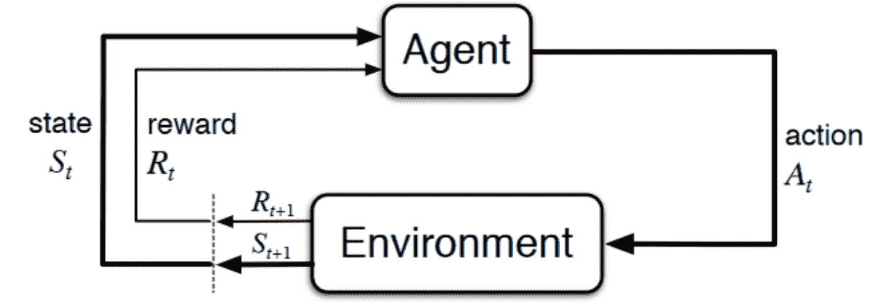

来源:萨顿的书

现在，让我们想象一个代理学习玩一个平台游戏。RL 流程如下所示:

*   我们的代理从环境接收状态 S0—我们接收游戏的第一帧(环境)。
*   基于状态 S0，代理采取行动 A0 —我们的代理将向右移动。
*   环境过渡到一个新的状态 S1。
*   给代理一个奖励 R1——我们没死*(正奖励+1)* 。

这个 RL 循环输出状态、动作和奖励的序列。代理人的目标是**最大化期望的累积报酬。**

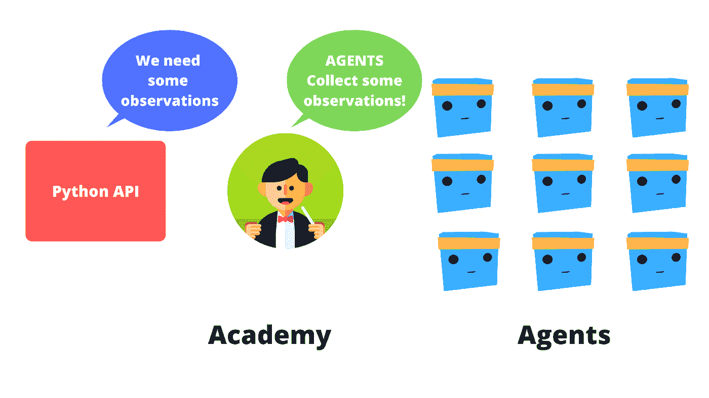

事实上，学院**将向我们的代理发送订单，并确保代理同步**:

*   收集观察结果
*   使用您的策略选择您的操作
*   采取行动
*   如果达到最大步数或完成，则重置。

# 训练一名特工翻墙

现在我们已经了解了 Unity ML-Agents 的工作原理，让我们来训练一个代理从墙上跳下来。

*我们在 github 上发布了我们训练过的模型，你可以在这里下载* [*。*](https://github.com/simoninithomas/unity_ml_agents_course)

## 跳墙环境

在这种环境下，我们的目标是训练我们的代理人走上绿区。

但是，有 3 种情况:

*   首先，你没有墙，**我们的代理只需要走上绿色瓷砖。**

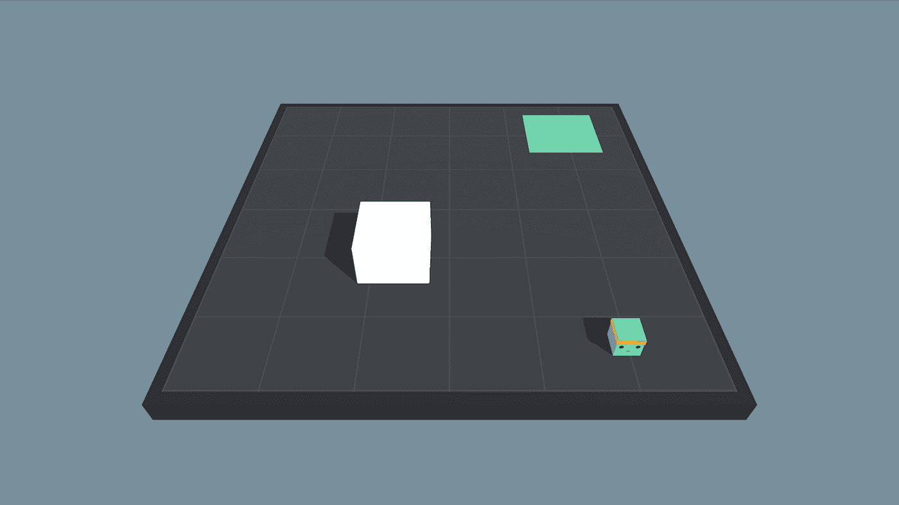

无墙情况

*   在第二种情况下，**代理需要学习跳跃**以到达绿色瓷砖。

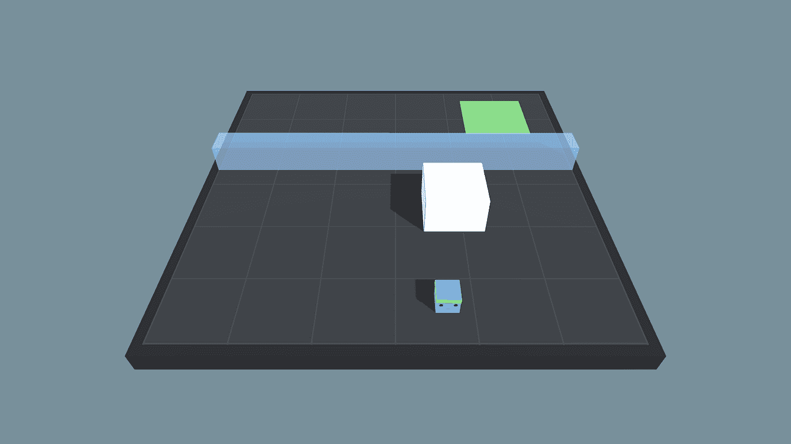

小墙情况

*   最后，在最困难的情况下，我们的代理人将无法跳得和墙一样高，所以他需要推动白色方块以便跳到它上面来跳过墙。

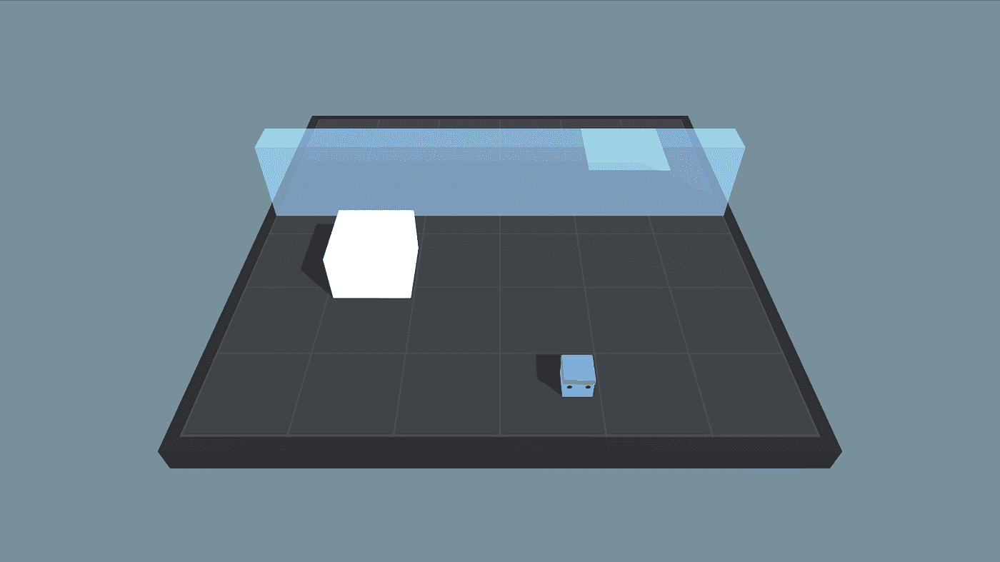

大墙情况

**我们将根据墙的高度学习两种不同的政策**:

*   第一个*小墙跳*将在无墙和矮墙情况下学习。
*   第二个，*大墙跳跃*，将在高墙情况下学习。

奖励制度是:

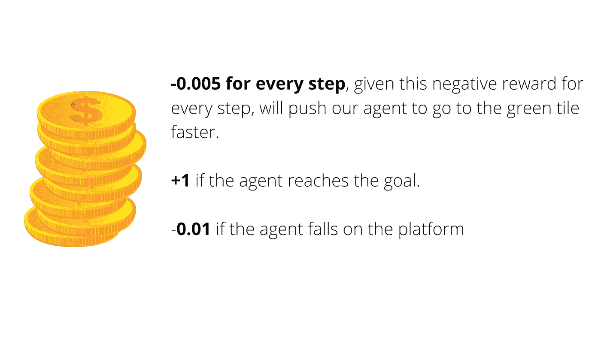

在观察方面，**我们没有使用正常视觉**(帧)，而是 14 个光线投射，每个光线投射可以探测 4 个可能的物体。把光线投射**想象成激光，如果它穿过物体就会被探测到。**

我们还使用代理的全球位置以及是否接地。

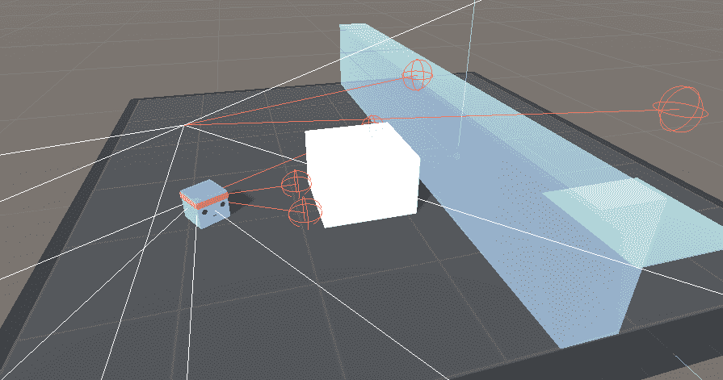

*来源:Unity ML-Agents 文档*

动作空间是离散的，有 4 个分支:

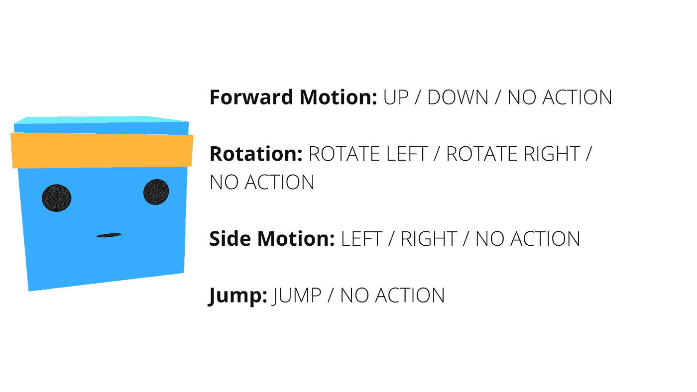

我们的目标是以 0.8 的平均回报达到基准**。**

## 我们跳吧！

首先我们打开 *UnitySDK 项目。*

在示例中搜索 *WallJump* 并打开场景。

你可以在场景中看到，许多代理，他们每个人都来自同一个预置，他们都共享同一个大脑。

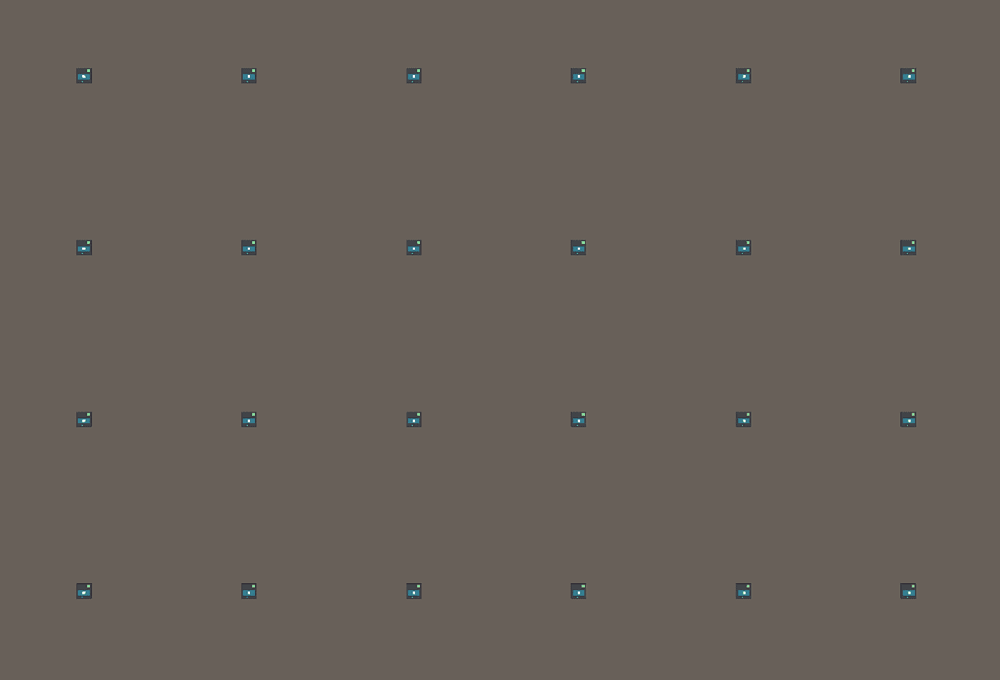

同一个代理预置的多个副本。

事实上，正如我们在经典的深度强化学习中所做的那样，当我们启动一个游戏的多个实例(例如 128 个并行环境)时，我们在此复制并粘贴代理，以便有更多不同的状态。

所以，首先，因为我们想从头开始训练我们的特工，**我们需要从特工身上移除大脑。**我们需要进入预置文件夹并打开预置。

现在在预设层级中，选择代理并进入检查器。

首先，在行为参数中，我们需要移除模型。**如果你有一些图形处理器，你可以把推理机从 CPU 改成 GPU。**

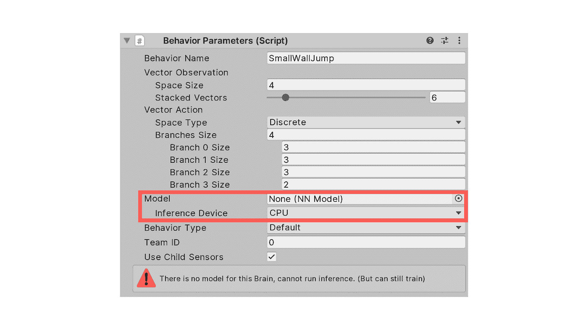

然后在跳墙代理组件中，**我们需要移除无墙脑、小墙脑和大墙脑情况下的大脑。**


现在你已经完成了，你可以从头开始训练你的代理了。

对于第一次训练，我们将只修改两个策略(SmallWallJump 和 BigWallJump) **的总训练步骤，因为我们只需要 300k 的训练步骤就可以达到基准。**

为此，我们转到，您可以在*config/trainer _ config . YAML*中将 SmallWallJump 和 BigWallJump 情况下的这些步骤修改为 **max_steps 至 3e5**

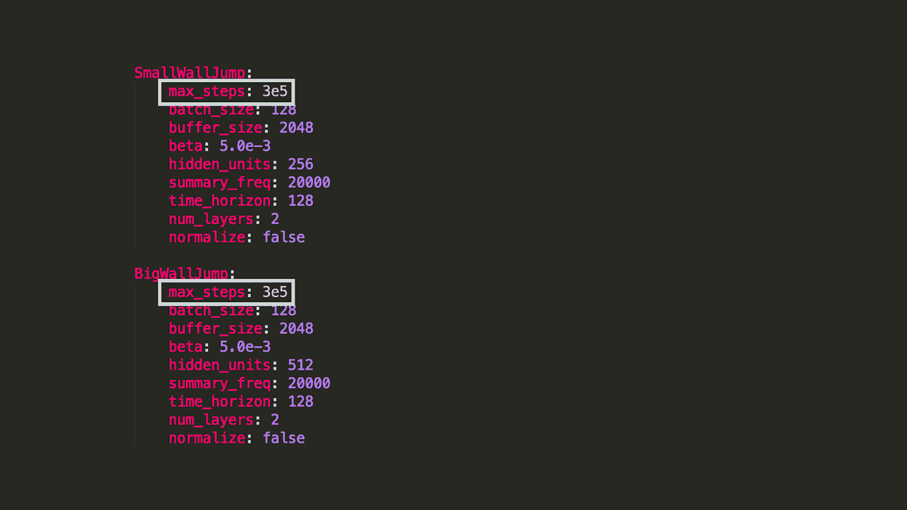

为了训练这个代理，**我们将使用 PPO** (近似策略优化)如果你不知道或者你需要刷新你的知识，[查看我的文章。](https://www.google.com/search?client=firefox-b-d&q=ppo+simonini)

我们看到，为了训练这个代理，我们需要使用 Python API 调用我们的外部通信器。该外部通信器**将要求学院启动代理。**

因此，您需要打开您的终端，进入 ml-agents-master 所在的位置并键入以下内容:

```
mlagents-learn config/trainer_config.yaml — run-id=”WallJump_FirstTrain” — train
```

它会要求你运行 Unity 场景，

按下编辑器顶部的▶️按钮。

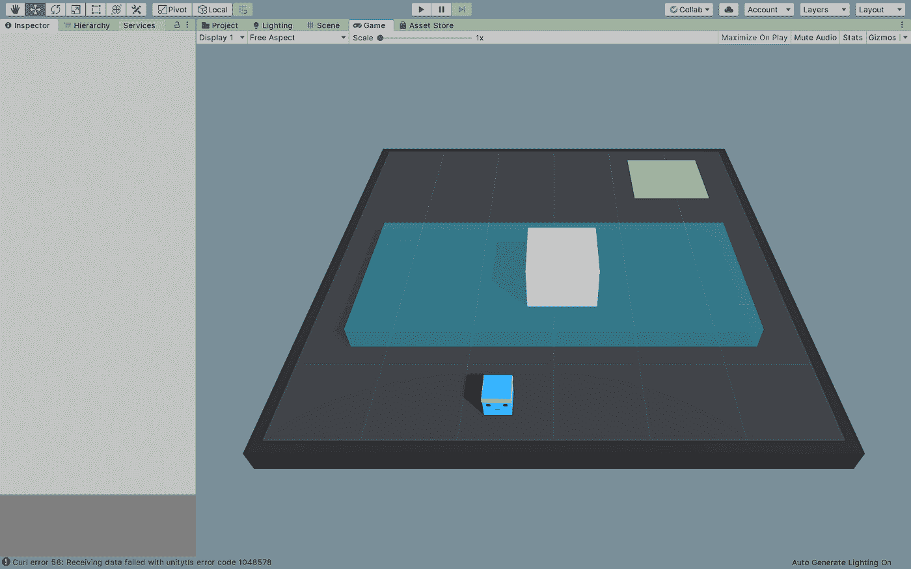

您可以使用以下命令启动 Tensorboard 来监控您的训练:

```
tensorboard — logdir=summaries
```

## 看着你的特工翻墙

你可以在训练的时候通过观看游戏窗口来观察你的经纪人。

培训结束后，您需要将保存在*ML-Agents-master/models*中的模型文件移动到*unity SDK/Assets/ML-Agents/Examples/wall jump/TF models*中。

再次打开 Unity 编辑器，选择 *WallJump 场景*。

选择 *WallJumpArea* 预设对象并打开它。

选择*代理*。

在代理*行为参数*中，拖动 *SmallWallJump.nn* 文件到模型占位符中。


将 *SmallWallJump.nn* 文件拖到无墙脑占位符。

将 *SmallWallJump.n* n 文件拖到小墙脑占位符中。

将 *BigWallJump.nn* 文件拖到无墙脑占位符。

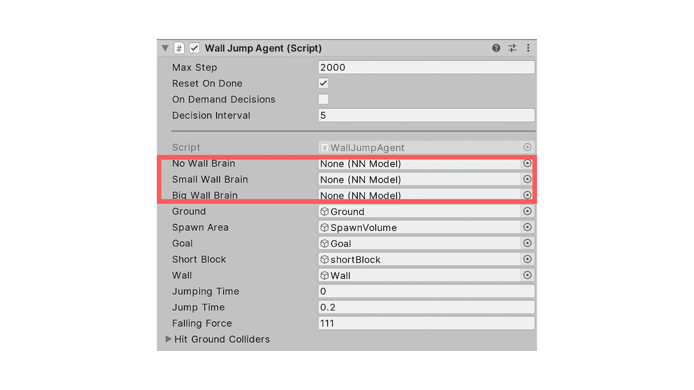

然后，按下编辑器顶部的▶️按钮，瞧！


🎉

# 是时候做些实验了

我们刚刚训练我们的特工学会了翻墙。既然我们有了好的结果，我们可以做一些实验。

记住,**最好的学习方法是通过实验保持活跃。**所以你要试着做一些假设，并验证它们。

## 将贴现率降至 0.95

我们知道:

*   **γ越大，折扣越小。**这意味着学习代理更关心长期回报。
*   另一方面，**伽玛越小，折扣越大。这意味着我们的代理更关心短期回报。**

这个实验背后的想法是，如果我们通过将 gamma 从 0.99 降低到 0.95 来增加折扣，我们的代理将会更关心短期回报，也许这将**帮助他更快地收敛到最优策略。**

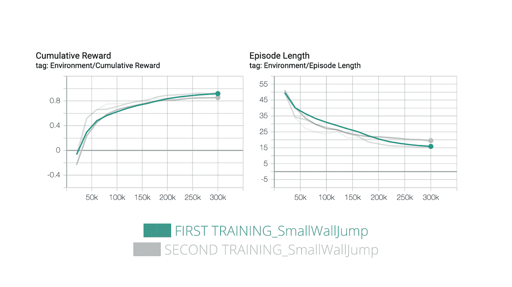

有趣的是，我们的代理人**在小墙跳跃的情况下表现完全相同，**我们可以解释说，这种情况很容易，如果有小墙，他只需要向绿色网格移动并跳跃。

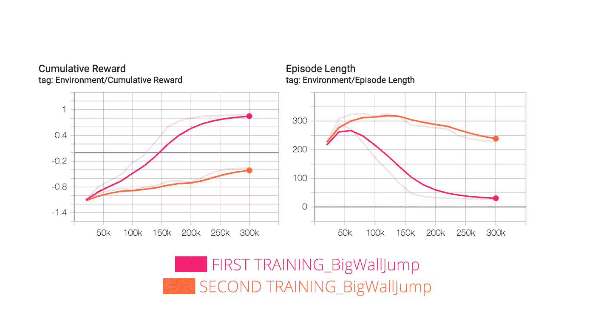

另一方面，**在大墙跳的情况下表现真的很差。**我们可以解释说，因为我们的新代理**更关心短期回报，他无法进行长期思考**，因此没有真正理解他需要推动白砖才能跳过墙。

## 增加了神经网络的复杂性

对于第三次也是最后一次培训，假设是*如果我们增加网络复杂性，我们的代理会变得更聪明吗？*

我们所做的是将隐藏单元的大小从 256 增加到 512。

但是我们发现这个新代理**的表现比我们的第一个代理差。**

这意味着当我们遇到这种简单的问题时，我们不需要增加网络的复杂性，因为这增加了收敛之前的训练时间。

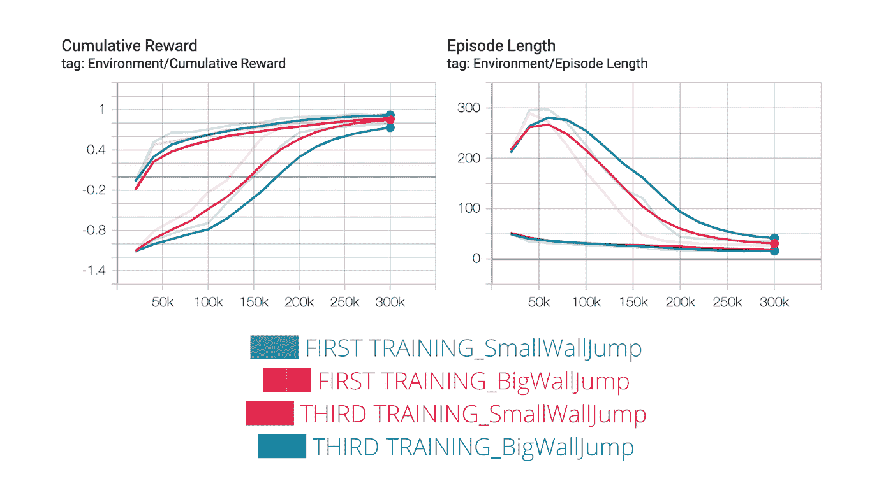

今天就到这里吧！你刚刚训练了一个学会翻墙的特工。厉害！

别忘了**去实验，换一些超参数试试新闻的东西。玩得开心！**

*如果你想和我们的实验进行比较，我们在这里公布了我们训练过的模型* [*。*](https://github.com/simoninithomas/unity_ml_agents_course)

在下一篇文章中，我们将训练一个**智能代理，它需要按下一个按钮来生成一个金字塔，然后导航到金字塔，撞倒它，并移动到顶部的金砖。为了做到这一点，除了外在奖励，我们还将好奇心作为内在奖励。**


如果你有任何想法，评论，问题，欢迎在下面评论或者给我发邮件:hello@simoninithomas.com，或者发推特给我。

不断学习，保持牛逼！

第 2 章:[深入探究 Unity-ML 代理](/diving-deeper-into-unity-ml-agents-e1667f869dc3)

第三章:[玛雅奇遇](/unity-ml-agents-the-mayan-adventure-2e15510d653b)