# 变分自动编码器介绍

> 原文：<https://towardsdatascience.com/an-introduction-to-variational-auto-encoders-vaes-803ddfb623df?source=collection_archive---------25----------------------->

## 使用 PyTorch 从理论到实践理解变分自动编码器

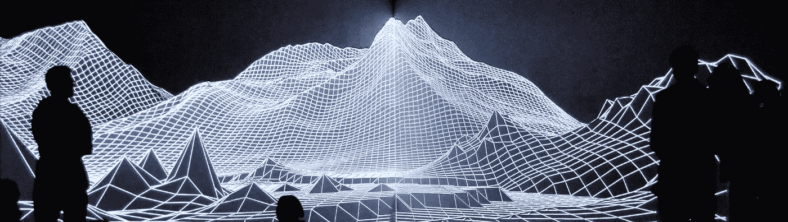

来自[https://joanielemercier.com/](https://joanielemercier.com/)的艺术作品(纽约艾雅法拉火山，2010 年 5 月 onedotzero 委托)

VAE 是潜在变量模型[1，2]。这种模型依赖于这样的思想，即由模型生成的数据可以通过一些变量来参数化，这些变量将生成给定数据点的一些特定特征。这些变量被称为潜在变量。

VAE 背后的一个关键思想是，我们不是试图显式地构建一个潜在空间(潜在变量的空间)并从中进行采样，以便找到可以实际生成适当输出(尽可能接近我们的分布)的样本，而是构建一个类似编码器-解码器的网络，该网络分为两部分:

*   编码器学习生成依赖于输入样本 X 的分布，从中我们可以采样很可能生成 X 个样本的潜在变量。换句话说，我们学习一组参数θ1，它们产生一个分布 Q(X，θ1 ),从中我们可以采样一个潜在变量 z，使 P(X|z)最大化。
*   给定潜在变量 z 作为输入，解码器部分学习生成属于真实数据分布的输出。换句话说，我们学习一组参数θ2，该参数生成函数 f(z，θ2 ),该函数将我们学习的潜在分布映射到数据集的真实数据分布。

可变自动编码器全局架构

为了理解变分自动编码器背后的数学，我们将通过理论，看看为什么这些模型比旧的方法更好。

## 本文将涵盖以下内容

*   如何定义建筑的潜在空间
*   如何从潜在空间采样中高效地生成数据？
*   VAEs 的最终架构
*   一些显示 VAEs 有趣性质的实验

# 1.潜在变量模型

潜在变量模型来源于这样一种想法，即模型生成的数据需要通过*潜在*变量来参数化。这个名字来源于这样一个事实:给定的只是模型产生的一个数据点，我们不一定知道潜在变量的哪些设置产生了这个数据点。

在一个更正式的设置中，我们在高维空间 Z 中有一个潜在变量的向量 *z* ，我们可以根据 Z 上定义的某个概率密度函数 *P* ( *z* )轻松地对其进行采样。然后，我们有一族确定性函数*f*(*Z*； *θ* ，由某空间θ中的一个向量 *θ* 参数化，其中*f*:Z×θ→x .*f*是确定性的，但如果 *z* 是随机的， *θ* 是固定的，那么*f*(*Z*； *θ* 是空间 X 中的随机变量。

在训练过程中，我们对 *θ* 进行了优化，使得我们可以从 *P* ( *z* )中采样 *z* ，并且有很大概率得到*f*(*z*)； *θ* 与数据集中的 *X* 一样近。为了实现这一点，我们需要找到参数 *θ* ，使得:

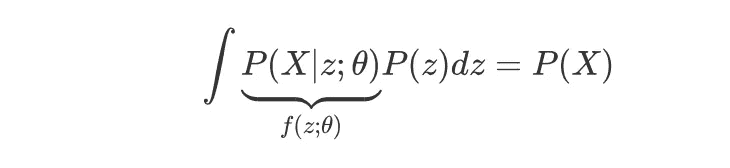

这里我们只是把*f*(*z*)； *θ* 乘一个分配*P*(*X*|*z*； *θ* 为了利用全概率定律使 *X* 对 *z* 的依赖关系显式。我们做的另一个假设是假设 P(W | z； *θ* )遵循高斯分布 N(X |*f*(*z*； *θ* )，σ*I)(这样做我们认为生成的数据几乎为 X 但不完全为 X)。

## 定义潜在空间

正如开始所解释的，潜在空间被认为是对影响我们数据分布的某些特定特征的变量空间进行建模。我们可以想象，如果我们考虑的数据集由汽车组成，那么我们的数据分布就是所有可能的汽车的空间，我们潜在向量的一些分量会影响汽车的颜色、方向或门的数量。

然而，很快就很难明确定义每个潜在组件的角色，尤其是当我们处理数百个维度时。除此之外，一些组件可以依赖于其他组件，这使得手工设计这个潜在空间变得更加复杂。换句话说，定义这个复杂的分布 P(z)真的很难。

## 解决办法

为了克服这个问题，诀窍是利用概率分布的数学性质和神经网络的能力，在具有反向传播的某些约束下学习某些确定性函数。

使问题更容易处理的数学特性是:

> 通过取一组正态分布的 d 变量，并通过一个足够复杂的函数对它们进行映射，可以生成 d 维中的任何分布。

因此，我们可以任意决定我们的潜在变量为高斯型，然后构建一个确定性函数，将我们的高斯潜在空间映射到复杂的分布中，我们将从该分布中采样以生成我们的数据。

将我们简单的潜在分布映射到代表我们复杂潜在空间的更复杂的潜在分布所需的确定性函数可以使用神经网络来构建，该神经网络具有一些可以在训练期间微调的参数。

# 2.学会从潜在空间中产生数据

在进入本文有趣的部分之前，让我们回忆一下我们的最终目标:

我们有一个正态分布的 d 维潜在空间，我们想学习一个函数 f(z；θ2)，这将把我们的潜在分布映射到我们的真实数据分布。换句话说，我们希望对潜在变量进行采样，然后使用该潜在变量作为生成器的输入，以便生成尽可能接近真实数据点的数据样本。

**我们仍然需要解决两件事:**

*   我们如何有效地探索我们的潜在空间，以便发现使概率 P(X|z)最大化的 z？(我们需要在训练中为给定的 X 找到正确的 z)
*   我们如何使用反向传播来训练这整个过程？(我们需要找到一个优化 f 的目标，将 P(z)映射到 P(X))

## 为我们的 X 数据样本找到正确的 z 潜变量

实际上，对于大多数的 *z* ， *P* (X|z)几乎为零，因此对我们估计的 *P* (X)几乎没有贡献。变分自动编码器背后的关键思想是试图对可能产生 X 的 z 值进行采样，并根据这些值计算 P(X)。为了做到这一点，我们需要一个新的函数 *Q* (z|X ),它可以取值为 X，并给出一个可能产生 X 的 z 值的分布。希望可能在 Q 下的 z 值的空间将比可能在前一个 P(z)下的所有 z 的空间小得多。

VAE 的这一部分将是编码器，并且我们将假设 Q 将在训练期间由神经网络学习，该神经网络将输入 X 映射到输出 Q(z|X ),这将是我们最有可能从中找到好的 z 以生成该特定 X 的分布

## 用反向传播训练模型

为了理解如何训练我们的 VAE，我们首先需要定义什么应该是目标，而要做到这一点，我们首先需要做一点数学。

让我们从编码器开始，我们希望 Q(z|X)尽可能接近 P(X|z)。为了测量两个分布有多接近，我们可以使用两个分布之间的 Kullback-Leibler 散度 D:

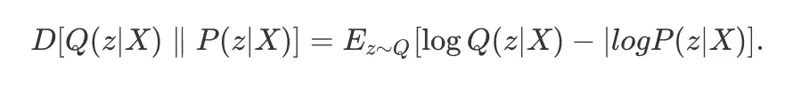

用一点数学知识，我们可以用一种更有趣的方式改写这个等式。

通过对 P(z|X)应用贝叶斯规则，我们得到:

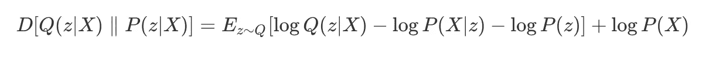

这相当于:

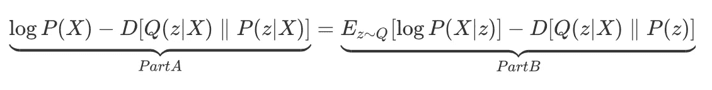

**让我们花点时间看看这个公式**

*   **A 部分**:左边的项对我们的反向传播设置并不感兴趣(我们不知道 P(X)的简单表达式)，但 log(P(X))实际上是给定 z 后我们想要最大化的，我们可以看到，我们可以通过最小化右边的部分来实现这一点(使 Q(z|X)尽可能接近 P(z|X))。这正是我们一开始提到的。
*   **B 部分**:这个术语更有趣，因为我们知道 P(X|z)(它是我们的解码器部分- >生成器)和 Q(z|X)(它是我们的编码器)。我们可以看到，为了最大化该项，我们需要最大化 log(P(X|z))，这意味着我们不想最大化概率的对数似然性，并最小化 Q(z|X)和 P(z)之间的 KL 散度。

为了使**部分 B** 更容易计算，假设 Q(z|X)是高斯分布 N(z|mu(X，θ1)，sigma(X，θ1))，其中θ1 是我们的神经网络从我们的数据集中学习的参数。

我们的公式还有一个问题不清楚:我们如何在反向传播过程中计算期望值？

**处理期望操作符**

一种方法是进行多次前向传递，以便能够计算对数(P(X|z))的期望，但是这在计算上是低效的。有希望的是，由于我们处于随机训练中，我们可以假设我们在历元期间使用的数据样本 Xi 代表整个数据集，因此有理由认为我们从该样本 Xi 获得的 log(P(Xi|zi))和相关生成的 zi 代表 log(P(X|z))的 Q 上的期望。

最后，解码器只是一个生成器模型，我们希望重建输入图像，因此一个简单的方法是使用输入图像和生成图像之间的均方误差。

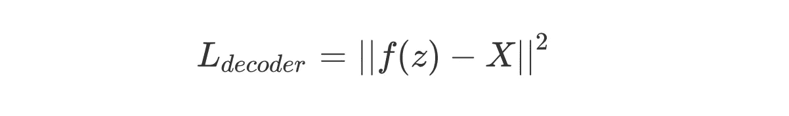

# 3.VAEs 的最终架构

我们可以知道恢复一个 VAE 的最终架构。如简介中所述，网络分为两部分:

*   学习生成依赖于输入样本 X 的分布的编码器，我们可以从中对很可能生成 X 个样本的潜在变量进行采样。这部分需要优化，以使 Q(z|X)成为高斯型。
*   给定潜在变量 z 作为输入，解码器部分学习生成属于真实数据分布的输出。该部分将采样的 z(最初来自正态分布)映射到更复杂的潜在空间(实际代表我们的数据的空间),并从该复杂的潜在变量 z 生成尽可能接近我们分布中真实数据点的数据点。

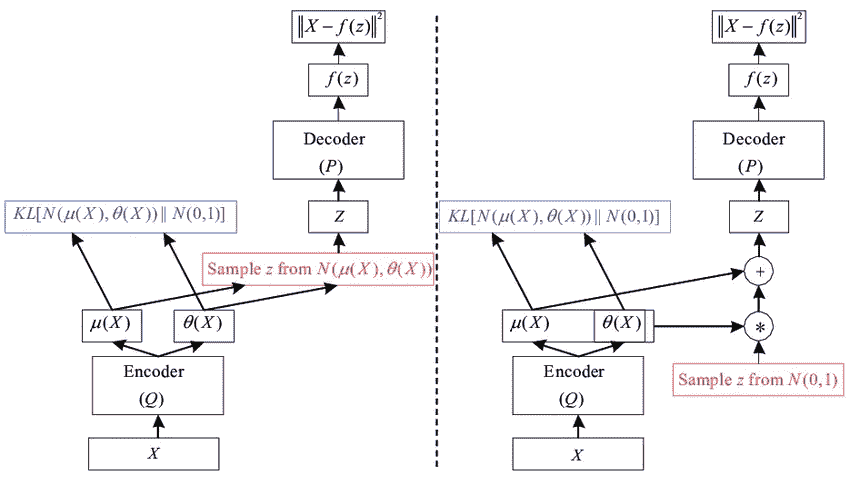

可变自动编码器详细架构。(左)和(右)是等价的，但是我们不能在(左)的例子中进行反向传播，所以我们在实践中使用(右)的例子。

# 4.VAEs 实验

现在你已经知道了变分自动编码器背后的所有数学原理，让我们通过使用 PyTorch 做一些实验来看看我们能用这些生成模型做些什么。

**py torch 的全球建筑**

**训练**

下面的图表显示了我们在训练中得到的结果。为了这个演示，VAE 已经在 MNIST 数据集[3]上进行了训练。每隔 10 个时期，我们绘制输入 X 和产生该给定输入的 VAE 的生成数据。

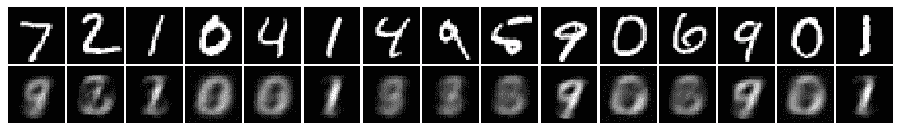

训练样本(输入向上，输出向下)—时期 1

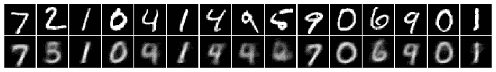

训练样本(输入向上，输出向下)—时期 10

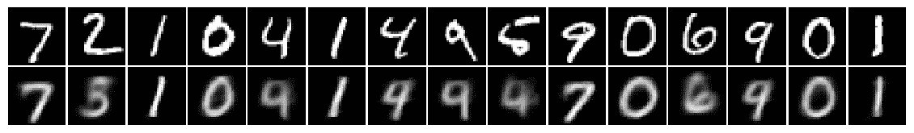

训练样本(输入向上，输出向下)—时期 20

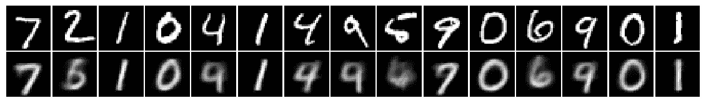

训练样本(输入向上，输出向下)—时期 30

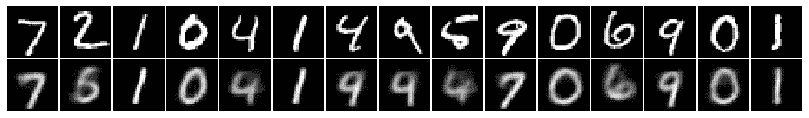

训练样本(输入向上，输出向下)—时期 40

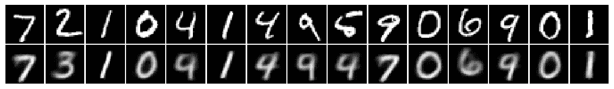

训练样本(输入向上，输出向下)—时期 50

**潜在空间**

关于 VAEs 的一个有趣的事情是，在训练期间学习的潜在空间有一些很好的连续性。我们可以通过考虑一个二维潜在空间来可视化这些性质，以便能够在 2D 容易地可视化我们的数据点。

当查看在训练期间学习的 2D 潜在空间中的 MNIST 数据集样本的重新划分时，我们可以看到相似的数字被分组在一起(绿色的`3`都被分组在一起并且接近非常相似的`8`)。

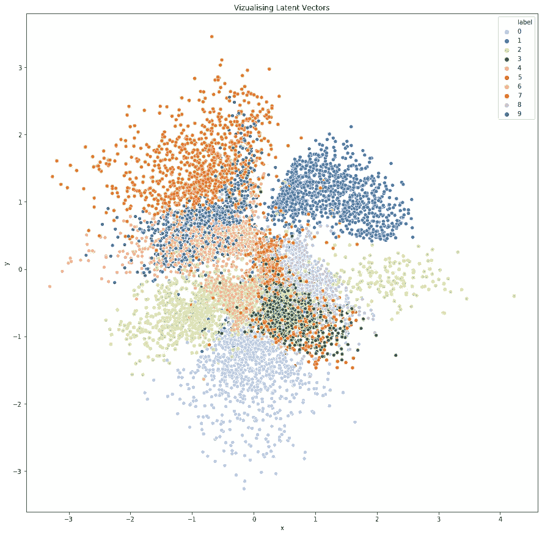

2D 潜在空间可视化

更直观地理解潜在空间连续性的一个好方法是观察潜在空间区域生成的图像。我们可以在下图中看到，当在潜在空间中移动时，数字被平滑地转换成如此相似的数字。

从 2D 潜在空间抽样生成的数字

# 结论

变分自动编码器真的是一个惊人的工具，由于神经网络的力量，解决了一些真正具有挑战性的生成模型问题。与以前的方法相比，VAEs 解决了两个主要问题:

*   如何对潜在空间中最相关的潜在变量进行采样，以产生给定的输出。
*   如何将潜在的空间分布映射到真实的数据分布。

然而，vae 也有一些缺点:

*   生成的图像是模糊的，因为均方误差倾向于使生成器收敛到平均最优值。

生成式反向串行网络(GANs)通过使用鉴别器而不是均方误差损失来解决后一个问题，并产生更真实的图像。然而，GAN 潜在空间非常难以控制，并且不具有(在经典设置中)像 VAEs 那样的连续性特性，而 VAEs 有时是某些应用所需要的。

## 参考

[1]多尔施，c，2016。变分自动编码器教程。 *arXiv 预印本 arXiv:1606.05908* 。

[2]金玛，D.P .和韦林，m .，2019。变分自动编码器导论。 *arXiv 预印本 arXiv:1906.02691* 。

[3]http://yann.lecun.com/exdb/mnist/[MNIST 数据集](http://yann.lecun.com/exdb/mnist/)

## 密码

 [## sinitame/神经网络-实验

### 我在神经网络上做的所有实验的集合

github.com](https://github.com/sinitame/neural-networks-experiments)