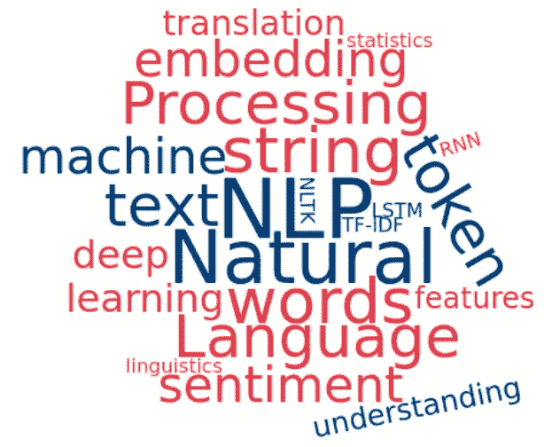
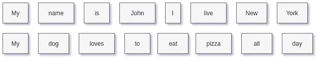
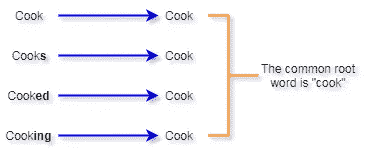
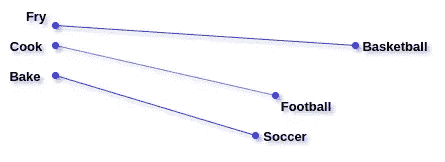
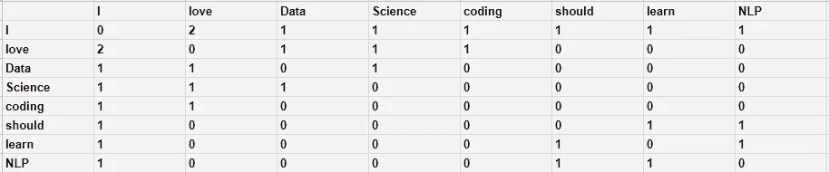
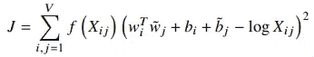

# 面向数据科学家的 NLP 入门指南，包含 7 种常用技术

> 原文：<https://towardsdatascience.com/an-introductory-guide-to-nlp-for-data-scientists-with-7-common-techniques-584d623c40f0?source=collection_archive---------16----------------------->

## 自然语言处理的基础

> 我为学习者写了一份名为《强大的知识》的时事通讯。每一期都包含链接和最佳内容的关键课程，包括引文、书籍、文章、播客和视频。每一个人都是为了学习如何过上更明智、更快乐、更充实的生活而被挑选出来的。 [**在这里报名**](https://mighty-knowledge.ck.page/b2d4518f88) 。

现代组织处理大量数据。这些数据可能以各种不同的形式出现，包括文档、电子表格、录音、电子邮件、JSON 等等。记录此类数据的最常见方式之一是通过文本。这种文字通常与我们日常使用的自然语言非常相似。

[自然语言处理](https://en.wikipedia.org/wiki/Natural_language_processing) (NLP)是对编程计算机处理和分析大量自然文本数据的研究。自然语言处理的知识对于数据科学家来说是必不可少的，因为文本是一种非常容易使用和常见的存储数据的容器。

面对从文本数据执行分析和构建模型的任务，人们必须知道如何执行基本的数据科学任务。这包括清理、格式化、解析、分析、可视化和建模文本数据。当数据由原始数字组成时，除了通常的完成这些任务的方法之外，还需要一些额外的步骤。

本指南将教你在数据科学中使用 NLP 的要点。我们将介绍 7 种最常用的处理文本数据的技术，包括使用 [NLTK](https://www.nltk.org/) 和 [Scikit Learn](https://scikit-learn.org/stable/) 的代码示例。

# (1)标记化

[标记化](https://nlp.stanford.edu/IR-book/html/htmledition/tokenization-1.html)是将文本分割成句子或单词的处理。在这个过程中，我们也扔掉了标点符号和多余的符号。

这并不像看起来那么简单。例如，上面第一个例子中的单词“New York”被分成两个标记。然而，纽约是一个代名词，在我们的分析中可能相当重要——我们最好只使用一个标记。因此，在这一步需要小心。

标记化的好处是，它将文本转换成一种更容易转换成原始数字的格式，这实际上可以用于处理。在分析文本数据时，这是很自然的第一步。

# (2)停用字词删除

标记化后的下一个自然步骤是[停用词移除](https://nlp.stanford.edu/IR-book/html/htmledition/dropping-common-terms-stop-words-1.html)。停用词的移除与标记化有着相似的目标:将文本数据转换成更便于处理的格式。在这种情况下，停用字词删除会删除英语中常见的语言介词，如“and”、“the”、“a”等。这样，当我们分析我们的数据时，我们将能够穿过噪音并专注于具有实际现实意义的单词。

通过删除预定义列表中的单词，可以很容易地删除停用词。需要注意的一点是，没有通用的停用词列表。因此，该列表通常是从头开始创建的，并根据正在处理的应用程序进行定制。

# (3)堵塞

[词干处理](https://nlp.stanford.edu/IR-book/html/htmledition/stemming-and-lemmatization-1.html)是另一种清理文本数据进行处理的技术。词干化是将单词还原成其词根形式的过程。这样做的目的是将因上下文而拼写略有不同但含义相同的单词减少到相同的标记中进行处理。例如，考虑在句子中使用“cook”这个词。根据上下文的不同，我们可以用很多方法来写“cook ”:

所有这些不同形式的单词 cook 本质上都有相同的定义。因此，理想情况下，当我们进行分析时，我们希望它们都映射到同一个令牌。在本例中，我们将它们都映射到单词“cook”的标记。这大大简化了我们对文本数据的进一步分析。

# (4)单词嵌入

既然我们的数据已经从前三种方法中清除了，我们就可以开始把它转换成一种实际上可以处理的格式。

[单词嵌入](https://machinelearningmastery.com/what-are-word-embeddings/)是一种将单词表示为数字的方式，通过这种方式，具有相似含义的单词具有相似的表示。现代的单词嵌入将单个单词表示为预定义向量空间中的实值向量。

所有的单词向量都有相同的长度，只是值不同。两个词向量之间的距离代表两个词的意思有多相似。例如，单词“cook”和“bake”的向量会相当接近，但是单词“football”和“bake”的向量会相当不同。

创建单词嵌入的一种常见方法叫做 [GloVe](https://nlp.stanford.edu/projects/glove/) ，代表“全局向量”。GloVe 捕获文本语料库的全局统计和局部统计，以便创建单词向量。

GloVe 使用所谓的*共生矩阵*。共现矩阵表示每对单词在文本语料库中一起出现频率。例如，考虑我们将如何为以下三个句子创建共现矩阵:

*   我喜欢数据科学。
*   我喜欢编码。
*   我应该学 NLP。

该文本语料库的共现矩阵如下所示:

对于真实世界的数据集，矩阵会大得多，**大得多**。好的方面是单词嵌入只需要为数据计算一次，然后就可以保存到磁盘上。

然后，GloVe 被训练来学习每个单词的固定长度的向量，使得任何两个单词的向量的点积等于来自共现矩阵的单词共现概率的对数。这表现在如下所示的纸的目标函数中:

在等式中， *X* 表示来自位置 *(i，j)* 处的共生矩阵的值，并且*w’*s 是要学习的单词向量。因此，通过使用该目标函数，GloVe 最小化了两个单词向量的点积和同现之间的差异，有效地确保了所学习的向量与矩阵中的同现值相关。

在过去的几年中，GloVe 已经被证明是一种非常健壮和通用的单词嵌入技术，这是由于它对单词的含义及其相似性进行了有效的编码。对于数据科学应用，这是一种久经考验的方法，可以将文字转换成我们可以处理和分析的格式。

这里有一个关于如何在 Python 中使用 GloVe 的[完整教程](https://medium.com/analytics-vidhya/basics-of-using-pre-trained-glove-vectors-in-python-d38905f356db)！

# (5)术语频率-逆文档频率

[词频-逆文档频率](https://en.wikipedia.org/wiki/Tf%E2%80%93idf)，更普遍的说法是 TF-IDF，是一种常用于信息检索、文本挖掘等应用的权重因子。TF-IDF 使用统计数据来衡量一个单词对特定文档的重要性。

*   **TF —术语频率:**测量字符串在文档中出现的频率。计算方式为文档中出现的总次数除以文档的总长度(用于标准化)。
*   **IDF —逆文档频率:**衡量一个字符串在文档中的重要性。例如，某些字符串，如“is”、“of”和“a ”,会在许多文档中出现很多次，但实际上并没有太多意义——它们不是形容词或动词。因此，IDF 根据每个字符串的重要性对其进行加权，计算方法是数据集中文档总数的 *log()* 除以该字符串出现的文档数(分母加 1，以避免被零除)。
*   **TF-IDF:**TF-IDF 的最终计算就是 TF 和 IDF 项的简单相乘: *TF * IDF* 。

考虑到目标词的局部和全局统计水平，TF-IDF 是完美平衡的。在文档中出现频率较高的单词权重较高，但前提是它们在整个文档中出现频率较低。

由于其鲁棒性，TF-IDF 技术经常被搜索引擎用来对给定关键字输入的文档相关性进行评分和排序。在数据科学中，我们可以使用它来了解哪些单词和相关信息在我们的文本数据中是最重要的。

# (6)主题建模

[主题建模](https://www.kdnuggets.com/2019/11/understanding-nlp-topic-modeling-part-1.html)，在 NLP 的上下文中，是从文本数据或文档的集合中提取主要主题的过程。本质上，这是一种形式的[维度缩减](https://en.wikipedia.org/wiki/Dimensionality_reduction)，因为我们将大量的文本数据缩减为更少的主题。主题建模在许多数据科学场景中都很有用。仅举几个例子:

*   文本的数据分析——提取数据的潜在趋势和主要成分
*   对文本进行分类——与降维有助于解决经典的机器学习问题类似，主题建模在这里也有帮助，因为我们将文本压缩到关键特征中，在这种情况下，就是主题
*   构建推荐系统——主题建模自动为我们提供文本数据的一些基本分组。它甚至可以作为构建和训练模型的附加功能

主题建模通常使用一种叫做 [*潜在狄利克雷分配*](/light-on-math-machine-learning-intuitive-guide-to-latent-dirichlet-allocation-437c81220158) (LDA)的技术来完成。使用 LDA，每个文本文档被建模为主题的多项式分布，并且每个主题被建模为单词的多项式分布(单个字符串，我们可以从我们的标记化、停用词移除和词干化的组合中获得)。

LDA 假设文档是由主题组合产生的。然后，这些主题根据它们的概率分布生成单词。

我们首先告诉 LDA 每个文档应该有多少个主题，以及每个主题由多少个单词组成。给定一个文档数据集，LDA 试图确定什么样的主题组合和分布可以准确地重新创建这些文档和其中的所有文本。它可以通过构建实际的文档来判断哪个(哪些)主题起作用，其中构建是通过给定所选主题，根据单词的概率分布对单词进行采样来完成的。

一旦 LDA 找到了能够最准确地在数据集中重新创建所有文档及其内容的主题分布，那么这些就是我们具有适当分布的最终主题。

# (7)情感分析

[情感分析](https://www.kdnuggets.com/2018/08/emotion-sentiment-analysis-practitioners-guide-nlp-5.html)是一种 NLP 技术，试图识别和提取文本数据中包含的主观信息。与主题建模类似，情感分析可以帮助将非结构化文本转换为嵌入数据中的信息的基本摘要。

大多数情感分析技术分为两类:基于规则的方法和机器学习方法。基于规则的方法遵循简单的步骤来实现它们的结果。在进行了一些文本预处理(如标记化、停用词移除和词干化)之后，基于规则的可以例如经历以下步骤:

1.  为不同的情绪定义单词列表。例如，如果我们试图确定一个段落是消极的还是积极的，我们可以定义像*不好*和*可怕*这样的词来表达消极情绪，而*很好*和*很棒*来表达积极情绪
2.  通读课文，数一数积极词的数量。对消极的单词做同样的事情。
3.  如果被识别为肯定的词的数量大于被识别为否定的词的数量，那么文本的情感是*肯定的*——反之亦然，对于*否定的*情感。

基于规则的方法对于了解情感分析系统的工作原理非常有用。然而，现代最先进的系统通常会使用深度学习，或者至少是经典的机器学习技术来自动化这个过程。

利用深度学习技术，情感分析被建模为分类问题。文本数据被编码到嵌入空间中(类似于上面描述的单词嵌入)，这是特征提取的一种形式。这些特征然后被传递到分类模型，在该模型中文本的情感被分类。

这种基于学习的方法是强大的，因为我们可以将其作为一个优化问题来自动化。事实上，我们可以不断地向模型提供数据，以获得持续的改进，这也是一个巨大的好处。更多的数据改善了特征提取和情感分类。

关于如何使用各种机器学习模型进行情感分析，有很多很棒的教程。这里有几个很棒的:

*   用[逻辑回归](/sentiment-analysis-with-python-part-1-5ce197074184)
*   与[随机森林](https://stackabuse.com/python-for-nlp-sentiment-analysis-with-scikit-learn/)
*   与[深度学习的 LSTM](/sentiment-analysis-for-text-with-deep-learning-2f0a0c6472b5)

# 喜欢学习？

在推特上关注我，我会在这里发布所有最新最棒的人工智能、技术和科学！也请在 LinkedIn 上与我保持联系！