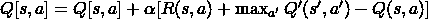
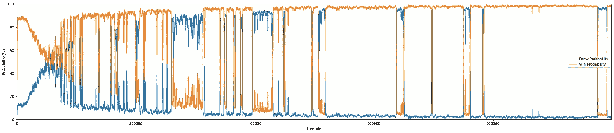
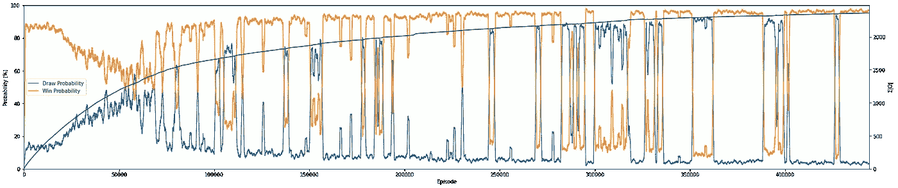

# 一个介绍性强化学习项目:通过自玩表格 Q-learning 学习井字游戏

> 原文：<https://towardsdatascience.com/an-introductory-reinforcement-learning-project-learning-tic-tac-toe-via-self-play-tabular-b8b845e18fe?source=collection_archive---------32----------------------->

在这个项目中，我将介绍一个表格 Q-learning 项目。我们将训练一个简单的 RL 代理，使其能够评估井字游戏的位置，以便在许多游戏中通过与自己对抗来返回最佳移动。

首先，让我们导入所需的库

注意，表格 q-learning 只适用于可以用合理数量的动作和状态来表示的环境。井字游戏有 9 个方块，每个方块可以是 X 和 O，也可以是空的。因此，大约有 3⁹ = 19683 个状态(当然还有 9 个动作)。因此，我们有一个包含 19683 x 9 = 177147 个单元格的表格。这不算小，但是对于表格 q-learning 来说肯定是可行的。事实上，我们可以利用棋盘的旋转不会改变井字游戏的事实。因此，如果你认为一个特定的电路板配置的旋转和反射是相同的，那么实际上“唯一状态”要少得多。我不会深入 Q-learning，因为这是一个介绍性的项目。

首先，我们用前面提到的形状初始化我们的 q 表:

现在，让我们为训练设置一些超参数:

现在，我们需要建立一个探索策略。假设你理解 RL 中的探索-开发，那么*探索策略*就是我们将逐渐减少ε(采取随机行动的概率)的方式。我们最初需要至少半随机地玩游戏，以便正确地探索环境(可能的井字游戏棋盘配置)。但我们不能永远采取随机行动，因为 RL 是一个迭代过程，它依赖于对未来回报的评估会随着时间的推移而变得更好的假设。如果我们只是简单地永远玩随机游戏，我们会试图将随机的行动列表与一些最终的游戏结果联系起来，而这些结果实际上并不依赖于我们采取的任何特定行动。

现在，让我们用 matplotlib 创建一个 epsilon 与剧集(模拟的游戏数量)的关系图，并将该图保存到一个图像文件中:

当我们开始模拟游戏时，我们需要设置一些限制，以便代理人不能做出无意识的举动。在井字游戏中，被占据的方块不再可用，所以我们需要一个函数来返回合法的移动，给定一个棋盘配置。我们将用一个 3x3 的 NumPy 数组来表示我们的棋盘，其中未被占据的方格是 0，X 是 1，O 是-1。我们可以使用 NumPy 的`np.argwhere`来检索 0 个元素的索引。

我们还需要一个助手函数来在 3x3 棋盘表示和整数状态之间进行转换。我们将未来的奖励估计存储在 q 表中，因此我们需要能够轻松地索引任何特定的董事会配置。我之前描述的在棋盘之间进行转换的算法是通过将可能状态的总数划分为与动作数量相对应的多个部分来实现的。对于板中的每个单元:

*   如果单元格为-1，则不改变`state`
*   如果单元格为 0，那么将`state`改变窗口大小的三分之一
*   如果单元格为 1，你将`state`改变窗口大小的三分之二。

最后，我们需要最后一个辅助函数来确定游戏何时到达了终止状态。如果游戏确实结束了，这个函数也需要返回游戏的结果。我的实现通过对每个轴上的板阵列求和来检查一系列 3 个连续 1 或 3 个连续-1 的行、列和对角线。这会产生 3 个和，每个轴或列一个。如果-3 是这些和中的一个，这个轴必须全是-1，表示对应-1 的玩家赢了，反之亦然。对角线的作用是一样的，除了只有 2 条对角线，而有 3 行 3 列。我最初的实现有点幼稚，我在网上找到了一个好得多的。它要短得多，速度也略有提高。

现在，让我们初始化一些列表来记录训练指标。

`past_results`会存储每个模拟游戏的结果，0 代表平局，1 表示正整数对应的玩家获胜，反之用-1 表示。

`win_probs`将存储百分比列表，每集后更新。每一个值都表示到当前一集为止，玩家获胜的游戏的分数。`draw_probs`也记录百分比，但是对应于出现平局的游戏的分数。

培训后，如果我们绘制`win_probs`和`draw_probs`的图形，他们应该展示以下行为。

1.  在训练的早期，赢的概率会很高，而平局的概率会很低。这是因为当两个对手在像井字游戏这样的游戏中采取随机行动时，赢的情况比平的情况更多，这仅仅是因为赢的情况比平的情况多。
2.  训练进行到一半时，当代理开始根据其牌桌的策略玩游戏时，赢和平局的概率将在 50%线上对称波动。一旦代理人开始与自己竞争，它将遇到更多的平局，因为双方都根据相同的战略政策进行博弈。每当代理人发现一个新的进攻策略时，图中就会出现波动，因为代理人能够在短时间内欺骗对手(自己)。
3.  波动了一段时间后，抽奖概率应该接近 100%。如果代理人真的对自己进行最优博弈，它将总是遇到和局，因为它正试图根据预期未来回报表来最大化回报…对手(自己)也在使用同一张表。

我们来写训练脚本吧。对于每一集，我们从一个非终结状态开始:一个空的 3×3 的棋盘，上面填满了 0。它每移动一步，以一定的概率ε，代理从可用的方块列表中随机选择一个动作。否则，它查找 q 表中对应于当前状态的行，并选择最大化预期未来回报的动作。计算新板状态的整数表示，我们记录对(s，a，s’)。一旦这个游戏结束，我们将需要把我们刚刚观察到的状态-动作对与最终的游戏结果关联起来(这还没有确定)。一旦游戏结束，我们回头参考每个记录的状态-动作对，并根据以下内容更新 q 表的相应单元:



q-学习更新规则

在上面的更新公式中，`s`是状态的整数表示，`a`是代理在状态`s`时采取的动作的整数表示，α是学习率，`R(s, a)`是奖励(在我们的例子中，是观察到这对`(s, a)`的相应游戏的最终结果)，`Q`是 q 表，涉及`max`的语句表示结果状态的最大预期奖励。假设电路板配置为:

```
[[0, 0, 0],
 [0, 0, 0],
 [0, 0, 1]]
```

我们采取动作 3，对应于坐标为`(1, 0)`的单元格，结果状态将是:

```
[[0  0, 0],
 [-1, 0, 0],
 [0, 0, 1]]
```

更新公式的这一部分指的是根据我们当前 q 表定义的政策，我们可以从这里采取的任何行动的最大预期回报。因此，`s'`是我刚刚描述的第二种状态，`a'`是我们理论上可以从这种状态(0–8)采取的所有行动，尽管在现实中，有些是非法的(但这是不相关的)。

在每 1000 集结束时，我只保存训练指标列表和这些指标的图表。最后，我保存了 q 表和存储这些训练指标的列表。

# 结果

我用 Google Colab 的在线 GPU 训练我的，但是如果你愿意，你可以在本地训练你的；你不一定要一直训练到收敛才能看到好的结果。

正如我之前提到的，以输赢结束的游戏和以平局结束的游戏之间的关系应该如下:

*   在早期的训练中，一个不熟练的，随机发挥的代理人会经常遇到输赢的情况。
*   每次代理发现一个新的策略，都会有波动。
*   在训练接近尾声，接近收敛时，代理人几乎总是会遇到和局，因为它是在与自己进行最优博弈。

因此，图形中较大的波动表示代理学会很好地评估特定的棋盘配置的时刻，这样做允许它防止和棋。

我们可以在结果图中清楚地看到这一点:



整个培训过程中的赢/输-平比率

在整个训练过程中，似乎 q 表经常会收敛，但很快就会完全改变。这些就是前面提到的第一次利用重大战略的时刻。

此外，正如你所看到的，随着你在整个训练过程中的进步，波动发生得越来越少。这是因为随着你的进步，还有更少的战术有待发现。理论上，如果代理收敛，就不会再有像这样的大波动了。抽牌会在 100%的时间发生，在抽牌百分比快速上升后，它不会再回落。

我决定将 Q 值随时间的变化可视化是一个好主意，所以我重新训练它，同时记录每集 Q 表的绝对值之和。无论特定的 q 值是正还是负，记录所有绝对 q 值的总和向我们显示何时发生收敛(当我们达到收敛时，q 值随时间的梯度降低)。



整个训练过程中的赢/输-平比率+整个训练过程中 Q 表的绝对值之和

你可以在这里访问 Google Colab 的完整代码:

[](https://colab.research.google.com/drive/1w3RYXZ_tg80qNDQZf1I2KyZcigwz8Not?usp=sharing) [## 谷歌联合实验室

### 编辑描述

colab.research.google.com](https://colab.research.google.com/drive/1w3RYXZ_tg80qNDQZf1I2KyZcigwz8Not?usp=sharing) 

或者在 GitHub 上点击:

尝试探索策略会影响训练。您可以更改与 epsilon 相关的参数，以及它是如何衰减的，以便获得不同的结果。

最后要注意的是，井字游戏可以用更简单的值迭代方法更容易地实现，因为转移矩阵和回报矩阵都是给定的。对于像井字游戏这样的环境来说，这种ε-贪婪优化是不必要的。