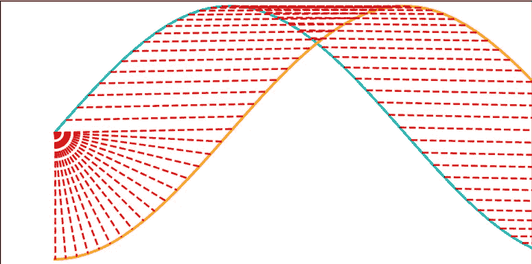
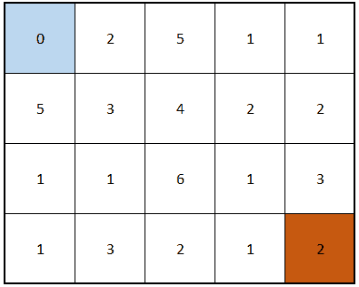
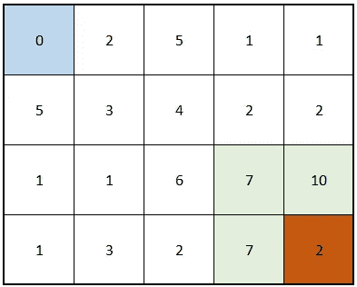
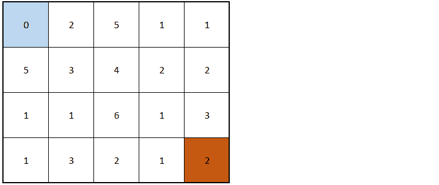
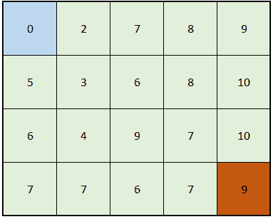
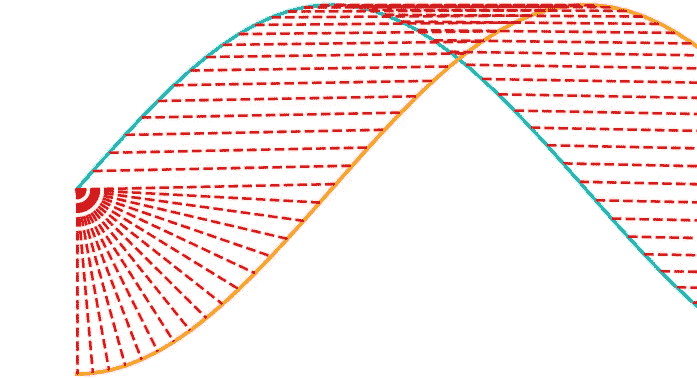
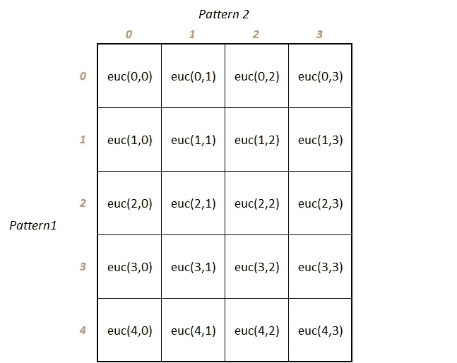

# DTW 的直观方法——动态时间弯曲

> 原文：<https://towardsdatascience.com/an-intuitive-approach-to-dtw-dynamic-time-warping-f660ccb77ff4?source=collection_archive---------25----------------------->

## 如何将算法可视化，让你可以自己定制。


奈杰尔·塔迪亚恩多在 [Unsplash](/photos/i9gR_dz_xzU?utm_source=unsplash&utm_medium=referral&utm_content=creditCopyText) 上拍摄的照片

既然你在这里，我想你已经知道我们为什么在时间序列数据中使用动态的或 DTW。简单地说，它用于对齐或匹配两个相似的模式。

# 简要概述

最初开发 DTW 的原因之一是为了语音识别。你的母亲可能一天说得很慢，另一天又说得很快；即使有些日子会有点感冒和喉咙痛，但你仍然可以听出她的声音。机器也能做到吗？它们能以某种方式匹配她的声音的高低、高低、频率，而不是她说话的方式，并告诉我们这确实是她的声音吗？

DTW 在现实生活中有几个令人敬畏的场景——如果你还不知道，我推荐你去了解它们——它们真的很有趣！

> 你可以在这里阅读更多关于 DTW [和它的许多应用](https://en.wikipedia.org/wiki/Dynamic_time_warping)[在这里](http://seninp.github.io/assets/pubs/senin_dtw_litreview_2008.pdf)(参考*介绍*部分)



两个信号对齐——“作者的图像”

# 带我去那里，快！

我喜欢这个算法！本质上，它是一种短小精悍的算法。这是一个使用 [*动态规划*](https://en.wikipedia.org/wiki/Dynamic_programming) 方法寻找最短路径的经典例子。

我有同事逃避理解算法的内部运作，因为它涉及到 [*递归*](https://en.wikipedia.org/wiki/Recursion_(computer_science)) *。*这最终会阻止他们理解方法的细微差别，以及学习如何根据他们的需求进行调整。

让我们用一种非编程的方式来可视化算法背后的逻辑，这样我们就可以从头开始写了。

> 要理解递归，首先必须理解递归。
> 
> ——斯蒂芬·霍金

想象你站在蓝色广场，希望去红色广场。你在沿途的单元格中看到的所有数字，对应于你在每一步必须支付的通行费金额(暂时是任意决定的)。如果我问你，“*告诉我一个人要从蓝色变成红色最少需要花多少钱*”，你会怎么做？


寻找“最便宜”的路线——“作者图片”

事实上，我可以简单地说，你应该只朝“向前”的方向移动。黑色箭头显示仅有的 3 个“允许”方向(右、下、右下对角线)，红色箭头显示“限制”方向，即除了 3 个允许方向(上、左、其他对角线等)之外的所有方向。).这类似于 DTW 在解决问题之前的假设。



允许的方向—“按作者分类的图像”

上述事实的另一种说法是，“你只能从 3 个相邻的方格中的一个到达任何方格”:


另一种看待它的方式——“作者的图像”

一种“蛮力”方法是尝试从蓝色到红色方块的所有可能路径，并选择最便宜的一条。然而，动态编程和递归给了我们一个更好、更聪明的方法。

# 懒惰的老板

我喜欢以“懒惰老板”的身份来解决所有递归问题，他有无数的手下来完成这项工作。如果有人让我解决上述问题，我会简单地说:“小黄人 A，B，C，告诉我到达红色方块周围的 3 个方块的最小成本，然后我一分钟后计算出答案。在那之前，不要打扰我。”

> 这就是递归使用的技巧——将你被要求做的 ***完全相同的工作*** 交给你的下属，在将工作“缩小”一点之后。一定要给自己留一些简单的东西，这样就没人会说你什么也没做！

假设通过某种魔法(你没兴趣知道)，小喽啰给你带来了答案，标在绿色的格子里:



小黄人 A、B、C 的回答——“作者图片”

我现在需要做的就是找到 **(10，7，7)** 的**最小值**，也就是 7，然后加上当前方块的成本，也就是 2。这给了我答案为 **9** 。搞定了。

9 是从蓝色到红色旅行的最小花费。但是等等，奴才们是怎么想出绿色价值观的？他们当然会模仿你，也扮演懒惰老板的角色！

每个爪牙抓 3 个低级爪牙(我告诉你，办公室里该死的等级制度！)并告诉他们为他们的 3 个邻居/相邻方块带来最小成本值。下面的动画可以更好地解释这一点:



工作中的奴才——“作者的形象”

这种情况一直持续下去，每一个小跟班都“神奇地”得到了答案。但是能持续多久呢？它肯定会结束吗？是的，确实如此。**当没有办法进一步细分作品时。当一个仆从在蓝色方块得到计算费用的任务时，他不能把它委托给任何人，因为没有邻居可去。他只需要知道那里的成本是零。**

就是这样。只需几行代码，您就可以将它转化为一个递归 python 函数:

```
def cheapest(cost, i, j):
 if (i==0) & (j==0):
     return 0  ## can't subdivide the work anymore if (i<0) | (j<0):
     return np.inf ## current square's cost + minimum of the 3 neigbours
 return cost[i][j] + min(cheapest(cost, i-1, j-1), 
                         cheapest(cost, i-1, j), 
                         cheapest(cost, i, j-1))
```

这里，`cost`是一个二维数组，我们的初始矩阵:

```
cost = [
 [0,2,5,1,1],
 [5,3,4,2,2],
 [1,1,6,1,3],
 [1,3,2,1,2]
]
```

请注意，当`i`或`j`小于零时，我是如何返回`np.inf`(无穷大)的。这只是忽略不存在的邻居的一种方式。例如，当你在一个顶行方块中时，你需要考虑的唯一邻居是左边的那个，因为在当前方块的上面没有方块。类似的逻辑也适用于第一列中的正方形，这里左边没有邻居。

您可以通过简单地调用以下命令来调用递归函数:

```
output_cost = cheapest(cost, 3, 4)
print(output_cost)
```

它将给出的输出是 9。

如果对所有方块调用它，最终可以创建一个最便宜的成本矩阵作为输出:

```
output_cost_matrix = []   ## used to store all outputs
for i in range(4):
   for j in range(5):
      output_cost_matrix.append(cheapest(cost, i, j))## reshape the output for better display
output_cost_matrix= (np.array(output_cost_matrix)).reshape(-1,5)
print(output_cost_matrix)
```

输出:

```
[[ 0,  2,  7,  8,  9],
 [ 5,  3,  6,  8, 10],
 [ 6,  4,  9,  7, 10],
 [ 7,  7,  6,  7,  9]]
```

那么，从蓝色方块到红色方块最便宜的路径是什么呢？

我们只需要跟踪每个方块周围的*最小邻居*。如果您也想打印路径，下面是代码。这当然没有优化，但很容易理解:

```
def trace_path(output_cost_matrix, i, j):
 path = [(i, j)]
 while ((i>0) | (j>0)):
   neighbours = [output_cost_matrix[i-1, j-1], 
                 output_cost_matrix[i-1, j], 
                 output_cost_matrix[i, j-1]]
   ## see which neighbour is the smallest
   path_min = np.argmin(neighbours) ## store the position of the smallest neighbour
   if path_min==0:
      i=i-1
      j=j-1
   elif path_min==1:
      i=i-1
   else:
      j=j-1
   path.append((i, j)) return path[::-1] ## return after reversing the list
```

让我们通过调用来查看从蓝色返回到红色方块的路径:

```
trace_path(output_cost_matrix, 3, 4)
```

输出:

```
[(0, 0), (0, 1), (1, 2), (2, 3), (3, 4)]
```

用图形表示出来:



追踪的路径——“作者的图像”

或者在我们的原始矩阵上追踪它:


最便宜的路径——“按作者排序的图像”

# 酷！但是 DTW 在这一切中处于什么位置呢？

问对了！DTW 是如何看待这一切的？

> DTW 不过是简单地将时间序列模式 1 中的一个点与模式 2 中最近的点进行匹配。

我们再来看两个信号的映射。青色的是图案 1，橙色的是图案 2，红线试图为图案 2 上的每个点找到图案 1 上的对应点:



模式映射——“作者的图像”

所以本质上，我们在寻找模式 2-点和模式 1-点之间的最短或最便宜的路径。但是任意两点之间的成本是多少。我们是否像例子中那样，对每个方块随机放置？

根据您的用例，您可以从这里选择各种选项，但最常见的是这些点之间的[欧几里德距离](https://en.wikipedia.org/wiki/Euclidean_distance)。

您将所有模式 1 点排列为矩阵的列轴，所有模式 2 点排列为行轴。然后用欧几里德距离填充每个正方形:



排列成矩阵的图案——“作者的图像”

然后是我们刚刚经历过的递归算法。像`[(0,0), (0,1), (1,1), (2,2), (3,3), (4,3)]`这样的输出路径意味着模式 1 中的点 0 应该与模式 2 中的点 0 和 1 匹配。模式 1 中的点 1、2、3 和 4 应与模式 2 中的点 1、2、3 和 3 相匹配。

但是这实际上能达到什么目的呢？这样的最短距离匹配意味着什么？

> 我喜欢把它想象成这样一种解决方案:你试图以一种确保模式 2 的拉伸(或收缩)最小的方式来匹配模式 2 和模式 1；贪婪地将它匹配到最近的邻居。

现在你知道了。从头开始实现一个简单的 DTW 算法。

我没有提到 DTW 过程的一些细微差别和变化，例如一个[窗口 DTW](https://en.wikipedia.org/wiki/Dynamic_time_warping#Implementation) ，我们在其中添加了一个位置约束。我希望这篇文章已经激发了你想了解更多的兴趣。如果你发现了一些很酷的东西，一定要告诉我！

对分享想法、提问或简单讨论想法感兴趣？在 [LinkedIn](https://www.linkedin.com/in/himanshu-chandra-33512811/) 、 [YouTube](https://www.youtube.com/channel/UChNybQwpqrX9SOc1D4K_x5Q) 、 [GitHub](https://github.com/HCGrit/MachineLearning-iamJustAStudent) 上或通过我的网站与我联系:[我只是一个学生](http://iamjustastudent.com/about)。

回头见&学习愉快！

[](https://www.linkedin.com/in/himanshu-chandra-33512811/) [## Himanshu Chandra -业务主管-ML

www.linkedin.com](https://www.linkedin.com/in/himanshu-chandra-33512811/)