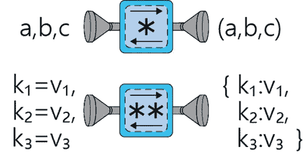
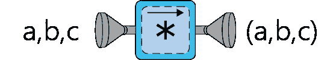
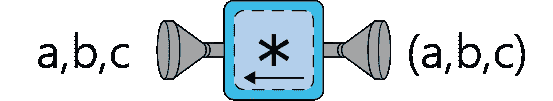
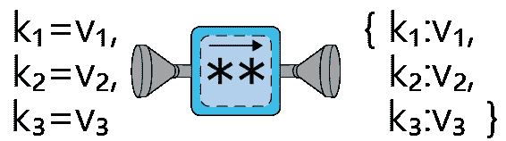
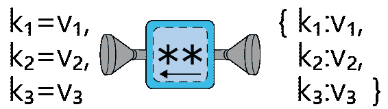

# 一个直观但全面的*args 和**kwargs 教程，最终解决您的问题

> 原文：<https://towardsdatascience.com/an-intuitive-but-comprehensive-tutorial-on-args-and-kwargs-to-finally-put-your-questions-to-rest-ad7713a42076?source=collection_archive---------37----------------------->

> *TLDR；使用* `**args*` *将元组打包/解包到变量* `*args*` *和* `***kwargs*` *将字典打包/解包到变量* `*kwargs*`



你可以在[这个链接](https://github.com/maticalderini/Tutorial_kwargs)找到原始代码库。

在最近的一篇文章中，我解释了如何用 matplotlib 创建自定义绘图函数。不可避免的是，为了做到这一点，我们需要大量使用**kwargs，所以我在这里简要介绍了它们。

不幸的是，`**kwargs`和`*args`是 python 编程初学者最困惑的方面之一。你可能已经看到过`*args`和`*kwargs`被用在其他人的代码中，或者可能在你最喜欢的库的文档中。你可能已经在寻找简单的解释，但是你找到的所有教程都和主题本身一样令人困惑。

虽然我在前面的帖子中对`**kwargs`的解释已经足够了(至少我希望如此！)，我已经被要求上映续集(前传？)在这篇文章中，我以一种直观的、循序渐进的方式更全面地介绍了著名的`*args`和`**kwargs`，这样你就再也不需要关于它们的其他教程了。我希望在这篇文章结束时，你会看到它们实际上是非常简单的操作符，你将能够马上开始把它们放到你所有的函数中，使它们更加灵活，更容易使用和阅读。

写完这篇文章后，我强烈推荐你去看看我的另一篇文章，这样你就可以看到这里展示的理论在用 matplotlib 创建自定义绘图函数中的实际应用。话虽如此，不再赘述，我向你介绍`*args`和`**kwargs`。

# 单一星级运营商— *

## *打包参数—为丢失的参数找到一个家



第一种使用著名明星`*`、`**`的方式是作为“包装工”。把星星想象成把所有被预定义的变量悬挂着的物体都存储在一个物体里。让我们在下面的一系列例子中看到这一点。

首先，让我们创建一个包含 3 个元素的数组，然后将每个元素存储在不同的变量中:

```
a, b, c = [1, 2, 3]
print(f"a: {a}\nb: {b}\nc: {c}") #Printing them on separate lines>a: 1
>b: 2
>c: 3
```

这可能特别无趣，但是现在想象一下，我们保留三个变量 *a* 、 *b* 、 *c* ，而不是三个变量和三个元素，但是将元素的数量增加到 6 个。你可以先试着这样做:

```
a, b, c = [1, 2, 3, 4, 5, 6]
```

如果你真的尝试过，你会发现这会导致一个错误。毕竟，我们试图将六个不同的元素放入三个变量中。假设您希望第一个元素存储在 *a* 中，第二个元素存储在 *b* 中，其余的元素存储在 *c* 中的一个列表中。

你绝对可以这样做:

```
array = [1, 2, 3, 4, 5, 6]
a, b, c = array[0], array[1], array[2:]
```

相反，请看这个示例一行程序:

```
a, b, *c = [1, 2, 3, 4, 5, 6]print(f"a: {a}\nb: {b}\nc: {c}") #Printing them on separate lines>a: 1
>b: 2
>c: [3, 4, 5, 6]
```

这个例子和那个没成功的例子有什么区别？假设变量由数组元素一次填充一个:

*   1 放在 *a* 内。没问题。
*   2 放在 *b* 内。没问题。
*   3 放在 *c* 内。没问题。
*   从 4 到 6 的数字的整个子列表不能放在任何地方。问题。

事实上，我们留下了一大块孤儿列表，python 不能很好地处理被挂起的对象。我们需要的是一个函数，它能够识别哪些对象被留在中间状态，并将它们放在一个列表中，这样我们就不会得到更多的错误。这正是`*`的含义。

当我们写`*c`时，我们实际上是在说`c = [all that's left, packed inside a list]`。代替`*c`，我们也可以写`*args`、`*random_name`、`*args_is_a_convention`，因为`*`后面的实际单词将是列表的名称，该列表将保存所有尚未放入变量的元素:

```
a, b, *args = [1, 2, 3, 4, 5, 6]
print(args)>[3, 4, 5, 6]a, b, *random_name = [1, 2, 3, 4, 5, 6]
print(random_name)>[3, 4, 5, 6]
```

我一直使用带有最后一个变量的`*`来存储在`a`和`b`获得列表份额后剩下的所有元素。但是当我说`*`将获取所有剩余的元素时，并不一定是指列表末尾的元素。我们也可以将第一个和最后一个元素分别保存在`a`和`c`中，并使用`*`来存储剩下的内容:

```
a, *args_is_a_convention, c = [1, 2, 3, 4, 5, 6]print(args_is_a_convention)>[2, 3, 4, 5]
```

这一切都很棒，但对于经常被谈论的东西来说，这似乎是一个非常合适的用例。为什么有人要关心它？当在函数定义中使用`*`这个很酷的属性时，就能找到答案。

## *打包参数——为函数的参数输入增加了灵活性

让我们创建并使用一个具有不同可能输入的基本函数(又名。争论。你可能已经明白我的意思了):

```
def basic_function(a, b, c):
    print(f"a: {a}\nb: {b}\nc: {c}")

basic_function('The name', 2, False)>a: The name
>b: 2
>c: False
```

没什么特别的。我们所做的是设置该函数，使其接受三个值，并将它们分别存储在变量`a`、`b`和`c`中。我们选择分别给这些变量赋予`'The name'`、`2`和`False`的值。这和上面的第一个场景很像，不是吗？

```
a, b, c = ['The name', 2, False]
print(f"a: {a}\nb: {b}\nc: {c}")>a: The name
>b: 2
>c: False
```

基本上，我们的函数定义与我们的变量声明(等号的左边)的作用相同，使用函数本身就像写下要放入每个变量中的值(等号的右边)。

那么，如果我们尝试像这样传递 5 个值，而不是传递 3 个值，会发生什么呢？

```
basic_function(‘The name’, 2, False, 1, ‘Last Name’)
```

你可以试一下，但是它会再次给你一个错误。这是因为我们本质上是在试图将太多的值打包到太少的变量中:

```
a, b, c = ['The name', 2, False, 1, 'Last Name']
```

为了解决这个问题，我们将使`c`能够获取`a`和`b`无法获取的所有值。为此，我们将稍微修改我们的函数，以匹配我们之前的解决方案:

```
def basic_function(a, b, *c):
    print(f"a: {a}\nb: {b}\nc: {c}")

basic_function('The name', 2, False, 12, 5)>a: The name
>b: 2
>c: (False, 12, 5)
```

我们再次看到，语法`*c`将所有没有被`a`和`b`接受的参数打包到一个名为`c`的数组中(像往常一样，这个数组可以被命名为任何名称，而不是`c`)。然而，在上一个例子中，有一个重要的警告你可能已经注意到了，它是非常重要的。默认情况下，得到的对象`c`将是一个**元组，而不是一个列表**，当您稍后试图使用它时，这将带来重要的考虑因素(例如，与列表相反，元组是不可变的)。如果需要，您可以在函数中将其转换为列表...

第一次使用`*`时，有一件事让很多人感到困惑，那就是`c`并没有“充当元组，但暗地里它是一个带星号的元组”。`c` **是一个元组**，句号。值得重复的是，`*name`将简单地获取所有额外的参数，并将它们存储在一个名为`name`的元组中。因此，我们可以像使用所有元组一样使用它。请看下面的例子，它稍微调整了一下基本函数:

```
def basic_function(a, b, *args):
    args_type = type(args)
    first_element = args[0]
    summed_args = sum(args)

    print(f"Type of args: {args_type}")
    print(f"First element of args list: {first_element}")
    print(f"Summed elements of args: {summed_args}")

basic_function('The name', False, 2, 5, 5)>Type of args: <class 'tuple'>
>First element of args list: 2
>Summed elements of args: 12
```

你看，这里的 args 很像一个 tuple，所以我们可以请求它的类型(tuple…)，我们可以通过索引得到元素，对它求和，等等。

如果这不是你第一次学习关于`*args`的教程，你可能已经看到了它是如何被用来定义一个对所有提供的数字求和的函数的。虽然我认为它通常是一个糟糕的例子，同时也是一个使用不当的例子，但是通过前面的例子，您应该能够理解它是如何工作的:

```
def example_of_sum(*args):
    print(sum(args))

example_of_sum(1, 9, 4, 6)>20
```

因为除了`*args` (no `a`或`b`)之外没有其他变量可用，所以结果元组`args`包含所有提供的值(1，9，4，6)。

在您开始使用`*`定义自己的函数之前，有一个小提示。正如您在前两个例子中看到的，我对结果元组使用了传统的名称`args`。我建议你也使用`args`作为你的元组的名称(或者至少是一些明确包含“args”的词)，这样当人们阅读你的代码时，他们可以很容易地识别你在做什么。

第二点也是更重要的一点:虽然我们以前可以这样做:

```
a, *b, c = [1, 2, 3, 4, 5, 6]
```

要在`b`内部存储除第一个和最后一个以外的所有值，在定义函数时不能这样做。换句话说，**这是行不通的**(所以一定要试试):

```
def basic_function(a, *args, c):
    print(a) #example of a random command
```

当你在函数中使用`*args`时，它必须出现在所有已定义参数的最后(实际上在`**kwargs`之前，但我们很快就会看到)。所以`def basic_function(a, *args, c):`是**错**，而`def basic_function(a, c, *args):`是**对**。

这基本上涵盖了`*`所做的我称之为“包装机器”的事情。它将被遗忘的对象或输入放入一个元组中。现在让我们看看硬币的另一面。

## *用于解包的参数—自由设置列表元素



与下一节相比，这一节将会出奇地短，那些解释`**kwargs`如何工作的部分也是如此，因为要点主要在前一节中已经涵盖了。

在这里，我们将看到`*`的另一个常见用法，即**与之前的**完全相反。这是`*`的另一个令人困惑的行为，它让人们不敢在他们的代码中使用`*args`。当我们以前使用它时，它总是与我们所谓的“无人认领的争论”联系在一起。换句话说，`*args`相当于说“将所有剩余的参数放入名为`args`的元组中”。

如果在一个元组或列表中使用`*`(不管它们是否是用`*`创建的)，这一次，存储在元组中的所有元素都将被解包。因为你不能简单地把对象扔到风中而没有一个变量来捕捉它们，通常用`*`对元组和列表的解包是在另一个函数中完成的。让我们用一个例子来说明这一切:

```
my_tuple = (1, 2, 3)
print(my_tuple)>(1, 2, 3)
```

这里没什么有趣的。让我们看看`*`会发生什么:

```
my_tuple = (1, 2, 3)
print(*my_tuple)
>1 2 3
```

乍一看可能不明显，但您应该注意到，元组中的数字现在都是自由的，彼此独立的，而不是在括号内，用逗号分隔。你可以用一个列表试试:

```
my_list = [1, 2, 3]
print(*my_list)>1 2 3
```

实际上，您可以对所有类型的对象进行尝试，并看到不同的结果(对于初学者来说，字典可能会给出意想不到的结果):

```
my_set = {1, 2, 3}
print(*my_set)>1 2 3my_dict = {'first':1, 'second':2, 'third':3}
print(*my_dict)>first second third
```

不过，你明白了。那么这为什么有用呢？主要是，这样您可以将列表中的元素作为独立元素传递给需要独立值而不是元组或列表的函数。当你在函数中有函数时，这是一个特别有用的行为(我发现这对于`**kwargs`更加重要)...不会太久了...).

例如，假设我们对函数定义没有太多的控制权(也许它是另一个库的一部分，而您不想深入研究源代码),而您恰好已经将数据存储在一个元组中:

```
def function_from_library(a, b, c):
    print(f"a: {a}\nb: {b}\nc: {c}")

my_tuple = ("First Name", "Last Name", "email")
```

现在，您可以通过以下方式轻松添加元组:

```
function_from_library(*my_tuple)>a: First Name
>b: Last Name
>c: email
```

如果这不是一个令人满意的结果，那么:

1.  那太好了，你明白*args 实际上一点也不难
2.  将来你可能会发现，它实际上可以非常灵活地解决一些问题
3.  **kwargs 实际上可能对您更感兴趣(差不多了……)

简而言之，您看到了如何根据数据是一组单独的对象还是它们的捆绑集合，将`*`用作数据的打包和解包操作符。如今，现在...到`**kwargs`！。

# 双星运营商——* *

## * *打包的 kwargs 为丢失的关键字参数找到一个家



如果你已经阅读并理解了上面关于`*`和`args`的解释，那么接下来的部分将会很顺利。我们看到`*name`会将自由漫游参数打包到一个元组中，供以后在变量`name`下使用。

另一方面，`**kwargs`将做完全相同的事情，但是将键值对打包到一个字典中。了解这一点的最佳方式是直接进入函数定义:

```
def not_using_kwargs(a, b, c):
    print(f"a: {a}\nb: {b}\nc: {c}")

not_using_kwargs(a=4, b=[1, 2, 3], c=True)>a: 4
>b: [1, 2, 3]
>c: True
```

虽然函数本身与我们之前使用的没有什么不同，但我们在这里实际上使用了不同的方法。在这种情况下，我们非常明确地告诉函数我们希望每个参数是什么:

```
not_using_kwargs(a**=**4, b**=**[1, 2, 3], c**=True**)
```

而不是简单地

```
not_using_kwargs(4, [1, 2, 3], **True**)
```

显式地写出参数的名称是有用的，因为您不需要记住它们在函数中的顺序就可以正确地使用它(想象一下，如果您有 10 或 20 个可能的参数)。例如，我们可以按照不同的顺序编写它们，函数仍然可以按预期工作:

```
not_using_kwargs(b=[1, 2, 3], c=True, a=4)>a: 4
>b: [1, 2, 3]
>c: True
```

那么，如果我们像下面这样使用函数，引入一个新的未定义参数，会发生什么呢？

```
not_using_kwargs(b**=**[1, 2, 3], c**=True**, a**=**4, so_new**=True**)
```

不出所料，事情会失败，因为函数不需要第四个参数。正如我们将在下面的例子中看到的，我们可能希望允许函数接受一些其他潜在的命名参数。那么我们如何修复我们的功能呢？这一次，用`**`。

```
def using_kwargs(a, b, **c):
    print(f"a: {a}\nb: {b}\nc: {c}")

using_kwargs(a=4, b=[1, 2, 3], so_new=True, even_newer=100, freshest_of_all=[20, 5, 1])>a: 4
>b: [1, 2, 3]
>c: {'so_new': True, 'even_newer': 100, 'freshest_of_all': [20, 5, 1]}
```

我们在这里看到，以前没有定义的所有新命名输入现在都存储在一个字典中，其中键表示参数的名称，例如`so_new`，字典条目的值是函数中传递的值，例如`True`。如果这还不够好，你可以考虑将它们结合使用:

```
def using_both(a, *b, **c):
    print(f"a: {a}\nargs: {b}\nkwargs: {c}")

using_both(4, 5, 6, "I'm an arg", [1, 2, 3], test="success", so="simple", where="I'm in a dictionary")>a: 4
>args: (5, 6, "I'm an arg", [1, 2, 3])
>kwargs: {'test': 'success', 'so': 'simple', 'where': "I'm in a dictionary"}
```

如果还不清楚，我建议你多花一秒钟看看前面的例子。这个想法是，`a`接受第一个输入(数字 4)，`b`接受其余未命名的输入(5 一直到列表[1，2，3])，因为有了`*`，而`c`接受了所有命名的输入，因为有了`**`，事实上我们拥有的唯一真正定义的输入是`a`。

和以前一样，定义函数时参数的顺序很重要。为了安全起见，切记始终将`*args`和`**kwargs`放在最后:

```
def my_function(a, b, c, d, ...,  *args, **kwargs)
```

当您使用该函数时，也要考虑这一点。如果你尝试这样做，你会得到一个错误(无论如何要试试看):

```
def my_function(a, b, c, d, *args, **kwargs):
    pass #Since we can't leave this blank, we put pass to say "don't do anything"my_function(5, 4, 3, 2, 'extra arg', a='this is A', extra='extra kwarg')
```

有人可能会认为，既然我们明确地告诉函数将`'This is A'`放入变量`a`，那么它将能够通过将“额外的”参数(5、4、3、2 和‘额外的 arg’)放入`args`来处理它们。然而，在您显式使用`a='This is A'`之前，`a`内的位置已经被 5 占据。请注意这种情况。

## *用于拆包的 kwargs 释放字典



我想那些通读了整篇文章的人已经明白这一部分将要发生什么了。但是我不期望每个人都已经阅读了我到目前为止写的每一个字，所以，这里是`**`拆包的秘密。

有时，您可能有一个字典，其中充满了您希望在函数中使用的键值对。也许你没有自己编写这个函数，或者你没有计划让它接受一个字典，你现在真的不能改变它，否则你将冒着破坏你的代码的风险。有了`**`，你可以像这样轻松使用你的字典:

```
def interesting_function(x, y):
    print(f'What an interesting result: {x + y}')my_dict_data = {"x":2, "y":8}

interesting_function(**my_dict_data)>What an interesting result: 10
```

这也很乏味吗？然后:

1.  太好了，你明白**kwargs 其实一点都不难
2.  将来你可能会发现它可以非常灵活地解决一些问题

另外，如果你想要一个更有趣的使用`**kwargs`解包的例子，我再次推荐你访问我的[最近的帖子](/creating-custom-plotting-functions-with-matplotlib-1f4b8eba6aa1)，在那里我解释了如何用 matplotlib 创建定制的绘图函数。

# 结论

如果你一直读到这里，希望你能理解`*args`和`**kwargs`到底是做什么的。事实上，从现在开始，希望你会认为它们是`*`和`**`，并看到它们本质上并不比元组打包/解包和字典打包/解包函数更特殊。

如果您有任何问题或意见，我希望通过评论/消息/一般社交媒体听到它们。否则，就在你的代码上撒一些星星吧！

*原载于 2020 年 5 月 11 日*[*https://matic derini . github . io*](https://maticalderini.github.io/blog/tutorial/2020/05/11/kwargsTutorial.html)*。*