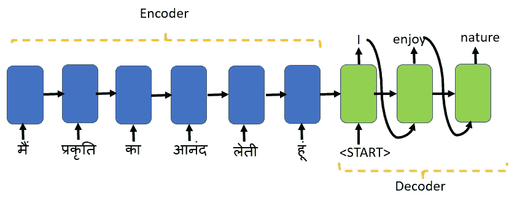
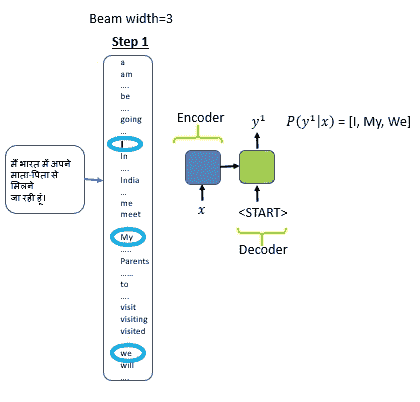
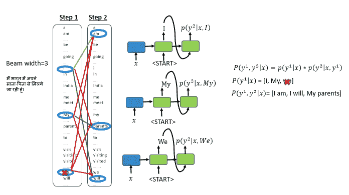
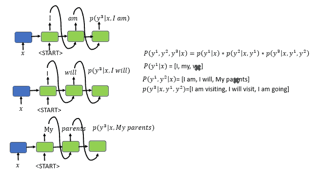
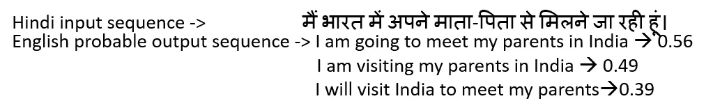
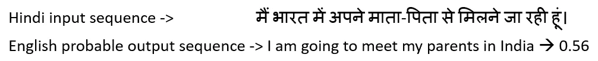

# 波束搜索的直观解释

> 原文：<https://towardsdatascience.com/an-intuitive-explanation-of-beam-search-9b1d744e7a0f?source=collection_archive---------1----------------------->

## 波束搜索的简单易懂的解释

在本文中，我们将了解:

*   什么是波束搜索，它是如何工作的？
*   波束搜索和贪婪搜索的区别

## 先决条件:

 [## 递归神经网络-RNN

### 如果你有兴趣知道谷歌语音搜索或亚马逊的 Alexa 或苹果的 Siri 是如何工作的。你需要有一个…

medium.com](https://medium.com/datadriveninvestor/recurrent-neural-network-rnn-52dd4f01b7e8)  [## 神经机器翻译的直观解释

### 简单解释用于神经机器翻译的序列到序列模型(NMT)

towardsdatascience.com](/intuitive-explanation-of-neural-machine-translation-129789e3c59f) 

由[罗曼·维尼斯](https://unsplash.com/@rvignes?utm_source=unsplash&utm_medium=referral&utm_content=creditCopyText)在 [Unsplash](https://unsplash.com/s/photos/words?utm_source=unsplash&utm_medium=referral&utm_content=creditCopyText) 拍摄的照片

在本文中，您将详细了解神经机器翻译是如何使用序列到序列算法在目标语言的句子中找到最相关的单词的。

***什么是光束搜索？***

为了理解波束搜索，我们将使用[序列的神经机器翻译用例来对](/intuitive-explanation-of-neural-machine-translation-129789e3c59f)序列进行排序。

序列到序列模型使用具有长短期记忆(LSTM)或门控循环单元(GRU)作为基本块的编码器和解码器框架。

编码器映射源序列，对源信息进行编码，并将其传递给解码器。解码器将来自编码器的编码数据作为输入，并将字符串开始标记`<START>`作为初始输入，以产生输出序列。

这里，源序列是印地语的一个句子，目标序列是用英语生成的。您不希望任何随机的英语翻译，但您希望选择最好的和最有可能的单词来翻译，以匹配北印度语句子的意思。

我有印地语的例子，因为这是我所知道的除英语之外的另一种语言。

***如何为目标序列选择最好的、最有可能的词？***

一个简单的方法是拥有目标语言的词汇，比如说 10，000 个单词，然后根据源句子，获得 10，000 个目标单词中每个单词的概率。

源句子在目标语言中可能有多种可能的翻译。

***要不要随便挑一个翻译？***

**我们的目标是挑选最好的、最有可能翻译的单词，所以我们根据源句选择概率最大的目标单词。**

你应该只选择一个最好的翻译吗？

**贪婪搜索算法为每个时间步长**选择一个最佳候选作为输入序列。仅选择一个最佳候选可能适合当前的时间步长，但当我们构建完整的句子时，它可能是次优的选择。

**波束搜索算法基于条件概率在每个时间步长为输入序列选择多个备选方案。**多个备选方案的数量取决于一个名为**波束宽度 B 的参数。**在每个时间步长，波束搜索选择 B 个概率最高的最佳备选方案作为该时间步长最有可能的选择。

我们举个例子来理解这一点。

我们将选择波束宽度= 3；我们的英语词汇量有 10，000 个单词。

**步骤 1:在给定输入句子**的情况下，找出概率最高的前 3 个单词。最可能单词的数量基于波束宽度

*   将编码的输入句子输入到解码器；然后，解码器将对词汇表中的所有 10，000 个单词应用 softmax 函数。
*   从 10，000 种可能性中，我们将只选择概率最高的前 3 个单词。
*   **当波束宽度设置为三个**时，考虑翻译单词的三个最佳和最有可能的备选。
*   如果波束宽度设置为 10，那么我们将选择概率最高的前 10 个单词。**我们在内存中存储前三个单词:我、我的和我们**

第一步:根据输入的句子找出三个概率最高的单词

贪婪搜索总是只考虑一个最佳选择。

**第二步:** **根据条件概率为第一个和第二个单词找出三个最佳配对**

第二步:找出翻译句子中第一个和第二个单词的前三对单词

*   将步骤 1 中选择的前三个单词(我、我的、我们)作为第二步的输入
*   将 softmax 函数应用于词汇表中的所有 10，000 个单词，以找到第二个单词的三个最佳备选项。在这样做的时候，我们将使用条件概率找出最有可能形成一对的第一个和第二个单词的组合。
*   为了找到第一个和第二个单词的三个最佳对，我们将取第一个单词“I”，将 softmax 函数应用于词汇表中的所有 10，000 个单词。
*   评估其他两个词的概率，选择第一个词:“我的”和“我们”
*   运行 30，000 种不同的组合来选择第一个和第二个单词的前 3 对。
*   前三个第一和第二单词对组合是:“我是”、“我的父母”和“我会”
*   我们现在已经删除了第一个单词“We ”,因为我们没有找到任何将“We”作为第一个和第二个单词的具有高条件概率的单词对
*   在每一步，我们实例化编码器-解码器网络的三个副本，以评估这些部分句子片段和输出。网络的拷贝数与波束宽度的大小相同

**第三步:** **根据输入的句子和选择的第一个和第二个单词**找到第一个、第二个和第三个单词的三个最佳对

第三步:找出翻译句子中前三个单词最可能的选择

*   沿着输入的句子和前 3 个第一和第二单词对组合:“我是”、“我的父母”、“我**将**”，找到条件概率最高的第三个单词。
*   再次运行 30，000 个组合来选择第一、第二和第三个字的最佳和最可能的组合，并实例化 seq2seq 编码器-解码器模型的三个副本
*   前三个第一、第二和第三单词组合是:“我正在访问”、“我将要访问”和“我将要去”。
*   我们放弃了组合“我的父母”,因为我们在前 3 个组合中没有找到第一、第二和第三个单词组合“我的父母”。

我们继续这个过程，我们选出三个概率最高的句子。前三个句子的长度可以不同，也可以相同。

具有最高条件概率和不同长度的三个输出句子

**我们最终选择解码器的输出作为概率最高的句子**

***光束宽度值越大，翻译效果越好吗？***

更高的波束宽度将提供更好的翻译，但会使用大量的内存和计算能力。

当我们有 3 的波束宽度和 10，000 个单词的词汇时，我们在每个时间步评估 30，000 个组合，创建三个编码器-解码器实例，最大句子长度是 9。创建多个编码器-解码器副本并在每个时间步计算 30，000 个单词的条件概率需要大量内存和计算能力。

较低的波束宽度将导致质量更差的翻译，但是在存储器使用和计算能力方面将是快速和有效的

## 结论:

波束搜索是序列到序列深度 NLP 算法(如神经机器翻译、图像字幕、聊天机器人等)最流行的搜索策略。

波束搜索使用条件概率基于波束宽度考虑多个最佳选项，优于次优贪婪搜索。

## 参考资料:

[https://www.youtube.com/watch?v=RLWuzLLSIgw](https://www.youtube.com/watch?v=RLWuzLLSIgw)