# 场感知因式分解机的直观解释

> 原文：<https://towardsdatascience.com/an-intuitive-explanation-of-field-aware-factorization-machines-a8fee92ce29f?source=collection_archive---------10----------------------->

## 从 LM 到 Poly2 到 MF 到 FM 到 FFM

在推荐系统中，场感知因子分解机器(FFM)特别有用，因为它们能够处理具有许多分类特征的大型稀疏数据集。

为了理解 FFM 是如何产生的，让我们明确一些基础知识，理解为什么 FFM 是好的，它们有什么好处。

由作者改编(文章底部的原始照片)

## 线性回归

当我们试图对因变量和一个或多个自变量之间的关系建模时，我们能想到的最简单的模型是线性回归模型。

例如，为了预测用户对某部电影的评价，我们可以使用许多不同的特征作为预测指标。然而，为了简单起见，让我们假设两个变量——性别(`x1`)和电影的类型(`x2`)。

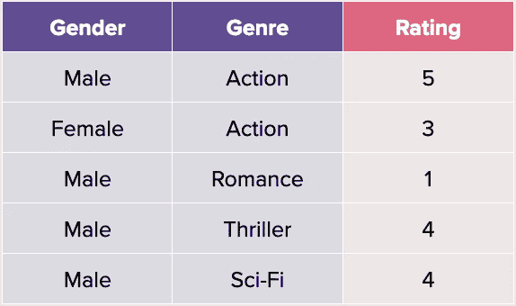

作者照片

在这种情况下，我们将以下面的等式结束(假设没有偏差，并假设对分类变量进行了一些编码):

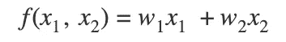

作者照片

然后我们将求解权重`w1`和`w2`。自然，线性回归不会表现得很好，因为它试图学习每个变量的平均行为，并且没有考虑这些变量之间相互作用的可能性(即，它不能学习`x1`可能与`x2`具有相关性)。

## Poly2

为了模拟这些相互作用，我们引入下一个最简单的模型——poly 2。代替上面的等式，我们为每个 ***特征对*** 添加一个交互项。这给了我们:

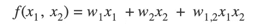

作者照片

然而，很明显，这种方法有一些主要的缺点。首先，**非常少的*交互将具有不可靠的预测***，其次，**看不见的交互(即*零*交互)将具有微不足道的预测**。

例如，在 10000 个示例的训练集中，如果我们只有 2 个男性观看惊悚电影的示例，我们对男性观看惊悚电影的未来预测将仅基于这 2 个训练示例(即，交互项的权重由 2 个数据点确定)。此外，如果我们的训练集没有女性观看科幻电影的例子(如上表所示)，对这些电影做出的预测将是琐碎而无意义的。

## **矩阵分解**

在 MF 中，我们通常以稍微不同的方式表示数据。我们希望捕捉到*用户*和*物品*之间的互动，而不是将每个变量编码为男性或女性，或者使用电影的类型。让我们看看我们的新数据:

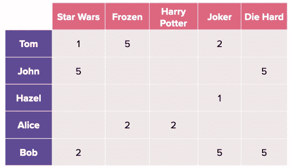

作者照片

在上图中，用户位于行中，而项目位于列中。给定的*用户-项目*交互的正值是用户对该电影的评价(*注意，值也可以是二进制的，如下图所示，以表示观看或未观看*)。

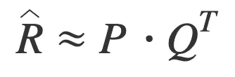

作者照片

给定上面的*用户-物品*矩阵***R***[*M*x*N*】,目标是近似两个矩阵——一个用户潜在矩阵**P**[*M*x*k*和一个物品潜在矩阵**Q**[*N*x*k*，其中更稳健的 MF 方法是加权 MF，其中非相互作用值用零填充，然后使用加权交替最小二乘(WALS)或随机梯度下降(SGD)进行优化，将(观察和未观察条目的)误差平方和作为损失函数。通常添加一个超参数来加权来自未观察条目的误差，因为由于稀疏性，它们往往更多。

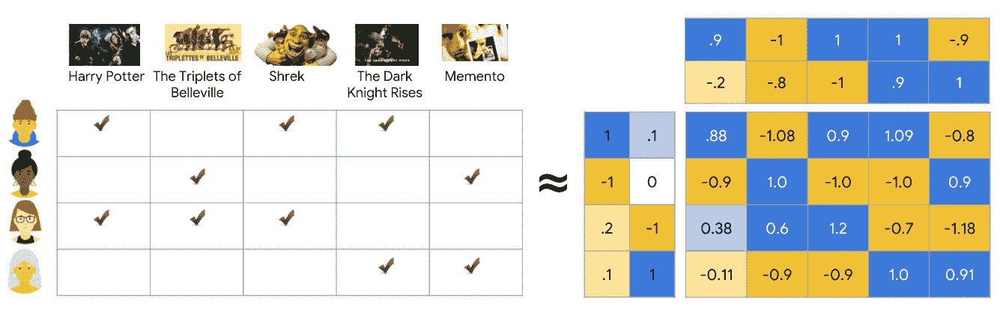

来源:[谷歌的推荐系统课程](https://developers.google.com/machine-learning/recommendation)

**MF 如何改进线性回归和 Poly2？**

MF 本质上是一个潜在因子模型，这意味着它可以将一个非常稀疏(和高维)的矩阵表示为两个维度低得多的矩阵。在高层次上，人们可以想象它与主成分分析(PCA)类似，我们试图在 *k* 成分中捕获尽可能多的方差。

> **注:**潜在向量的概念与向量嵌入同义，其思想是从高维空间中学习一种紧凑的表示。

MF 的一个缺点是它只是一个矩阵分解框架。因此，我们只能将矩阵表示为一个*用户条目*矩阵，而不能包含诸如电影类型、语言等辅助特性。因式分解过程必须从现有的相互作用中学习所有这些。因此，因式分解机作为 MF 的改进版本被引入。

(*由于本文关注的是 FFM，我就不深究 MF 的更多细节了。为了了解更多，我强烈推荐* [*谷歌的推荐系统入门课程*](https://developers.google.com/machine-learning/recommendation) *。*)

## 因子分解机器(FM)

如前所述，FM 是 MF 的改进版本。更具体地说，FM 是一种更一般化的预测器，如支持向量机(SVM)，但能够在稀疏性下估计可靠的参数[2]。简单来说， **FM 公式化为线性模型，特征之间的相互作用作为附加参数(特征)**。这些特征交互是在它们的潜在空间表示中完成的，而不是在它们的平面格式中。它在数学上表示为:

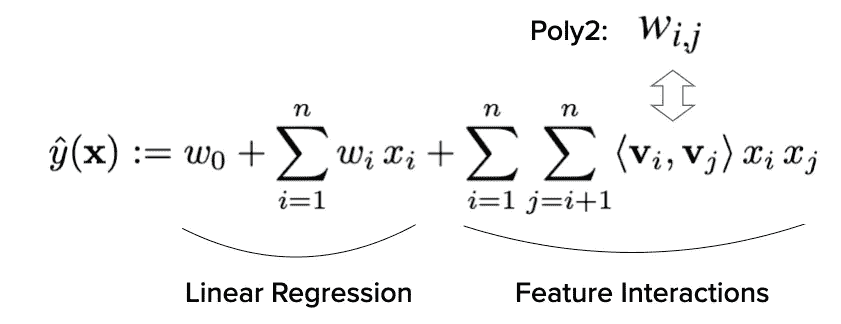

作者照片

如上所述，我们可以将上面的等式分解为两部分——左边的一个*线性回归*模型和右边的一个等价的*矩阵分解*。

**与 Poly2 相比，交互的捕获有何不同？**

上面等式的右边可能会把人吓跑，因为它看起来很吓人。为了更容易理解，让我们来看看如何表示我们在 MF 中看到的*用户条目*矩阵。

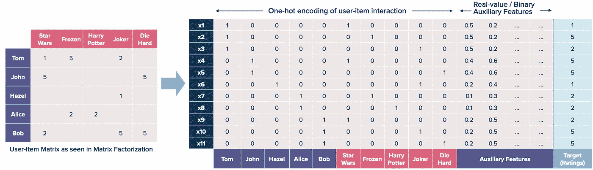

作者照片

首先，我们希望将*用户-项目*交互表示为一个 hot 编码向量，其中转换后的每一行都只有**一个活动用户和项目**。然后，我们可以添加辅助特征(例如，用户评价的其他电影、评价的最后一部电影、他消费该电影的时间等)作为一次性编码或归一化向量。

一般来说，因式分解机器能够估计稀疏设置中的相互作用，因为它们通过因式分解打破了相互作用参数的独立性(使用`<v_i, v_j>`中表示的潜在向量)。这意味着一个交互的数据也有助于估计相关交互的参数(类似于矩阵分解和协同过滤的思想)。

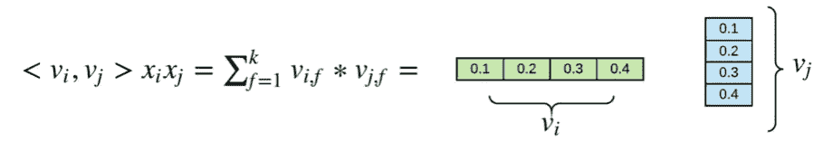

来源:[媒体文章](/thrive-and-blossom-in-the-mud-fm-model-for-recommendation-system-1-95707839e235)作者:迈克尔·魏

与 Poly2 相比，FM 中每个相互作用的权重使用两个潜在向量的内积来估计。这意味着，即使在训练集中`x_i`和`x_j`之间没有交互，FM 也能够概括这种交互，因为它已经在训练期间创建了嵌入(如在 MF 示例中，我们获得了两个潜在矩阵)。在 Poly2 中，这是不可能的，因为模型没有看到这种特殊的相互作用。注意，在 FM 中，有一个额外的超参数 *k —* 所使用的潜在特征的数量(如上图所示)。

如果调频已经可以概括得这么好，f FM 如何超越调频？

## 场感知因式分解机(FFM)

在深入研究 FFM 之前，注意术语上的差异是至关重要的:自变量如*流派*和*性别*现在将被称为**字段**。每个字段的分类值将被称为**特征**。比如*男*、*女*、动作、*言情*等都是特色。

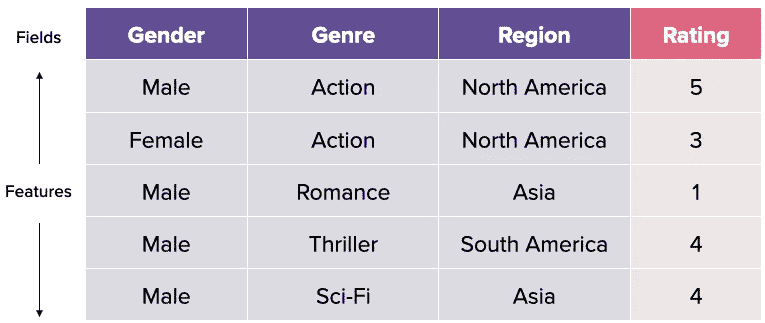

作者照片

在 FM 中，每个特征只有一个潜在向量来学习所有*其他*特征的潜在效果[1]。例如，如果我们有 3 个字段*性别*、*流派*和*国家*，我们将 FM 下的交互计算为:

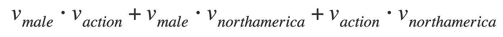

作者照片

以上表第一行为例，用*男*的潜在向量来学习*动作*T0*北美*的潜在效果。然而，*动作*属于*流派*领域，而*北美*属于*地区*领域，然而我们使用相同的潜在向量来表示*男性*。

FFM 将这种单一的表现方式分解成多个潜在向量——每个向量代表一个场。这样做背后的直觉是，`<v_male, v_action>`和`<v_male, v_northamerica>`的潜在向量可能非常不同，我们希望更准确地捕捉它们。FFM 领导下的互动将如下:

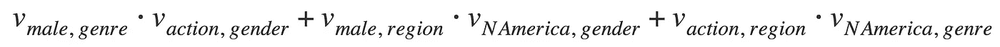

作者照片

为了了解`<v_male, v_action>`的潜在效果，我们使用`v_male,genre`，因为我们想要将潜在向量专门用于*类别*字段。同样，我们使用`v_action,gender`是因为我们想要捕获专门针对*性别*字段*的潜在向量。*

什么时候我们应该使用 FFM 而不是调频？

比较 FFM 和 FM，FFM 为每个*特征*学习多个潜在向量，而 FM 为每个*特征*学习一个潜在向量。人们可以把前者解释为试图在更细粒度的层次上表现相互作用。因此，表示这种颗粒相互作用所需的潜在特征 *k* 的数量较少，即 FFM 中的 *k* 、FM 中的< < *k* 。

在 FFM 的官方论文中，经验证明，对于具有许多分类特征的大型稀疏数据集，FFM 表现更好。相反，对于小而密集的数据集或数值数据集，FFM 可能不如 FM 有效。FFM 还容易在训练数据集上过度拟合，因此应该使用独立的验证集，并在损失增加时使用早期停止。

## 摘要

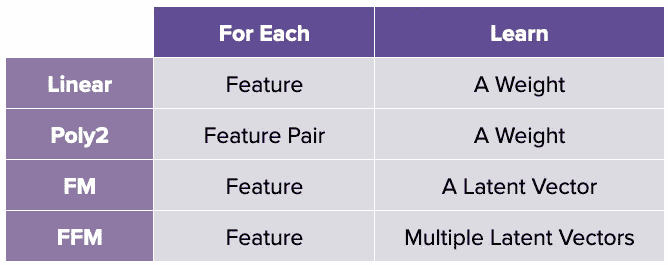

作者照片

希望这对那些探索 FFM 或 FM 在稀疏矩阵监督学习应用中的使用或探索推荐系统的人有所帮助。:)欢迎随时留言评论！

来源: [UncleLeo](https://www.shutterstock.com/image-vector/theory-evolution-man-human-development-monkey-1022560147) /Shutterstock

***支持我！*** —如果你喜欢我的内容并且*没有*订阅 Medium，请考虑支持我并通过我在这里的推荐链接[订阅](https://davidcjw.medium.com/membership) ( *注意:你的一部分会员费将作为推荐费*分摊给我)。

## 参考资料:

[1] [用于 CTR 预测的场感知因式分解机](https://dl.acm.org/doi/10.1145/2959100.2959134)

[2] [因式分解机](https://www.csie.ntu.edu.tw/~b97053/paper/Rendle2010FM.pdf)

[3] [谷歌的推荐系统课程](https://developers.google.com/machine-learning/recommendation)

[4] [在深度学习中茁壮成长:推荐系统的 FM 模型(上)](/thrive-and-blossom-in-the-mud-fm-model-for-recommendation-system-1-95707839e235)