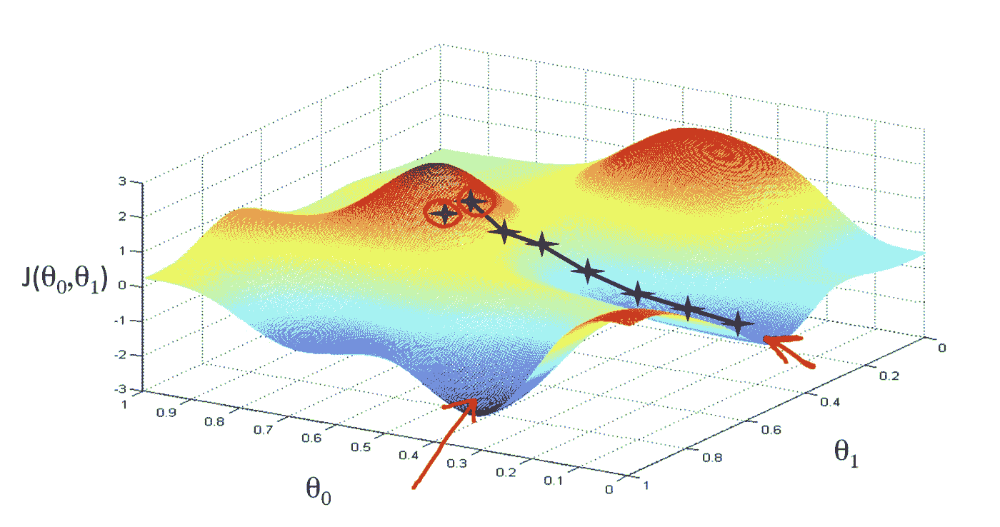
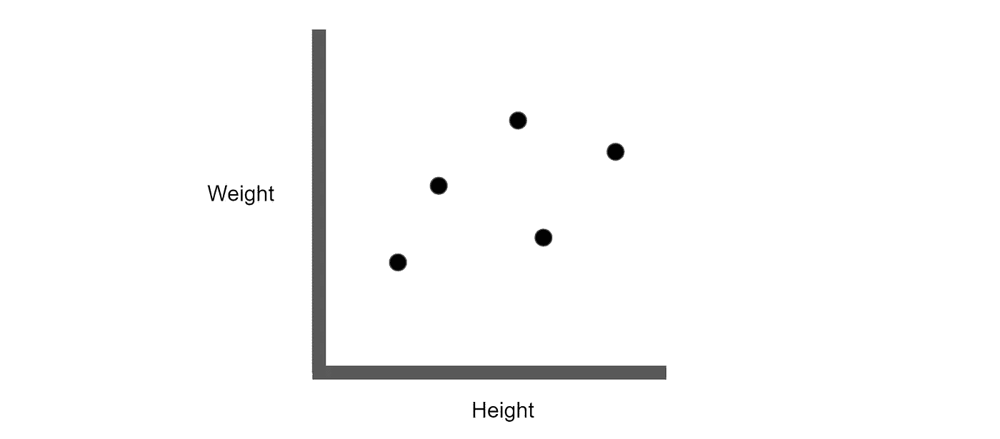
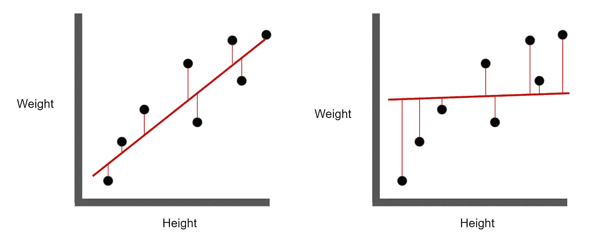
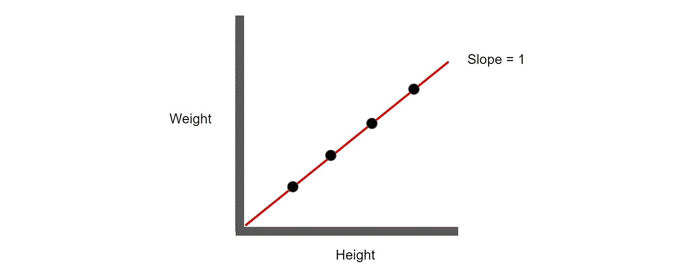
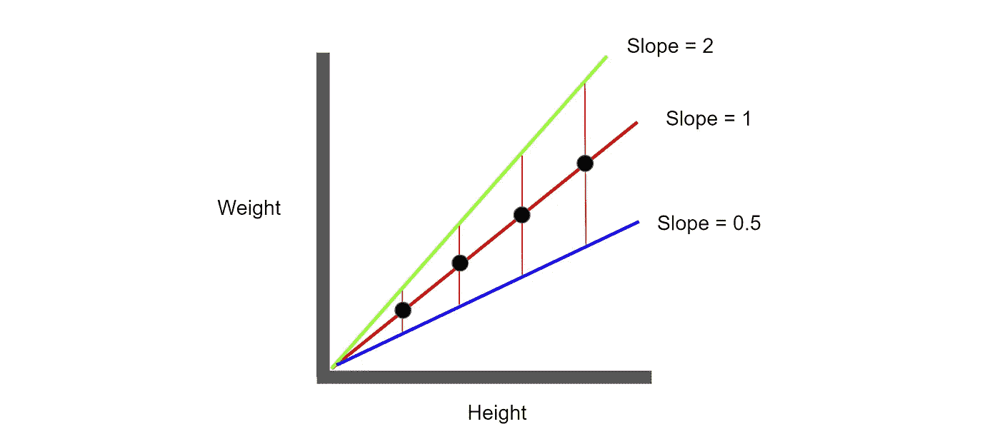
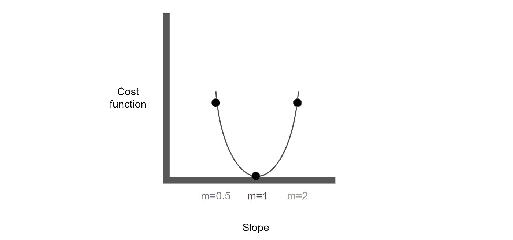
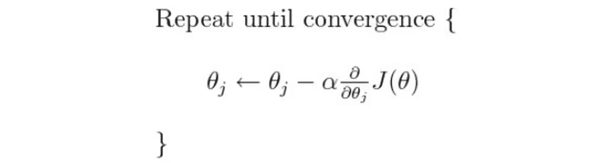
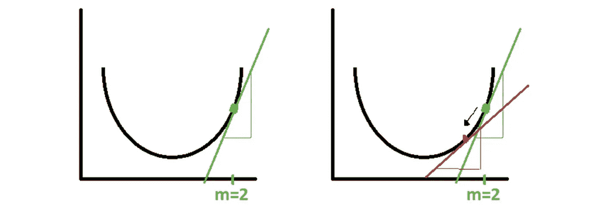
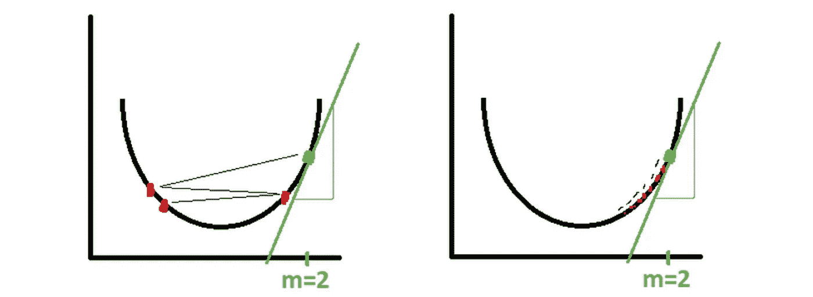

# 梯度下降的直观解释

> 原文：<https://towardsdatascience.com/an-intuitive-explanation-of-gradient-descent-83adf68c9c33?source=collection_archive---------25----------------------->

## 最广泛使用的机器学习算法之一将在 5 分钟内解释

梯度下降广泛应用于机器学习领域，本质上是一种用于寻找成本函数最小值的优化算法。在数据科学中，梯度下降用于细化我们的模型的参数(系数)，以最小化误差。我们将通过下面的示例来了解梯度下降的工作原理。

想象一下，上面的图表代表了人的身高和体重之间的关系；高个子的人通常比矮个子的人更重。假设我们希望找到最佳拟合线，即最能代表上述数据的等式。

上图显示，左边的(红色)最佳拟合线比右边的精确得多。这可以通过观察每个点和最佳拟合线之间的距离来看出。距离越小(误差越小)，最佳拟合线越好。最佳拟合线由我们在高中时都学过的方程表示，y = mx + b。

要理解梯度下降，我们首先需要理解什么是成本函数。

**成本函数本质上是我们希望最小化的东西；在这种情况下，我们希望最小化数据点和最佳拟合线之间的距离。**如果成本函数更直观，可以将其视为误差函数。为了理解成本函数，让我们使用一个更简单的例子。

假设有数据点正好落在最佳修复线上，y = x，其中斜率等于 1。在这种情况下，数据点与最佳拟合线之间的距离*又称成本函数* ***、*** 将等于零。

现在假设我们将最佳拟合线移动到绿线，以使斜率等于 2(绿线)。现在，数据点和最佳拟合线之间的距离增加了。**表示成本函数增加**。类似地，如果我们移动最佳拟合线以使斜率等于(蓝线)， **t** 成本函数将等于绿线增加。

如果我们用相应的成本函数绘制最佳拟合线的斜率，我们可以看到 1 的斜率最小化成本函数，也就是最小化数据点和最佳拟合线之间的距离。如果你回头看我们的图，斜率等于 1，这是真的！

现在谈谈有趣的事情。

梯度下降是一种算法，用于实质上最小化成本函数；在上面的例子中，梯度下降会告诉我们，1 的斜率会给我们最精确的最佳拟合线。

虽然看起来令人生畏，但其实很简单。让我解释一下:

*   θj 等于 m(斜率)
*   α等于学习速率(稍后我将对此进行更详细的解释)
*   (∂/ ∂θj)*J(θ)等于点 m 处成本函数的偏导数(成本函数的斜率，**不是最佳拟合线)**
*   *重复直到收敛*仅仅意味着重复算法直到它达到全局最优值(在本例中为最小值)。

换句话说，这种算法意味着:

重复用 m 点处成本函数的斜率乘以系数(α)减去最佳拟合线的斜率，直到偏导数的斜率为零。

> **新斜率=最佳拟合线的旧斜率—α*点 m 处成本函数的偏导数**

为了展示一个例子，假设我们从一条斜率为 2 的最佳拟合线开始。如果我们观察成本函数上斜率为 2 的点(绿点)，我们可以得到该点的偏导数，也就是与曲线相切的绿线的斜率。在这里，我们可以看到偏导数是正的。回顾我们的等式，

*新斜率=最佳拟合线的旧斜率—α*****点 m 处成本函数的偏导数***

新的斜率(m)将等于 2 **减去** **一个正数**(因为偏导数是正的)，这将我们带到红点(如上所示)。

如果部分推导是负的 aka，如果点开始于图的左侧，则新斜率将等于旧斜率减去负数，其等于旧斜率**加上** **正数。**

我们会重复这个过程，直到我们达到收敛，也就是我们达到一个最小值，因此，我们会确定最佳拟合线的斜率，使成本函数最小化！

在梯度下降算法中关于 alpha (α)的一个简短注释，

如果α太大，则算法将在每次迭代中过冲(如左图所示)，这可能会阻止它达到最小值。反之，如果α太小，则需要太长时间才能达到最小值。因此，α必须介于两者之间，使得这两种情况都不发生。

简而言之，这就是梯度下降！