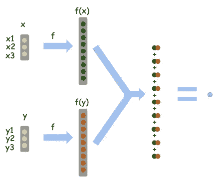

# 支持向量机(SVM)内核的直观解释

> 原文：<https://towardsdatascience.com/an-intuitive-explanation-of-kernels-in-support-vector-machine-svm-9ef366e8d5fb?source=collection_archive---------45----------------------->

简而言之，内核是帮助我们更快完成某些计算的捷径，否则这些计算将涉及到更高维度空间的计算。这听起来相当抽象。在这篇博文中，我将带你看一个只需要基本算法的简单例子。

**简单的例子:**

我们有一个三维向量 x = (x1，x2，x3)。我们这样定义这个运算 f(x):f(x)=(x1x 1，x1x2，x1x3，x2x1，x2x2，x2x3，x3x1，x3x2，x3x3)。换句话说，它想把 x 中的每一对相乘，产生一个 9 维向量。

我们插上一些数字，更直观一点！假设 x = (1，2，3)；y = (4，5，6)。然后:
f(x) = (1，2，3，2，4，6，3，6，9)
f(y) = (16，20，24，20，25，30，24，30，36)

现在，由于某种原因，我们实际上并不关心 f(x)和 f(y)。我们只想知道点积，<f f="">。提醒一下，点积意味着 f(x)的第一维乘以 f(y)的第一维，f(x)的第二维乘以 f(y)的第二维，……f(x)的第九维乘以 f(y)的第九维，我们把它们都加起来。所以:</f>

<f f="">= 16+40+72+40+100+180+72+180+324 = 1024</f>

一大堆代数！主要是因为 f 是从 3 维到 9 维空间的映射。尽管最终的答案只有一个数字，但我们必须在中间“膨胀”，在 9 维空间中完成所有这些繁琐的计算，然后才能浓缩成一个数字。

如果我告诉你有一条捷径呢？

我声称“内核”，K(x，y ) = ( <x y="">)，达到了同样的效果。就是我们在 x 和 y 上做点积而不是 f(x)和 f(y)，然后平方。</x>

让我们来测试一下:

提醒:x = (1，2，3)；y = (4，5，6)。

<x y="">= x1 y1+x2 y2+x3y 3 = 1×4+2×5+3×6 = 32
K(x，y) = ( < x，y > ) = 32 = 1024</x>

瞧，同样的结果。但是这个计算要容易得多，因为我们只在三维空间中操作。我们从未涉足 9 维空间！

**数学定义**:

现在让我们继续讨论一些数学形式。

K(x，y) =

k 表示核函数。这里 x，y 是 n 维输入。 *f* 是从 *n* 维度到 *m* 维度空间的映射。通常 *m* 比 *n* 大很多。**内核是一个函数，取 *x* 和 y*作为输入，不需要计算 *f(x)* 和 *f(y)* 就能得到与<f(x)*、 *f(y)* >相同的结果。**

内核还有一个好处:它们允许我们在无限的维度上做事情！ *f(x)* 可以是从 n 维到无限维的映射，因而不可能先写出 *f(x)* 和 *f(y)* ，再做点积。那么内核给了我们一个绝妙的捷径。一个这样的例子是径向基函数(RBF)内核。

与 SVM 的关系:这与 SVM 有什么关系？SVM 的思想是 y = wφ(x)+b，其中 w 是权重，φ是特征向量，b 是偏差。如果 y >为 0，那么我们将数据分类为 1 类，否则分类为 0 类。我们希望找到一组权重和偏差，以使利润最大化。一些教材说，对于 SVM 来说，内核使数据线性可分。我认为更准确的说法是，*内核不能让数据线性分离。特征向量 phi(x)使数据线性可分*。核是为了让计算过程更快更容易，特别是当特征向量 phi 的维数非常高的时候。

**为什么也可以理解为相似度的度量:**
如果我们把核的定义放在上面，< f(x)，f(y) >，在 SVM 和特征向量的上下文中，就变成了< phi(x)，phi(y) >。点积意味着 phi(x)到 phi(y)的投影，或者通俗地说，x 和 y 在它们的特征空间中有多少重叠。换句话说，他们是多么的相似。点积是衡量相似性的指标。内核只是一种实现点积效果的方法，而不需要在 f(x)和 f(y)之间做点积。

*原载于*[*www.quora.com*](https://www.quora.com/What-are-kernels-in-machine-learning-and-SVM-and-why-do-we-need-them/answer/Lili-Jiang)*。*