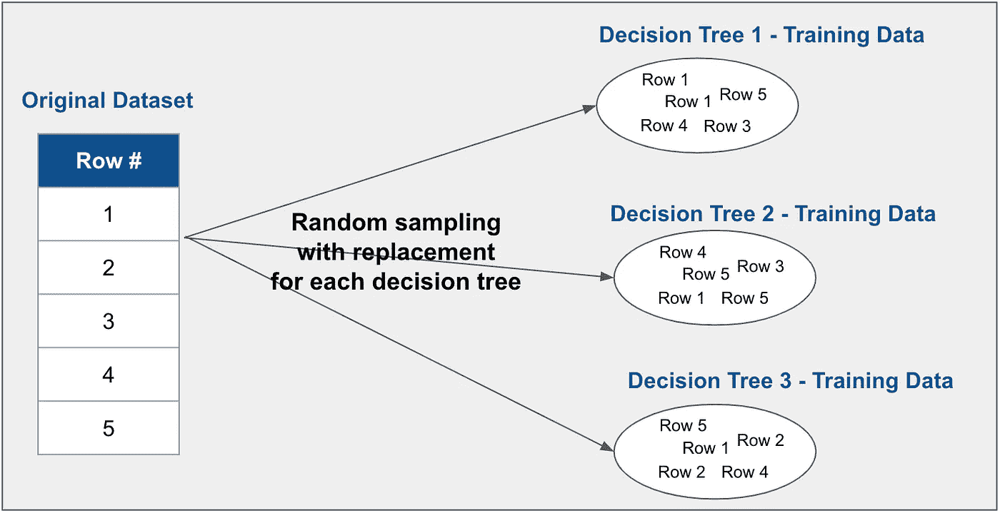
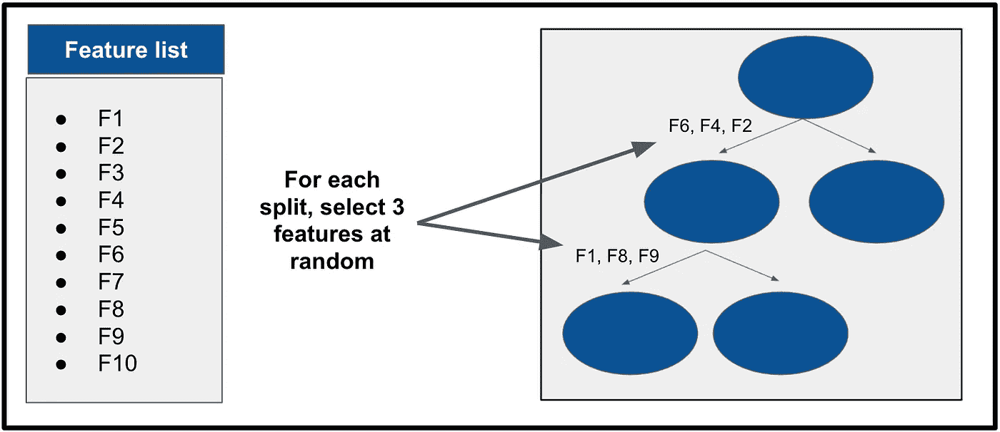

# 随机森林的直观解释

> 原文：<https://towardsdatascience.com/an-intuitive-explanation-of-random-forests-109b04bca343?source=collection_archive---------33----------------------->

在 [Unsplash](https://unsplash.com/s/photos/forest?utm_source=unsplash&utm_medium=referral&utm_content=creditCopyText) 上由 [Deglee Degi](https://unsplash.com/@deglee?utm_source=unsplash&utm_medium=referral&utm_content=creditCopyText) 拍摄的照片

## 群体的智慧…决策树的智慧

2004 年，记者 James Surowiecki 出版了一本名为《群体的智慧》的[书](https://en.wikipedia.org/wiki/The_Wisdom_of_Crowds)，在书中他认为一个群体的平均决策往往比任何一个个体的决策要好。

例如，这个理论表明，如果你问一群人一个罐子里有多少块糖，然后把他们的答案加起来平均，结果会比许多最佳的个人猜测更准确。

Surowiecki 继续解释说，这种效应并不总是正确的，而是有一些特定的特征使群体变得明智:

▹:这个小组必须有不同的信息和背景

▹人必须独立做出决定

▹一定有收集信息的方法

同样的思路也支撑着最受欢迎的机器学习算法之一——随机森林——一种结合多个决策树的结果进行准确预测的方法。

 [## 为决策树算法建立直觉

### 决策树是现代机器学习中最重要的概念之一。他们不仅是一个有效的…

towardsdatascience.com](/building-an-intuition-for-the-decision-tree-algorithm-75e0786e86d) 

# 算法是如何工作的

正如一个群体必须有不同的个体才能变得明智一样，一个随机森林必须由不同的决策树组成才能有效。

随机森林算法通过两种方式鼓励这种多样性。

首先，随机森林中的每个决策树都根据不同的数据子集进行训练。这是通过一种称为“随机抽样替换”的抽样过程实现的，其中记录是随机选择的，但不会从初始数据集中删除。通过设计，这鼓励了每个树的训练数据集中的重复。因为这个过程是重复的，所以每个决策树“知道”不同的数据子集。

作者图片

随机森林算法还通过在每个决策树的每次分裂中选择完整特征列表的随机子集来创建多样性。该子集的大小是一个灵活的参数，但一个常见的选择是使用特征总数的平方根(这是随机森林分类器的 scikit-learn 实现默认使用的)。

例如，假设我们正在用三个决策树和十个特征训练一个随机森林。

在第一个决策树的根(第一个)节点，算法将随机选择三个特征(10 的平方根是 3.2)。然后，它会找到可能的最佳分割，并再次选择三个随机特征来评估下一次分割。对每棵树的每一次分裂都重复这一过程。

作者图片

最终，这一过程会生成暴露于不同信息的树，然后将这些树聚合在一起以做出最终预测。

对于回归问题，随机森林取每棵树预测的平均值。对于分类，它采用众数或多数。

# 关键超参数

随机森林和决策树的最重要的超参数几乎是相同的。

**标准**或成本函数定义了用于识别每棵树最佳分割的方法——基尼系数、特征重要性等。**最大深度**告诉每棵树离根节点有多远可以生长。用于分割的**最小样本**定义了每个节点中必须存在的记录数量，以继续另一个分割。

有两个额外的超参数专门适用于随机森林。

首先，**数量估计器**定义了森林中包含多少棵树。虽然增加树的数量不太可能损害准确性，但往往会有收益递减。当然，估计器越多，训练模型的时间就越长。

第二， **max features** 超参数定义了在每棵树的每个分割点有多少个可用的特性。如上所述，一个常见的默认值是特征总数的平方根。

与大多数算法类似，正确的超参数集通常因项目而异。交叉验证搜索有助于确定最佳值。

# 好处和权衡

随机森林算法有几个好处。首先，它是通用的——它适用于分类和回归问题。第二，它不需要特征缩放或异常值处理，因为数据的方差不影响底层决策树如何找到最佳分裂点。这使得实现起来相当快。最后，由于上面讨论的原因，随机森林比决策树更不容易过度拟合——它们是在比单个树更多样化的数据集上训练的。

随机森林算法的一个主要缺点是更难解释。决策树非常清晰地讲述了预测是如何从各种特征组合中得出的。另一方面，在一个随机的森林中，推论分布在无数的树上。从本质上讲，随机森林也比简单决策树需要更长的训练时间，并且在大型数据集上运行缓慢。

# 摘要

随机森林是一种算法，它聚合大量独立训练的决策树来进行预测。这种“群体智慧”的方法允许它从一组不同的数据中学习，从而得到更稳定、更概括的结果。由于其独创性和易用性，随机森林是应用数据科学的中流砥柱。

***P.S. →如果你想了解更多关于 SQL、Python、数据科学的知识，订阅我的*** [***免费邮件列表***](https://subscribe.to/everythingdata) ***。***