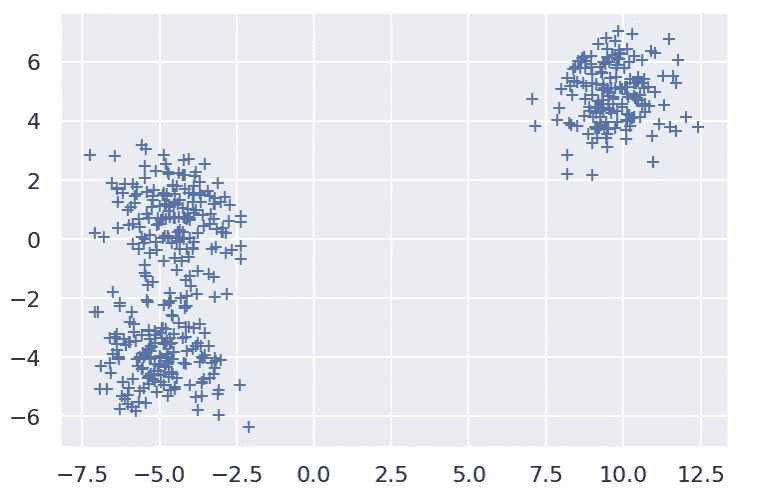
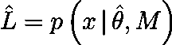
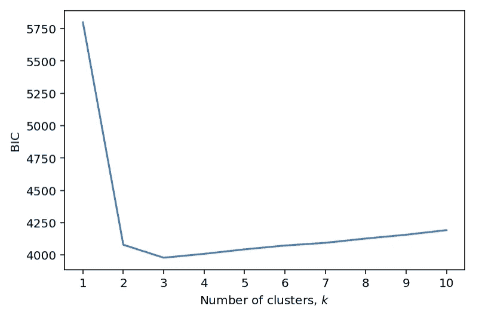

# 贝叶斯信息准则的直观解释

> 原文：<https://towardsdatascience.com/an-intuitive-explanation-of-the-bayesian-information-criterion-71a7a3d3a5c5?source=collection_archive---------19----------------------->

## 如何知道你是否选择了正确的模型

米歇尔·特雷瑟默在 [Unsplash](https://unsplash.com?utm_source=medium&utm_medium=referral) 上拍摄的照片

在机器学习中，当面对堆积如山的未标记数据时，数据科学家的第一个冲动是尝试对数据进行聚类。聚类为我们提供了一种描述数据、发现数据点之间的共性以及捕捉异常值的方法。

但是在没有任何先验知识的情况下，我们如何知道数据中存在多少个聚类呢？

大多数聚类技术要求我们选择固定数量的聚类。像 ***k-means*** 这样的算法然后会找到这些 ***k*** 不同聚类的中心。有时目视检查会有所帮助。

该数据集中似乎有 3 个聚类。

目视检查可以是一个良好的开端，尤其是如果您的数据是二维或三维的。除此之外，可视化变得更加棘手。

让我们停下来一分钟，问问自己，当我们进行视觉检查时，我们的大脑在做什么。

我们的视觉系统非常善于分辨对比。我们寻找点密度的对比，然后挑选出高密度的空间分离区域。然后我们计算我们发现的这种区域的数量。对于这些致密区域之外的点，我们会问:“这代表另一个星团吗？”或者“这是原始集群之一的异常值吗？”

我们的大脑正在执行类似贝叶斯估计的东西。我们实际上是在问，“我们的数据被我们的模型解释的概率是多少？”以及“解释我们的数据的最简单的可能模型是什么？”

模型 m 的极大似然函数。

第一个问题是关于似然函数，用 ***L*** 表示。我们的数据 ***x*** 用模型 ***M*** 来解释的可能性有多大(比如一些聚类的方法)，这些模型有一定的模型参数*(比如聚类的中心和范围)。*

*当我们找到最大化这个概率的参数值时，我们用克拉( **^** )来表示它们。这给出了“最大似然函数”，用一个克拉表示为 ***L*** 。*

*回到我们的例子，您可以想象一个模型，它有多少个数据点就有多少个聚类。看，没有异常值！*

*但这不是一个非常有用的模型。*

> *所有的模型都是错的，但有些是有用的。*

*我们必须平衡我们模型的最大可能性， ***L*** ，与模型参数的数量， ***k*** 。我们寻求参数数量最少但仍能很好地解释数据的模型。因此，我们引入了模型参数数量的惩罚*。**

*我们现在已经接近贝叶斯信息准则(BIC)。*

**

*BIC 针对最大似然函数平衡模型参数数量 ***k*** 和数据点数量 ***n*** 、 ***L*** 。我们寻求找到最小化 BIC 的模型参数 ***k*** 的数量。*

*这种形式的 BIC 源自 Gideon Schwarz[1]1978 年的一篇论文。这种推导可能很难理解，所以我们在这里不做深入探讨。*

*计算最大似然函数是最难的部分，但对于大多数常见的模型，存在分析函数。例如，在线性回归中，对数似然就是均方误差。*

*标准的机器学习库通常会为你计算似然函数，所以不要绝望。*

*让我们完成数据聚类的例子。我想使用高斯混合模型对数据进行聚类，并确定要选择的最佳聚类数。在 Python 中，使用 *scikit-learn* 库，方法如下:*

*绘制不同值的 ***k*** 的 BIC，我们可以看到 3 个集群的 BIC 是如何最小化的。*

**

*BIC 同意我们最初的视觉估计。它还告诉我们，更大数量的聚类也可以很好地拟合数据，但代价是必须引入更多的参数。*

## *结论*

*您总是可以找到适合您的数据的模型，但这并不能使它成为一个伟大的模型。遵循奥卡姆剃刀原理，我们应该总是选择做出最少假设的模型。在机器学习中，过度拟合模型在野外表现不佳。*

> *有了四个参数，我就能适应一头大象，有了五个参数，我就能让它扭动鼻子。*
> 
> *—约翰·冯·诺依曼*

*使用贝叶斯信息标准，您可以找到仍然工作良好的最简单的可能模型。希望这篇文章已经让您对它的工作原理有了直观的感受。*

## *参考*

*[1] G. E .施瓦茨，[估计模型的维数](https://projecteuclid.org/euclid.aos/1176344136) (1978)，统计年鉴，**6**(2):461–464*