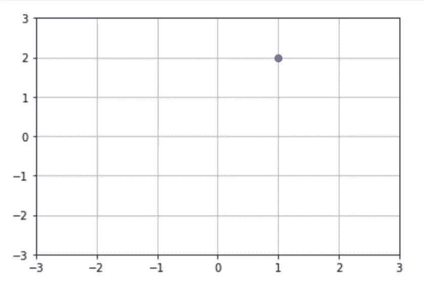
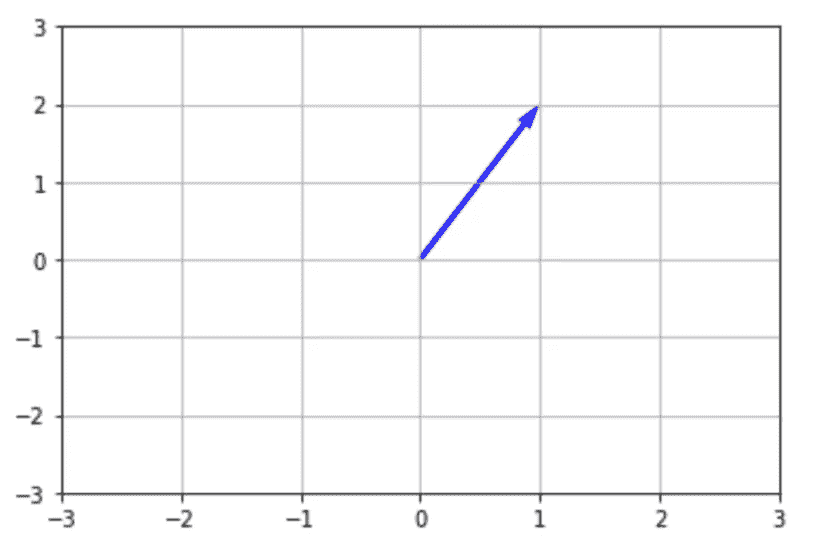
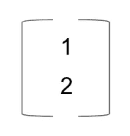
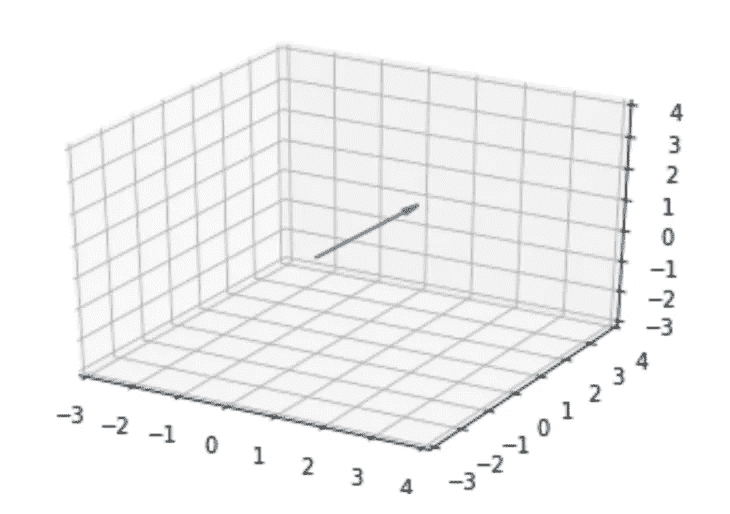
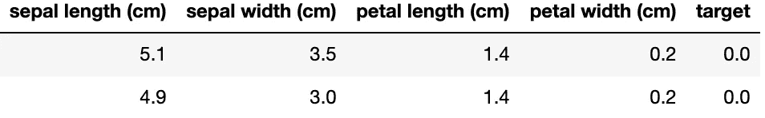
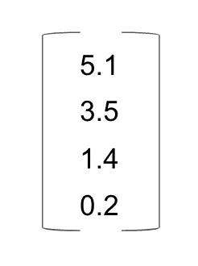
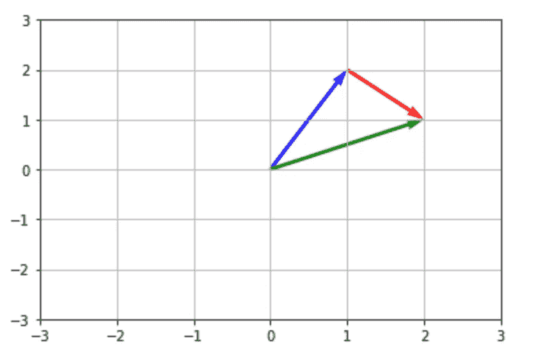
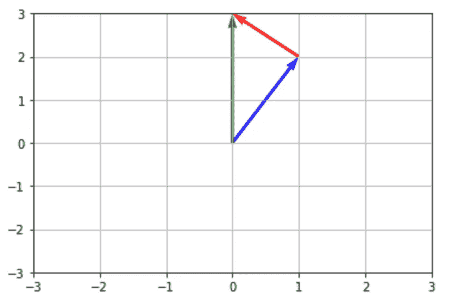
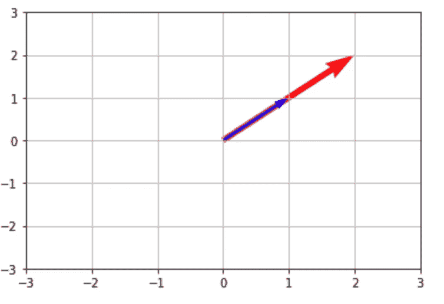
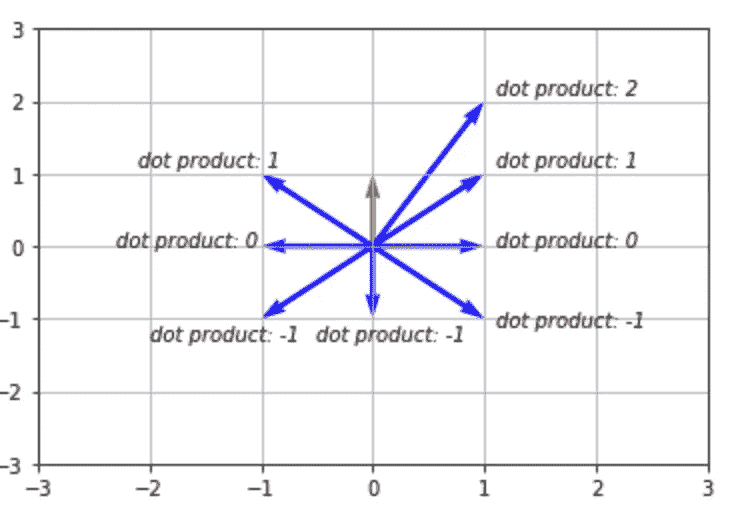

# 向量的直观解释

> 原文：<https://towardsdatascience.com/an-intuitive-explanation-of-vectors-23e15d35f35e?source=collection_archive---------28----------------------->

在 [Unsplash](https://unsplash.com/s/photos/arrow?utm_source=unsplash&utm_medium=referral&utm_content=creditCopyText) 上由 [Franck V.](https://unsplash.com/@franckinjapan?utm_source=unsplash&utm_medium=referral&utm_content=creditCopyText) 拍摄的照片

## 涉猎线性代数

在这篇介绍性的文章中，我将定义向量，讨论一些解释它们的方法，然后对它们相关的数学运算提供一个直观的解释。

# 定义向量

先说一个大家熟悉的小学时的练习题。我们将在 X，Y 数字网格上绘制一个点(1，2)，其中 X 代表水平方向，Y 代表垂直方向。

我们已经在定义向量的道路上走得很好了。关键的区别在于，我们不再用网格上的“点”来思考世界，而是需要开始思考“线”。

在上面的例子中，我们已经从点(0，0)移动到点(1，2)。我们的矢量就是代表这种运动的直线:

如果您仔细观察，您会发现我们的产品系列有两个关键特性，而我们的观点没有:

1.  **星等**:这是“长度”的同义词我们也可以认为这是“我们已经走了多远。”
2.  **方向:**与我们的点不同，我们的线实际上是朝着某个方向运动的。

现在我们可以给这个概念下一个正式的定义了。根据韦伯斯特[的说法](https://www.merriam-webster.com/dictionary/vector)一个矢量是:

> "一个具有**大小**和**方向**的量，通常用一条有向线段来表示，其长度代表大小，其空间方向代表方向。"

我更喜欢简单的定义:“空间中的一条线。”

表示向量的一种常见方式是将 X 和 Y 维堆叠在一起:

2D 向量的简单表示

我们也可以通过超越二维来扩展我们小学对坐标系的理解。

在可感知的现实世界中，我们有三个维度——左/右、前/后和上/下。在空中挥动你的手，想想它是如何向这些方向移动的。现在你对三维向量有了理解。

我们也可以尝试可视化我们的三维向量。让我们取原始向量(1，2)并添加一个第三维，我们称之为 Z，并设置值为 1。下面是生成的向量(1，2，1):

这幅插图没有很好地体现三维，因为它是在 2D 的屏幕上显示的。一旦我们开始超越三维，人类大脑的视觉化就变得非常具有挑战性。如果你想试试，我推荐你去 youtube 看看一些流行的尝试。

但是，虽然我们的空间解释停留在三维，数学或分析解释可以更高。我们也可以开始从数字跳到它们可能代表的真实世界的实体。

让我们以 iris 数据集为例，这是一个用于在机器学习中引入分类的流行数据集:

这里，我们有四个“特征”或预测因子——萼片长度、萼片宽度、花瓣长度和花瓣宽度，我们可以用它们来预测我们的目标变量；花的类型(表示为 0、1 或 2)。

上表中的每一行和每一列都可以解释为向量。例如，我们可以这样表示我们的第一行:

或者，从几何学上来说，我们可以把花的这个实例想象成空间中的一条线，它在 4 个不同的方向上距离原点 5.1、3.5、1.4 和 0.2 个单位。

在我们进入数学之前，我恳求你停下来想一想我们刚刚发现了什么。每一个捕捉世界上真实和有形事物的数据集，都可以被转化为多维空间中的线。

# 向量运算

在本节中，我们将简要介绍与向量相关的数学运算。

在此之前，我将快速分享我学习数学的哲学。除非你是严格意义上的学者，否则数学的 ***目的是帮助我们解决世界上的真实问题*** 。不幸的是，我们必须在这一点与建立对基础知识的初步理解的需要之间取得平衡。在这篇文章中，我们没有时间去解决任何现实世界的问题，但是我鼓励你不要忘记这是最终的目标。

## 向量加法

***数值上:*** 我们把两个向量上的每个维度相加。

**举例:** [1，2] + [1，-1] = [2，1]

***几何上:*** 我们通过将一个向量的尾部放在另一个向量的头部，然后从我们的起点到我们的终点画一条线，来添加两个向量。

当我们把向量看作“旅行”的表示时，这有很大的直观意义我们只是将一段旅程加到另一段旅程上，然后测量我们的总旅程。

下面我们展示了蓝色向量[1，2] +红色向量[1，-1] =绿色向量[2，1]。

## 向量减法

***数值上:*** 我们减去两个向量上的每一维。

**例子:** [1，2]-[1，-1] = [0，3]

***几何上:*** 既然我们在做减法，那么我们可以把这个想象成把第二个向量(红色)的方向反过来，然后把它的尾巴放在第一个向量(蓝色)的头上，得到我们的结果(绿色):

## **标量乘法**

***数值上:*** 我们将向量的每一维乘以一个标量值:[1，1] * 2 = [2，2]

***几何上:*** 我们的起始向量[1，1]保持它的方向但是“缩放”或者增长了标量值的因子。

## 向量的大小

***数值上:*** 为了度量大小或长度 ***、*** 我们使用勾股定理:取向量中每个平方元素之和的平方根。下面是几个例子:

**例 1:**[1，2]的量级= sqrt(1 + 2 ) = sqrt(5) = 2.23

**例二:**[3，5，6]的量级= sqrt(3+5+6)= sqrt(9+25+36)= sqrt(70)= 8.36

***几何上:*** 这个不需要可视化。你看到的只是矢量的长度。向量的大小通常用管道符号来表示:|V|。

## **矢量乘法(点积)**

***数值上:*** 我们对两个向量中每一维的乘积求和。结果将总是一个标量值。下面是几个例子:

**例一:**【1，2】**【2，3】= 1 * 2+2 * 3 = 8。**

****例二:**【1，2，3】**【2，3，4】= 1 * 2+2 * 3+3 * 4 = 20。****

*******几何:*** 这个有点棘手。与其进行直接的空间解释，不如让我们取一个向量[0，1](下面的红色)，并找出它与多个其他向量(下面的蓝色)的点积:****

********

****在这个练习中，我注意到了一些事情:****

1.  ****当蓝色向量的方向与红色向量的方向相似时，点积较大。****
2.  ****蓝色向量的大小越大，点积就越大。****
3.  ****当蓝色向量垂直于红色向量时，点积为 0。****

****鉴于这些观察，我对点积的简化解释是这样的: ***点积告诉我们两条直线在方向上有多相似；按两个向量的大小缩放。*******

****现在让我们看一个例子来巩固我们的理解，在这个例子中，X 在二维空间中具有非零值:****

********

****上面的每个点积在我们上面的解释中应该是有意义的。****

****为什么蓝色向量[1.5，2]与我们的红色向量的点积比蓝色向量[2，1]大？因为它的星等更大，方向更类似于我们的红色矢量。****

****为什么蓝色向量[1，-1]与我们的红色向量的点积为 0？因为这两个向量是正交的(彼此成直角)。它们指向不同的方向。****

# ****摘要****

****到目前为止，我们已经把向量定义为一个有大小和方向的线空间。我们已经知道，数据集中的每一行或每一列都可以在几何上表示为一个理论上无限维的向量。最后，我们已经完成了主要向量运算的数值和几何解释。****

****在我的下一篇文章中，我将定义矩阵并解释它们在线性代数中的作用。****