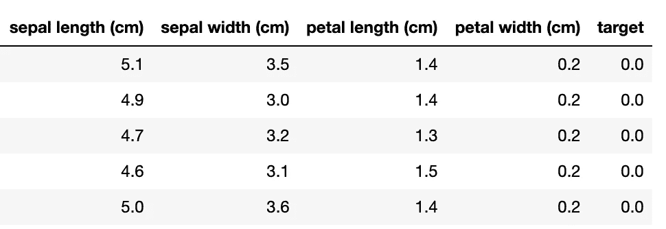
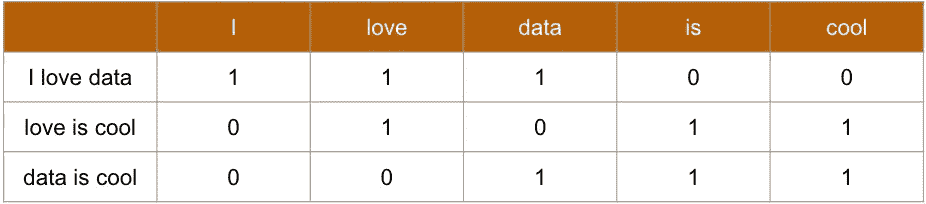
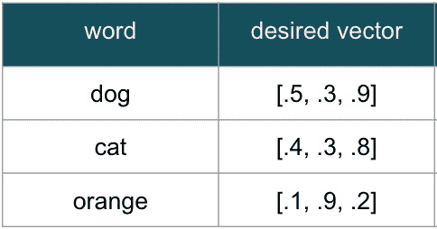
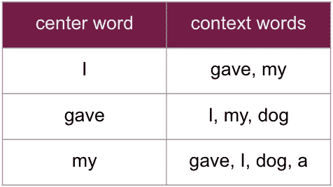
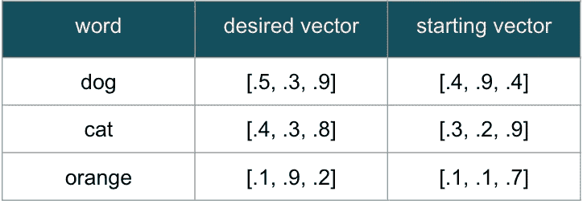
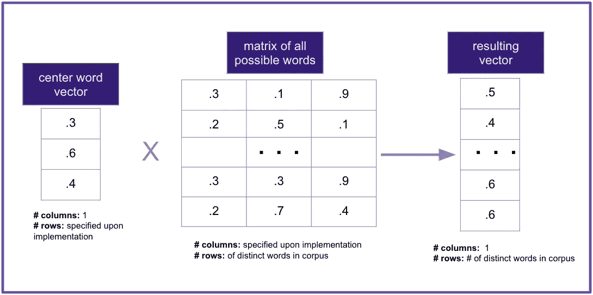

# word2vec 的直观解释

> 原文：<https://towardsdatascience.com/an-intuitive-explanation-of-word2vec-208bed0a0599?source=collection_archive---------24----------------------->

照片由[阿克谢·纳纳瓦蒂](https://unsplash.com/@anphotos?utm_source=unsplash&utm_medium=referral&utm_content=creditCopyText)在 [Unsplash](https://unsplash.com/s/photos/matrix?utm_source=unsplash&utm_medium=referral&utm_content=creditCopyText) 上拍摄

## 没有数学，没有代码，只有单词嵌入背后的逻辑

## 对单词嵌入的需求

在传统的监督机器学习任务中，数据科学家需要两个关键要素:

1.  数据
2.  发现数据模式的方法(算法)

反过来，计算机可以做两件事:

1.  通过将算法应用于数据来学习模式
2.  使用这些学习到的模式对新数据进行预测

一个经典的例子——我们取了一些关于不同花的数据点(即花瓣长度，花瓣宽度)，我们选择一个分类算法(即。随机森林)，我们的计算机使用该算法来识别模式并对其他花卉进行分类。

将这种通用方法联系在一起的一个关键因素是，数据科学家用计算机理解的语言——数字——与计算机交流。提供的“数据”必须是数字，这样才能工作。

那么，当我们拥有的“数据”是文本而不是数字时，我们能做什么呢？当花瓣长度= 1.4 厘米，花瓣宽度= 0.2 厘米时，我们有一个句子——“我爱数据。”自然，我们必须找到一种方法将文本转换成数字。

一种方法是简单地创建用 1 和 0 表示单词的数据点。整个词典中的每个单词都成为一个数据点，只有给定句子、短语或文档中的单词被标记为 1。

例如，如果整个字典包含单词“I”、“love”、“data”、“Is”和“Cool”，我们对句子“I love data”的表示将是[1，1，1，0，0]，其中前三个 1 表示存在“I”、“Love”和“Data”，后面的零表示不存在“Is”和“Cool”。“爱很酷”这句话看起来应该是这样的:[0，1，0，1，1]。

句子的一键编码表示

如果我们将上面的例子扩展到有更多单词的字典，我们现在有一个可伸缩的方法将文本转换成数字。这种方法被称为“一个热门编码”或“一袋单词”——通常对文本分类和情感分析等事情非常有用。例如，我可以将许多不同的推文转换成这些数字列表，然后训练一个模型来预测推文是正面还是负面(我可以使用数字 1 表示正面，0 表示负面)。

虽然这种方法有其优点，但它在几个关键方面失败了:

1.  **没有意义感或上下文感:**计算机可以学习包含“欣喜若狂”这个词的推文是一条快乐的推文，但它无法学习“欣喜若狂”这个词与“激动不已”这个词几乎同义，与“失望”这个词几乎相反。
2.  **太多的数据点:**为了对字典中每个单词的存在或不存在进行编码，每个单词都需要一个数据点(又名变量或特征)。英语中大约有一百万个单词[。](https://englishlive.ef.com/blog/language-lab/many-words-english-language/)

解决方案是创建数字列表(线性代数术语中的“向量”)，以更有创意的方式表示单词。这被称为单词嵌入。

Word2Vec 是 Google 在 2013 年开发的一种建模方法，用于创建这样的嵌入。(Word2Vec 旗下有几种不同的型号。我在下面概述了跳过克的方法)。

## 创建复杂的单词嵌入

为了克服单词袋方法的不足，我们需要一个系统来为相似的单词创建彼此相似的向量。

例如，单词 dog 和 cat 应该用比单词 dog 和 orange 更接近的数字来表示。大概是这样的:

为了创建这个系统，我们可以通过查看文本中“附近”的单词来利用上下文。例如，它可以了解到狗和猫有些相似，因为它们出现在句子中“treat”和“playing”这样的词附近:

> “我给了我的狗一份礼物”
> 
> “我的狗喜欢玩捡球游戏”
> 
> “我的猫喜欢这种款待”
> 
> “我总是看到我的猫在玩那个玩具”

现在——困难的部分——我们如何教计算机解决这个问题？

Word2vec 的方法是训练一个模型，该模型可以预测整个文本(语料库)中每个单词的每次出现的所有相邻单词。

我们可以将我们正在关注的每个单词称为“中心单词”，将每个邻近的单词称为“上下文单词”。同样，我们试图预测全文中每个中心词的每次出现的所有上下文词。

下面是我们将用来训练模型的前 9 个“实例”，给定上面的句子，并假设窗口为 2(该窗口指定我们应该在每个中心单词的左右两侧寻找多少个点):

为了对每个训练实例进行预测，我们从字典中每个单词的随机数字向量开始。同样，我们这个练习的最终目标是让相似的单词有相似的向量。

在这个例子中，每个单词向量的长度为 3，但是理论上它可以是我们指定的任何长度。

一旦我们有了这些“起始向量”，我们就使用文本中的每个中心词/上下文词对来遵循以下步骤:

1.  **将中心单词向量乘以单词表示的完整矩阵。**这个矩阵是所有其他单词向量的简单水平堆叠(行)。当这个乘法完成后，我们剩下一个向量，它有一个元素代表字典中的每个单词。下面是一个简单的视觉:

实际上，我们对每个上下文单词都有一个“结果向量”。

**2。将向量转换成概率。**这里我们使用的是 softmax 函数，它实际上是将每个数字除以向量中所有数字的总和。这给了我们一个有用的特性，即新向量中的所有数字的总和都是 1。它们现在可以被认为是概率。

3.**计算概率。**现在我们有了一个概率向量，我们的下一步是将它与“目标变量”(基础事实)进行比较。我们如何表示那些目标变量？我们只需要一个热编码。一个向量，上下文单词用 1 表示，其他单词用 0 表示。

然后我们可以计算一个损失函数(你的预测有多错误的分数)。这鼓励系统调整其预测向量，使得它们在更可能出现在上下文中的单词上具有更大的*权重*。

系统 ***怎么知道*** 去调整这些向量值也就是所谓的权重？

4.**尽量减少损失。**最后一步——反向传播——是神经网络调整其权重以最小化损失函数的过程。在这种情况下，权重是每个词向量的值。它们调整得越好，预测向量就越精确，损失就越低。

突然间，最初随机的权重被收紧，以创造我们所寻求的现实:彼此相似的词向量具有相似的数字**，因为这些数字最小化了损失函数**。他们为什么要最小化损失函数？因为它们准确地预测了相同的上下文单词。

## **申请**

最终，我们对文本中的每个单词都进行了随机加权，并对它们进行了优化以表达含义，从而构建了一种新的与计算机对话的方言。下面是 3 个例子，说明如何使用生成的向量:

1.  **文本分类** — 通过平均/组合单词向量，以无数不同的方式对文本进行分类。
2.  **语音识别** —将口语单词转换成矢量，以便识别意思。
3.  **建议** — 创建任何有“上下文”的数字表示例如，[歌曲](/using-word2vec-for-music-recommendations-bb9649ac2484)可以表示为预测播放列表或队列中附近歌曲的向量。