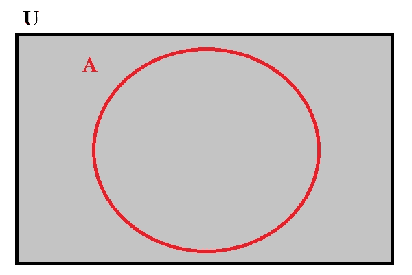
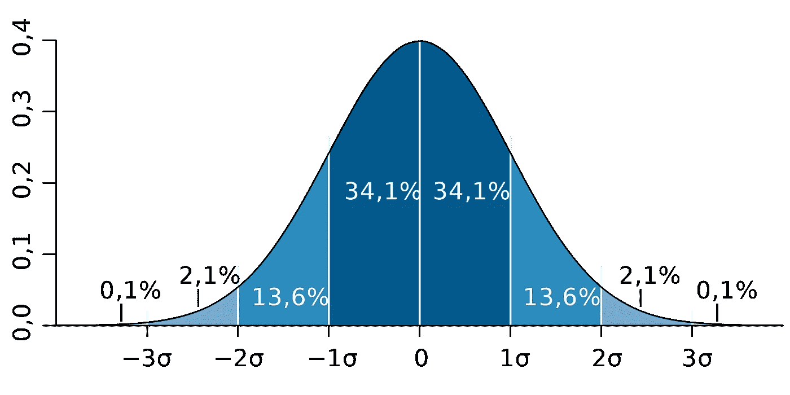
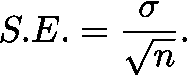

# 基本统计学直观指南

> 原文：<https://towardsdatascience.com/an-intuitive-guide-to-basic-statistics-43e143e77a29?source=collection_archive---------23----------------------->

## 基本统计概念入门

克里斯·利维拉尼在 [Unsplash](https://unsplash.com?utm_source=medium&utm_medium=referral) 上的照片

揭开数据集秘密的过程中最基本的部分之一是统计学(及其词汇，即概率)。直到最近，我一直对统计数据又爱又恨。这个主题对我来说总是令人生畏，从来没有直观的感觉。我最近看到了一本书，书名是《T4 统计学》，作者是蒂莫西·c·乌尔丹。这本书让我对统计学有了直观的认识，我希望通过总结这本书的观点也能让你对统计学有同样的认识。如果你有时间，我强烈建议你看看这本书。我会在这里尽力，但绝对值得。

## 目录

*   我们为什么关心？
*   [人口 v/s 样本](#12d4)
*   [采样](#8e78)
*   [分配](#d787)
*   [正态分布](#1c43)
*   [Z 分数](#a50f)
*   [标准误差](#38ba)
*   [P 值](#56b8)
*   [统计显著性](#be76)
*   [假设检验](#86f5)

## 我们为什么关心？

让我们从理解我们为什么需要统计数据开始。从最简单的意义上说，统计学允许我们管理信息。它允许我们收集、研究和总结信息(/数据)。研究人员从大量人群中收集一些信息，利用这些信息总结他们的经验，并对一个群体做出一些一般性的陈述。例如，假设您正在建模一个数据集，目标是开发一个预测模型。从某种意义上来说，您正在做类似的事情:您收集一些信息(在 ML 中称为训练数据)，通过做出一些合理的假设来总结这些信息(例如，作为模型参数)，并(对测试数据)做出一般的陈述。所以，我认为加深对统计学的理解可以帮助我们成为更好的数据建模者。

## 人群 v/s 样本

简单来说，总体是我们希望拥有的，但样本是我们拥有的。总体代表感兴趣的某个组或类别的所有成员，而样本是从总体中抽取的子集。维恩图的一个类比是:群体是我们感兴趣的宇宙，样本是其中的一个事件。

图 1 事件 A 和宇宙 u 的维恩图。

从图 1 中，**‘A’**是样本，‘**‘U’**是总体。这就是我们在一个典型的数据建模练习中所做的事情:尝试使用可以推广到人口中未知部分的训练数据，即测试数据(=U-A)，来建立一个模型。我们希望使用样本而不是总体的原因可能有很多:总体太大而无法收集(例如，在语言建模练习中，所有可能的句子的总集合非常庞大)，信息收集过程昂贵且耗时，等等。这里的关键是，因为我们和一小部分人一起工作，所以我们希望它能代表真实的事情。这就是为什么统计学家们不厌其烦地思考抽样问题。

## 抽样

为了确保样本能够代表总体，我们采用了所谓的**随机**抽样。在统计学中，随机抽样意味着人口中的每个成员都有同等的机会被选入样本。基于这种方法，我们可以确定样本和总体之间的任何差异都不是系统性的，而是随机的。换句话说，我们可以说通过随机抽样，我们不会偏向于人口中的任何特定成员。这种类型的取样是最流行的方法之一，也用于 k 倍交叉验证。还有其他(细微差别)类型的采样技术，你可以在这里[阅读更多。](https://en.wikipedia.org/wiki/Sampling_(statistics))

## 分布

采集的样本可以包含不同类型的特征(/ [随机变量](https://en.wikipedia.org/wiki/Random_variable))，如连续或分类。分布只是变量(/feature)上的数据或分数的集合。此外，一个变量上的任何分数集合，不管变量的类型如何，都会形成分布，并且这种分布可以用图表表示。我们通常对这些分布的特征感兴趣，例如分布的典型值**、值的变化**、分布的形状**等等。研究随机变量的分布能让我们洞察它的行为。******

******分布中的典型值通常使用均值(其他测量方法包括中位数、众数)和方差(或范围、IQR)等统计方法进行测量。其中最受欢迎的选择是均值和方差，但根据数据类型，其他选择可能更有用(例如，对于异常值，中值可能是比均值更好的选择)。方差提供分数分布中离差量的统计平均值。观察方差的一个问题是它的单位与原始变量不同。为了解决这个问题，我们通常看标准差(方差的平方根)。******

******为了对标准差有更深入的理解，我们来看两个词:离差是指一个个体值与平均分之差；标准指的是典型的或平均的。所以标准差是个别值和分布平均值之间的典型或平均偏差。标准差用于检查分数在分布中的平均离差。因此，当平均值的度量与离散值的度量结合时，我们可以得到分数分布的大致情况。关于样本标准偏差和方差公式中的修正，可在[这里](https://en.wikipedia.org/wiki/Bessel%27s_correction)找到。检查分布的另一个有用的方法是箱线图。******

## ******正态分布******

******我计划通过谈论正态分布的重要性来激发这一部分。我认为[这个](https://www.quora.com/Why-is-the-normal-distribution-important)问答线程做得很好。因此，我将在这里总结一些关于正态(也称为钟形曲线)分布的事实。******

************

******标准的正态分布。图片来源:[维基媒体](https://commons.wikimedia.org/wiki/File:Standard_deviation_diagram.svg)******

******它有三个基本特征:a)对称，b)均值，中值，众数都在同一个地方，即分布的中心，c)渐近，即上下尾部从不接触 x 轴。之所以在实践中使用正态分布，是因为我们关心的是样本中某件事只是偶然发生的确切概率。如果我们只对描述一个样本感兴趣，那么这些值是否正态分布并不重要。例如，如果样本中的普通人每天消耗 2000 卡路里，那么样本中出现一个每天消耗 5000 卡路里的人的机会(或概率)是多少？此外，我们通常对从总体中抽取样本进行推断感兴趣，这可以通过使用正态分布来完成。******

******那么，给定一个分布，我们如何发现它是否遵循正态分布？我们可以看一下[偏斜度](https://en.wikipedia.org/wiki/Skewness)和[峰度](https://en.wikipedia.org/wiki/Kurtosis)。这些是用来描述分布的特征。我们可以将分布的偏斜度和峰度与正态分布进行比较，以检查我们对给定随机变量是否遵循正态分布的假设。正如我们将在后面的章节中看到的，理论正态分布是统计学的一个关键要素，因为推断统计学中使用的许多概率都是基于正态分布的假设。******

## ******z 分数******

******有时我们对描述分布中的单个值感兴趣。使用平均值和标准差，我们可以生成一个标准分数，也称为 z 分数，来比较各个值的相对重要性。此外，这种标准化有助于我们比较两个独立变量的分布值(因为两者现在都在同一尺度上)。******

******例如，我们想比较吉姆的英语考试和统计学考试的成绩。假设英语测试的分值范围是 0-100，而统计学测试的分值范围是 0-200。此外，我们看了试卷，意识到统计学考试比英语考试更难。直接比较吉姆两次考试的分数是不正确的。比较合理的办法是先把分数标准化再比较。标准化以标准偏差为单位对测试分数进行重新分级。请注意，即使一个测试比另一个更难，这种差异在平均值和标准偏差中有所体现。换句话说，z 分数以标准差为单位表示分布中给定分数高于或低于平均值的程度。此外，当整个分布被标准化时，标准化分布的平均 z 得分始终为 0，标准差始终为 1。******

******让我们在这里暂停一会儿，以理解 z=1 的 z 分数会告诉我们什么。在吉姆的英语测试中，z=1 的 z 分数会告诉我们:a)吉姆比参加测试的一般学生做得更好，b)他的分数是平均值的 1 个标准差，c)如果分数是正态分布的，他比班上大约三分之二的学生做得更好(来自[68–95–99.7 规则](https://en.wikipedia.org/wiki/68%E2%80%9395%E2%80%9399.7_rule))。但是，仍然可能有许多 z 分数不打算描述的信息。例如，Jim 正确拼写了多少单词，或者他是否是一个好的拼写者，如果参加测试的其他学生是好的拼写者，则测试的难度水平，等等。类似于上面的例子**如果我们确信**我们的随机变量的分布是正态的，我们可以计算百分位数(使用 [z 得分表](https://en.wikipedia.org/wiki/Standard_normal_table))。******

****值得注意的是，我们只是对计算百分位数感兴趣，我们可以在不计算 z 分数的情况下计算这些值:[等级顺序](https://en.wikipedia.org/wiki/Order_statistic)观察值，并使用百分位数的定义。****

## ****标准误差****

****这是[推断统计学](https://en.wikipedia.org/wiki/Statistical_inference)中最重要的概念之一，并被广泛使用。考虑标准误差有两种方式。从形式上来说，**标准误差被定义为某个统计量的抽样分布的标准偏差**(如果这让你感到头晕，等一下，我们将把它分成几行)。另一种看待标准误差的方式是，它是许多推断统计中用于计算的公式中的分母。****

****让我们后退一步，试着更深入地理解这些定义。想象一下，我们对测量一个社区的平均身高感兴趣。基于我到目前为止所描述的一切，我们从社区的所有人中抽取一个样本。为了简单起见，我假设社区里有 4 个人，身高分别是 1cm、2cm、3cm、4cm。此外，让我们假设我们的样本大小为 2。这些都是可能的配对:(1，2)，(1，3)，(1，4)，(2，3)，(2，4)，(3，4)，以及基于这些的平均身高:分别是 1.5cm，2cm，2.5cm，2.5cm，3cm，3.5cm，群体平均身高是 2.5cm，我们可以观察到，我们计算的平均身高取决于我们抽取的样本，并且随着我们改变样本而改变。换句话说，我们感兴趣的统计数据(平均身高)由于随机抽样而有一些变化(即标准偏差)，我们称之为标准误差。****

****如果我们试图在这种情况下剖析定义，它说存在一个抽样分布(我们得到这是随机抽样的结果；在示例中，这是平均身高的集合)，该分布与平均身高(可以是我们感兴趣的任何其他统计数据，例如体重、智商等)相关联。)，这样一个分布的标准差就叫做标准差。从本质上说，标准误差是对从同一人群中抽取的相同大小的样本的随机变异程度的度量。尽管所有的统计数据都有标准误差，但平均值的标准误差是最常用的。****

****为了避免混淆，区分抽样分布和简单的频率分布，抽样分布的均值和标准差被赋予了特殊的名称，即均值的期望值分别为**和**标准差**。平均值被称为期望值，因为平均值的**抽样分布的平均值**(即通过重复收集样本并计算平均值生成的分布平均值)与总体平均值相同:当我们从总体中选择样本时，我们的最佳猜测是样本的平均值将与总体的平均值相同。这为我们提供了对标准误差的解释:当我们说样本平均值代表总体的平均值时，它为我们提供了可以预期有多大误差的度量(记住，标准偏差告诉我们个体值和平均值之间的平均差)(因此，命名为标准误差)。******

****很多时候，我们没有时间和资源从总体中抽取多个样本，求样本均值的分布(或抽样分布)的均值和标准差。到目前为止，我们已经说服自己，标准误差是存在的，它对分析很重要，而且我们通常无法获得抽样分布。这就给我们带来了这样一个问题:我们能利用样本中的信息来提供一些标准误差的估计值吗？****

****为了检验这个问题，让我们考虑一下样本的两个特征。首先，我们的样本有多大？样本越大，我们对总体的估计误差就应该越小，因为样本越大，就越像总体，所以估计也就越准确。其次，我们需要检查样本的标准差。这里我们假设总体标准差等于样本标准差。这个关于人口的假设可能不正确，但我们必须依赖他们，因为这是我们所有的信息。此外，如果我们知道总体标准差，我们可以使用它。因此，标准误差的公式为:****

********

****如果你最终浏览了我之前链接的 Q/A 主题，并且知道中心极限定理(CLT)，那么我们也可以在这里说，CLT 指出，当我们有一个合理的大样本(例如，n=30)时，均值的采样分布将是正态分布的。****

## ****p 值****

****我认为这个术语相当流行。但是，让我试着让它更直观一点。在继续之前，我想稍微停顿一下，回顾一下我们到目前为止讨论的内容。我们发现，我们通常处理的数据和实际人口之间存在差异，因为不方便处理人口。为了生成样本，我们考虑适当的采样技术。一旦我们得到一个样本，我们就可以研究随机变量的分布，以了解我们的样本。我们还研究了所有统计中最基本的分布之一的一些特征，以及证明/否定随机变量的分布是否遵循正态分布的方法。我们还研究了一种标准化技术，它可以帮助我们比较不同尺度/分布上的随机变量的值。最后，我们理解了在将样本结果推广到总体的问题中，标准误差的重要性。在这里，让我们一起使用所有这些概念来进一步探索从我们的样本中归纳见解的想法。****

****假设我们有一个样本(来自城市 A)，其平均智商测试得分为 110，全国平均水平为 100。我们可以看到，样本和总体得分 10 分之间存在差异，但这种差异是有意义的，还是微不足道的？也许，如果我再次采样数据，差异可能会改变。如果这给你的头脑带来了标准误差，你就在正确的轨道上！那么，我们如何知道这种差异不仅仅是由于随机机会(来自随机抽样技术)？更具体地说，我们正在寻找获得随机样本的概率，使得与全国平均水平的差异为 10 个点。暂停一下，想一想这个概率能给我们带来什么。****

****如果我们有这种概率，而且它很小，那么我们知道这种差异不是随机的，而是由样本的某些特征决定的。这就是 p 值的症结所在。一个流行的概率临界值是 0.05。这个 0.05 的 p 值表示，如果 10 个点的差异概率≤ 0.05，那么我们知道这个差异在某种意义上是有意义的，因为随机抽样我们看不到这个。****

****那么，让我们回到我们最初计算概率的问题。您可能还记得之前的内容，正态分布使我们能够计算概率(68–95–99.7 规则和 z 得分表)。为了确定 10 个点的差异概率，我们需要样本均值的正态分布或均值的正态抽样分布。我们也可以使用一个密切相关的 t 分布族来计算这个概率。正如你在这里看到的，这看起来非常类似于正态分布。您可以观察到，随着分布的大小(/ [自由度](https://en.wikipedia.org/wiki/Degrees_of_freedom_(statistics)))增加，它趋向于正态分布。因此，考虑选择 t-分布的一种方式是，当我们不知道总体标准差，并且正在查看有限的数据(以样本的形式)时，在某些事件中减少信念可能是一个更好的想法:我们可以观察到 t-分布的 PDF 被压扁，这意味着尾端的概率相对于正态分布增加。计算 t 值的公式与 z 得分相同，只是它使用了从样本计算的标准误差(因为我们不知道总体标准偏差；如果我们知道它，我们就可以计算出 z 值，它被称为 t 值，因为我们使用 t 分布来计算概率。****

****实质上，如果我们知道总体标准偏差，我们可以使用它来计算 z 得分和正态分布，以计算样本与总体相比存在 10 个点差异的概率，如果不知道，我们可以使用标准误差来计算 t 值，并使用 t 分布来计算概率。****

## ****统计显著性****

****在这一节中，我们将把我们到目前为止学到的所有思想用于探索统计学的一个流行应用——推理。推断背后的想法是研究样本并推断出关于更大人群的结论。对于许多推断统计，我们经常问的问题的共同主题是，我们在样本中观察到的一些统计值与随机抽样产生的方差相比是大还是小(即，就标准误差而言)。请记住，这是一个重要的问题，因为作为随机抽样的结果，我们预计样本中会有一些变化(与总体相比)，我们使用样本标准差和大小来量化这种变化，并将其称为标准误差。****

****继续上一节的智商测试示例，我们试图回答的具有统计学意义的问题是，10 分的差异是否是随机抽样的结果。三种常用工具用于得出关于统计数据的统计显著性的结论，它们是[测试](https://en.wikipedia.org/wiki/Statistical_significance)、[效应大小](https://en.wikipedia.org/wiki/Effect_size)和[置信区间](https://en.wikipedia.org/wiki/Confidence_interval)。简而言之，检验就是简单地使用标准误差来计算 p 值，并以此来检验统计显著性；由于观察到样本越大，标准误差越小(因为标准误差与样本大小成反比，导致 z 值(/t 值)越高),因此忽略样本大小的影响是有意义的；置信区间是量化区间的另一种方式，在该区间内，如果我们重复收集样本，我们可以确保实际的统计数据是真实的。****

****简单地说，统计显著性帮助我们决定我们从样本研究中得出的结论是否也适用于(更广泛的)人群。****

## ****假设检验****

****统计学中的另一个流行词。在这里，我们试图做的只是提出一个假设，并确认或拒绝它。从上一节来看，甚至在我们执行统计显著性测试之前，我们就想要建立一个基准。这个基准是我们的假设。****

****通常，主要假设是零假设(h0)。顾名思义，这假设了一个无效效应，或者说该效应不存在(这可以是我们感兴趣在人群中测量的任何效应)。与此互补的是交替假说(H_a)。再次顾名思义，我们正在考虑零假设的替代方案，即效果是存在的。所以，现在问题稍微变了:样本均值(这是一个例子，我们可以选择任何我们喜欢的统计数据)与总体均值的差异有多大，我们才能认为这种差异是有意义的，或者是有统计学意义的？注意，在这个问题中，总体均值是我们的 H_0，样本均值是 H_a。****

****例如，在之前的智商测试示例中，h0 是全国平均值 100，H_a 是样本平均值 110，我们正在测试我们的假设，即这个样本是否有什么特殊之处导致了 10 点的差异，或随机抽样，即具有统计显著性。****

****你可能已经注意到，在所有这些讨论中有一个警告。我们之前提到过，如果计算出的概率(p 值)足够小(我们定义为 0.05)，那么我们说这些差异在统计上是显著的，或者说是有意义的。当我们接受 0.05 的截止值时，有可能实际上是我们的随机样本导致了这样的差异，并且 h0 是真实的，即我们最终选择了一个极其罕见的随机样本(例如，对于正态分布，选择这样的样本的概率将是 1–0.997 = 0.003！).所以，在这种情况下，我们最终会犯错误。这种误差称为 I 型误差，截止值为α。****

****我希望一些基本的统计概念现在直观得多。我跳过了一些建立在上述想法上的重要概念，这些概念相当有趣:[相关性](https://en.wikipedia.org/wiki/Pearson_correlation_coefficient)、 [t 检验](https://en.wikipedia.org/wiki/Student%27s_t-test)、 [ANOVA](https://en.wikipedia.org/wiki/Analysis_of_variance) 、[回归](https://en.wikipedia.org/wiki/Regression_analysis)。我将留给你们一个有趣的测试，在我们讨论过的事情的背景下:[正态性假设检验](https://en.wikipedia.org/wiki/Jarque%E2%80%93Bera_test)。****