# 置信区间的直观指南

> 原文：<https://towardsdatascience.com/an-intuitive-guide-to-confidence-intervals-522908b9a158?source=collection_archive---------40----------------------->

## 用理论和模拟解构置信区间

克里斯·利维拉尼在 [Unsplash](https://unsplash.com?utm_source=medium&utm_medium=referral) 上的照片

统计学是基于我们观察到的数据。假设基础数据生成过程是随机的，并且统计建模的目标之一是理解该数据生成过程。由于数据本身是随机的，所以我们根据观察到的数据估计的任何数字都有一些内在的不确定性。思考这个问题的一种方式是，如果我们再次收集数据，并试图再次估计这个数字，结果可能会发生变化。换句话说，估计是可变的(想想:方差)。因此，我们通常对单个值(或点估计)不感兴趣，而是对一系列值感兴趣，这是谈论我们不确定的估计的自然方式。在统计学术语中，这被称为置信区间。简而言之，置信区间让我们以一系列值的形式量化估计的不确定性。

我过去研究过置信区间，从未对自己的理解感到满意。每一次，我都有一种模糊的感觉，我明白置信区间意味着什么，但从来没有确定的感觉。最近，我发现了一些启示，在这篇文章中，我将使用理论和模拟来讨论置信区间。

在深入细节之前，让我们检查一下我们对置信区间的理解。看看[这篇文章](https://www.usatoday.com/story/news/politics/2020/05/21/coronavirus-wearing-mask-public-common-nationscape-survey-finds/5215365002/)和关于美国人在公共场合是否戴口罩以应对冠状病毒传播的情节。根据[数据](https://www.usatoday.com/story/news/politics/2020/05/21/coronavirus-wearing-mask-public-common-nationscape-survey-finds/5215365002/)，84%的美国人在公共场合戴口罩，误差幅度(或置信区间)为+/- 2.6%点。为了便于讨论，让我们假设他们在谈论 95%的置信区间，因为这是一个相当普遍的选择。有个问题要问你，

Q **:** 这是否意味着区间【81.4%，86.6%】包含了在公共场合 95%时间戴口罩的人的实际百分比？

如果你对上述问题的回答是肯定的，那么你就像以前的我一样，在置信区间上犯了一个常见的解释错误。

让我们先来回顾一下确切的置信区间。

# 置信区间

形式上，参数‘θ’的‘1-α’置信区间是区间 C = [a，b]，其中 a = a(X₁，X₂，…，Xn)和 b = b(X₁，X₂，…，Xn)是数据的函数，这样，

在上面的口罩例子中，α = 0.05 (95%的置信度)，参数θ =为应对病毒传播而在公共场合戴口罩的美国人的百分比，a = 81.4%，b = 86.6%，这两个数据都是使用收集到的数据计算出来的。换句话说，上面的等式表明(*真*)参数包含在区间 **C** 中的概率至少为 1-α。注意，在上面的句子中，我是如何在单词 parameter 的前面默默地添加了单词 true 的。这就是置信区间的关键，即θ代表真实的参数值，它是未知的(否则调查是无用的)，**但是**是确定性的。更明确地说，在冠状病毒传播时，在公共场合戴口罩的美国人的百分比是未知的，但这不是一个随机数字。如果我们有意志力和手段去调查所有美国人，我们就能找到这个未知的(确定性的)数字。

调查整个美国人口是不现实的，我们想用我们收集的数据做一些合理的猜测。基本上，通过置信区间，我们试图得出一个数值范围，它将包含美国人在 95%的时间里戴口罩的真实比例。注意，置信区间中的不确定性通过区间‘a’和‘b’的端点悄悄进入，区间‘a’和‘b’是数据的函数(假设数据是随机的！).

**要点**:置信区间谈论一个**随机**区间包含(未知)确定性真参数的概率。

# 解释

对置信区间的自然解释如下:想象一遍又一遍地重复实验(在这种情况下，这意味着做几次独立的调查)。对于每个实验，我们可以计算包含真实(未知)参数的置信区间。根据大数的 l[aw](https://en.wikipedia.org/wiki/Law_of_large_numbers),(随机)区间 95%的时间将包含真参数。这是因为我们可以用一个指示函数来表示区间包含真参数的事件，然后从 [LLN](https://en.wikipedia.org/wiki/Law_of_large_numbers) 得出 0.95 的比例。

# 例子

现在，让我们来看看《所有的统计数据》一书中的一个例子来收集这些概念。

设θ是一个固定的未知实数，X₁和 X₂是独立的随机变量，使得 p(xᵢ=1)=p(xᵢ=-1 = 0.5。设 Yᵢ = θ + Xᵢ，假设我们只观察 y₂.y₁定义下面的“置信区间”，它只包含一个点，

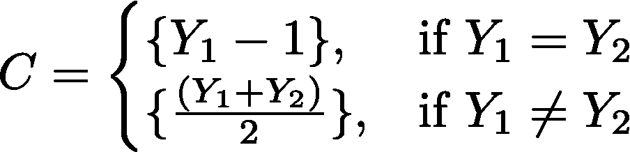

我们很容易验证，对于θ的任意值，P(θ ∈ C) = 0.75。这是因为在第二种情况下，Y₁ ≠ Y₂，C = {θ}，发生概率为 0.5，而在第一种情况下，C={θ}或 C={θ-2}，均发生概率为 0.25。所以，“C”是 75%的置信区间。

我们来看看这个实验的一个[实现](https://en.wikipedia.org/wiki/Realization_(probability))。假设我们观察到 Y₁ = 15，Y₂ = 17。基于这个数据，我们 75%的置信区间是 C={16}。

这个计算出的置信区间**没有**说‘C’包含θ的概率是 75%。而是由于θ是固定的(见问题)，要么包含在置信区间内，要么不包含在置信区间内。我们知道θ是未知的。如果(神奇地)我们知道了θ的值，我们就可以明确地观察到它是否包含在区间内(P(θ ∈ C) = 1)，或者不包含在区间内(P(θ ∈ C) = 0)。换句话说，对于一个固定的(或确定的)值，没有什么是不确定的:它要么在区间内，要么不在区间内(例如 P(2 < 3) = 1)。

**一个常见的陷阱**:在观察数据并计算水平为‘1-α’的置信区间后，不再是真参数被包含(/陷)在该区间的概率至少为 1-α。间隔包含或不包含 true 参数。由于置信区间是一个随机变量，其基于数据的值是[一个实现](https://en.wikipedia.org/wiki/Realization_(probability))，其中**代表**一个 1-α置信水平，不再是概率性的。当我们称一个区间为 x%置信区间时，“x%”与估计过程(计算“a”和“b”的过程)的可靠性相关联。

这看起来有点奇怪，因为我们从来没有看到真正的参数θ(感觉它是随机的)，但请记住，它是被假定为确定性的。这个概念来自频率主义者的解释，即θ是一个确定的未知数，它不可能是随机的。

# 摘要

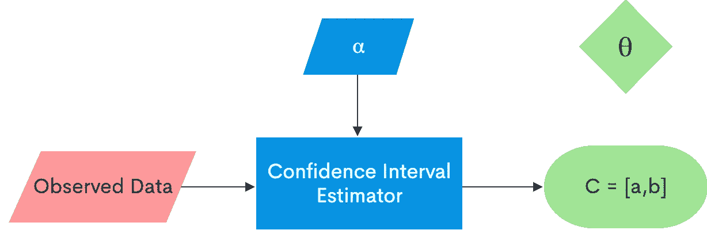

红框是随机输入到机器中的。蓝箱由我们控制，即我们可以确定我们感兴趣的置信区间的水平，我们还可以选择特定的机器(即估计器)。绿框是确定性的，即“C”是被称为“1-α”水平置信区间的**和**，θ是未知参数。

该图总结了我们在前面几节中讨论的内容:我们观察了一些数据(随机的)，基于这些数据，我们计算了给定水平(α)的置信区间，这导致了 1-α置信区间，这是一个实现，因此不是概率性的。而且参数还有一个未知的确定性真值，要么位于‘C’中，要么不在(就像数字 2 要么位于区间[3，4]中，要么不在)。最后，当我们说[a，b]是 1-α置信水平时，“1-α”是估计过程中的一个标签，并不针对包含真实参数θ的任何概率陈述。本质上，上述机器消耗数据(和α)并吐出一个区间‘C’，我们称之为完全确定的 1-α置信水平。

一个可能萦绕在你脑海中的大问题是，我们如何确保真正的参数在不知道其实际值的情况下被限制在区间“C”内？这看起来很神奇(至少对我来说是这样)，但它是基于一个对所有统计学都很重要的非常强大的定理的想法:[中心极限定理](https://en.wikipedia.org/wiki/Central_limit_theorem)(下一节将详细介绍)。我省略了置信区间的估计，因为它值得单独讨论。

# 模拟

在本节中，我们来看一个使用类似于掩模数据的示例的模拟。假设我们调查了一群美国人(不管他们是否戴口罩)，观察到了以下反应:X₁，X₂，…，Xn，where

这是一个[指示变量](https://en.wikipedia.org/wiki/Dummy_variable_(statistics))，表示一个人是否戴着面具(1)或(0)，概率为 *p* 。此外，假设这些都是同分布的，这意味着 xᵢ~·伯恩(p)是[伯努利随机变量](https://en.wikipedia.org/wiki/Bernoulli_distribution)。类似于前面的讨论，真实的比例 *p* 是未知的。估算 *p* 的一个方法是取我们数据的平均值，即:

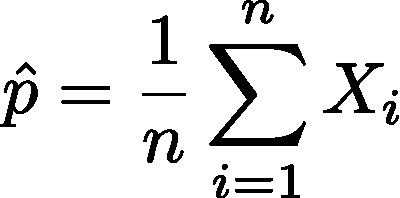

这似乎是一个自然的估计:我们计算样本中戴口罩的人的比例。如前所述，这个估计值是可变的，因为如果数据改变，p_hat 也会改变。从数量上来说，[大数定律](https://en.wikipedia.org/wiki/Law_of_large_numbers)和[中心极限定理](https://en.wikipedia.org/wiki/Central_limit_theorem)告诉我们以下内容，

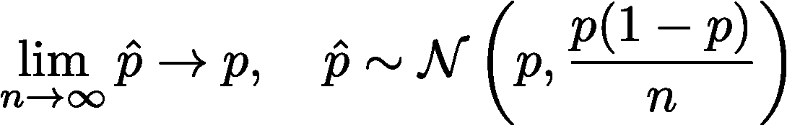

假设某些假设得到满足，这两个定律一起谈论[收敛到真实参数](https://en.wikipedia.org/wiki/Law_of_large_numbers)值以及收敛到真实参数过程中的[分布(假设 *n* 足够大)。所以，我们可以确定我们的估计收敛于真实值。现在，我们来关注一下置信区间。顺便说一下，我们可以观察到，与我们的估计相关的可变性是 p(1-p)/n，随着我们从越来越多的人那里收集响应，这个可变性变为零。](https://en.wikipedia.org/wiki/Central_limit_theorem)

在这个练习中，让我们关注 95%的置信区间。利用上面的等式，我们可以这样写，

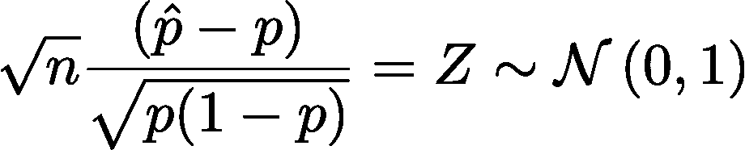

这给了我们一种方法来包含真正的参数 *p，*

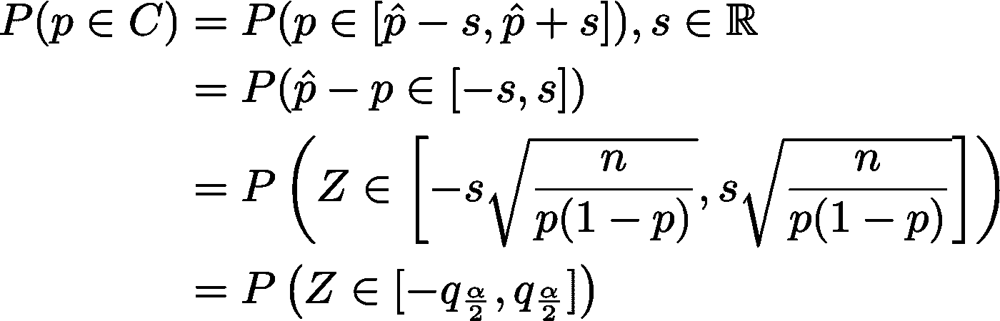

这里，“qₓ”是分位数函数，[等于](http://www.statskingdom.com/z_table.html#invest_z_table) ~ 1.96。最后一步是根据我们希望“C”包含真实参数的概率至少为 1-α这一事实。使用这个值，我们得到，

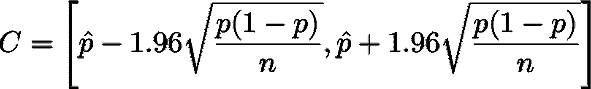

还有一个小问题:这个练习的要点是估计未知的 p，但是我们的 C 表达式包含 p。有几种方法可以继续，但为了保持本文简洁，让我们从一个简单的保守界限开始，即区间的最大宽度。这发生在 *p* = 0.5 *时。*因此，我们得出

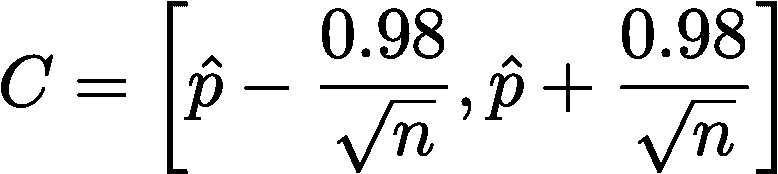

我们现在将使用这个最终表达式进行模拟。对于下面的模拟，我假设 n = 1000，这在调查人的情况下是合理的。

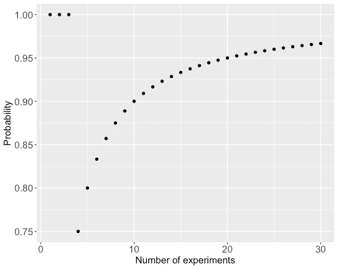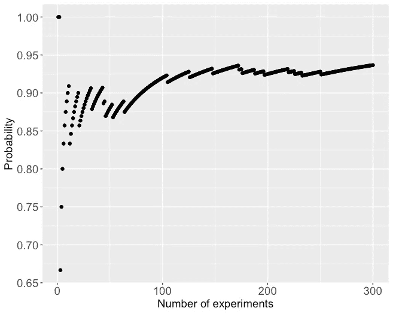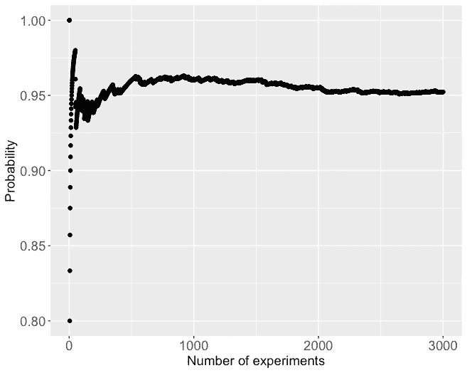

从左到右:描绘当实验次数从 30 到 300 到 3000 增加时，包含真参数 p 的置信区间的比例收敛的图。这直接来自大数定律

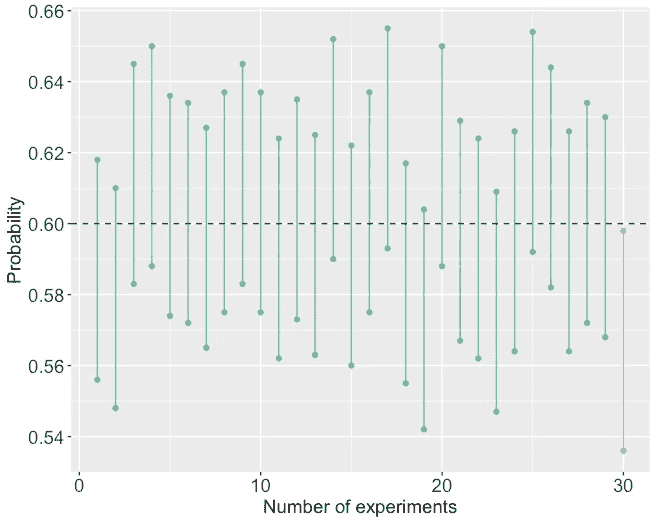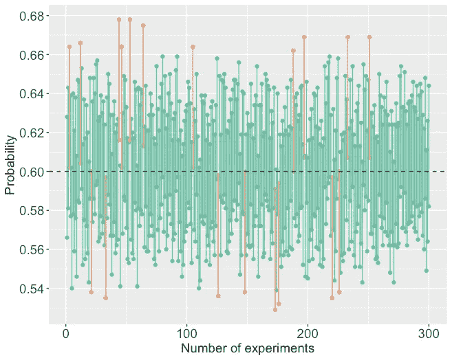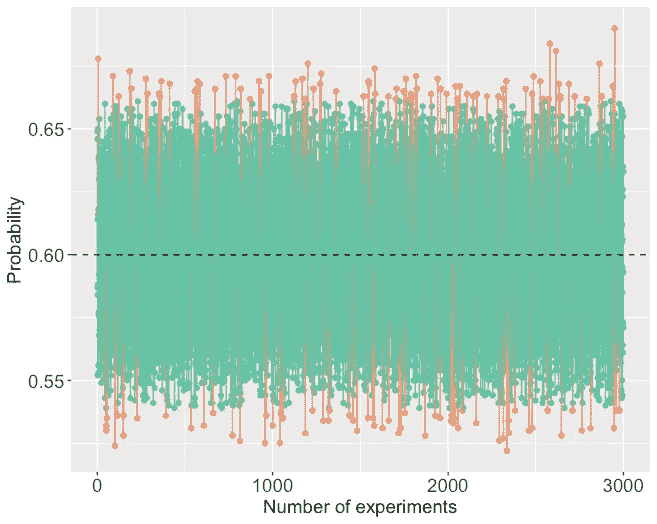

从左到右:描绘基于反复做实验计算的置信区间的图(30，300，3000)。虚线代表真实比例，在这些模拟中假设 p=0.6

我们可以观察到，随着实验次数的增加(这是我们反复做实验的另一种说法)，包含真参数的置信区间的比例收敛到水平 1-α(这里α=0.05)。我们还可以看到，对于少数实验，只有一个置信区间不包含真实参数，这似乎与我们在此分析中使用的 0.95 水平相反。但是，我们需要记住，我们在最左边的图中看到的 30 个置信区间是 30 个实现，它们是从具有一些可变性的置信区间的基本分布中提取的。如果你尝试对相同数量的实验重新运行模拟，这就是为什么它每次都吐出不同的结果。这也正是为什么我们说，一旦我们使用观测数据估计置信区间，它就不再是概率性的。现在，我们估计的置信区间可能不包含真实参数(例如，如果我们从最左侧的图中选择了 1 红色置信区间)，但这正是我们在本节开始时的分析所涵盖的内容。虽然我们还没有完全排除这种可能性，但我们做出的是极不可能像任何概率分析那样。

你可以在这里找到用于这些模拟的脚本[。](https://github.com/sahilgupta2105/Medium-Articles/blob/master/ConfidenceIntervalSimulator.R)

## 资源

 [## 所有的统计数据

### 这本书是给想快速学习概率统计的人看的。它汇集了许多主要观点…

link.springer.com](https://link.springer.com/book/10.1007/978-0-387-21736-9)  [## 置信区间

### 这篇文章需要统计学专家的关注。具体问题是:许多回复和修复表明…

en.wikipedia.org](https://en.wikipedia.org/wiki/Confidence_interval)