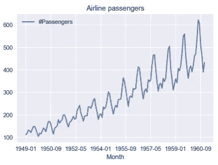
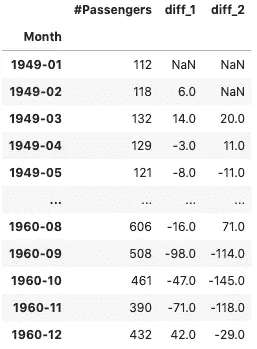
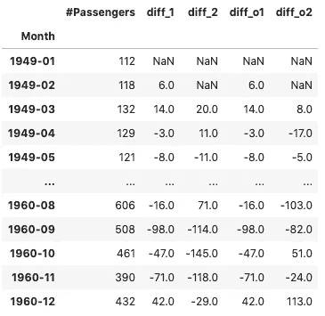

# Python 中差分时间序列的直观指南

> 原文：<https://towardsdatascience.com/an-intuitive-guide-to-differencing-time-series-in-python-1d6c7a2c067a?source=collection_archive---------19----------------------->

在 [Unsplash](https://unsplash.com/s/photos/time?utm_source=unsplash&utm_medium=referral&utm_content=creditCopyText) 上由 [Aron 视觉](https://unsplash.com/@aronvisuals?utm_source=unsplash&utm_medium=referral&utm_content=creditCopyText)拍摄的照片

## 了解时间序列差异的原因、内容和方式！

在处理时间序列时，你迟早会遇到差异这个术语。在这篇文章中，我将尽我所能提供一个简单和容易的数学理论介绍。然后，我还将展示在 Python 中可以遵循的两种不同方法。我们开始吧。

# 理论

在我真正解释什么是差异之前，我需要快速介绍另一个在处理时序数据时至关重要的概念——平稳性。有很多很棒的文章深入探讨了什么是平稳性，包括弱变量和强变量之间的区别等等。然而，为了这篇文章，我们将集中讨论一个非常基本的定义。

这都是因为时间序列数据不同于处理回归问题时可能遇到的其他类型的数据，例如，预测波士顿地区的房价。这是因为时间序列以时间结构为特征，这实际上意味着数据点的顺序确实很重要。

举一些例子，时间序列数据可以显示趋势(增加和/或减少的模式，例如，在一些商品的生产或销售中)或季节性(当一些时间段显示不同的模式时，例如，在夏季的几个月中与旅游相关的收入增加)。从统计学的角度来看，趋势意味着随时间变化的平均值，而季节性意味着变化的方差。在这样的情况下，我们处理的是**非平稳**系列。

因此**平稳**序列基本上是一个具有稳定/恒定统计特性(均值、方差等)的时间序列。)久而久之。或者换句话说，这种时间序列中的观测值不依赖于时间。我们为什么关心这个？简单地说，处理这样的序列并做出准确的预测要容易得多。时间序列建模的一些方法或者假设或者要求基本的时间序列是平稳的。

我将在另一篇文章中省略平稳性测试的细节(例如，用扩展的 Dickey-Fuller 测试),直接回到主题——差异。**差分**是处理非平稳数据的可能方法之一，它用于试图使这样的序列平稳。实际上，这意味着将后续观测值相互相减，公式如下:

`diff(t) = x(t) — x(t — 1)`

其中`diff`是时间 *t* 的差分序列，`x`代表原始序列的观测值。这种转换非常简单，但是我将在下面的实际例子中说明一些细微的差别。

# Python 中的示例

## 设置

和往常一样，第一步是导入所需的库。

## 数据

对于这个简短的例子，我们将使用一个非常著名的航班乘客数据集(该数据集可以在我的 [GitHub](https://github.com/erykml/medium_articles/blob/master/data/air_passengers.csv) 上获得)。如果你上过关于时间序列的课程或读过这方面的书，你很可能会立刻意识到其中的情节。

我相信这是一个很好的地方来提及，在实践中，你很少会遇到这样一个清晰的时间序列与一个明显的模式。每个人都用这个作为例子，这不是巧合；)

## 标准差分

在 Python 中应用差异最简单的方法是使用`pd.DataFrame`的`diff`方法。使用`periods`参数的默认值会产生一个差分序列，如上式所述。

如果我们有一个具有明显季节性模式的时间序列(比如夏季乘客数量的增加)，我们可以应用`diff`方法，并将`periods`参数指定为我们想要差异的周期数。所以在这种情况下，使用`periods = 12`会导致以下情况:

`diff(t) = x(t) — x(t — 12)`

季节变化不需要在一年的尺度上发生，事实上，它通常可以被定义为任何固定时期内的重复模式。

为了清楚地说明如何使用`diff`方法，您可以运行下面的代码片段并检查输出。

## 递归差分

我们已经看到了`pandas`对`diff`的较量。`numpy`的有点不同，因为它实现了递归差分。当处理递归差分时，执行差分的次数被称为**差分顺序**。让我们从一个将差序为 2 的变换应用于同一数据集的示例开始。这意味着我们首先应用常规差分(如上面的`pandas`案例),然后对已经差分的序列再次应用变换。因此递归部分。看了结果表之后，逻辑就清晰可见了。

我们将一些`NaN`值附加到差分序列的前面，以确保它们与原始序列的长度相同。

在表格中，我们可以看到`diff_o1`(其中 o 代表顺序)与`diff_1`相同。但是，我们可以清楚地看到`diff_2`和`diff_o2`的区别。

那么我们什么时候应该使用递归差分法呢？当我们有一个非平稳序列时，它就派上用场了，应用差分使序列平稳，它仍然是非平稳的。然后，我们可以使用 2 阶差分(也可能更多，尽管超过 2 阶并不常见)。这就是 ARIMA 模型中的情况，其中 I 代表积分，实际上对应于对序列求差分以获得平稳性。

# 结论

在本文中，我介绍了时间序列差异的概念，并解释了这种方法的两种变体之间的差异。但是这篇文章只是触及了时间序列分析、平稳性和处理非平稳数据的表面。希望我能在以后的文章中涵盖一些更实用的技巧。

您可以在我的 [GitHub](https://github.com/erykml/medium_articles/blob/master/Time%20Series/time_series_differencing.ipynb) 上找到本文使用的代码。一如既往，我们欢迎任何建设性的反馈。你可以在推特上或者评论里联系我。

2020 年初，我出版了一本关于使用 Python 解决金融领域实际任务的书。在这本书里，我更全面地介绍了时间序列分析和预测，包括测试平稳性和处理非平稳数据的各种方法。如果你有兴趣，我贴了一篇文章介绍这本书的内容。你可以在[亚马逊](https://www.amazon.com/Python-Finance-Cookbook-libraries-financial-ebook/dp/B083KG9DC7)或者 [Packt 的网站](https://bit.ly/2SbBNcj)上买到这本书。

# 参考

*   [https://numpy . org/doc/stable/reference/generated/numpy . diff . html](https://numpy.org/doc/stable/reference/generated/numpy.diff.html)
*   [https://pandas . pydata . org/pandas-docs/stable/reference/API/pandas。DataFrame.diff.html](https://pandas.pydata.org/pandas-docs/stable/reference/api/pandas.DataFrame.diff.html)