# 期望最大化算法的直观指南

> 原文：<https://towardsdatascience.com/an-intuitive-guide-to-expected-maximation-em-algorithm-e1eb93648ce9?source=collection_archive---------22----------------------->

艾米丽·莫特在 [Unsplash](https://unsplash.com?utm_source=medium&utm_medium=referral) 上的照片

## 使用 EM 算法对阶跃函数建模

期望值最大化算法是一种估计未观察变量的流行技术，也是工具箱中一个非常强大的工具。过去我曾多次尝试研究这种算法，但概念似乎太抽象，无法想象我可以使用这种算法的实际应用。此外，我发现的例子(可能)太局限于特定领域，不具有相关性。就像爱因斯坦说的，我们应该让一切尽可能简单，而不是更简单。我写这篇文章的目的是想出一个直观的例子来展示 EM 算法的威力。

我将在本指南中使用的示例显然可以使用其他(更简单的)技术来建模，但这里的目标仍然是使用这个相当简单的问题来演示 em 算法的基本概念。事不宜迟，问题来了:如何建模一个阶跃函数(图 1)？

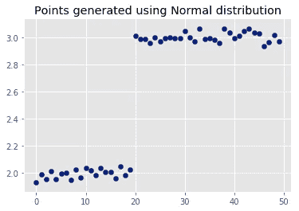

图 1:使用正态分布在 y=2 和 y=3 附近生成的点，方差为 0.03

如果我们使用非线性模型来估计我们的函数，这个问题的答案是微不足道的。但是，为了理解 EM 算法的工作原理，现在让我们坚持使用线性模型。

这个想法很简单，如果这不是一个阶跃函数，我们可以简单地使用一个线性回归模型。此外，如果我们以某种方式知道跳跃点，我们可以在我们的特征空间中添加一个虚拟变量(时间序列分析中使用的一种流行技术)，问题就已经解决了。让我们尝试使用线性模型来回答这个问题，并可能获得对 EM 算法的赞赏。我认为，理解所涉及的不同组成部分的数学知识可以有助于更深入地理解所涉及的思想，并将它们转移到其他问题上。所以，这将是一个相当数学化的指南。但是，我保证让事情尽可能简单，但不会更简单。

让我们从介绍我们的训练集 *Z* 的符号开始，

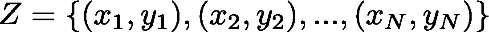

为了使用线性模型来模拟阶跃函数，我们需要两条平坦的线，并让这两条线，

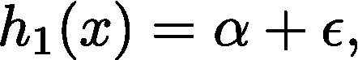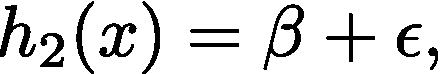

其中 *ϵ* 为带参数的高斯噪声( *μ，σ* )，而 *α，β* 为常数(我们将尝试估计)。此外，请注意，我们对两条线使用了相同的噪声，因为我们可以假设数据产生过程是相同的。

为了完成对数据模型的描述，我们需要一个指示变量(δ),这样我们的完整模型如下:

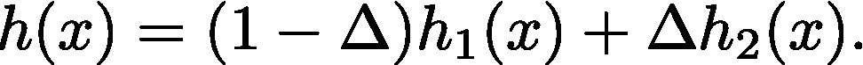

这个想法是，当δ= 0 时，第一行被激活，当δ= 1 时，第二行被激活(你也可以把指示变量想象成一个开关)。这给了我们想要的效果:在跳跃之前 h1(x)是我们的数据模型，在跳跃之后 h2(x );指示器变量在跳跃时激活。这里的挑战是，我们没有关于指标变量的信息，或者换句话说，这是我们收集数据时没有观察到的。

本质上，我们是在说我们对指标变量不确定。那么，我们该怎么办？有印象吗，还是我们被困住了？如果你认为不是，那你就对了。让我们用概率的思想来进一步发展我们的数据模型。我们可以引入指标变量的概率分布来模拟这种不确定性。设δ为伯努利随机变量，其中δ= { 0，1}，P(δ= 1)=θ。基于指示变量的这种分布(这可以被认为是给我们的数据增加了另一个潜在特征)，我们可以得到下面的表达式(使用条件概率)，

上面的表达式表明，我们对一个数据点(来自我们的数据)的信念可以根据我们对指标变量的信念分成两部分。这个想法是将我们对指标变量的不确定性纳入我们的模型 h(x)的关键。如果你在这一点上感到有点迷茫，请记住，一个简单的回归模型也旨在估计 P(Y |Z)，即 Y 的概率，假设我们观察了我们的数据。所以，我们正在尝试做类似的事情。再坚持一会儿，你就会看到奇迹。

设 *Y* 表示模型 *h(x)，*的输出，那么我们可以将 *Y* 的密度函数写成:

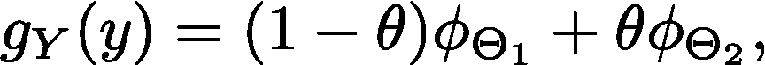

其中ϕ_{θ_{1}} ~*n*(α，σ^{2})和ϕ_{θ_{1}} ~*n*(β，σ^{2}).这就完成了我们对该数据模型的数学描述，剩下的就是确定模型参数θ=(*α，β，θ* )。

我们可以使用标准的最大似然估计技术来估计参数值。对数似然函数可以写成如下形式，

为了使我的工作简单一点，我跳过了上面等式中的一个步骤(产品的对数也可以写成对数的总和)。注意，由于对数项的总和，很难使上述等式最大化。这就是 E-M 算法的闪光点。通过对未观察到的(/潜在/缺失)变量(在我们的例子中是指标变量)进行假设，该算法可用于简化这一过程。

我想在这里稍作停顿，在我们正在努力解决的当前问题的背景下更多地谈论这一点。正如我前面提到的，如果我们在我们的特征空间中显式地添加一个虚拟变量，问题就会变得微不足道。然而，实际上在识别跳跃点方面可能存在挑战。因此，我们可以认为虚拟变量在我们的数据集中缺失，并从这个角度应用 E-M 算法。这是 EM 算法的妙处:**假设**关于一些缺失的(/未观察到的)数据的知识大大简化了问题。

让我们**假设**我们知道每个数据点的指标变量的值，那么对数似然函数就变成，

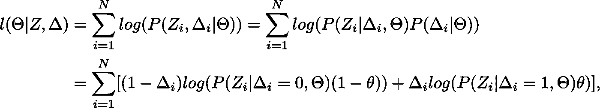

其中最后一行来自指示符变量的定义。注意，对于δI = 0，第一项非零，而第二项为零。

使用模型输出的密度函数，我们可以简化表达式，

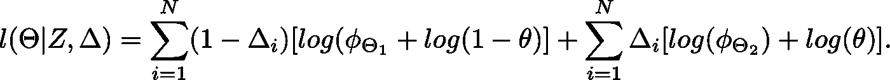

我们现在可以通过对参数θ求微分来最大化对数似然(MLE)。重要的是，在这里花一点时间，思考如何纳入指标变量的不确定性简化了我们的估计问题。可以发现这些参数是，

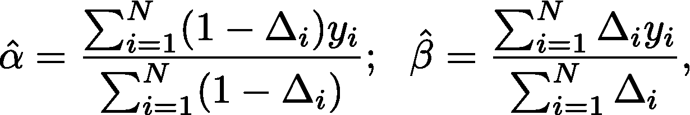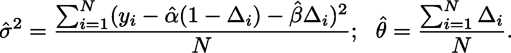

换句话说，线参数的估计只是特定线处于活动状态的区域中值的平均值(类似于简单的回归模型)，噪声的方差是我们预测中的方差，指示变量的概率分布是δI = 1 的点的比例，这正是我们直觉上要做的。

让我们再次暂停一下，回顾一下我们到目前为止所做的工作。我们试图建立一个阶跃函数模型。为此，我们定义了两条直线 h1(x)和 h2(x ),以及一个指示变量，用于在二维空间的不同区域激活这些直线。由于我们没有关于跳跃的信息，我们使用参数为θ的伯努利随机变量进行建模。这使我们能够完成对模型的描述。为了估计我们模型的参数，我们使用了极大似然估计。并且，为了简化我们的对数似然表达式，我们使用了 EM 算法中关于缺失(/未观测)变量的思想。因此，假设我们以某种方式知道每个数据点的指标变量值，我们通过最大化数据的对数似然来找到参数估计。

现在，让我们放松我们之前的**假设**关于指示变量(或跳跃)的知识。这就是 EM 算法帮助我们的地方。我们在这里能做的最好的事情就是用它的**期望值**替换每个指标值。该期望值**定义**如下，称为责任，

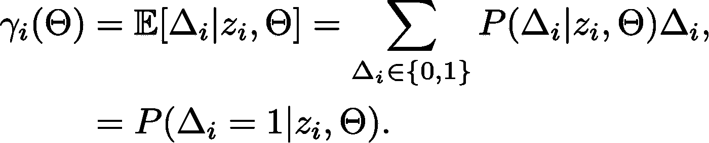

这被称为模型 2 的*责任*(因为当δI = 1 时 h2(x)有效)用于观察 *i* 。使用 E-M 算法，以迭代的方式计算这些责任。

在第一步中，我们计算指标值(或我们的缺失/未观察变量)的期望值，也称为责任，在第二步中，我们使用最大化对数似然的导出表达式来计算参数估计值。该算法总结如下，

**期待-步骤**:

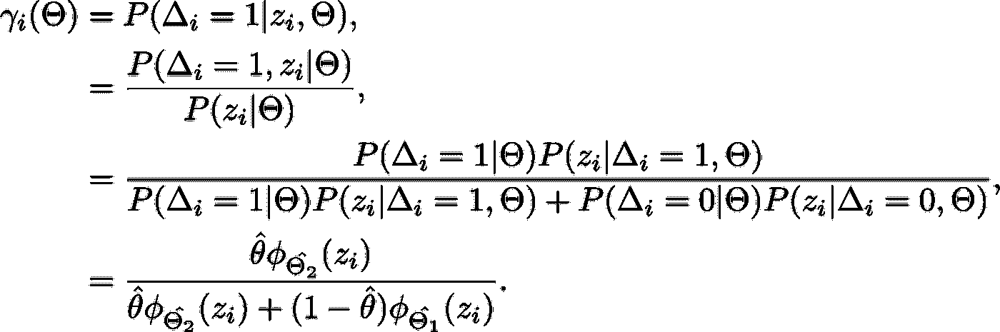

**最大化步骤**:

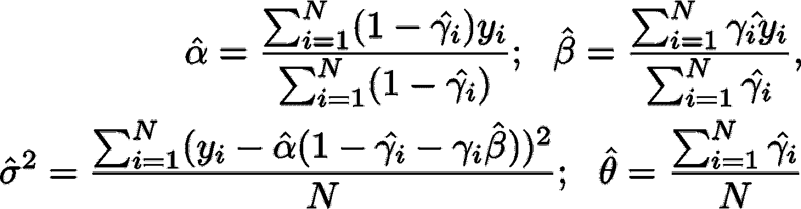

简单来说，EM 算法所做的就是通过一个平均值(**期望**)解决关于指标变量的假设，然后解决原问题(**最大化**)。这是以迭代的方式进行的，并且算法收敛到正确的答案。

这就完成了问题的数学建模。为了测试这些想法，我用 Python 编写了算法程序(你可以在下面找到代码)。模拟数据集(50 个点)的建模结果如下所示。

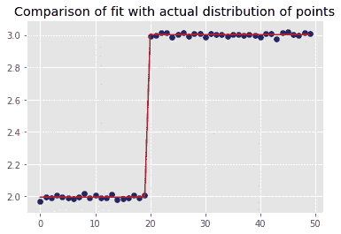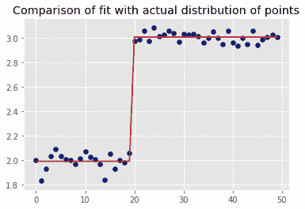

点是从均值为 y=2、y=3、方差为 0.01(左)和方差为 0.05(右)的正态分布中生成的

正如我们所看到的，即使方差增加，EM 算法看起来也相当稳健。

代码:[https://github . com/sahilgupta 2105/machine _ learning/blob/master/step _ function _ em . ipynb](https://github.com/sahilgupta2105/machine_learning/blob/master/step_function_em.ipynb)

我在这里讨论的大部分观点都是改编自一本叫做《统计学习的要素》的书。