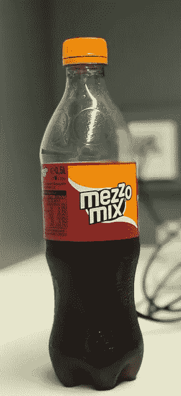
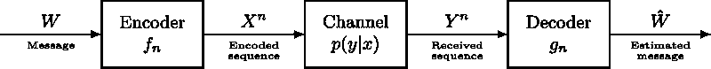
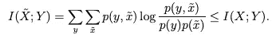
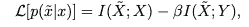
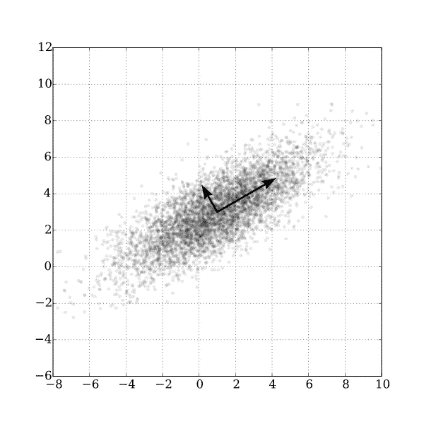
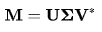
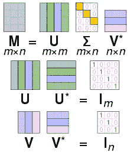
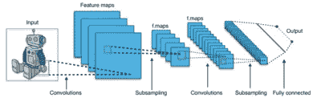
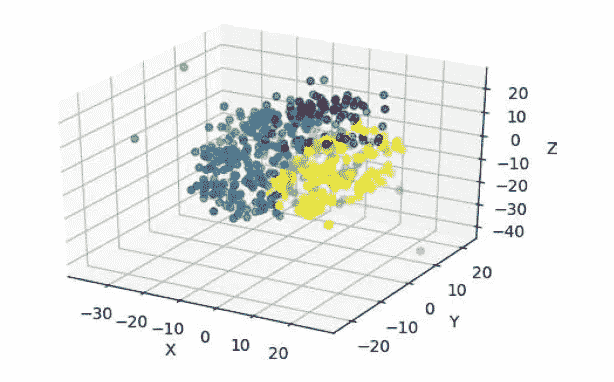

# 信息压缩直观指南

> 原文：<https://towardsdatascience.com/an-intuitive-guide-to-information-compression-b735490c545e?source=collection_archive---------33----------------------->

## *信息:概率的负倒数值。*

瓶颈(自行点击图片)

维数灾难指的是在高维空间中分析和组织数据时出现的各种现象，这些现象在低维环境中不会出现，例如日常经验的三维物理空间。因此，支持结果所需的数据量通常随着维数呈指数增长，而这并不总是可行的。此外，在处理更多的输入维度时也存在计算障碍。

**Claude Shannon 的噪声信道编码定理**表明，虽然从信源到接收机的信息传输过程中可能会添加噪声，并且对于通信信道的任何给定程度的噪声污染，都有可能通过信道以可计算的最大速率几乎无差错地传输离散数据。

来源:维基媒体

这激发了对基于编码器和解码器架构的更密集的低维输入表示的需求。其中除了解码器能够很好地有效估计消息之外，编码应该尽可能高效。有各种各样的降维技术和压缩方法可以找到解决方法。在这篇文章中，我将尝试给出一些这样的突出思想的直观概述。

## 信息瓶颈法

这种压缩方法的一个有趣的原理是来自信息论的信息瓶颈方法。如论文*中所述的信息瓶颈方法*

> 理解信号 X 不仅需要预测 y，还需要指定 X 的哪些特征在预测中起作用。我们将问题形式化为寻找 X 的一个短码，该短码保留关于 Y 的最大信息。也就是说，我们通过有限的码字集 X \\'形成的“瓶颈”挤压 X 提供的关于 Y 的信息。

x 中关于 Y 的信息量由下式给出

我们可以通过最小化损失来找到最佳瓶颈表示 x

β是用于改变压缩分辨率的拉格朗日乘数。这直观地意味着瓶颈表示应该编码更多关于目标变量的信息和更少的自变量。这为我们提供了信息压缩的理想目标。

## 主成分分析

PCA 是一种正交线性变换，它将数据变换到超椭球形式的新坐标系中，使得数据的最大方差点位于第一主分量轴上，第二大方差点位于第二坐标上，依此类推。如何将这一想法进一步用于降维，我们移除解释最小方差的轴。

这是通过计算数据的协方差矩阵，找出协方差矩阵的特征向量和特征值，然后最终按照特征值的降序排列特征向量来实现的。这些特征向量被称为主分量。

PCA 用于一般的降维，也用于将多维点投影到更小的维度以便可视化。

来源:维基媒体

## 奇异值分解

这种思想可以用在许多应用中，其中很少是在推荐系统中，提取单词嵌入，执行 PCA，计算伪逆，伪逆大量用于找出封闭解，如在线性回归和一般矩阵分解的情况下。它是特征分解的推广，要求矩阵是正方形的，但这里也可以是矩形的。

其中 M 是分解成潜在矩阵 U 和 V*的矩阵，也称为左右奇异矩阵，**σ**等于 **M** 的奇异值。M*M 的特征向量构成 V 的列，MM*的特征向量构成 U 的列，其中*对应于矩阵的转置。奇异值是 M*M 或 MM*的特征值的平方根。

来源:维基媒体

## 自动编码器

自动编码器是最流行的信息压缩工具之一，它被扩展用于各种任务，例如嵌入学习、图像处理、维数减少和异常检测。

自动编码器的目的是学习编码，然后从简化的编码中重建尽可能接近其原始输入的表示。为了迫使自动编码器学习更鲁棒的表示，使用了正则化版本。

稀疏自动编码器不一定需要较少数量的隐藏单元，而是只允许少量的隐藏单元同时活动。为了在隐藏单元的激活中实现稀疏性，由某个参数缩放的激活的 L1 或 L2 正则化被添加到损失函数中。

去噪自动编码器采用部分受损的输入，并被训练以恢复原始的未失真输入，从而去除分离噪声。

收缩自动编码器试图实现类似于稀疏编码器的东西，不同之处在于它试图压缩编码器激活的雅可比矩阵相对于由某个参数缩放的输入的 Frobenius 范数。

来源:维基媒体

## 卷积神经网络

从自然语言处理到计算机视觉，卷积神经网络组件找到了自己的位置。1x1 卷积、卷积 1D、卷积 2D 与池结合为我们提供了有效的压缩技术。它们主要用于计算机视觉任务，这表明它在处理如此高输入维度空间方面的有效性。

在完全连接的神经网络中，每个神经元接收来自前一层的每个元素的输入。在卷积层中，神经元仅接收来自前一层的受限子区域的输入，该子区域称为感受野。在卷积层中，与全连接层相比，接收区域小于整个前一层。这些网络提供了各种优势，例如本地连接和参数共享。因此，它使我们能够有效地工作与压缩低维表示的图像。

来源:维基媒体

## t-SNE

这是一种非线性降维技术，将数据嵌入二维或三维的低维空间，主要用于可视化目的。

t-SNE 计算高维空间和低维空间中的实例对之间的相似性度量，然后使用使用梯度下降优化的 KL 散度最小化这些相似性在更高和更低维空间中的差异。

代码输出

## 结论

> *“我喜欢密度，不喜欢体积。”*

—莫林·霍华德