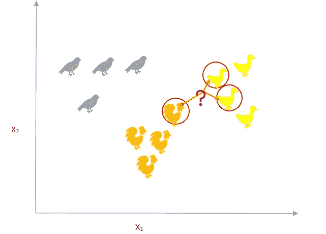
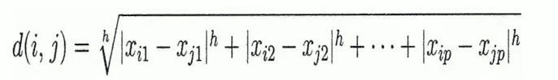
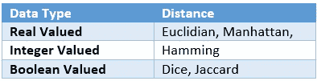
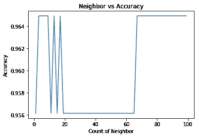
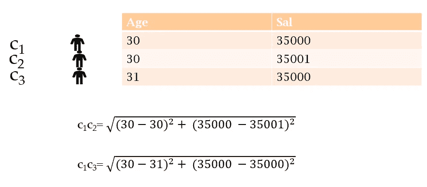
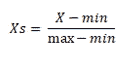
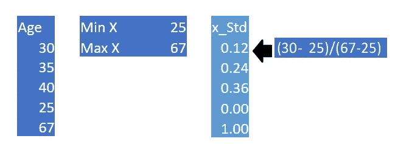

# kNN 及其实现的直观指南

> 原文：<https://towardsdatascience.com/an-intuitive-guide-to-knn-with-implementation-fc100bf29a6f?source=collection_archive---------46----------------------->

## 一个载体被它所保持的公司所知


图片来源:Unsplash(照片由[乔恩·泰森](https://unsplash.com/@jontyson)拍摄)

kNN 是最简单的分类算法之一，因此仍然是社区的“宠儿”之一。有不少关于流行的机器学习算法的调查，kNN **很少能被排除在前 10 名之外。你可以在 KNN 查看我们的视频[这里](https://www.youtube.com/watch?v=xx7FIZrtnM0)和我们的代码[这里](https://www.kaggle.com/saptarsi/k-nn-sg)。**

我们首先来看直觉。在任何班级，当有多个学科的学生参加时，都有同一个学科的学生坐在一起的倾向。kNN 利用了这个想法。

让我们从一个例子开始，来理解它是如何工作的。



图 1:KNN 插图(来源:作者)

> 有三种鸟。任务是找到问号标记的新鸟的类型(类)。

我们观察它的三个最近的邻居(被圈起来的)，观察到大多数邻居是鸭子(3 个中的 2 个)，并且**断定这个未标记的观察结果是鸭子**。在这个例子中，我们已经查看了三个最近的邻居，因此 k 的值被取为 3。

> 物以类聚


图片来源:Unsplash Photo by[Fungai Tichawangana](https://unsplash.com/@fungaifoto)

**因此，有两个设计决策需要考虑:**

*   需要考虑多少邻居？

如果我们保持一个小值，它将识别局部模式，在某些情况下也可能拾取噪声。一个很高的 k 值，它会看全局格局。在最坏的情况下，它的行为类似于朴素贝叶斯的先验概率。**无论数据位于何处，它都会将其分配给多数类。**

*   将使用哪种距离度量？

可以是欧几里德、曼哈顿、汉明距离、余弦相似度的倒数等。有兴趣的读者可以看看参考文献 1，一本只讲距离度量的书。

**实施:**

下面的代码足以导入和实例化分类器。

```
from sklearn.neighbors import KNeighborsClassifier
*#Initalize the classifier*
knn = KNeighborsClassifier(n_neighbors=15)
```

**scikit 中 kNN 的重要参数有哪些？**

*   **n_neighbors:** 与‘k’含义相同，默认值为 5
*   **权重:**可能的值有均匀和距离。默认情况下，这是统一的，当您使用距离时，所有邻居都有相同的投票权重，这意味着较近的邻居比较远的邻居有更多的权重。
*   **算法:**最好的选择是使用“自动”，在这一步中计算距离矩阵，这是 kNN 中计算量最大的部分。
*   **p** :如果 p =2，则为欧几里德距离，如果 1，则为曼哈顿距离，这适用于度量为 ***明可夫斯基的情况。*** *方程给出了两个 p 维向量 x1 和 x2。*



**闵可夫斯基距离(来源:作者)**

*   **metric:** 默认为 ***Minkowski，*** *基于两个向量的数据类型有很多选项，下表列出了其中一些。*



图 2:基于数据类型的不同距离度量(来源:作者)

还有一个选项来创建您自己的距离度量，但那是一个单独的故事。

**如何确定‘k’的最优值？**

最简单的解决方案是采用不同的“k”值并运行算法，检查测试集的准确性，当我们看到饱和时，我们可以停止。

```
**# Initialize an array with diffrent choices of 'k'**
nc=np.arange(1,100,2)
#**Creating an array to store the accuracy values**
acc=np.empty(50)
i=0
for k in np.nditer(nc):
    **#Initializing kNN with diffrent values of K** knn = KNeighborsClassifier(n_neighbors=int(k))
    knn.fit(x_train, y_train)
    **#Finding the testing set accuracy **   
    acc[i]== knn.score(x_test, y_test)
    i = i + 1
```

接下来，绘制不同“k”值的精确度

```
x=pd.Series(acc,index=nc)
x.plot()
*# Add title and axis names*
plt.title('Neighbor vs Accuracy')
plt.xlabel('Count of Neighbor')
plt.ylabel('Accuracy')
plt.show()
```



图 3:确定“k”的最佳值(来源:作者)

我们可以停在一个很小的“k”值上，如图 3 所示，可能在 6，7 左右。

**为什么基于距离的算法需要缩放？**

让我们再举一个例子。假设，我们有三个客户的数据，我们有两个属性年龄和工资。三个向量，每个向量都是二维的。我们必须确定谁是 C1 最近的邻居。



图 4:缩放的需要(图片来源:作者)

如果我们计算一下，我们会发现两者的距离都是 1，因此它们是等距离的。然而，薪水的 1 Rs 的变化和年龄的 1 Rs 的变化是不等价的，并且由于薪水的范围与年龄相比会相当高，所以在欧几里德距离计算中，它会窒息或支配年龄。

使它们达到相同范围的一种标准技术称为归一化或最小-最大缩放，由等式 2 给出



等式 2:标准化

下面附上一张虚构的有年龄的插图



图 5:最小-最大缩放的图示(来源:作者)

因此，所有值都映射在 0 到 1 之间，最小值映射到 0，最大值映射到 1。

```
**# Impoting minmaxscaler**
from sklearn.preprocessing import MinMaxScaler 
**#Initilization**
scaler = MinMaxScaler(feature_range=(0, 1)) 
**#Transforming the value**
x_scaled = scaler.fit_transform(x)
```

**关键备注:**

*   kNN 是一个非常简单的算法，并且没有对数据分布做任何假设，因此被称为**非参数**。
*   确定“k”并不容易。
*   随着维度数量的增加，许多距离度量都不再适用。
*   最后，**邻域矩阵的计算非常昂贵**。
*   可以将**简单地扩展到回归**，其中目标变量的值将是其 k 个最近邻居的平均值。
*   它还能容忍输入数据的变化，因为它只在被要求分类时才开始计算。它通常被称为懒惰的学习者。

**参考:**

[1]德扎 MM，德扎 e .距离百科。《距离百科全书 2009》(第 1-583 页)。斯普林格，柏林，海德堡。

[2][https://towards data science . com/KNN-k-nearest-neighbors-1-a 4707 b 24 BD 1d](/knn-k-nearest-neighbors-1-a4707b24bd1d)