# PCA 直观指南

> 原文：<https://towardsdatascience.com/an-intuitive-guide-to-pca-1174055fc800?source=collection_archive---------16----------------------->

## 主成分分析背后的思想

内森·杜姆劳在 [Unsplash](https://unsplash.com?utm_source=medium&utm_medium=referral) 上的照片

主成分分析(PCA)是一个非常有用的工具，可以用来获得关于数据集的直觉。它主要用于降维。我最近偶然看到[一篇关于 PCA](https://arxiv.org/pdf/1404.1100.pdf) 的教程论文，它通过谈论这个强大概念背后的直觉为我揭开了 PCA 的神秘面纱，并启发我分享我在这个过程中发现的一些事情。这篇文章中的大部分想法都是从原始论文中得到启发的，我很感谢作者写了这篇文章。我将从基础开始构建概念，并以 PCA 在一些真实数据上的应用结束。

## 降维的需要

人类通过观察事物来学习。最常见的学习技巧之一是进行一项实验，收集一些数据，研究它，并就我们试图研究的现象得出结论。例如，假设我口袋里有一枚硬币，我正试图确定它是否有偏差。为了找到这一点，我多次投掷硬币，从我的实验中收集数据，并利用统计学原理，我可以推断出我的硬币。同样，在更现实的环境中，我们手头有一个数据集，它代表了对现实世界现象的观察，我们的目标是研究它，以深入了解潜在的现象。

让我们假设我们有兴趣了解[弹簧](https://en.wikipedia.org/wiki/Spring_(device))是如何工作的。对于那些不熟悉这个的人来说，弹簧的动力学是由虎克定律控制的。我选择这个例子(类似于原始论文)是为了使讨论简单，并梳理出潜在的想法。为了做到这一点，我们将设置一个带有摄像机的实验，并在不同的时间记录弹簧尖端的位置(出于任何原因，我可能强烈怀疑弹簧的位置完全包含了动力学，这就是为什么我首先记录它)。因此，我们在这里收集的数据集将是一个矩阵 X，具有 *n* 个观察值和 *2* 个特征(X 和 y 坐标)。假设我们进行了实验并获得了一些观察结果，如图 1(左)。

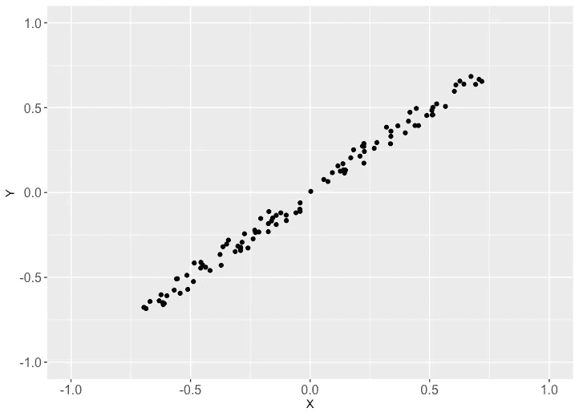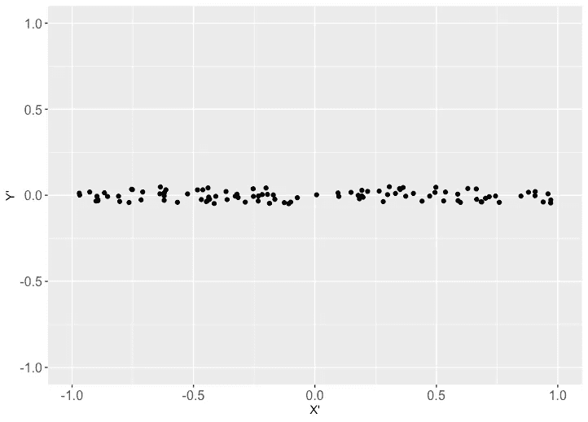

图 1:(左)从弹簧实验(n=100，p=2)收集的观察结果，(右)旋转坐标框架以揭示弹簧的动力学可以仅被描述为一个方向

在我们的观察中有两件有趣的事情正在发生:a)看起来弹簧尖端在不同时间点的位置几乎沿着相对于 x 轴倾斜的直线(如果你读过胡克定律，你就知道为什么会发生这种情况)，b)收集的数据有噪声，例如，由于固定相机的不稳定底座。第一个观察更多的是关于弹簧动力学的启发(我只提到了虎克定律来提供一些背景，应该记住，我们在进行这个实验时对这个定律是*无知的*，并且试图通过实验发现这个定律)。

尽管我们收集了沿任意选择的 x 轴和 y 轴的观察值，但看起来弹簧的动力学可以在一个方向上描述。例如，我们可以旋转我们的参照系，使所有的点都位于旋转坐标系中的 x '方向(图 1，右)。我们还可以看到，与 x 方向的可变性相比，y 方向的可变性似乎较小，这可能是数据收集过程中的噪声。换句话说，弹簧的动力学可以完全由单一的运动方向(新的 x 轴)来描述，并且在我们的观察中有一些以噪声形式存在的冗余。

> **总结**:数据集可能包含不必要的复杂性，有时可能隐藏简化的结构。需要系统化方法来降低这种复杂性并从我们的数据集中去除冗余。

## PCA 的目标

PCA 旨在识别最有意义的参考系(在线性代数中也称为 ***基*** )来重新表达我们的数据集，希望这个新的*基*将过滤掉噪声并揭示任何隐藏的结构。

在 spring 实验中，我们手动实现了这个目标:观察图显示我们可以旋转坐标轴，y 方向上的微小变化(与 x 方向相比)显示有一些噪声，可以过滤掉。

# 参照系

让我们继续在春季实验的基础上提出更系统化的降维方法，即 PCA。我们需要引入线性代数中的一些基本概念。我会尽量让讨论简单一些。

## 一个幼稚的参照系

在春季实验中，我们使用在实验室中任意安装的相机收集我们的观察结果(这类似于真实世界中我们收集某些维度/特征的数据)。基于我们的摄像机的方向，定义了一个隐式坐标框架，即相对于摄像机定义的 x 轴和 y 轴(图 1，左侧)。这叫做*幼稚的*参照系。

上一段中的关键是单词*隐含的*，也就是说，如果没有一些关于弹簧如何工作的额外信息，我们不可能找到更好的框架。同样，在现实世界中，我们无法自由控制记录观察结果的维度，所以*天真的*选择已经为我们做好了。

> **总结**:朴素参照系是数据收集方法的一个属性，它是(隐含地)赋予我们的。

> 迂回:在我们继续讨论之前，让我们简单地谈谈线性代数中的一个基本概念，叫做**基**。

*基础*可以被认为是参考框架的一个构建模块。考虑我们实验中的一个观察结果(0.9，0.85)。该观察可以被视为使用 x 轴向量的某一部分(=0.9)和 y 轴向量的某一部分(=0.85)来构建。

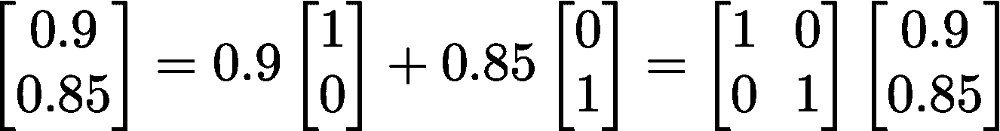

这是一种非常强大的思维方式，因为仅使用坐标轴方向上的两个向量(以及关于乘数(0.9，0.85)的信息)，我们就可以描述我们的观察结果。这些乘数的一个稍微专业的术语是*投影。*比如观察沿 x 轴方向的*投影*是一个大小为 0.9 的矢量。上式中最右边的等式是这个事实的矩阵表述。

换句话说，我们可以将观察值(0.9，0.85)分解为两个独立部分的组合:x 轴(由向量(1，0)给出)和 y 轴(向量(0，1))。沿着 x 轴和 y 轴的向量一起形成了一个*基础。我称它们为构建模块，因为二维平面中的任何向量都可以表示为(或者换句话说，构建为)这两个向量的组合。*

让我们以矩阵的形式收集我们的原始参考系的构件。

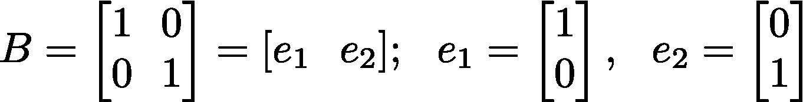

我们可以对整个数据集的上述讨论简明地描述如下，

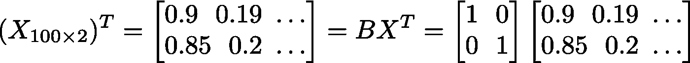

这个矩阵方程用朴素基描述了观测向量(x，y)(即数据)(这就像陈述 2 = 2，这就是为什么我们看到恒等矩阵出现在 RHS 中)。LHS 只是以矩阵 X^T 的形式并排堆叠的单个观测向量，而 RHS 是我们之前所说的所有观测向量的简明表述方式。这里我跳过了一个步骤:每个观察值都可以像第一个观察值一样分解，然后最右边的矩阵方程就出来了。

这个等式看起来相当简单，因为矩阵 *B* 就是单位矩阵*。*如果我们开始以稍微不同的方式思考这个等式，神奇的事情就会发生:矩阵 X^T 是数据，而最右边的矩阵(与单位矩阵相乘的矩阵)是乘数的集合，它为我们提供了构建数据集的方法。这可能感觉是一种尴尬的思考方式，但是一分钟后就会明白为什么它会如此强大。

## 更好的参照系

回想一下，作为系统化降维方法(PCA)的第一步，在 spring 实验的推动下，我们试图找到一个更好的参考框架，它可能会简化数据以揭示隐藏的结构(类似于我们如何能够确定 spring 的动力学基本上是一维的)。我将再次通过回顾春季实验来激发讨论。在 spring 实验中确定一个更好的参考框架意味着简单地旋转坐标框架(图 1，从左到右看起来像是所有点围绕原点的旋转)。

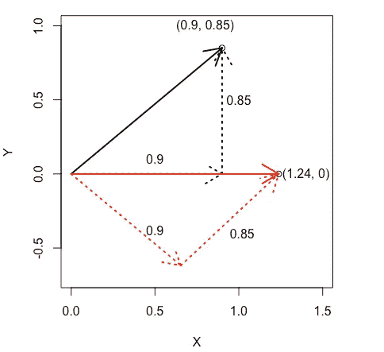

图 2:旋转第一个观察值，使其与水平方向对齐，这将作为新的 X 轴 X’。请注意，旋转角度约为 43.5ᵒ(这是将第一次观察与水平方向完全对齐的角度)。

图 2 描述了旋转第一观察的方法。在我们的原始参照系中的观察值是黑色的，旋转后的结果是红色的(沿原始 x 轴和 y 轴的分量是虚线)。沿着旋转后的观察向量的方向可以作为新的 X 轴，X '，类似于图 1 中看到的，对吧。还记得我们在迂回中看到，我们的数据中的任何观察值都可以使用基数和乘数来构建。这就是看矩阵方程的另一种方法派上用场的地方。让我们看看我们是否可以在这里利用这个想法。

用这个角度(43.5ᵒ)旋转朴素基的给定公式为:

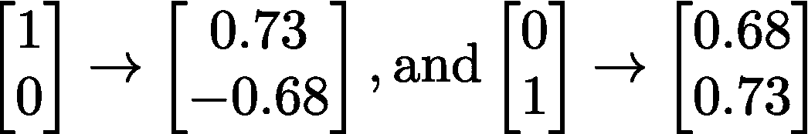

> 我们能利用这种洞察力来计算第一次观测的新位置吗？

是啊！我们已经知道使用向量(1，0)和(0，1)创建第一个观察值的方法:使用乘数 0.9 和 0.85 将它们组合起来。因此，第一次观察的新位置是使用相同的乘数简单地组合变换的基向量，

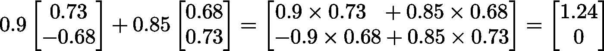

如果您想知道如何对原始 x 轴和 y 轴的变换向量使用相同的乘数，请查看图 2，注意所有东西都旋转了相同的角度。

这只是一个观察，如果我们有一个简洁的方法来描述所有 100 个观察，不是很好吗？事实证明这是迂回路线的简单延伸，

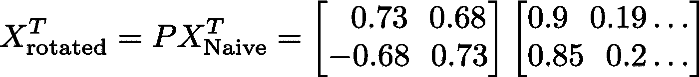

希望现在您已经看到发生了什么以及为什么会这样:要旋转我们数据集中的任何观察值，我们需要使用观察值的相应乘数来组合上面转换的 x 轴和 y 轴向量。换句话说，p 是一个矩阵，它通过 43.5ᵒ旋转一个向量，并将我们的数据集从原始参照系(图 1，左)带到一个更好的参照系(图 1，右)。

让我们稍微概括一下这个想法。在观察我们的观察图的激励下，我们决定旋转可能是一个很好的转换选择，可以帮助我们找到一个更好的参考框架来研究我们的问题。原来对于这样的变换有很多可用的选择，比如[旋转](https://en.wikipedia.org/wiki/Rotation_(mathematics))、[剪切](https://en.wikipedia.org/wiki/Shear_mapping)、 […](https://en.wikipedia.org/wiki/Linear_map#Examples_of_linear_transformation_matrices)一个自然的问题是如何挑选最好的？我们将在接下来的部分尝试回答。

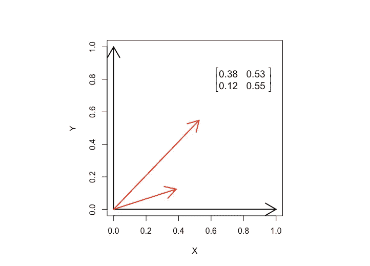

图 3:对矩阵 P 的任意选择将原始参考系转换成一个新的参考系(红色)

需要注意的重要一点是，通过改变矩阵 P 中存储的数字，我可以生成新的变换。图 3 显示了一个例子。我生成了一个随机的 2 x 2 矩阵，产生的转换用红色表示。虽然这不是一个直观的选择，但红色向量一起形成了一个基础:任何二维向量都可以使用这些向量的组合来构建。

> **总结**:将大小为 p *x* p 的矩阵乘以我们的大小为 p *x* n 的数据矩阵(其中 p 是维数)改变了参照系，或者更正式地可以称为**基的改变**。

# 主成分分析

前几节的观点使我们能够对我们的最终目标提出更好更精确的问题，

*   基础有什么好的选择？
*   如何最小化噪音或冗余？

我们将在调查第二个问题的过程中回答第一个问题。我们可以对数据做出的一个合理的 ***假设*** 是，与信号相比，测量噪声较低(否则数据噪声太大，无法得出任何有用的结果)，换句话说，这与说噪声方差< <信号方差相同。这一假设为我们提供了一种数学求解第二个目标的方法，即我们可以最大化方差来识别信号。回想一下，我们在图 1 的 spring 实验中看到这个假设成立(右图，与 x 方向相比，y 方向的方差非常小)。

假设矩阵 *X* 是我们有 *n* 个观测值的数据，每个观测值有 *p* 个维度。为了最大化数据的方差，我们首先需要计算数据的方差。每个 *p* 维度代表一个可能的方向，我们的数据可能会沿着这个方向变化，即存在方差。因此，数学上描述数据方差的一种自然方式是[协方差矩阵](https://en.wikipedia.org/wiki/Covariance_matrix)，

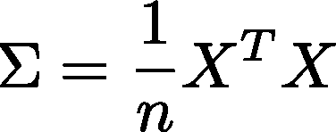

前提是数据以平均值为中心。该矩阵的对角元素表示沿每个维度的方差，非对角元素是协方差。注意σ是一个方阵( *p* x *p* )并且是对称的:协方差(X，Y) =协方差(Y，X)。

基于我们的目标(以及来自 spring 实验的直觉)的好的协方差矩阵将具有大的对角元素和小的(最好是零)非对角元素。这是因为两个原因，

*   我们假设我们的数据具有低噪声。因此，最大方差方向包含感兴趣的信号。
*   理想的基础是在独立的(/垂直)方向上分解数据，类似于图 1(右)，以揭示任何隐藏的结构，这相当于协方差等于零。

这给了我们一个我们正在寻找的模板矩阵，即最好是一个对角矩阵。现在，剩下的就是找到这样一个矩阵。让我们通过一个简单的例子来建立一些直觉。

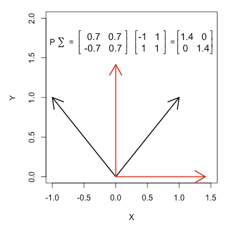

图 4:并排堆叠的黑色向量代表 2x2 协方差矩阵，当乘以“右”矩阵 P 时，将它们转换为红色向量，即对角矩阵

在图 4 中，我们得到了一个 2 x 2 的协方差矩阵(用黑色向量表示)。从这个例子中我们看到，选择“正确的”矩阵 P 会将协方差矩阵转换为对角矩阵(由红色向量表示)。因此，将给定的矩阵转换成对角矩阵是一个寻找正确的基础(或参照系)的问题。

有许多方法(/潜在基)对角化协方差矩阵，PCA 基于一种简单的方法:**假设**所有方向(形成基)相互垂直。然后，对角化协方差矩阵将涉及广义旋转(在 2D，这将类似于图 4)。

最后，我们有一个用于主成分分析的**算法**，

*   在最大方差中选择方向，称之为 d₁
*   接下来，选择方差最大的垂直于 d₁的方向，称之为 d₂
*   依此类推……我们可以计算出构成基础的方向
*   以矩阵的形式收集基，并将其乘以原始数据会导致基的变化

在 spring 实验(图 1)中，该算法会将 d₁识别为沿 x '的方向，将 d₂识别为 y '。得到的一组方向{d₁、d₂……}是*主成分*，这些成分中每一个的重要性都与这些方向中每一个的数据可变性相关联。最后，我们在改变*基础*后获得的结果矩阵代表了我们在这些主成分方面的数据(见图 1 右侧和基础改变部分)。

我们上面发现的算法是形成 PCA 的步骤的粗略轮廓。主要步骤(协方差矩阵的对角化)是线性代数中一个研究得很好的问题，有两个主要的分解来做这件事:[特征值分解](https://en.wikipedia.org/wiki/Eigendecomposition_of_a_matrix)，和 S [奇异值分解](https://en.wikipedia.org/wiki/Singular_value_decomposition)。PCA 的实际实现使用这些分解技术中的任何一种。

> **总结** : PCA 把我们的数据转换成一个新的基，这个基是由相互垂直的方向定义的，叫做主成分，沿着主成分方差最大化，每个方向的重要性都与该方向数据的方差相关联。

# 例子

我将使用[这个数据集](https://archive.ics.uci.edu/ml/datasets/Beijing+Multi-Site+Air-Quality+Data)作为例子。该数据集包含北京 12 个国控空气质量监测点每小时的空气污染物数据。我将只使用其中一个网站的数据(Data _ 数据 _ 万寿西工 _ 2013 03 01–2017 02 28 . CSV)。各种维度(/特征)是空气中常见污染物的浓度，如 SO₂、NO₂、一氧化碳、O₃、不同大小的颗粒物、环境空气条件，如温度、压力、[露点温度(与空气密度密切相关)](http://ww2010.atmos.uiuc.edu/(Gh)/guides/maps/sfcobs/dwp.rxml)、风速和一天中的时间。这些尺寸可能是由环境监测中心的专家根据他们的领域知识选择的，并使用传感器进行测量(会有一些测量噪声)。数据集有 32，829 个观察值和 15 个维度。

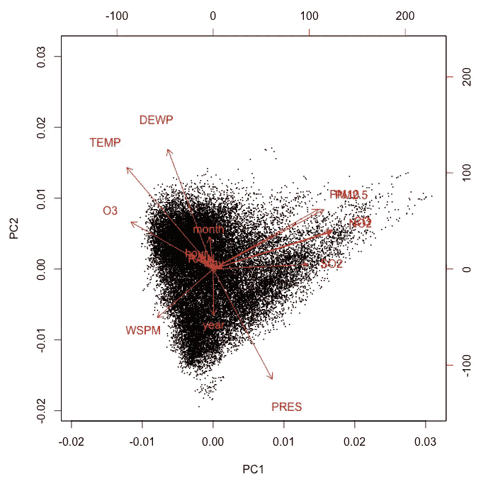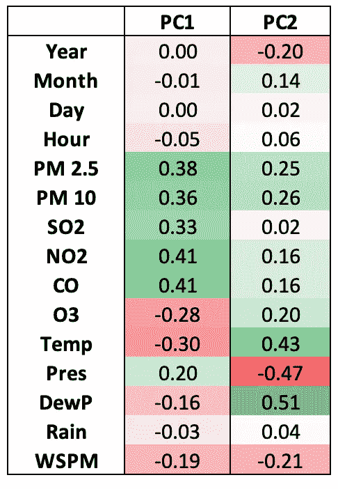

图 5:PC1-PC2 平面数据集的散点图。(右)沿 PC1 和 PC2 方向投影的尺寸的投影表(/乘数)

图 5 显示了数据集在由两个主要成分 PC1 和 PC2 定义的平面中的散点图。PC1 和 PC2 是两个最重要的主分量，即分别与最大和第二大方差方向相关联。我们的数据集中的每个观察值都是 15 维的，并沿着 PC1 和 PC2 投影，这在图中有精确的描述(图 5)。散点图中的红色箭头表示相对于两个主要成分的原始尺寸。对应于两个主分量的方向向量在右边的表中给出。

我们已经可以从这些方向看到一些有趣的东西。在 PC1 方向，我们看到 PM2.5、PM10、SO₂、NO₂、CO 等污染物与 O₃、温度、露点压力、风速呈负相关。换句话说，随着温度和风速的下降，污染物的浓度增加，这是有道理的，因为在较低的温度下，由于重力的作用，分子倾向于沉降到更靠近地球表面的地方，而较小的风意味着空气分散更少(更高的压力、浓度……)。我们可以看到的另一件有趣的事情是臭氧(O₃)与所有其他污染物的负相关。虽然距离我最后一次遇到化学反应已经有一段时间了，但稍微挖掘一下就会发现，臭氧化学反应的形成取决于周围的空气条件。例如，在较低的温度下，一氧化碳/ NO₂)is 稳定，但在较高的温度下(即阳光)，[化合物反应形成 O₃](https://en.wikipedia.org/wiki/Tropospheric_ozone#Formation) 。实质上，PC1 是在对比环境空气条件和污染物浓度。

PC2 方向在温度、露点温度和压力之间具有[大的负相关性，这可能与连接这些变量的基本](https://www.omnicalculator.com/physics/air-density)[理想气体定律](https://en.wikipedia.org/wiki/Ideal_gas_law)有关。

我们看到，主成分分析有助于理解和可视化数据集，并为我们提供了一种提取有用信息的系统方法。PCA 并不总是最好的选择，有时还会造成伤害。了解这种技术的局限性是有帮助的，这种局限性是由我们在推导这种技术时所做的一些假设造成的。对于 PCA 的更严格和详细的处理，请查看[原始论文](https://arxiv.org/pdf/1404.1100.pdf)，这真的是非常有趣的阅读。

## 参考

*   [主成分分析教程](https://arxiv.org/pdf/1404.1100.pdf)
*   [线性代数:前沿基础](http://www.ulaff.net/)
*   [高等线性代数:前沿基础](https://www.cs.utexas.edu/users/flame/laff/alaff/)
*   [从初级角度进行高级数据分析](http://www.stat.cmu.edu/~cshalizi/uADA/15/lectures/17.pdf)