# 简易决策树的直观指南

> 原文：<https://towardsdatascience.com/an-intuitive-guide-to-the-humble-decision-tree-fbee2c24751e?source=collection_archive---------58----------------------->

## 用例子和简单的数学解释！

作者图片

# 概观

> 我们如何做决定？
> 
> *定义决策树*
> 
> *它是如何工作的？*
> 
> 我们如何建立一个有效的决策树？

*在我们开始之前，我假设您至少在高层次上理解了回归和分类的概念。如果没有，这里快速总结一下:*

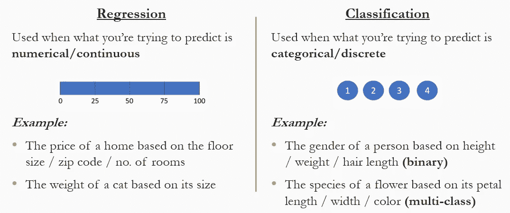

*作者图片*

# 什么是决策树？

1.  一种算法，即**使用树状结构表示一组问题&决策**。
2.  它提供了一个**过程**来决定**问什么问题、问哪个问题以及何时问它们**以预测结果的价值。

# 我们如何做决定？

*在我们深入细节之前，让我们通过两个非常简单的例子来了解我们是如何做决定的…*

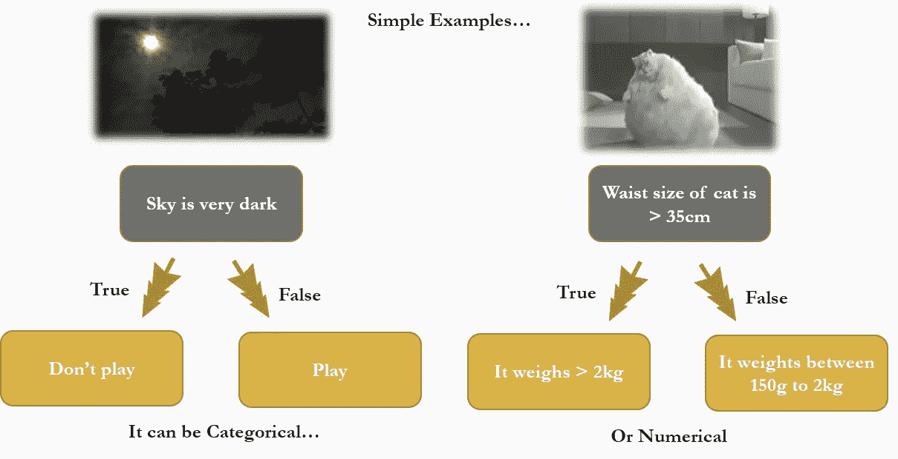

[猫源](https://giphy.com/gifs/cat-fat-AiTAxk2kavgpa/links)

***左>*** *根据天空的颜色，我们决定要不要出去玩一个游戏(绝对决定)。* ***右*** *>根据一只猫的腰围大小，我们决定对它的体重进行粗略的估计(数值决定)。另一方面，那只猫需要一些真正的帮助节食！*

这里有一个更复杂的例子

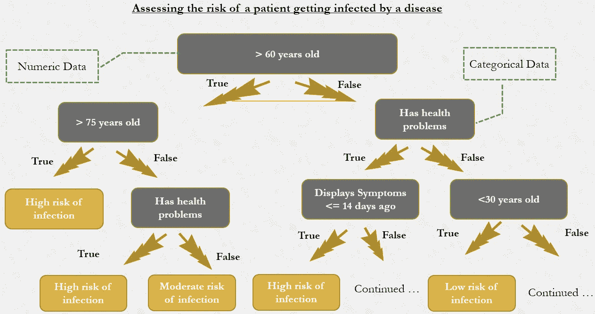

*作者图片*

**>评估患者感染老年人更易患疾病的风险。**以上是一个医生在查看你的个人/健康记录以评估你患病风险时的假设心理模型(尽管是一个简化的模型)

# 行话时间

和大多数算法一样，我们可能会遇到一些术语。这里有一个直观的表示来帮助我们浏览这些术语…

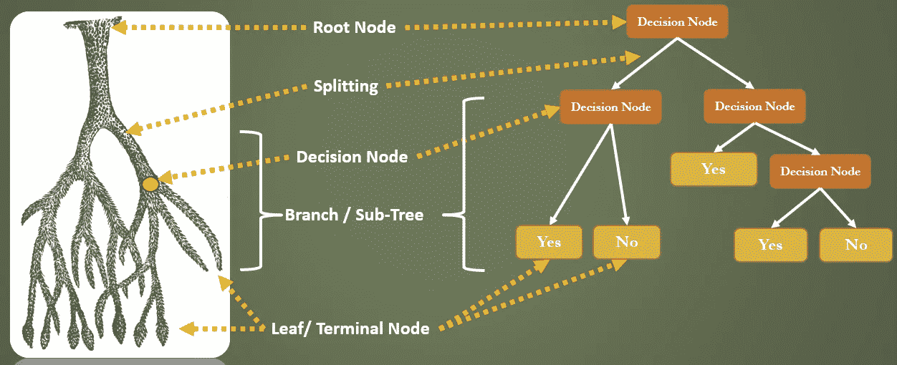

*作者图片*

> **根节点**:数据的整个样本或总体
> 
> **分割:**将一个节点分割成两个或更多子节点的过程
> 
> **决策节点**:有其他子节点的子节点。它们有指向它们的箭头和远离它们的箭头。
> 
> **叶/终端节点:**没有子节点的节点(不进一步拆分)。他们有指向他们的箭头，但没有指向远离他们的箭头。
> 
> **父/子节点:**被分成子节点的节点被称为子节点的父节点，而子节点是父节点的子节点。
> 
> **子树/分支:**树的子部分

既然这个问题已经解决了，让我们看看决策树是如何帮助我们预测问题的结果的！

# 决策树是如何构建的

## **示例数据集**

这个*虚拟数据集*描述了如何使用患者的年龄以及常见的病毒症状(如呼吸困难和胸痛)来预测一个人是否感染了新冠肺炎病。

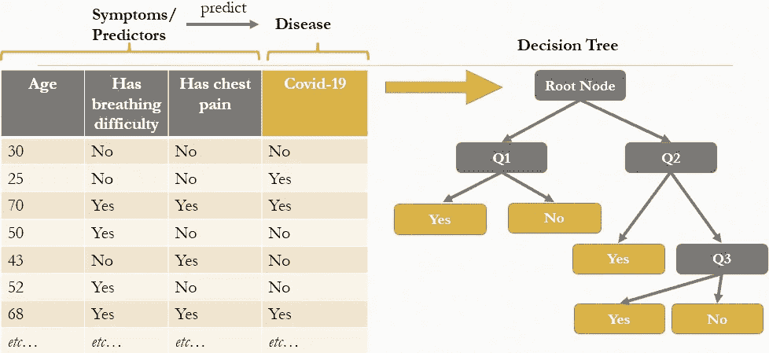

将患者数据集映射到决策树

## 逐步走查

**1。**整个患者数据集被输入到根节点。

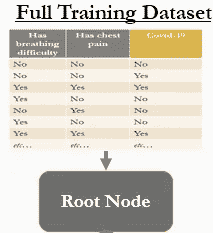

*作者图片*

**2。**询问一个关于患者的问题，并根据答案是对还是错对数据集进行分割/分区。

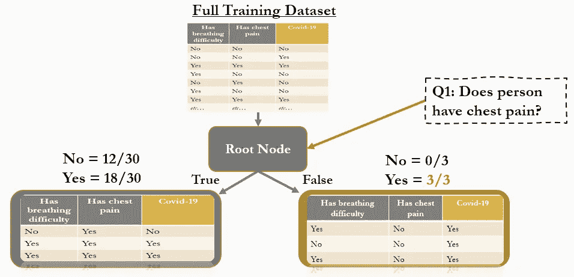

*作者图片*

**3。**在每次分割时，该算法试图确保所得分区中的患者尽可能同质(即每个子节点上的所有病毒阳性或病毒阴性)。如果一个子节点没有被很好地分离，将会询问进一步的问题来进一步分割数据集。

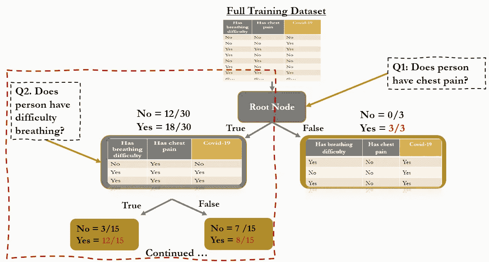

*作者图片*

**4。**该过程继续进行，直到不再有患者可被分割或满足停止标准。

# 建立一棵有效的树的关键

为了建立一棵**有效的树，**有三个重要问题**需要回答:**

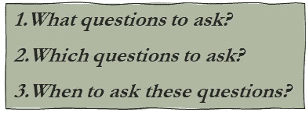

# 问:我们可以问什么问题？

为了获得问题，我们迭代出现在预测值列的每一行中的每个值。每个值都成为用于将数据划分为不同子集的阈值的潜在候选值:

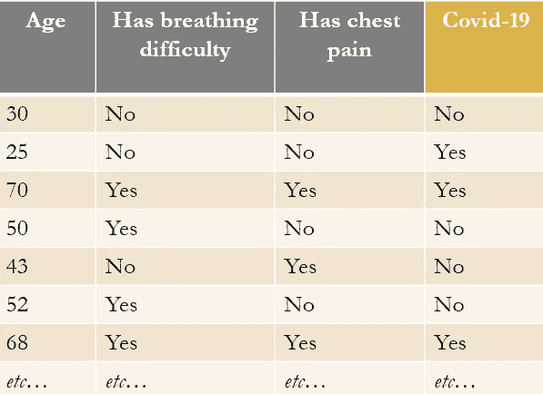

*作者图片*

**潜在问题:**

此人是否超过 60 岁？

此人是否超过 30 岁？

此人是否有呼吸困难？

患者是否有胸痛？

# 问:我们应该问哪些问题？

> **最好的问题最能减少不确定性，并导致最纯粹的叶节点。**

减少不确定性意味着什么？为了理解这一点，让我们在决策树的叶节点上看下面两个例子:

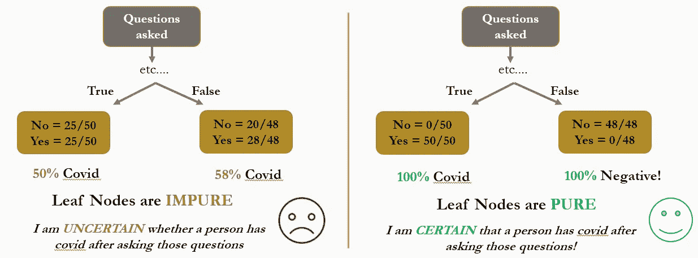

*作者图片*

在左侧，每个叶节点包含具有和不具有新冠肺炎的个体的混合物，即**不纯**。如果我们将*左叶节点*中的个体分类为阳性，则被正确分类的概率**仅为 50%** ，因为它仅包含 25/50 的 covid 阳性个体。

在右侧，决策树的每个叶节点是完全同质的(50/50 covid 为正，48/48 covid 为负)，即**纯**。如果我们将*左叶节点*中的个体分类为阳性，则被正确分类的概率是 **100%** ，因为它仅包含 covid 阳性的个体。

**因此，*具有更纯的节点增加了被正确分类的机会，并减少了决策结果的不确定性。***

# 问:如何量化节点中的不确定性/杂质？

有几种方法可以量化杂质，但我们现在只谈两种:

1.  **Gini 杂质** —量化一个节点中有多少杂质*(越低越好)*
2.  **信息增益—** 量化一个问题在多大程度上解混了节点中的标签/减少了不确定性*(越高越好)*

## 基尼杂质

> *公式:***1——概率(“正结果”)^2——概率(“负结果”)^2**

**将该公式应用于我们的示例，如果我们的第一个问题是“有胸痛”，我们将得到以下输出:**

**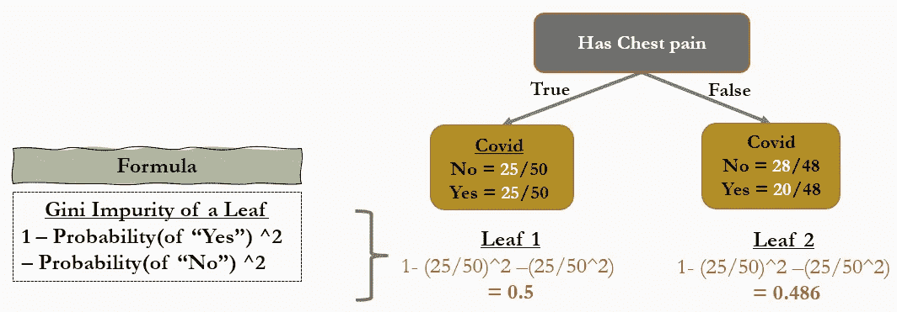**

***作者图片***

**为了计算“有胸痛”的总基尼系数，我们取两个叶基尼系数的加权平均值如下:**

**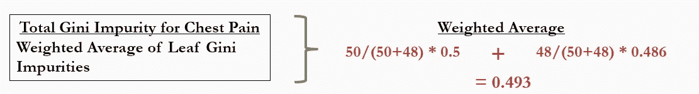**

***作者图片***

## **信息增益**

> **公式:起始基尼系数——问题的平均加权基尼系数**

**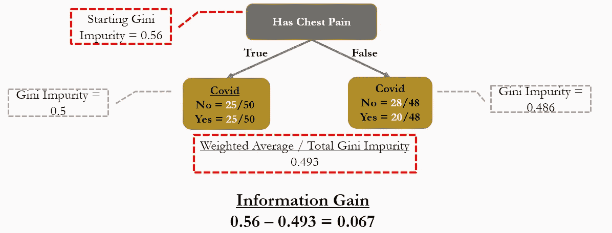**

***作者图片***

**获得最多信息的问题将是最好的问题，即越高越好！**

# **问:什么时候应该提问？**

**既然我们已经了解了基尼系数，我们可以用它来帮助我们决定…**

## ****决策树的**开始**问题，即在根节点****

**为此，我们只需计算每个候选问题的总基尼系数，然后选择基尼系数最低的问题:**

**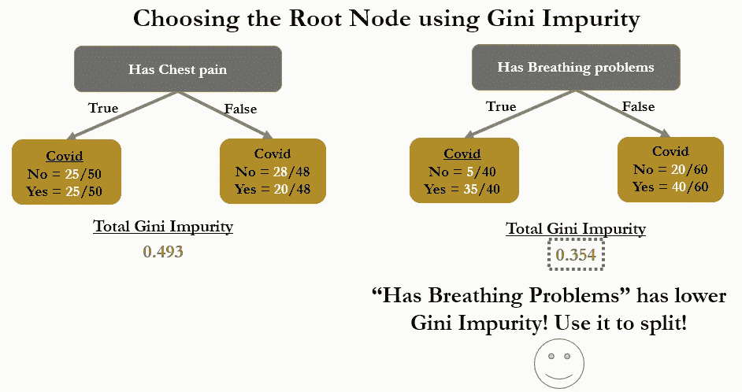**

***作者图片***

## ****什么时候拆分一个节点或者使一个节点成为叶节点？****

**为此，我们执行以下步骤:**

1.  **计算潜在叶节点的基尼系数。**
2.  **通过另一个问题进一步拆分节点，计算总基尼系数。**
3.  **比较两个基尼系数杂质，并选择导致基尼系数杂质较低的行动。**

**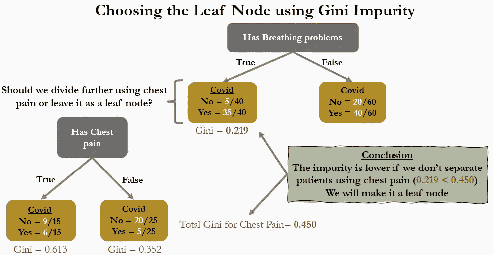**

***作者图片***

**在这种情况下，我们将使所讨论的节点成为叶节点，因为分裂会导致更高的 Gini 杂质。**

# **问:如何在叶节点做出决策？**

**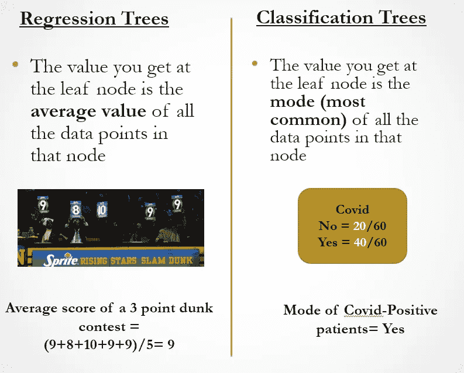**

**[*扣篮大赛图片来源*](https://cdn.vox-cdn.com/thumbor/CABufmH4AYI2RxD_5dNt1qIKmME=/0x0:3063x2048/1820x1213/filters:focal(1280x778:1770x1268):format(webp)/cdn.vox-cdn.com/uploads/chorus_image/image/58724411/1844167.jpg.0.jpg)**

****暂时就这样吧！希望你喜欢这个关于决策树如何工作的简单解释:)****

# **关于作者**

**Ranon 是 NCS 的数据科学家，他使用高级数据分析和机器学习来解决问题。他在自愿的基础上教授数据分析概念，并且是 ML @ Georgia Tech 的非全日制硕士学生。**

**在空闲时间，他喜欢烘焙和了解金融市场。他的人生格言是保持谦虚，不断学习:)**

**如有任何问题，请随时通过 [LinkedIn](https://www.linkedin.com/in/ranon-sim) 联系我。只要我有时间，我很乐意回答你的问题！**