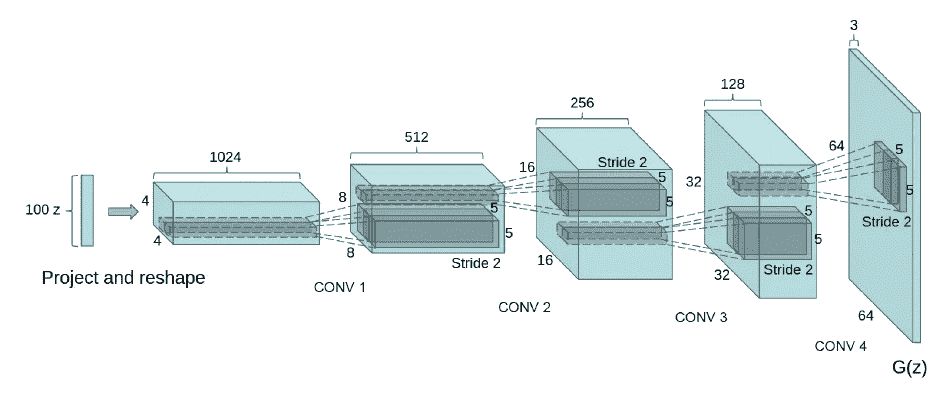
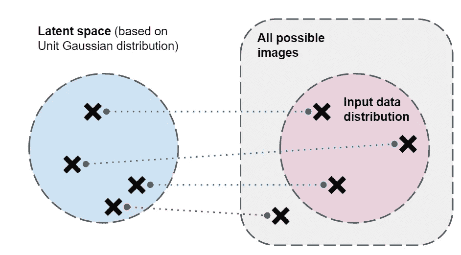
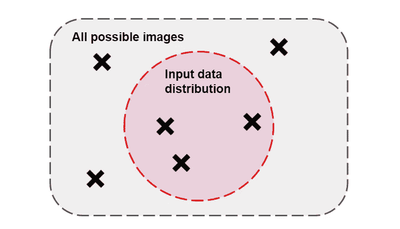

# 对 GANs 的直观了解

> 原文：<https://towardsdatascience.com/an-intuitive-look-at-gans-1aa35e27cb52?source=collection_archive---------39----------------------->

## 学习 GANs 如何工作背后的直觉，而不需要复杂的数学方程。

马里奥·高在 [Unsplash](https://unsplash.com?utm_source=medium&utm_medium=referral) 上的照片

# 介绍

自 Goodfellow 等人于 2014 年在 [NIPS](http://papers.nips.cc/paper/5423-generative-adversarial-nets) 推出 GANs(生成对抗网络)以来，GANs 已经在深度学习和计算机视觉领域掀起了风暴。GANs 的主要思想是同时训练两个模型；一个生成器模型 ***G*** 基于随机噪声生成样本，另一个鉴别器模型 ***D*** 确定样本是真实的还是由 ***G*** 生成的。

这篇文章将介绍 GANs 工作背后的直觉，而不会过多地钻研损失函数、概率分布和数学。重点是对 GANs 如何运作有一个很好的顶层理解。鉴于 GANs 越来越受欢迎，重要的是任何人都能够在不预先加载太多复杂信息的情况下开始他们的深度学习之旅！对于完整的解释，[约瑟夫·罗卡](https://medium.com/@joseph.rocca)有一大篇[T21 一篇](/understanding-generative-adversarial-networks-gans-cd6e4651a29)关于它！

训练 GAN 框架类似于两个玩家的最小-最大游戏。 ***G*** 不断改进，生成更逼真、质量更好的图像。 ***D*** 提高了确定图像是否由 ***G*** 创建的能力。训练 GAN 可以完全通过反向传播来完成，这极大地简化了训练过程。通常，通过从 ***G*** 到 ***D*** 的定期切换来执行训练，以防止两个模型中的巨大性能差距。

# 发电机模型

发生器模型通常由一系列上采样和卷积层组成。一种常见的架构是 DC(深度卷积)-GAN 网络，由[亚历克·拉德福德](https://arxiv.org/search/cs?searchtype=author&query=Radford%2C+A)等人在 [ICLR 2016](https://dblp.org/db/conf/iclr/iclr2016.html) 上展示。DCGAN 框架可以在下面找到。如果你见过其他常见的 CNN 框架，GAN 结构非常类似于标准的 CNN 分类器，只是它是水平“翻转”的。

来自 https://arxiv.org/abs/1511.06434[的 DCGAN 架构](https://arxiv.org/abs/1511.06434)

提供给发电机网络的输入在图中标记为“100z”。这意味着采样了 100 个点，创建了长度为 100 的潜在向量。“z”还表示这些点是从单位正态分布中取样的。因此，我们可以将生成器网络视为执行从潜在空间到训练数据的映射的函数。

我们可以把潜在空间(100 维)想象成基于高斯分布的固定分布。生成器网络从这个潜在空间中随机采样点，并将其映射到图像空间(64 x 64 x 3 维)。在所有可能图像的空间中，存在描述在输入训练数据中找到的图像的更小的子空间。鉴别器将对生成器进行处罚，因为它通过对抗性损失函数创建了不属于训练数据分布(非“真实”)的图像。

生成器的映射功能，由作者生成图像

# 鉴别器模型

鉴别器通常具有类似于标准 CNN 分类器的框架，例如 VGG。鉴别器的目的是学习根据图像是来自训练数据还是由 ***G*** 生成来将输入图像分类为真实或虚假。看下图，鉴别器的目的是学习红色虚线。因此，它将能够根据该输入数据分布来分类真实和伪造的图像。如果提供的图像位于红色空间之外，它们将被归类为“假的”。

鉴别学习，作者图片

# g 和 D 串联

在 GAN 框架中， ***G*** 和 ***D*** 模型必须一起训练。这两种模型的改进最终会产生更好、更真实的图像。一个好的鉴别器模型可以完美地捕捉训练数据分布。这允许发生器具有良好的“参考”空间，因为发生器的训练高度依赖于鉴别器输出。

如果鉴别器没有很好地捕捉到训练数据分布，生成的与训练图像不相似的图像将被归类为“真实的”,这将降低模型性能！

# 限制

很明显，这个简单的 GAN 框架只能产生类似于训练数据分布的图像。因此，需要大量的训练数据！此外，甘的训练还有许多障碍。一个常见的问题是模式崩溃，即生成器模型学习将多个潜在向量映射到一个单独的图像。这极大地影响了 GAN 框架的多样性。

# 结论

近年来有许多解决这些问题的 GANs 的变化和发展。其中包括改进的损失函数和为特定任务定制的专门框架，如超分辨率或图像到图像的翻译。