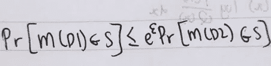

# 差异隐私的直观视图

> 原文：<https://towardsdatascience.com/an-intuitive-view-of-differential-privacy-261e3f1c30d9?source=collection_archive---------53----------------------->

## 这篇文章将用最简单的数学直观地解释不同的隐私。

差异隐私的一个例子。作者图片

我猜想，当我们第一次接触“怪异”的数学定义时，我们大多数人在学习差分隐私时都会遇到困难。

图像由[3]定义 2.4。

当我第一次读到差分隐私(DP)的论文时，我正在努力理解它的含义。看了一些关于差分隐私的技术帖子，终于，我明白了它是什么。在这篇文章中，我将跳过 DP 中的所有其他定义(如敏感度),只解释 DP 的直观视图。

# 什么是差分隐私？

我先介绍一下什么是差分隐私(DP)。给定一个查询函数 f，它从给定的数据库 d 中检索用户的吸烟人数。

> D = [0，1，1，1]其中 0 代表不吸烟，1 代表吸烟。
> 
> f(D) = 3

现在，给定两个数据库 D1 和 D2，仅相差 1 条记录(D1 和 D2 相邻)，这意味着 D1 是[0，1，1，1]，f(D1) = 3，D2 是[0，1，1]，f(D2) = 2。你可以认为 D2 已经被更新，最后一条记录已经被删除(例如，由于用户删除了他的帐户)。

现在，让我们假设攻击者想要从数据库 D1 中检索一些私人信息。攻击者知道谁已经删除了他的帐户(例如，攻击者知道 Bob 从一些服务中删除了他的帐户)，但是攻击者希望知道 Bob 是否是吸烟者(他可能想要对 Bob 做坏事)

昨天，攻击者查询系统得到一个结果，即 f(D1) = 3。今天，鲍勃删除了他的帐户，D1 变成了 D2，攻击者再次运行查询(假设没有其他新信息)，即 f(D2) = 2。

现在，攻击者知道 Bob 是一个吸烟者，因为他可以通过这样做获得信息

> 鲍勃是一个吸烟者= f(D1)-f(D2)= 3–2 = 1，其中 1 代表以上定义的吸烟。

这就是“差分”隐私，我们可以通过旧的查询结果和新的查询结果之间的差异来获得隐私信息**。**

## 数学定义(只是直观地解释)

我在这里举了个例子[1]来解释 DP 的数学定义。

首先，为了理解 DP，我们可能需要知道 KL 散度[6]在做什么。KL 散度是衡量两个概率分布之间的距离。较高的 KL 散度表示两个概率分布更远(重叠较少)，较低的表示更近(重叠较多)。

KL 散度的公式，顶部为离散分布，底部为概率分布。作者图片

你可以通过两个分布 P 和 q 之间的重叠程度来理解 KL 散度

现在，让我们回顾一下 DP 的一般数学定义，如下所示:

DP 的一般数学定义，以 D1 和 D2 为例。“S”是输出的集合，我们现在只假设这个 S 是一个实数 R(数学上可能是错误的，但足以直观地理解)。作者图片

乍一看这个公式，我无法解读。看了几个帖子和解释，特别是来自[1]的，现在理解了解释。我们还需要看看 KL 的背离(见本书[3]第 3.5.1 节)。

两边除以 Pr[M(D2)..s】。作者图片

通过放置自然对数来移除指数。作者图片

这种形式似乎很熟悉，不是吗？它类似于 KL 散度的公式，有一个概率分布 P 除以另一个概率分布 Q，在我们的例子中，P(x) = Pr[M(D1)]，Q(x) = Pr[M(D2)] (M 稍后解释)。KL 散度是不对称的，也就是说 P(x)/Q(x)和 Q(x)/P(x)是不一样的，但是在 DP 这里我们不关心不对称。

DP 希望将确定性输出更改为概率分布。

查询函数 f 的确定性输出“吸烟者的数量”表示吸烟者的数量。作者图片

查询结果的概率分布。作者图片

因此，通过向查询结果添加由ε值限制的噪声(常见的噪声类型是高斯和拉普拉斯)，可以找到新的随机化查询函数 M。

> STD(ε)是一个基于ε计算标准差的函数，现在我只是假设这个函数可以计算理论上正确的标准差。
> 
> M(D) = f(D) + N(0，STD(ε))其中 N 是高斯噪声。
> 
> 然后，查询结果不再是纯粹的 2 或 3。
> 
> f(D1) = 3 #原旧查询
> M(D1) = 3+(-0.8) = 2.2 #第一个旧查询
> M(D1) = 3+(0.7) = 3.7 #第二个旧查询
> 
> f(D2) = 2 #原新查询
> M(D2) = 2+(0.7) = 2.7 #第一次新查询
> M(D2) = 2+(-0.4) = 1.6 #第二次新查询

现在我们只是得到了吸烟者的“大概”数量，有一个正确的概率(例如 70%)。

因此，当我们试图通过新旧查询之间的差异来获取私人信息时，我们只能知道 Bob 可能是吸烟者，也可能不是。

D1 和 D2 的概率输出。作者图片

如果两个概率分布重叠(P(M1)/P(M2) = 1，ln(1)< =ε0)，那么，攻击者就不知道鲍勃是不是吸烟者。因为 P(M1)与 P(M2)生成相同的输出，所以攻击者无法区分结果。虽然这样可以防止信息通过差异泄露，但是也会影响查询功能的质量。更多的噪声(更小的ε，最小为 0)导致好的私密性和差的质量，更少的噪声(更高的ε)导致差的私密性和好的质量。因此，epsilon 是一个随机查询函数的“隐私预算”,它控制着为了保护数据库隐私你可以放弃多少质量。

# 结论

DP 意味着我们可以通过一个旧查询和一个新查询之间的差异来获得一些私人信息。DP 可以通过 KL 散度来理解，将查询函数改为随机化函数，可以避免隐私信息立即泄露。

然而，**更多次的查询仍然可能泄露隐私信息**(在他们得到查询的意思之后)，这又涉及到很多新的概念，比如隐私花费(例如 TensorFlow DP optimizer 或 PyTorch Opacus PrivacyEngine 中的隐私会计师)来阻止用户查询系统。

一旦我理解了更多的 DP 概念，如隐私支出或 epsilon-differential private，我会写更多直观的解释。希望这篇文章能帮助你直观地理解什么是 DP。

以下是我了解 DP 的资源。

[1]https://zhuanlan.zhihu.com/p/139114240

[2]https://zhuanlan.zhihu.com/p/61179516

[3][https://www.cis.upenn.edu/~aaroth/Papers/privacybook.pdf](https://www.cis.upenn.edu/~aaroth/Papers/privacybook.pdf)

[https://www.sohu.com/a/252919825_354899](https://www.sohu.com/a/252919825_354899)

[5][https://towards data science . com/understanding-differential-privacy-85ce 191 e198 a](/understanding-differential-privacy-85ce191e198a)

[6][https://towards data science . com/light-on-math-machine-learning-intuitive-guide-to-understanding-KL-divergence-2b 382 ca 2 B2 a 8](/light-on-math-machine-learning-intuitive-guide-to-understanding-kl-divergence-2b382ca2b2a8)