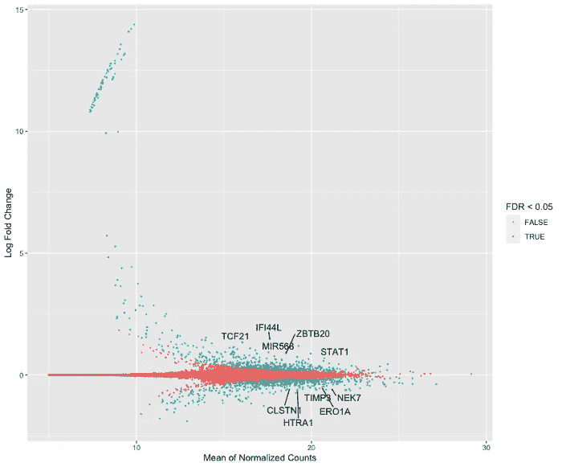

# 真理之岛

> 原文：<https://towardsdatascience.com/an-island-of-truth-f789eaad314?source=collection_archive---------79----------------------->

汤姆·温克尔斯在 Unsplash 上的照片

## [来自脸书和 Airbnb 的实用数据建议](/an-island-of-truth-practical-data-advice-from-facebook-and-airbnb-a0d9c355e5a0)

由[詹姆斯·梅菲尔德](https://medium.com/u/4d693169151a?source=post_page-----f789eaad314--------------------------------) — 9 分钟阅读

我承认……我不止一次发现自己在生产、出版和公开不正确的数据。我不记得我是如何找到这些数据的——也许我在我的数据湖或数据仓库中运行了一个 SHOW TABLES 命令，得到的结果是*听起来*合法。

照片由克利福德摄影在 Unsplash

## [使用 Python 对股票和加密货币进行均值-方差分析](/cryptocurrencies-the-new-frontier-part-1-940e787c7ab9)

乔纳斯·本纳 — 16 分钟阅读

加密货币多年来一直是一个热门话题，这是有充分理由的。对一些人来说，它们是一个黑匣子，对另一些人来说，它们是金融不可避免的未来。不用说，任何人，只要花了至少一部分时间和金钱投资股票和其他资产，近年来都会考虑投资这种新颖的资产类别。

图由麦迪逊井上 Pexels

## [研究基于内容的新闻源过滤](/researching-content-based-filtering-for-news-feeds-17954b1865d7)

由 [Michel Wijkstra](https://medium.com/u/d43acc8ec018?source=post_page-----f789eaad314--------------------------------) — 14 分钟读取

随着新闻消费日益数字化，新闻平台不得不努力转移和保留他们的用户群。维持和增加任何数字平台的用户群的一个行之有效的方法是应用个性化技术。

作者图片

## [如何开始学习生物信息学而不被吓倒(带 R)](/how-to-start-learning-bioinformatics-and-not-get-intimidated-with-r-b4b6a2450212)

通过 [Lathan Liou](https://medium.com/u/a28e6c477cc8?source=post_page-----f789eaad314--------------------------------) — 7 分钟读取

这篇文章的目标读者是那些希望“闯入”生物信息学领域并且有 R(理想情况下使用 tidyverse)经验的人。生物信息学可能是一个听起来很可怕的概念(至少对我来说是这样)，因为它是一个如此广阔和快速发展的领域，以至于很难准确定义它是什么。