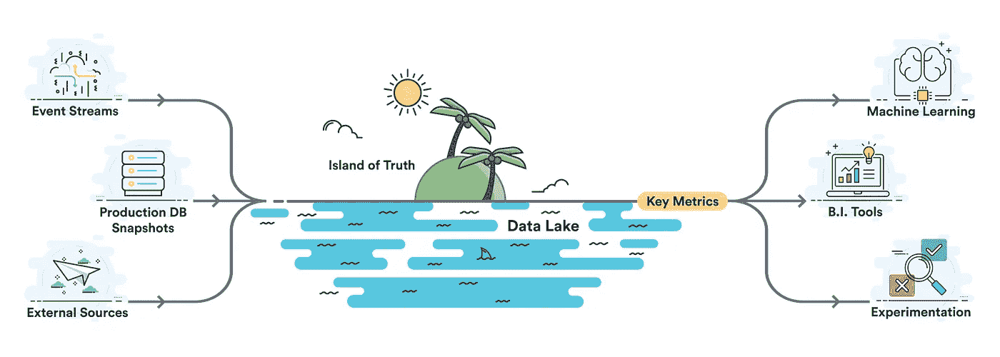
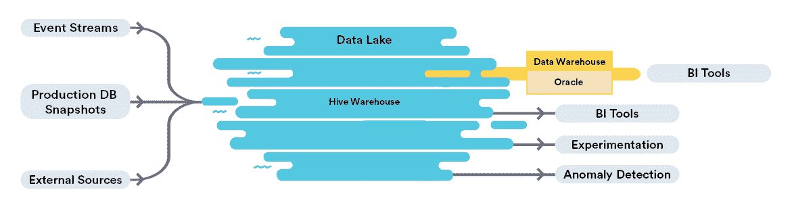
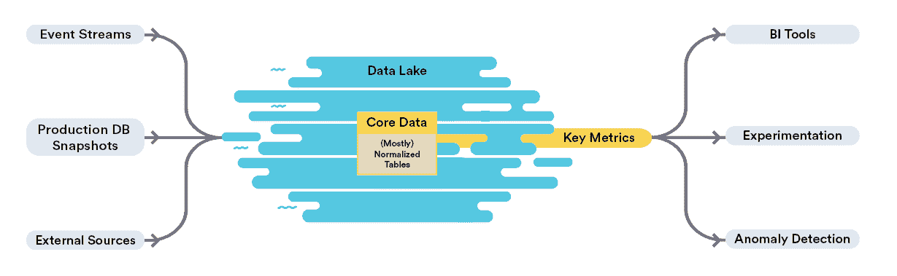
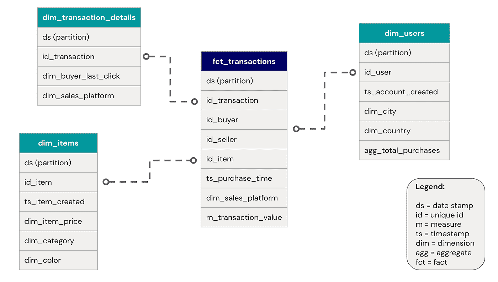

# 真实之岛:来自脸书和 Airbnb 的实用数据建议

> 原文：<https://towardsdatascience.com/an-island-of-truth-practical-data-advice-from-facebook-and-airbnb-a0d9c355e5a0?source=collection_archive---------9----------------------->

## 在贵公司构建核心数据集的操作指南。探索数据湖、仓库、表模式和指标的概念。

我承认……我不止一次发现自己在生产、出版和公开不正确的数据。我不记得我是如何找到这些数据的——也许我在我的数据湖或数据仓库中运行了一个 SHOW TABLES 命令，得到的结果是*听起来*是合法的。或者，也许我在仪表盘上找到了一个参考栏，而这个参考栏*似乎*正是我需要的。也许我试图找到几个月前创建汇总表的人，却发现他们已经离开了公司。

有一次，当我运行一个查询并广泛地分享一些数据时，当一位高管发电子邮件问我“嘿，你从哪里得到这个的时候，我的心沉到了谷底。您的经理刚刚说这个指标高出了 24%。”这些太普通的故事中令人痛苦的部分，也是我感受最深的部分，是**对数据的信任被打破了**。

> "不是你对我撒谎，而是我不再相信你，让我动摇了."——弗里德里希·尼采

# 这篇博客文章让我们深入了解了脸书和 Airbnb 的数据，并就如何建立一个值得信赖的数据生态系统提供了实用的建议。

## **脸书的数据**

早在 2008 年我在脸书工作时，我的正式职位是增长团队的数据分析师。作为一个兼职项目，我亲自教 550 名同事如何编写他们的第一个 SQL 查询。这是一次很棒的经历，我的同事喜欢这种了解数据的感觉。脸书刚刚开发了 Hive，为了帮助它被采用，我主动创建了这些介绍类。

一旦我的同事掌握了 SELECT 和 FROM 的基本知识，他们问的第一个问题是“我如何找到我需要的数据？”这是一个很难回答的问题。我们有大量具有相似名称和不同相关程度的数据表。作为他们的老师，我不想给别人指错桌子，但是我怎么知道哪张桌子是正确的呢？

是 dim_user、dim_users 还是 dim_users_extended？即使我设法将它们指向正确的表，我也不知道如何查询它以生成准确的指标。例如，dim_users 表上的简单 COUNT(*)将返回比我们报告的活动用户数更大的数字。事实证明，如果我没有过滤掉 user_type=-1 并设置 active_30d=1，那么我的结果将是完全错误的。

这个度量定义警告是一个大问题，当我的同事得出不正确的结果时，他们会感到沮丧和尴尬。我发现这些度量问题非常具有挑战性，因此我的新公司 Transform 正在开发工具和框架，以帮助公司正确定义和分类他们的关键绩效指标。

***脸书建筑示意图***

**注意 BI 工具引用两个不同数据系统的潜在问题。*

## **Airbnb 的数据**

2014 年，当我离开脸书加入 Airbnb，担任数据基础设施和数据工具项目经理时，我发誓要在这个问题变得制度化和棘手之前解决它。乍一看，Airbnb 的数据湖已经看起来非常令人生畏，有数千个表和近 1pb 的数据。老实说，这很危险。

由于一些早期的基础架构挑战(我在这里写的)，组织对数据的信任度很低。对于重要的数据表和关键指标，我们缺乏可信的、单一的真实来源。几乎所有的分析见解都是由少数几个特定数据领域的数据科学家产生的，这些人整天被问题轰炸。如果这些数据科学家中的一个离开了公司，展开他们迷宫般的管道来寻找定义他们指标的实际 SQL 将是一场噩梦。

虽然早期存在一些挑战，但我们仍然致力于解决这个问题，因为我们认识到创建可信、准确数据集的真正潜力。不过，这项工作的风险很高。**如果我们没有建立对数据的信任，公司将会在大数据基础设施、提高生产力的数据工具和技术数据科学人员上浪费数百万美元。当危险无处不在时，我们如何重建对数据准确性和正确性的信心？**

***Airbnb 架构图***

**我们将核心数据放在数据湖的中心，这样它就可以与所有其他数据资产相结合，减少了在不同系统之间保持数据集同步的负担。*

## **创造真理之岛**

我们的答案是将“核心数据”构建为我们大数据湖中的极乐真理岛。一片阳光明媚的绿洲，远离鲨鱼出没的水域。其核心数据是一组基于实际主题领域的事实表和维度表。当我们最初构建它时，我们与公司的领域专家一起工作来解开用于生成表格的逻辑，然后与不同部门的利益相关者一起验证度量定义。收入、发送的消息和创建的列表等事实很容易与地区、语言和列表类型等维度结合起来。

通过删除表中许多危险的细微差别并发布优秀的元数据，我们降低了 SQL 新手的入门门槛。我们的团队致力于确保表格始终准确、完整、可靠、相关、独特、可发现和及时。凭借这些品质，我们赢得了客户的信任，然后通过我们在交付高质量数据集方面的一致性来加强这种信任。

一旦真理岛建立起来，我们就将核心数据作为数据教育工作的核心。Airbnb 的新用户可以放心地开始他们的数据之旅，因为他们知道这些表格是值得信赖的。教授数据课现在是一种绝对的快乐！员工可以自助服务，减轻数据科学家和数据分析师回答简单问题的负担。

***例证图式为一座真理之岛***

*许多事实表(fct_*)要求财务报告具有高度的准确性，因此我们从生产数据库快照中获取它们。我们可以用点击流日志的维度来丰富这些事实，这些维度更能容忍小错误或损失。

# *接下来的几节将提供其他公司如何开始创建自己的真理岛的学习。*

## **我们应该在哪里构建它？**

要创建一个真理岛，您需要在您的数据生态系统中开辟一个安全的地方，让您的内部客户可以轻松访问。它需要能够足够快地运行查询，以鼓励探索和连接数据集。在脸书，我们通过将我们的 Hive 数据的一个子集移动到 Oracle 机器的机架上，建立了一个真理岛(注意:这是在 Presto 被开发出来之前)。这一物理屏障确保了只有高质量、值得信赖的数据才能跨越数据仓库的鸿沟，分析查询也能在 Oracle 中快速运行。这种方法的缺点是只有少数人知道如何构建在系统之间移动数据的 ETL 管道，并且保持数据同步是一个挑战。此外，没有人能够直接通过 SQL 访问 Oracle 表，因此只能通过 BI 工具访问那里的数据，这限制了探索。

在 Airbnb，我们采取了不同的方法，在我们的蜂巢生态系统中使用逻辑屏障来创建我们的真理岛——而不是物理屏障。好处是更多的人可以访问 Hive，因此可以轻松地将这些可信的核心数据表加入到他们自己的数据集中。Airbnb 还运行了 Presto，其速度足以在我们的生态系统中“以思维的速度”支持分析查询。**这是一个很好的模式，因为我们不需要专门的数据工程师在两个系统之间移动数据，并且我们避免了保持数据集同步的麻烦。**

建议:在你的数据湖中间建立你的真实岛，而不是在不同的系统中。廉价文件存储的普及，加上 Presto、Dremio、Spark、AtScale 等现代查询引擎的速度。让这成为可能。如果你有幸在一家拥有单一数据仓库的公司工作，该数据仓库将所有摄取数据和摘要数据存储在 Snowflake、Redshift、Azure 数据仓库或 Google BigQuery 中，那就太好了。这里的关键点是，您应该在一个所有源数据和汇总数据都可以访问的地方创建您的真理岛。

## 谁应该为我们的真理之岛做贡献？

建立这样一个可信的分析数据集的老方法是雇佣一个商业智能工程师团队，他们是数据集市和 OLAP 立方体的专家。总的来说，这些人擅长为数据集不常改变的财务和运营团队创建流程和构建可信的报告。这种方法的缺点是，这些 BI 工程师经常脱离产品开发工作流，他们的治理模型跟不上现代产品开发的步伐。

许多组织已经转向在产品开发团队中嵌入数据分析师和数据科学家，以便他们可以快速构建表格、定义指标和运行实验。这种范式帮助团队快速处理数据，但是一种反模式正在出现，在这种模式中，分析师和数据科学家快速构建管道原型(在诸如 Airflow 之类的工具中)，然后“将他们的 ETL 扔到墙外”。BI 工程师被要求采用没有数据含义或如何使用的上下文的管道，这造成了不愉快的感觉。

建议:这是一个棘手的问题，因公司而异。我的建议是创建一小组数据工程专家，他们可以帮助在严格的过程和支持更快的产品开发速度之间找到平衡。该团队(或虚拟团队)应该概述结构和可重复的代码模式，以致力于真理岛，帮助嵌入式数据分析师和数据科学家做出贡献。

## **怎样才能保持酒吧的品质？**

对数据质量(准确性、完整性、可靠性、相关性、唯一性、可发现性和及时性)设定严格的指导原则为进入数据创造了很高的门槛。在 Airbnb，我们为着陆时间设置了服务水平目标，测试了基数爆炸的列，并对类型不匹配的数据发出了警报。

建议:我的观察是，数据工程有两个重要的部分——有时称为 ETL、管道建设、分析工程或 BI 工程。

*   第一:从源数据中导出数据概念，如事实、维度、度量
*   第二:维护面向内部用户的数据集以供使用

两者都非常有价值，但只有第一个是对数据工程时间的良好利用，因为它利用创造性思维和洞察力来生成新的数据资产。第二种是重复的、耗时的、容易出错的，并且通常无助于数据工程师学习或成长他们的角色。数据工程师应该投资于框架、工具、测试和流程，以减轻他们为保持内部数据集的高标准而进行的持续维护负担。

## 我们应该从什么开始？

我见过项目陷入困境，人们在会议前协调预备会议，讨论他们想要召开的会议，以获得大量无关的利益相关者的支持。我所看到的工作是当人们开始建造这个真理之岛的时候。选择一个像“core_”或“gold_”这样的名字作为你桌子的前缀就足以开始建立和营销你的内部品牌。

> “不要等待；时机永远不会“恰到好处”。“从你所站的地方开始，用你所掌握的任何工具去工作，在你前进的过程中会发现更好的工具。”—拿破仑·希尔

建议:找到驱动你最重要的公司成果的数据集，并开始构建这些表格。理想情况下，你的真理岛将开始概述最关键的事实，并开始编目推动你的度量的漏斗。拥有一个定义良好的星型架构来分离事实和维度，降低了内部客户的准入门槛。这篇博客文章不会提供如何建立星型模式的指导，因为有许多像 [Kimball](https://www.kimballgroup.com/data-warehouse-business-intelligence-resources/kimball-techniques/etl-architecture-34-subsystems/) 这样的好资源可以帮助指导这个旅程。

## **我们如何从这些(大部分)规范化的表格中获得关键指标？**

即使是从一组值得信赖的表中，关键指标的推导也可能很复杂。创建一个包含定义、注释、异常检测和生命周期管理的度量存储库更具挑战性。我的新公司正在开发工具来简化这一过程，但我将把这个话题留到另一篇博文中去讨论…

## **感谢和赞美**

Rupen Parikh、Siva Kolappa、Ray Ko 和 Prashanth Nerella 感谢你们在脸书建造这座建筑的过程中所做出的贡献。感谢你教给我的关于数据架构、治理和 ETL 的一切。

Riley Newman、Aaron Keys、Jonathan Parks、Sid Kumar、Max Beauchemin、Marcus Schmaus、Lauren Chircus 以及 Airbnb 的整个数据科学团队，谢谢你们。你在构建核心数据方面兢兢业业、深思熟虑，帮助 Airbnb 成为一家让人们与数据打交道的世界级公司。延伸阅读:[Airbnb 如何将数据民主化](https://channels.theinnovationenterprise.com/articles/how-airbnb-democratized-data)和[扩展 Airbnb 的实验平台](https://medium.com/airbnb-engineering/https-medium-com-jonathan-parks-scaling-erf-23fd17c91166)

感谢吉姆雷诺在这篇文章中的杀手图形。

## **取得联系**

[电子邮件](http://james@transformdata.io) … [LinkedIn](https://www.linkedin.com/in/james-mayfield-15b71354/) … [等待数据转换注册](https://mailchi.mp/55a0f0f69177/sign-up)