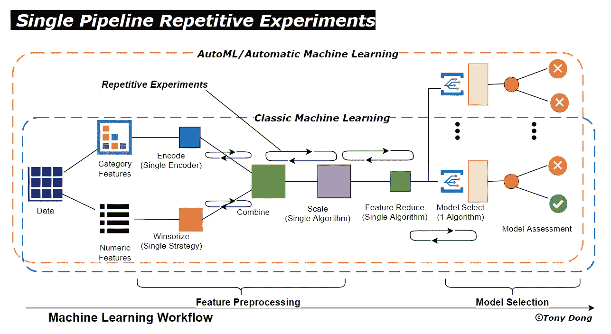
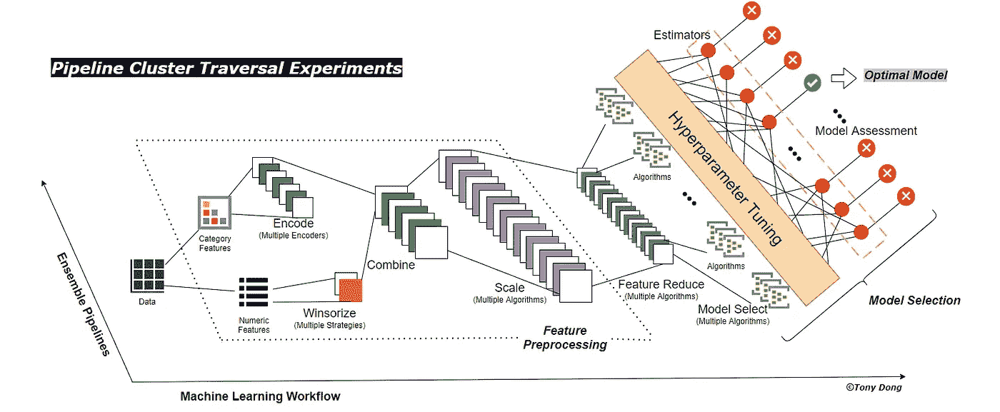
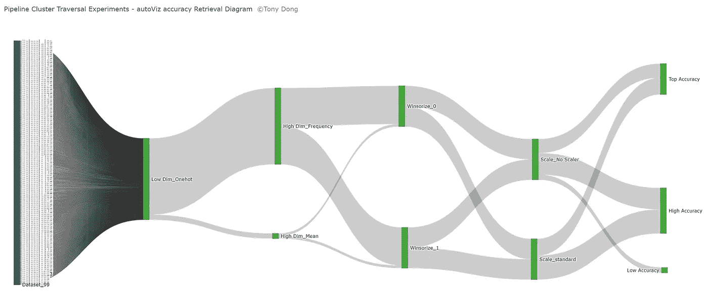
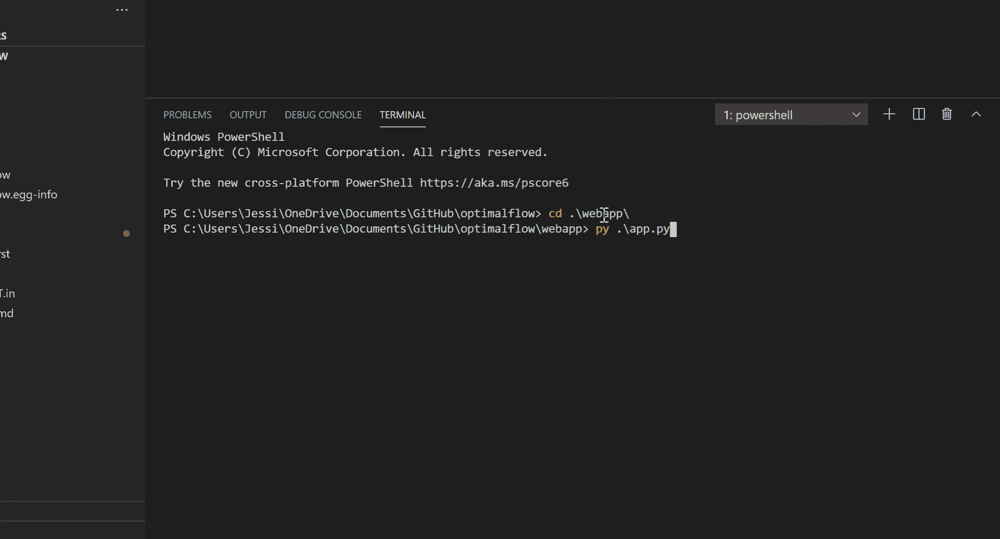

# 一种全方位自动机器学习——OptimalFlow

> 原文：<https://towardsdatascience.com/an-omni-ensemble-automated-machine-learning-optimalflow-369d6485e453?source=collection_archive---------55----------------------->

亨特·哈里特在 [Unsplash](https://unsplash.com?utm_source=medium&utm_medium=referral) 上的照片

***optimal flow****是一个 Omni-ensemble 自动化机器学习工具包，它基于*流水线簇遍历实验*方法，帮助数据科学家以一种简单的方式构建最优模型，并用简单的代码实现机器学习工作流的自动化。*

****OptimalFlow*** 包装 Scikit-learn 监督学习框架，根据每个框架组件中的算法排列，自动创建一组机器学习管道(管道簇)。*

*它的预处理模块包括特征工程方法，如缺失值插补、分类特征编码、数字特征标准化和异常值 winsorization。这些模型继承了 Scikit-learn 和 XGBoost 估计器在分类和回归问题上的算法。可扩展的编码结构支持从外部评估程序库中添加模型，这使得 ***OptimalFlow 的*** 可伸缩性不同于大多数 AutoML 工具包。*

****OptimalFlow*** 使用*流水线簇遍历实验*作为优化器来构建用于最优基线模型搜索的全集成工作流，包括特征预处理/选择优化、超参数调整、模型选择和评估。*

*与其他流行的“AutoML 或自动化机器学习”API 相比，***optimal flow****被设计为 Omni-ensemble ML 工作流优化器，具有更高级别的 API 目标，以避免一般流水线构建中的手动重复训练-评估实验。**

**它通过创建自动化集合管道(管道集群)遍历实验和评估机制，将重点从单个管道组件自动化切换到更高的工作流级别，从而重建了自动化机器学习框架。换句话说， ***OptimalFlow*** 跳出了单个管道的范围，而将整个管道作为一个实体，自动生成所有可能的管道进行评估，直到找到其中的一个导致最优模型。因此，当我们说一个流水线代表一个自动化的工作流时， ***OptimalFlow*** 被设计来组合所有这些工作流，并找到最优的一个。这也是将其命名为 ***OptimalFlow*** 的原因。**

****

**图一。OptimalFlow 的工作流程**

**为此，***optimal flow****创建*流水线簇遍历实验*来组装覆盖机器学习工作流主要任务的所有交叉匹配流水线，并应用遍历实验来搜索最优基线模型。此外，通过将所有关键管道组件模块化到可重用的包中，它允许所有组件进行定制更新，并具有高可扩展性。***

**常见的机器学习工作流通过“单管道”策略实现自动化，该策略首先由 scikit-learn 库引入并得到很好的支持。在实际使用中，数据科学家需要在一个管道内的每个组件中实施重复实验，调整算法和参数，以获得最佳基线模型。我把这种运行机制称为“单管道重复实验”。无论是经典的机器学习还是当前流行的 AutoML 库，都很难避免这种单一流水线聚焦的实验，这是监督建模工作流程中最大的痛点。**

****

**图 2，单管道重复实验**

*****optimal flow****中的核心概念/改进是*流水线簇遍历实验*，这是 Tony Dong 在 Genpact 2020 GVector 大会上首次提出的一种框架理论，利用系综流水线算法优化和自动化机器学习工作流。***

**与使用单个流水线的其他自动化或经典机器学习工作流的重复实验相比，*流水线簇遍历实验*更强大，因为它通过集合所有可能的流水线(*流水线簇*)和自动化实验将工作流从一维扩展到二维。凭借更大的覆盖范围，在没有人工干预的情况下找到最佳模型，以及由于其在每个组件中的系综设计而更加灵活地应对未知数据，*管道簇遍历实验*为数据科学家提供了一种替代性的更方便和“全自动”的机器学习方法。**

****

**图 3，流水线簇遍历实验**

*****OptimalFlow*** 由以下 6 个模块组成，您可以在 [***文档***](https://optimal-flow.readthedocs.io/) *中找到关于每个模块的更多详细信息。*每个模块都可以用*到*来简化*和*来单独自动化具体的组件流水线。另外，你可以在 [***文档***](https://optimal-flow.readthedocs.io/) 中找到它们的例子。**

*   **用于特征预处理的 autoPP**
*   **用于分类/回归特征选择的 autoFS**
*   **用于分类/回归模型选择和评估的 autoCV**
*   **用于*管道簇遍历实验的自动管道***
*   **用于管道集群可视化的 autoViz**
*   **日志和跟踪的自动流程。**

****

**图 4，autoViz 模块生成的模型检索图**

**还有一些现场笔记本 [***活页夹***](https://mybinder.org/v2/gh/tonyleidong/OptimalFlow/master?filepath=tests%2Fnotebook_demo.ipynb) 和演示 [***文档***](https://optimal-flow.readthedocs.io/en/latest/demos.html) 。**

**使用 OptimalFlow，数据科学家，包括有经验的用户或初学者，可以轻松地构建最佳模型，而无需繁琐的实验，并更加注重将他们的行业领域知识转化为实际实施的部署阶段。**

*****OptimalFlow*** 从一开始就被设计成高度模块化，这使得继续开发变得容易，用户可以基于它构建应用。**

**在 0.1.10 版本之后，它增加了一个“无代码”的 Web 应用程序，作为基于 OptimalFlow 构建的应用程序演示。web 应用程序允许对 OptimalFLow 中的所有参数进行简单的点击和选择，这意味着用户可以构建端到端的自动化机器学习工作流，而无需任何编码！(阅读 TDS 上的[文档](https://optimal-flow.readthedocs.io/en/latest/webapp.html)或[故事](https://medium.com/@tonyleidong/build-no-code-automated-machine-learning-model-with-optimalflow-web-app-8acaad8262b1)的更多详情)**

****

**关于 ***OptimalFlow*** 的相关阅读:**

> **[使用 OptimalFlow 在机器学习中进行集成特征选择——使用简单代码选择顶级特征的简单方法](/ensemble-feature-selection-in-machine-learning-by-optimalflow-49f6ee0d52eb)**
> 
> **[集成模型选择&使用 OptimalFlow 的机器学习评估—使用简单代码选择最佳模型的简单方法](/ensemble-model-selection-evaluation-in-machine-learning-by-optimalflow-9e5126308f12)**
> 
> **[端到端 OptimalFlow 自动化机器学习教程结合真实项目-公式 E 圈数预测第 1 部分](/end-to-end-optimalflow-automated-machine-learning-tutorial-with-real-projects-formula-e-laps-8b57073a7b50)**
> 
> **[端到端 OptimalFlow 自动化机器学习教程结合真实项目-公式 E 圈数预测第二部分](/end-to-end-optimalflow-automated-machine-learning-tutorial-with-real-projects-formula-e-laps-31d810539102)**
> 
> **[用 OptimalFlow Web App 建立无代码自动机器学习模型](/build-no-code-automated-machine-learning-model-with-optimalflow-web-app-8acaad8262b1)**

**总之，***optimal flow****为数据科学家分享了一些有用的属性:***

*   ****简单&代码少* —高级 API 实现*流水线簇遍历实验*，每个 ML 组件高度自动化和模块化；***
*   ***井集合* —每个关键组件都是流行算法的集合，包括超参数调整；**
*   ***全覆盖* — *管道簇遍历实验*设计用于与所有关键的 ML 组件进行交叉实验，如组合置换输入数据集、特征选择和模型选择；**
*   ***可扩展&一致性* —每个模块由于其集成&可重用设计，可以很容易地添加新算法；不需要额外修改现有的代码；**
*   ***适应性强* — *流水线簇遍历实验*使得使用正确的流水线来适应看不见的数据集变得更加容易；**
*   ***欢迎自定义修改* —支持自定义设置，根据弹性需求添加/删除算法或修改超参数。**

**作为一个初始的稳定版本发布，所有的支持是受欢迎的！请随时在***optimal flow****GitHub[**这里**](https://github.com/tonyleidong/OptimalFlow/issues) 分享您的反馈、报告问题或作为贡献者加入。***

# ***关于我:***

***我是一名医疗保健和制药数据科学家以及大数据分析和人工智能爱好者。我开发了 ***OptimalFlow*** 库，帮助数据科学家以简单的方式构建最优模型，用简单的代码实现机器学习工作流程的自动化。***

**作为一名拥有多年分析经验的大数据洞察寻求者、流程优化者和人工智能专家，我使用数据科学中的机器学习和问题解决技能将数据转化为可操作的洞察，同时提供战略和量化产品作为最佳结果的解决方案。**

**你可以在我的 [LinkedIn](https://www.linkedin.com/in/lei-tony-dong/) 或者 [GitHub](https://github.com/tonyleidong) 上和我联系。**