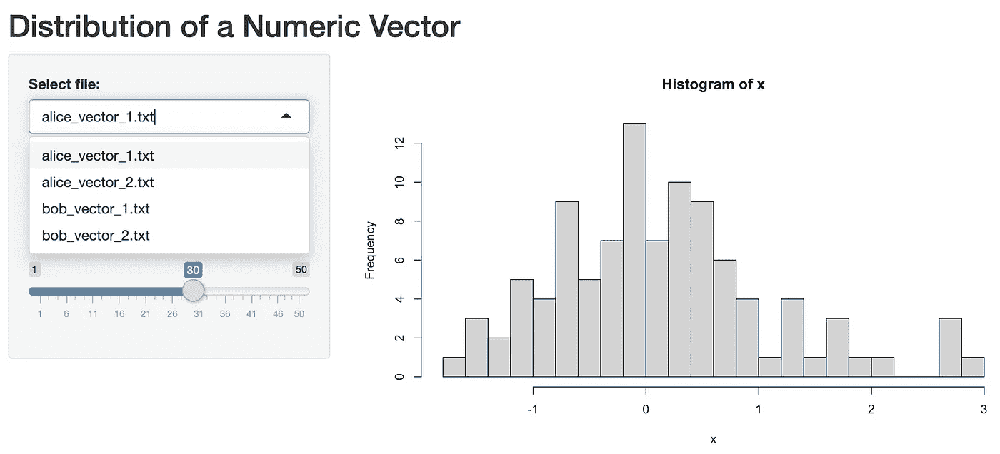
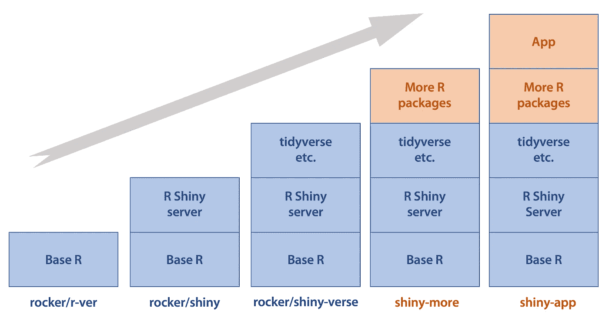
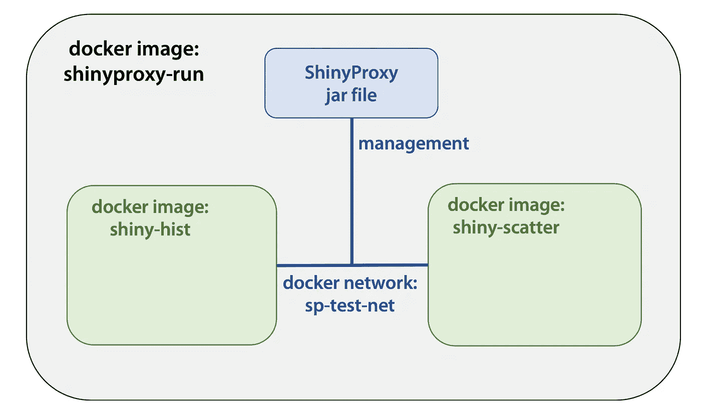
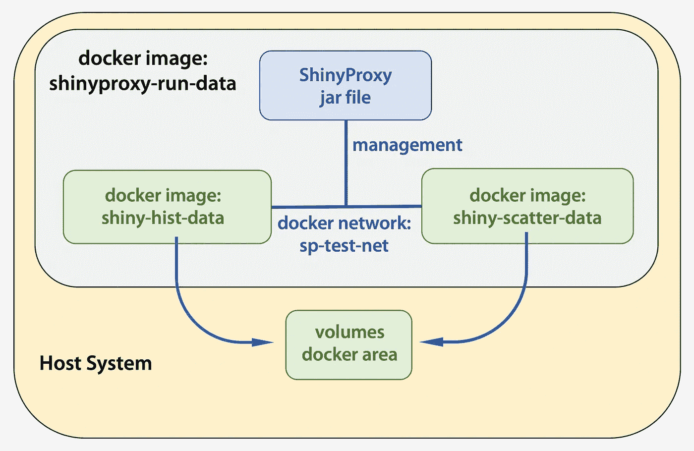
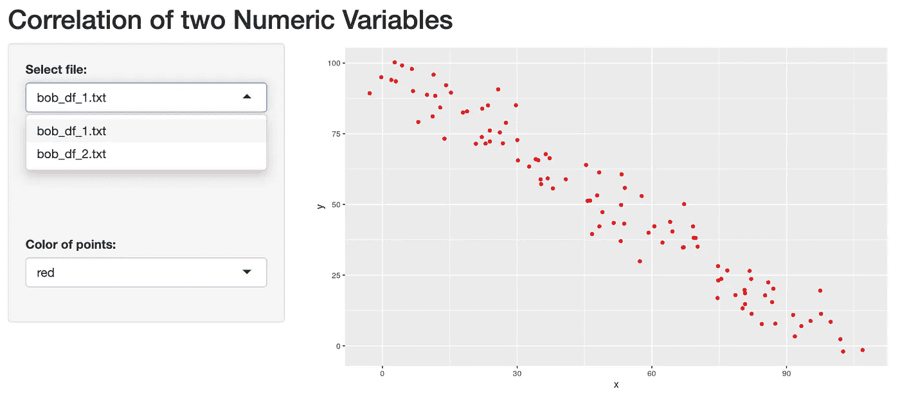

# 部署企业级应用程序的开源解决方案

> 原文：<https://towardsdatascience.com/an-open-source-solution-to-deploy-enterprise-level-r-shiny-applications-2e19d950ff35?source=collection_archive---------9----------------------->

## 使用 docker + ShinyProxy 交付您的 R 数据可视化产品


图片由[卢克·切瑟](https://unsplash.com/s/photos/luke-chesser)在 [Unsplash](https://unsplash.com/photos/JKUTrJ4vK00) 上拍摄

对于许多 R 用户来说，FR Shiny 已经成为构建数据科学交互式 web 应用的流行平台。它允许人们轻松地从 R 可视化数据分析，而不需要弄乱许多行代码。你可以在 [R Shiny Gallery](https://shiny.rstudio.com/gallery/) 中探索一些功能强大、视觉上吸引人的应用。

作为一名生物信息学科学家，我为生物学家提供最先进的高通量实验数据的数据分析和可视化解决方案。随着合作者数量的增长，我需要构建一个 R Shiny 应用程序的主机，以确保模块化、标准化和可复制的工作流。然而，如果我想扩大我的项目规模，让这个系统得到更广泛的应用，我必须面对几个问题:

1.  如何在远程电脑或云端流畅运行 R Shiny apps？
2.  如何从单个门户部署和管理多个 R Shiny 应用？
3.  R Shiny apps 如何在主机系统中动态读写文件？
4.  在 R Shiny 应用程序中，不同的用户可以访问不同的数据集吗？

这些当然可以通过 RStudio 提供的 [Shiny Server Pro](https://rstudio.com/products/shiny-server-pro) 来实现。然而，我搜索了在线资源，经历了试验和错误，发现 **docker + ShinyProxy** 是一个很好的开源解决方案，它使我能够成功地部署一系列具有所需功能的 R Shiny 应用程序。

虽然整个过程对技术要求不高，但我还没有看到如何从头开始构建这些的分步教程。在这里，我的目的是向您展示部署两个具有特定于用户的数据访问的 example R 闪亮应用程序的旅程，并希望它能启发您的项目。

📝**注:** *本教程介绍如何在本地计算机上部署多应用系统。但是这些步骤通常适用于远程计算机或云上的部署。当远程部署需要注意时，我会特别说明。*

ℹ️ *本教程需要的所有文件都托管在我的* [*GitHub 库*](https://github.com/xmc811/ShinyProxy-template) *上。repo 中有五个带编号的子目录，对应于本教程中构建最终系统的五个步骤(第 02-06 节)。在我们学习教程的过程中，我还会向您展示特定文件夹或文件的链接。*

# 01.软件要求

我们应该已经安装了 R 和 RStudio。为了构建我们的示例 R 闪亮的应用程序，我们还需要通过调用`install.packages()`来安装`shiny`和`tidyverse`。

接下来，我们将安装 docker。由于我用的是 macOS，所以我用[这个链接](https://docs.docker.com/docker-for-mac/install/)安装 Docker 桌面。要在其他操作系统上安装它，您可以在这里找到信息。

**我们为什么要用 docker？**

docker 的理念是封装软件代码及其所有依赖项，以便它可以在任何基础设施上统一和一致地运行，即容器化策略。r 闪亮的应用通常有很多包依赖。我们将首先在本地计算机上测试它的运行，然后让他们远程工作。没有 docker 的容器化，我们将不得不确保所有运行应用程序的计算机都有相同的运行环境。这意味着我们将花费大量的精力来安装和配置大量的软件和软件包。当一个包在测试计算机上更新时，它必须在所有其他计算机上更新。我们可以看到，以这种方式管理多个 R shiny 应用程序很容易变得很痛苦。有了 docker，我们可以将应用程序、它们的依赖项和运行环境打包成一个整体**映像**。图像可以复制到其他计算机上，我们可以开始运行应用程序(只要那台计算机安装了 docker)。在不被繁琐的安装和配置所干扰的情况下，这种类型的实践大大加快了软件开发和部署的工作流程。

# 02.构建闪亮的应用程序

由于这只是一个概念验证教程，我们将构建两个简单的 R Shiny 应用程序。因为一般结构和文件系统是相同的，所以它们可以很容易地扩展到更大的项目中。

第一个应用程序“Hist_App”读取存储在文件中的数字向量，并绘制其分布。如图 1 所示，我们可以选择四个数据集中的一个，并调整箱的数量。（💻 [**源文件**](https://github.com/xmc811/ShinyProxy-template/tree/master/02-build-shiny-apps/Hist_App) )



**图一。第一个 App“Hist _ App”的界面**

第二个应用程序“Scatter_App”读取存储在文件中的两列数据帧，并绘制两个变量的散点图。同样，我们可以选择四个数据集之一，并改变点的颜色。（💻 [**源文件**](https://github.com/xmc811/ShinyProxy-template/tree/master/02-build-shiny-apps/Scatter_App) )。在这两个应用中，数据文件都位于`./data/`文件夹中。


**图二。第二个 app“散点 _App”的界面**

当我们打开`app.R`文件时，我们可以通过在 RStudio 中单击“运行应用”来本地测试这两个应用。

# 03.构建并运行 R 闪亮的应用程序 docker 映像

现在我们已经构建了两个 R Shiny 应用程序，但它们只能在我们的本地机器上运行。为了让它们在其他计算机上工作，我们将利用我在上面解释的 docker 容器化策略来构建 docker 映像。

为了构建 docker 映像，我们需要一个**基础映像**来开始。我们可以复制文件并将附加软件或软件包安装到基本映像中，以构建新映像。 [Docker Hub](https://hub.docker.com/) 是一个可以公开获得大量预建 Docker 图像的地方。有一个名为' [rocker](https://hub.docker.com/u/rocker) '的社区知识库，定期更新常见的 R 相关 docker 图片。我们将使用的图像是`[rocker/shiny-verse](https://hub.docker.com/r/rocker/shiny-verse)`。我们在终端中使用以下命令将映像拉至本地机器:

```
docker pull rocker/shiny-verse
```

正如你可能猜到的，`rocker/shiny-verse`是一个已经安装了 R，R Shiny server，以及包括`tidyverse`在内的几个常用包的环境。`rocker/shiny-verse`是在其基础镜像`rocker/shiny`上通过安装`tidyverse` *等构建而成。*。`rocker/shiny`又是从`rocker/r-ver`开始构建的，是 base R 环境。现在你可以看到它是如何工作的:**docker 镜像是一层一层构建的**。当我们需要构建 docker 映像时，我们不会从头开始(例如，从基本操作系统或基本 R 开始)。我们可以从一些预煮的食物开始，然后在上面加上我们的食谱。下图试图解释这个概念。



**图三。逐层构建 docker 图像。**蓝色图层和图像显示的是已经建成的；棕色的层和图像表明那些需要被建造。

通常，我们需要额外的 R 包来运行我们的应用程序。因此，我们可以在`rocker/shiny-verse`之上安装这些包来构建`shiny-more`映像。最后，复制并配置应用程序文件以构建准备运行的`shiny-app`映像。幸运的是，我们的两个应用不需要更多的 R 包，因此`shiny-more`图像是不必要的。我们可以从`rocker/shiny-verse`直接构建`shiny-app`。

📝**注意:** *虽然在本教程中跳过了从* `rocker/shiny-verse` *到* `shiny-more` *的步骤，但是我在 GitHub 中包含了构建这个中间映像所需的* [*文件*](https://github.com/xmc811/ShinyProxy-template/tree/master/optional) *，因为您将需要它们。从技术上来说，即使需要更多的软件包，人们仍然可以直接从* `rocker/shiny-verse` *进入* `shiny-app` *，但这样做的话，每次更新应用程序时，都需要花费几分钟来重新安装所有的软件包。因此，最佳实践是逐层构建图像***。**

*我们需要两个文件来构建`shiny-app`映像:`Dockerfile`，构建 docker 映像总是需要用到它；`shiny-server.sh`，它运行着 R Shiny 服务器。从 [GitHub 目录](https://github.com/xmc811/ShinyProxy-template/tree/master/03-shiny-apps-docker)中可以看到，在每个 app 的文件夹中，这两个文件都被添加在之前的文件之上。现在，在终端的`./Hist_App`文件夹中，运行以下命令:*

```
*docker build . -t shiny-hist*
```

*这将从`rocker/shiny-verse`开始构建`shiny-hist`图像。基本图像在`Dockerfile` : `FROM rocker/shiny-verse:latest`的第一行指定。剩下的几行只是要求 docker 进行复制/安装/配置的命令。在终端中，运行`docker images`。现在我们应该看到`rocker/shiny-verse`和`shiny-hist`都在那里。然后，运行:*

```
*docker run --rm -p 3838:3838 shiny-hist*
```

*这将在端口 3838 的计算机上启动我们的直方图应用程序。打开网络浏览器，并转至`localhost:3838`。我们将有一个闪亮的应用程序在 docker 中运行！*

*运行散点图 app 的步骤是一样的:在`./Scatter_App`文件夹内，运行`docker build . -t shiny-scatter`(记得更改图像标签)，运行`docker run —-rm -p 3838:3838 shiny-scatter`。散点图应用程序将通过端口 3838 访问。*

*现在，我们可以在本地计算机上运行 R 闪亮的应用程序 docker 映像。但是如何让它们在远程机器上运行呢？您可能会注意到`rocker/shiny-verse`有一个`rocker/`部件。这是 Docker Hub 上的存储库名称。我们构建的`shiny-hist`和`shiny-scatter`只是本地映像，并没有被推送到 Docker Hub。要进行推送，请注册 Docker Hub 帐户，并通过 Docker 桌面或终端登录:*

```
*docker login -u "username" docker.io*
```

*用存储库名称重新标记应用程序后，我们可以将 docker 映像推送到网上:*

```
*docker tag shiny-hist username/shiny-hist     
docker tag shiny-scatter username/shiny-scatterdocker push username/shiny-hist
docker push username/shiny-scatter*
```

*在其他安装了 docker 的电脑上，我们只需将图像拖到本地并运行应用程序。*

# *04.使用 ShinyProxy 部署多个 R Shiny 应用*

*我们已经构建了两个 R Shiny 应用程序，可以利用 docker 轻松地将它们部署在不同的计算机上。下一个挑战是:我们如何从单个门户访问和管理多个应用程序，并为不同的用户添加身份验证。这时 [ShinyProxy](https://www.shinyproxy.io/) 开始发挥作用。ShinyProxy 是一个开源解决方案，专门开发来结合 R Shiny 和 docker，并提供额外的多应用功能，包括用户认证(甚至 LDAP 认证)。这允许多个用户在企业环境中部署和使用一系列 R Shiny 应用程序。*

*假设我们想从一个网页访问我们构建的两个应用程序，并且只允许两个用户登录:Alice 和 Bob。为了实现这一点，我们需要在**同一个文件夹**中有三个新文件。两个文件`Dockerfile`和`application.yaml`在 [GitHub](https://github.com/xmc811/ShinyProxy-template/tree/master/04-shinyproxy) 目录下。我们还应该从 ShinyProxy [下载页面](https://www.shinyproxy.io/downloads/)下载`shinyproxy-2.3.1.jar`文件，因为它很大。*

*在构建 ShinyProxy 映像和运行应用程序之前，我们应该看一下`application.yaml`文件，了解它是如何配置运行的。线条`authentication: simple`表示我们可以直接在`user`部分设置用户名和密码。这里，设置了两个用户(“Alice”和“Bob”)及其密码。R 亮闪闪的 docker 映像在`specs`部分配置:我们可以设置 ID、显示名称和应用程序的描述，最重要的是，`container-image`应该是`shiny-hist`或`shiny-scatter`，这样 ShinyProxy 就知道运行正确的映像。*

*另一个新概念是 docker 网络。这使得 docker 通过连接多个容器变得更加强大。我们可以在`application.yaml`中看到`docker: internal-networking: true`和每个图像都有`container-network: sp-test-net`。它使这两个应用程序在一个 docker 网络中运行，并由 ShinyProxy 管理。而且，ShinyProxy 本身可以作为容器运行。本节旨在建立一个包含`shiny-hist`、`shiny-scatter`和 ShinyProxy 的整体形象。同样，**任何东西都可以打包并作为容器运行！**下图展示了 ShinyProxy 的设计:*

**

***图 4。ShinyProxy 设计***

*因此，在构建 ShinyProxy 映像之前，我们需要首先构建 docker 网络:*

```
*docker network create sp-test-net*
```

*📝**注意:** *如果您尝试在远程服务器上构建 docker 网络，尤其是使用 VPN 时，您可能需要指定 IP 子网掩码以避免 IP 地址冲突。我用的命令是* `docker network create --driver=bridge --subnet 172.17.253.9/30 sp-test-net` *。详细解释请见* [*此链接*](https://stackoverflow.com/questions/50514275/docker-bridge-conflicts-with-host-network) *。**

*网络名称应该与我们在`application.yaml`中指定的名称相同。接下来，我们构建 ShinyProxy 映像来连接多个 R Shiny 应用程序(该命令应该在带有`application.yaml`、`shinyproxy-2.3.1.jar`和`Dockerfile`的目录中运行):*

```
*docker build . -t shinyproxy-run*
```

*最后，我们运行`shinyproxy-run`并在 web 浏览器上转到`localhost:8080`来查看结果:*

```
*docker run --rm -v /var/run/docker.sock:/var/run/docker.sock --net sp-test-net -p 8080:8080 shinyproxy-run*
```

*我们应该会看到一个登录页面。通过使用“Alice”或“Bob”和密码登录，我们将被定向到带有两个可用应用程序的门户页面。*

*📝**注意:***`application.yaml`*文件中有很多选项可以配置，发挥 ShinyProxy 的全部潜力。详细文档可以在* [*本页*](https://www.shinyproxy.io/configuration/) *找到。***

# **05.通过 docker 卷进行动态数据访问**

**完成前面的步骤后，我们现在可以从一个门户部署和管理多个 R Shiny 应用程序。但我们的多应用系统还有一个缺陷:目前，所有数据集都存储在每个应用的`./data`文件夹中。这给动态数据访问带来了困难。如果 R Shiny 应用程序使用的数据集被更新，我们必须重新构建相应的应用程序 docker 映像，以使用户可以访问新数据。当更新频繁时，让用户看到即时的数据变化变得不可行。此外，我们可能还希望应用程序在主机系统中生成文件，如果 docker 容器只能操纵自己，这是不可能的。幸运的是，docker 可以使用 [**卷**](https://docs.docker.com/storage/volumes/) 在主机中创建一个“docker 区域”并将其挂载到容器中，因此容器可以访问和操作主机系统中的文件。**

**为了探索这个特性，我们应该首先将数据文件移出 app 文件夹。上一节的树形结构如下:**

```
**04-shinyproxy/
├── Dockerfile
├── Hist_App
│   ├── Dockerfile
│   ├── Hist_App.Rproj
│   ├── app.R
│   ├── data
│   │   ├── alice_vector_1.txt
│   │   ├── alice_vector_2.txt
│   │   ├── bob_vector_1.txt
│   │   └── bob_vector_2.txt
│   └── shiny-server.sh
├── Scatter_App
│   ├── Dockerfile
│   ├── Scatter_App.Rproj
│   ├── app.R
│   ├── data
│   │   ├── alice_df_1.txt
│   │   ├── alice_df_2.txt
│   │   ├── bob_df_1.txt
│   │   └── bob_df_2.txt
│   └── shiny-server.sh
├── application.yml
└── shinyproxy-2.3.1.jar**
```

**让我们重新组织结构，在应用程序文件夹之外创建一个目录，用于存储两个应用程序使用的数据文件:**

```
**05-data-on-host/
├── Data
│   ├── DF
│   │   ├── alice_df_1.txt
│   │   ├── alice_df_2.txt
│   │   ├── bob_df_1.txt
│   │   └── bob_df_2.txt
│   └── Vector
│       ├── alice_vector_1.txt
│       ├── alice_vector_2.txt
│       ├── bob_vector_1.txt
│       └── bob_vector_2.txt
├── Dockerfile
├── Hist_App
│   ├── Dockerfile
│   ├── Hist_App.Rproj
│   ├── app.R
│   └── shiny-server.sh
├── Scatter_App
│   ├── Dockerfile
│   ├── Scatter_App.Rproj
│   ├── app.R
│   └── shiny-server.sh
├── application.yml
└── shinyproxy-2.3.1.jar**
```

**现在，如果我们尝试运行直方图应用程序的`./Hist_App`文件夹中的`docker build`，将会出现错误，因为`./Hist_App/data`文件夹不再存在。相反，我们应该对`Dockerfile`和`app.R`进行修改([见此处](https://github.com/xmc811/ShinyProxy-template/commit/19965c5f93584d18d33df61c6cbae6f8ff32ede6)的具体修改)。**

**我们首先删除了`Dockerfile`中的行`COPY data /srv/shiny-server/data`，然后将`app.R`中的`./data/`改为`/Data/Vector/`，以告知应用程序数据文件现在存储在不同的位置。用不同的标签重建 docker 映像后:**

```
**# within ./Hist_App folder
docker build . -t shiny-hist-data**
```

**我们运行以下命令:**

```
**docker run --rm -v /Users/mingchuxu/Documents/projects/ShinyProxy-template/05-data-on-host/Data/:/Data  -p 3838:3838 shiny-hist-data## Note: The absolute path to /Data in your computer is different, please change it accordingly.**
```

**我们可以看到直方图应用在`localhost:3838`上成功运行。app 如何知道数据文件的正确位置？窍门来自上面命令中的`-v`选项。该选项告诉 docker，我们希望将主机目录`/Users/mingchuxu/Documents/projects/ShinyProxy-template/05-data-on-hist/Data`挂载为容器中的`/Data`(该选项接受`<host-dir>:<container-dir>`格式)。这就是为什么当我们在`app.R`中指定`/Data/Vector/`时，直方图 app 知道去主机系统中的`/Users/mingchuxu/Documents/projects/ShinyProxy-template/05-data-on-hist/Data/Vector`中找数据文件。**

**我们可以在散点图文件夹中进行相同的更改([参见这里的确切更改](https://github.com/xmc811/ShinyProxy-template/commit/1acf7318eca674fb45bc14544bb71035b14942f2))，构建一个新的 docker 映像，并在挂载主机目录的情况下运行它。散点图应用程序也应该在`localhost:3838`运行:**

```
**# within ./Scatter_App folder
docker build . -t shiny-scatter-datadocker run --rm -v /Users/mingchuxu/Documents/projects/ShinyProxy-template/05-data-on-host/Data/:/Data  -p 3838:3838 shiny-scatter-data## Note: The absolute path to /Data in your computer is different, please change it accordingly.**
```

**下一步是将 docker 音量功能与 ShinyProxy 结合起来。在`application.yaml`中，选项`container-volumes`等同于`docker run`中的`-v`选项，允许我们进行相应的配置。让我们修改`application.yaml`文件([查看这里的确切变化](https://github.com/xmc811/ShinyProxy-template/commit/51237c0c9f8095218d12f6db925b4cd58ba27509))，然后构建并运行一个新的 ShinyProxy 映像:**

```
**docker build . -t shinyproxy-run-datadocker run --rm -v /var/run/docker.sock:/var/run/docker.sock --net sp-test-net -p 8080:8080 shinyproxy-run-data**
```

**现在从`localhost:8080`开始，我们可以运行多个 R 闪亮的应用程序，从我们的主机读取数据。下图说明了与图 4 相比改进的设计。我们可以自由地将`./Data`文件夹移动到我们计算机上的任何地方。只要记住每次我们改变绝对路径并重建 ShinyProxy 映像时，都要修改`application.yaml`中的`container-volumes`选项。**

****

****图 5。带有 docker volumes 的改进 ShinyProxy 设计****

# **06.配置用户特定的数据访问**

**完成了前面的步骤，我们现在面临最后一个问题:如何让 Alice 和 Bob 访问特定于用户的数据？这可以通过利用在 ShinyProxy 登录时创建的环境变量来解决:`SHINYPROXY_USERNAME`。**

**首先，让我们在`Data/`文件夹的层次结构中再增加一层。如下树形结构所示，`alice*txt`放入`Alice/`,`bob*txt`放入`Bob/`。这使得 R Shiny 应用可以基于不同的 ShinyProxy 登录用户名访问不同的文件夹。**

```
**Data
├── DF
│   ├── Alice
│   │   ├── alice_df_1.txt
│   │   └── alice_df_2.txt
│   └── Bob
│       ├── bob_df_1.txt
│       └── bob_df_2.txt
└── Vector
    ├── Alice
    │   ├── alice_vector_1.txt
    │   └── alice_vector_2.txt
    └── Bob
        ├── bob_vector_1.txt
        └── bob_vector_2.txt**
```

**接下来要做一系列的修改。请参见此 [GitHub 提交](https://github.com/xmc811/ShinyProxy-template/commit/fb892a84b042682c4ab72517e8676200519c3e07)了解所有需要的更改。具体来说，在每个 app 的`app.R`文件中，我们需要添加`username <- Sys.getenv("SHINYPROXY_USERNAME")`来获取登录用户名，在`ui`和`server`中都通过`paste0()`来修改目录路径；在每个 app 的`shiny-server.sh`文件中，我们应该添加以下两行，将环境变量传递到 R Shiny app 中([在此详细解释](https://stackoverflow.com/questions/39084284/how-to-pass-environment-variables-to-shinyapps)):**

```
**env > /home/shiny/.Renviron
chown shiny.shiny /home/shiny/.Renviron**
```

**然后，就像在第 5 节中一样，我们将为每个应用程序构建新的 docker 映像。同样，我们使用新的 docker 图像标签来区分它们和前面章节中构建的图像。**

```
**# within ./Hist_App folder
docker build . -t shiny-hist-user# within ./Scatter_App folder
docker build . -t shiny-scatter-user**
```

**在构建最终的 ShinyProxy 映像之前，我们还需要修改`applicaiton.yaml`，因为 docker 映像和卷都已经发生了变化([参见这里的确切变化](https://github.com/xmc811/ShinyProxy-template/commit/fb892a84b042682c4ab72517e8676200519c3e07))。**

**最后，使用以下命令:**

```
**docker build . -t shinyproxy-run-user       
# Note the tag name changedocker run --rm -v /var/run/docker.sock:/var/run/docker.sock --net sp-test-net -p 8080:8080 shinyproxy-run-user**
```

**我们可以检查`localhost:8080`并看到 Bob 现在只能访问`Bob/`文件夹中的文件。最后，我们构建了一个简单的 R Shiny app 系列原型，允许用户认证和特定于用户的数据访问！**

****

****图 6。ShinyProxy** 针对用户的数据访问**