# 稀疏均值回复投资组合选择的优化算法

> 原文：<https://towardsdatascience.com/an-optimization-algorithm-for-sparse-mean-reverting-portfolio-selection-4b991bae037?source=collection_archive---------32----------------------->

## 算法交易

## 自动识别资产并确定多头/空头头寸

多头和空头。希瑟·m·爱德华兹在 [Unsplash](https://unsplash.com/s/photos/herd?utm_source=unsplash&utm_medium=referral&utm_content=creditCopyText) 上拍摄的照片

受配对交易和多空股票策略的行业实践的激励，我们研究了一种结合统计学习和优化的方法来构建具有均值回复价格动态的投资组合。

我们的主要目标是:

*   设计具有均值回复价格动态的投资组合，参数由最大似然估计；
*   选择具有理想特征的投资组合，如高均值回归；
*   建立一个简约的投资组合，即从大量的资产中找出一小部分来做多头/空头头寸。

在本文中，我们提出了完整的问题公式，并讨论了利用问题结构的专门算法。使用历史价格数据，我们在一系列的数值例子中说明了该方法。

# 问题定式化

给定在 *T* 时间步内观察到的 *m* 资产的历史数据。我们的主要目标是找到向量 *w* ，组成我们投资组合的资产的线性组合，这样相应的投资组合价格过程最好地遵循 OU 过程。在 *T* 时间步内观察到 OU 过程的可能性由下式给出

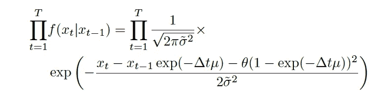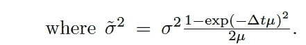

我们联合优化方法的一个主要特点是我们同时*求解最优投资组合和相应的最大似然参数。*

最小化负对数似然导致最优化问题

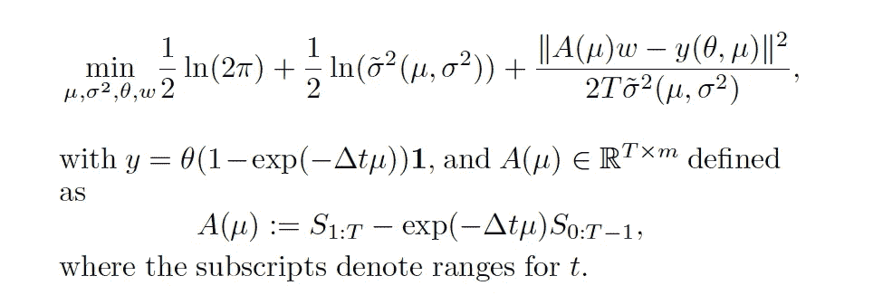

# 稀疏性和速度

给定一组候选资产，我们希望选择一个小的精简子集来构建投资组合。这一特性在实践中很有用，因为它降低了交易成本、执行风险和监控许多股票价格的负担。

为了给模型添加这个特性，我们想要对投资组合向量 *w* 施加稀疏惩罚。虽然 1-范数是经常使用的，但在我们的例子中，我们已经施加了 1-范数等式约束||w||₁ = 1。为了获得稀疏解(即，将非零权重限制为较小的数)，我们使用 0 范数并将基数约束||w||₀ ≤η应用于优化问题。这个约束限制了投资组合中资产的最大数量，并且是非凸的。

除了简化解决方案之外，我们可能还想推广产品组合的其他功能。惩罚可能性框架足够灵活，允许这些增强。均值回复系数μ概括了一个重要特征；更高的可能是理想的。我们可以通过提升更低的 *c* 来寻求更高的值，例如使用线性惩罚。

有了新的约束和惩罚，优化问题就变成了

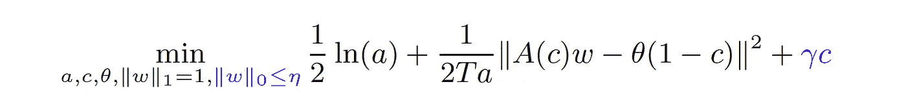

# 最优化算法

我们的策略是首先使用可变投影，如下所示:

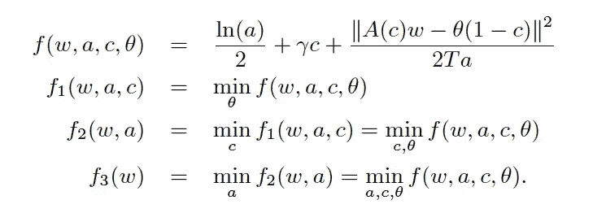

这导致我们解决带有*非凸*约束的*非凸*优化问题:

如果我们想用梯度下降法迭代，但是下一次迭代 wᵢ₊₁可能在可行域之外。

在*投影* *梯度* *下降*中，我们简单地选择可行集合中最接近每次迭代的点。这可以简单地概括为

这是我们算法的总结:

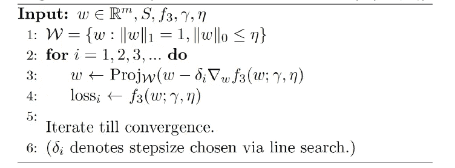

投影梯度下降算法

# 例子

我们对三组选定资产的经验价格数据进行了实验:

**贵金属:** GLD、GDX、广东西江、SLV、GG、AB

**大型资本股票/ETF:**GOOG、JNJ、NKE、MCD、SBUX、SPY、VIG、VO

**石油公司/ETF:**BP，COP，CVX，石油，USO，VLO，XOM

数据来自雅虎财经，给出了过去五年每项资产的收盘价。前 70%的数据(随着时间的推移)用于训练，其余用于测试。

对于每个组，我们成对地逐步增加候选资产集，并应用我们的方法。下表显示了当允许 2、4 或 6 项资产时的优化投资组合权重，以及相应投资组合的样本内和样本外负对数可能性(nll)。

当我们包含更多的资产时，投资组合 nll 通常会减少，这意味着随着候选集的扩大，我们可以获得更多的可表示的投资组合。

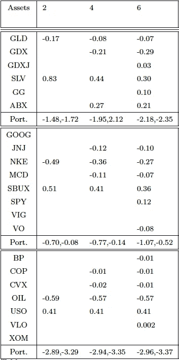

接下来，我们看看资产价格的时间序列和由此产生的投资组合。

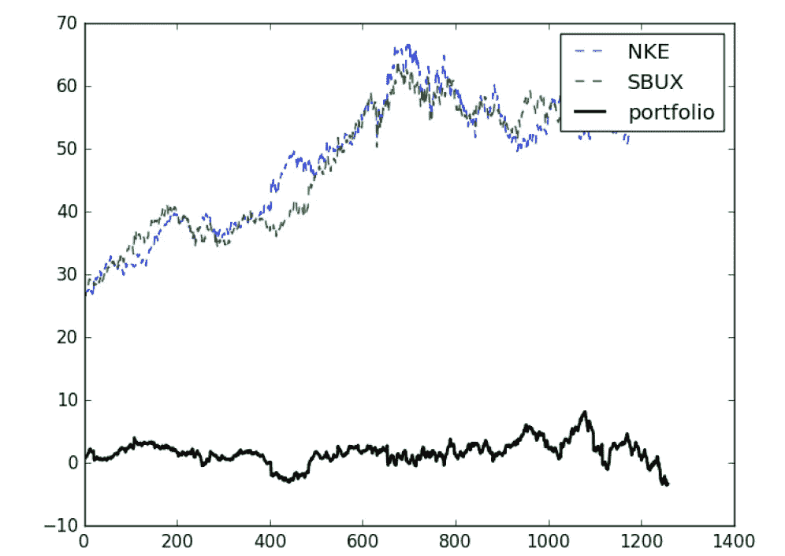

一段时间内的资产价格和投资组合价值对

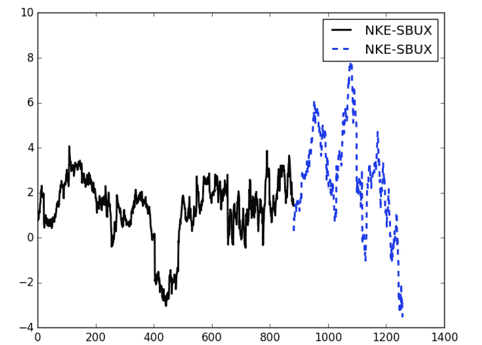

在 8 项资产中，该算法选择了 NKE-SBUX 的双资产投资组合。放大的投资组合价值(黑色:样本内；蓝色:样本外)

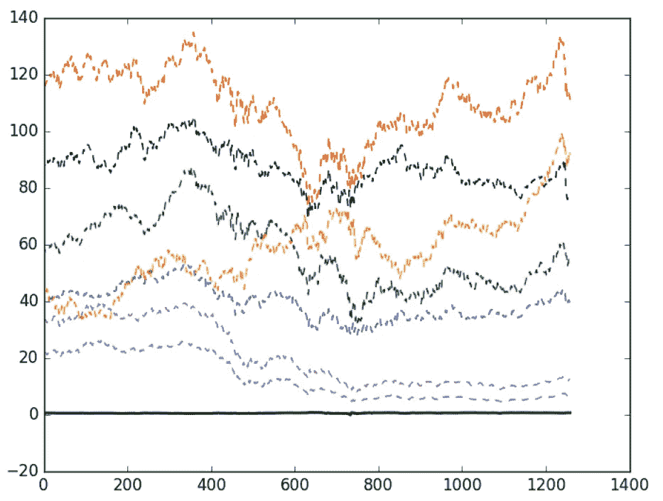

BP、COP、CVX、石油、USO、VLO、XOM 的价格，以及由此产生的投资组合价值(黑色)。

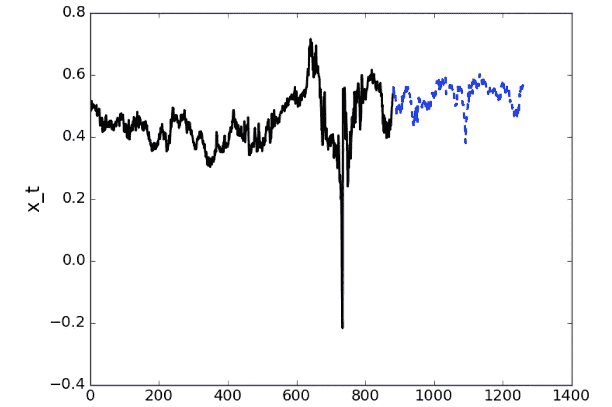

在 7 项资产中，该算法为 2 项资产的投资组合选择了石油-USO。这是投资组合价值(黑色:样本内；蓝色:样本外)。

# 结论

我们的算法可以完全自动化，以处理更多的资产价格和识别价格模式，并进而发现交易机会。*可扩展性*的这一特性对于所有机器学习交易方法都至关重要。在我们的[论文](https://papers.ssrn.com/sol3/papers.cfm?abstract_id=3252777)中，我们还讨论了我们算法的*速度*，这是 algo 交易策略的另一个重要元素。

为了交易均值回复投资组合，我们仍然需要确定进场和出场的时机以及止损策略，正如相关的[文章](/pairs-trading-with-optimized-positions-exit-rules-811fa0c6be91)所讨论的。

# 参考

J.张，A. Aravkin 和 T. Leung (2020)，**通过惩罚似然优化的稀疏均值回复投资组合**，《自动化》，第 111 卷，108651。[https://doi.org/10.1016/j.automatica.2019.108651](https://doi.org/10.1016/j.automatica.2019.108651)

T.Leung T .和 X. Li (2015)，**有交易成本的最优均值回复交易&止损退出**，国际理论&应用金融杂志，第 18 卷，第 3 期，第 1550020 页。[https://doi.org/10.1142/S021902491550020X](https://doi.org/10.1142/S021902491550020X)

[谷歌学术](https://scholar.google.com/citations?user=P40aOHIAAAAJ&hl=en) // [领英页面](https://www.linkedin.com/in/timstleung/) // [主页](https://sites.google.com/site/timleungresearch/research)

***来自《走向数据科学》编辑的注释:*** *虽然我们允许独立作者根据我们的* [*规则和指导方针*](/questions-96667b06af5) *发表文章，但我们不认可每个作者的贡献。你不应该在没有寻求专业建议的情况下依赖一个作者的作品。详见我们的* [*读者术语*](/readers-terms-b5d780a700a4) *。*