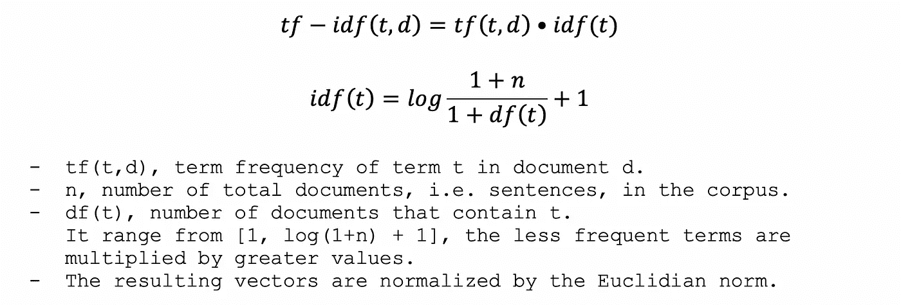
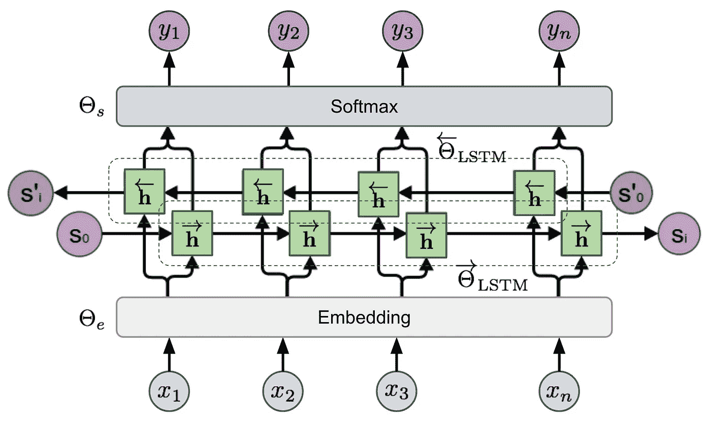
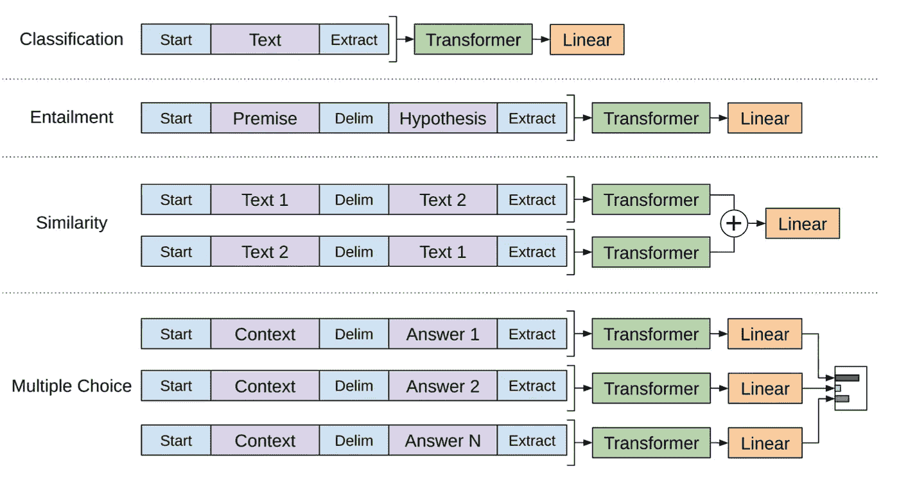

# 自然语言处理中的文本表示综述

> 原文：<https://towardsdatascience.com/an-overview-for-text-representations-in-nlp-311253730af1?source=collection_archive---------13----------------------->

## 讨论自然语言处理中三种最常用的输入类型。

当要阐明一个人对某个特定话题的理解时，写作总是一个不错的选择。通过把想法写在纸上，想法会被澄清，困惑会被暴露。虽然这可能不是最舒服的事情，但这确实是一种学习和提高的有效方式。

如果你发现自己很难向朋友解释一些事情，一些你已经研究了一段时间，但不知何故仍然无法清晰直观地描述的事情，你应该试着把它写下来。

在这篇文章中，我试图总结 NLP 中文本表示的一些想法，旨在为未来的复杂概念奠定基础，并希望对您的学习贡献我的 *granito de arena* 。


NLP 输入的预处理步骤

上图总结了一个**文本** **语料库**转化为不同输入格式的过程，供一个**机器** **学习** **模型**使用。从左起，语料库经过几个步骤才获得**记号**，一组文本**构建** **组块**即**词**、**子词**、**字**等。由于 ML 模型只能够处理**数字** **值**，所以通过在**关联** **数组**(词汇)中查找或者使用**散列** **技巧**，句子中的记号被它们对应的**id、**所替换。一旦完成，它们就被转换成不同的**输入** **格式**，如右图所示。这些格式中的每一种都有自己的优点、缺点，应该根据手头任务的特点有策略地选择。

我们将研究上面显示的每一个输入表示，直接从标记开始，忽略前面的步骤。

## 内容:

*   一键编码
*   计数向量/特征散列/Tf-idf
*   单词嵌入/训练嵌入/语境化嵌入

## 1.一键编码


单词“The”、“cat”和“on”在词汇表中分别具有索引值 0、1 和 2，只有在这些位置它们的独热向量将具有值 1。向量的长度由语料库中唯一标记的数量决定。图片来自[来源](https://www.kdnuggets.com/2019/10/introduction-natural-language-processing.html)。

当在一个数据集中遇到一个****特征**时，一键编码可能是一个人的首选(显然，如果你认为这样的特征对模型有用的话)。这是一种简单而直接的技术，它通过用充满**零**的**向量**替换每个类别来工作，除了其对应的**索引**值的位置，其值为 **1** 。**

**当对文本文档应用独热编码时，标记被它们的独热向量所代替，并且给定的句子又被转换成形状为(***【n，m】***)的 **2D 矩阵**，其中 ***n*** 是句子中 **标记**的**号** **以及 ***m*** 根据一个句子有多少个标记，它的**形状**将**不同**。****

```
As an example, say that we were to use one-hot encoding for the following sentences:s1\. ***"This is sentence one."***
s2\. ***"Now, here is our sentence number two."***The vocabulary from the two sentences is:**vocabulary = {"here": 0, "is": 1, "now": 2, "number": 3, "one": 4, "our": 5, "sentence": 6, "this": 7, "two": 8}**The two sentences represented by one-hot vectors are:**indices**                             **words
     ** *0  1  2  3  4  5  6  7  8*
s1: **[[0, 0, 0, 0, 0, 0, 0, 1, 0],** - "this"
     **[0, 1, 0, 0, 0, 0, 0, 0, 0],** - "is"
     **[0, 0, 0, 0, 0, 0, 1, 0, 0],** - "sentence"
     **[0, 0, 0, 0, 1, 0, 0, 0, 0]]** - "one"s2: **[[0, 0, 1, 0, 0, 0, 0, 0, 0],** - "now"
     **[1, 0, 0, 0, 0, 0, 0, 0, 0],** - "here"
     **[0, 1, 0, 0, 0, 0, 0, 0, 0],** - "is"
     **[0, 0, 0, 0, 0, 1, 0, 0, 0],** - "our"
     **[0, 0, 0, 0, 0, 0, 1, 0, 0],** - "sentence"
     **[0, 0, 0, 1, 0, 0, 0, 0, 0],** - "number"
     **[0, 0, 0, 0, 0, 0, 0, 0, 1]]** - "two"
```

## **改变形状和不认识的单词**

**随着训练库**变得越来越大，词汇的大小只会**增长**，结果，每个记号将由具有越来越大**长度**的向量来表示，使得矩阵更加**稀疏**。代替单词级表示，更常见的方法是使用**字符**作为标记，因为它将**限制**向量的长度。****

**但是无论是使用单词级还是字符级表示，不同的句子矩阵都不可避免地会有不同的**形状**(不同的行数)。对于大多数 ML 模型来说，这可能是一个问题，因为它们的输入形状应该是相同的。**另一方面，基于 RNN** 的模型，如果设置正确，由于其'**重现**'的性质，不会有这种担心，但是同一个**批次**中的所有实例仍有望共享一个**统一的**形状。**

**为了解决这个问题，一个解决方案是为所有实例固定一个长度*——**截断**较长的实例，而**填充**。对于像短文本的**情感** **分析**这样的任务(尽管使用一键处理不会产生好的结果)，通常使用前 300 个字符就足够了。在 **Keras** 中，**填充**令牌可以被**屏蔽**，因此它们不会影响损失。***

***训练语料库的规模可以想有多大就有多大，使词汇量越来越丰富，但在**推理**时间里，总有可能遇到**未知** **单词**。处理这个问题的一个方法是在初始化时在词汇表中保留一些空间，这样当一个不在词汇表中的单词弹出时，它可以被分配到其中一个保留位置(一个**oov**bucket)。***

***另一种特征化文本的方法是通过 **n-gram 计数矢量器**，让我们来看看。***

## ***2.计数矢量器***

***一键编码的使用允许我们实现句子的**记号** - **级**表示，这是通过用向量替换其记号，同时保持其原始的**顺序** **排列**来实现的。另一方面，计数矢量器基于词频，能够**将整个句子**压缩成一个**单个**矢量。如前所述，计数向量的每个位置被分配给一个特定的标记，其值代表该标记在句子中的 **出现**的**号** **。*****

***首先从语料库中生成标记，并且构建词汇以将标记映射到它们相应的 id。计数向量不是为每个单词构建一个向量，而是简单地**计算**每个单词在句子中出现的次数，并将该数字放在向量中它们对应的**位置**。***

```
*If we were to represent the sentences from the previous example with count vectors, they would look like this:s1: [0, 1, 0, 0, 1, 0, 1, 1, 0]s2: [1, 1, 1, 1, 0, 1, 1, 0, 1]vocabulary = {"here": 0, "is": 1, "now": 2, "number": 3, "one": 4, "our": 5, "sentence": 6, "this": 7, "two": 8}*
```

***现在所有的句子都由共享相同长度 ***l*** 的向量表示，长度由词汇表中**唯一**标记的数量定义，默认为**但也可以手动选择**。这种表示句子的方式将无法提供原句子的任何标记**排序** **信息**，并且其关联的**上下文**信息丢失——只有**术语** **频率**反映在计数向量中。*******

```
***For illustration purposes, let's vectorize sentence s3:s3: ***"this this this is is one one one one"***
--> feature counts: "this" x 3, "is" x 2, "one" x 4s3: [0, 2, 0, 0, 4, 0, 0, 3, 0]***
```

***除了使用单个单词/字符作为标记，这可以被视为**单字母**计数矢量器，我们还可以使用两个或更多连续的单词/字符来形成标记，获得所谓的 2 字母、3 字母或更一般的 **n 字母**矢量器。***

## *****垃圾邮件检测中的用法*****

******

***[Webaroo](https://unsplash.com/@webaroo?utm_source=unsplash&utm_medium=referral&utm_content=creditCopyText) 在 [Unsplash](https://unsplash.com/s/photos/spam-email?utm_source=unsplash&utm_medium=referral&utm_content=creditCopyText) 上拍摄的照片***

***计数向量的一个用例是，例如，**垃圾邮件** **电子邮件** **检测**与**朴素** **贝叶斯**模型。***

***邮件过滤的主要**标准**是每类邮件中的**术语** **频率**，即一个单词在垃圾邮件和非垃圾邮件中出现的次数。***

```
***The model learns through training about what words are more spam-like words, and what words are not. It assumes **conditional** **independence** for each email’s content words, meaning they are mutually independent and their appearances are only conditioned by the email’s **label**(spam, Y=1, or non-spam, Y=0).The probability of a given email being a Spam(Y=1), given its content words(X), is calculated using **Bayes** **rule**. According to which, such probability is determined by the probability of seeing these words in those Spam emails, P(X|Y=1), multiplied by the portion of Spam emails the model has seen during training, P(Y=1), and divided by P(X).***
```

******

```
***With X being the collection of words from an email, {x1, x2, …, xm}, by assuming **conditional** **independence**, P(X|Y=1) is calculated as the product of the probabilities of seeing these words in Spam emails:***
```

******

***这里使用计数向量的一个**缺点**是**未知的**单词被**扔掉****。如果你有一个句子有 m 个*单词和 n 个*单词，而这些单词在模型中从未出现过，那么只有 m-n 个 单词会被考虑进去。这被狡猾的垃圾邮件发送者用于**过滤** **规避**——修改垃圾邮件关键词，使它们不为模型所知，但仍然对用户可读。该模型将看到的内容仅包含**中性**单词，并且该电子邮件可以被分类为**非垃圾邮件**。*******

```
*******- Sentence from a Spam email:*"come* ***make*** *some* ***money****, ten* ***thousand******dollar*** *a week for doing nothing"*- With modified words:*"come* ***mayke*** *some* ***m0ney****, ten* ***th0usand******dollar$*** *a week for doing nothing"*- The sentence the model will see:*"come some, ten a week for doing nothing"********
```

******除了其他优点之外，特征散列有助于减轻损害。******

## ******特征散列******

******随着模型用越来越大的语料库训练，它产生的词汇需要越来越多的存储空间来存储。为了提高效率，这些查找表被存储在 **RAM** 中，用于快速**令牌 id** **映射**，并且一旦它们的大小变得太大，能够**减慢** **操作。********

******通过使用**散列** **技巧**，我们可以完全摆脱这种**消耗内存的**词汇，而代之以使用**散列** **函数**进行令牌-id 映射。对于一个给定的字符串，哈希函数能够返回一个数值**、**一个**哈希**、**值**，也就是**对该字符串唯一的**，并将其作为**令牌**、 **id** 。******

************

******使用散列函数进行令牌-id 映射。******

******由于不涉及固定大小的词汇，所有的记号现在都可以分配给一个数字，不管模型之前是否见过它。在**垃圾信息** **检测**的情况下，**通过让垃圾信息词变得对模型陌生来绕过**过滤器的方式不再那么有效。任何给定的字，“已知”或“未知”，都可以被馈送到**散列**T42 函数并输出一个在**预定义的** **范围**内的**数字** **值**。它在计数向量中的相应位置将加 1，而不是丢弃未知单词，因此电子邮件中的所有单词都将被考虑在内，而不仅仅是中性单词。******

******与词汇表不同，特性哈希是一种 **one** - **way** 操作——我们无法通过哈希函数使用其**哈希** **值**找到**初始** **特性**。相同的输入将总是产生相同的输出，但是两个不同的特征可能碰巧被映射到相同的散列值(如果向量大小很大，即 2 个⁴).，这种可能性可以忽略不计)******

## ******Tf-idf 术语权重******

******如前所述，当表示**句子** **上下文**时，计数向量是有缺陷的，因为它们不反映任何初始的**标记** **排序**。当诸如“like”、“a”或“and”等几乎没有意义的**上下文** **信息**的术语出现得太频繁时，事情会变得更糟，通过降低它们的频率，将模型的**注意力**从那些**不太频繁但更有趣的**术语上移开。******

********Tf-idf** 代表**术语** - **频率** (tf)乘以**逆** **文档** - **频率** (idf)，它用于根据每个标记出现在多少个不同的句子中，通过**重新加权**计数特征来解决这个问题。假设一个**术语的** **相关性**与其在不同文档中出现**的**的**号**之间存在**逆** **关系**，则**惩罚**。******

******作为一个例子，让我们看看 **Scikit-Learn 的** tf-idf 实现、 **TfidfTransformer** ，在默认设置中:******

************

******Scikit-Learn 默认设置中的 TfidfTransformer。******

## ******3.单词嵌入******

******到目前为止，我们已经看到了两种类型的表示: **One-hot** 编码，这是一种标记级别的表示，允许保留初始句子中的标记顺序；以及**计数向量**，这是一种更紧凑的**句子级别的**表示，它依赖于术语频率。******

******对于 NLP 任务，如**文本生成**或**分类**，一键表示或计数向量可能**能够**足以表示模型做出明智决策所需的**信息。但是，它们的用法对于其他任务来说就不那么有效了，例如**情感** **分析**、**神经** **机器** **翻译**以及**问题** **回答**，这些任务需要对**上下文**有更深入的理解才能获得很好的结果。********

****以 One-hot 编码为例，使用它不会导致这些任务的**良好概括的**模型，因为任何两个给定单词之间都不能进行**比较**。所有矢量都是彼此**正交的**，任意两个矢量的**内积** **积**为零，它们的**相似度**不能用**距离**或**余弦相似度**来度量。****

```
**Say that we were to train a language model for text generation and we've provided the model with the following sentence: ***"I want to have an orange",*** expecting it to output ***"juice"***.--> ***"I want to have an orange juice"***If done right, the model should learn that ***"orange juice"*** is a common thing, or the entire sentence is a common sentence.If we were asked to complete the following sentence with one word: ***"I want to have an apple"***. Having seen the first sentence, our common sense will tell us to use ***"juice"***, provided that we have a notion on the similarities between ***"orange"*** and ***"apple"***.But the model we just trained won't be able to mimic this since it doesn't have any clue about how similar these two words are. In fact, it doesn't have any clue on how similar any two given words are, so it won't be able to generalized from ***"orange juice"*** to ***"apple juice".*****
```

****为此，我们求助于**单词** **嵌入**，一种能够**捕获**单词的**语义** **含义**的特征化单词级表示。****

****通过嵌入，每个单词由一个固定大小的**密集** **向量**表示(通常范围从 50 到 300)，其值对应于一组**特征**，即*男性*、*女性*、*年龄*等。如下图所示，这些特征被视为一个词的语义的**不同的** **方面**，它们的值由**随机** **初始化**得到，并在训练过程中**更新**，就像模型的**参数**一样。****

********

****嵌入“国王”、“王后”、“女人”和“公主”的向量。图片来自[来源](https://peltarion.com/knowledge-center/documentation/modeling-view/build-an-ai-model/blocks/text-embedding)。****

****当训练嵌入时，我们不告诉模型这些特征应该是什么，而是由模型来决定什么是学习任务的最佳特征。在建立一个**嵌入** **矩阵**(一组单词嵌入)时，我们只定义它的**形状**——单词的数量和每个向量的长度。每个特征所代表的东西通常很难解释。****

********

****单词嵌入的可视化。图片来自[来源](http://www.vima.co.za/2017/03/21/a-dive-into-word2vec-tsne-for-visualisation/)。****

****单词嵌入捕捉**语义** **含义**的能力可以通过将这些高维向量通过 **t-SNE** 投影到 2D 空间进行可视化来说明。如果成功地获得了嵌入，用 t-SNE 绘制这些向量将展示具有相似含义的单词如何最终变得更加接近。****

****不同嵌入向量之间的**语义** **关系**也可以用下面的例子来说明。****

```
**Say that we have the embedding vectors of the word "**king**", "**queen"**, "**man**", and "**woman"**. The resulting vectors of subtracting "**queen**" from "**king**" and "**woman**" from "**man**" would be very similar direction-wise since they both carry similar values for that ***Gender*** feature."**king**" - "**queen**" ≃ "**man**" - "**woman**"or equivalently,"**king**" - "**queen**" + "**woman**" ≃ "**man**"**
```

## ****训练词嵌入****

****前面我们提到过**嵌入**向量可以像另一个**层**(在神经网络中)一样被训练，它们也可以被单独训练**并在以后通过**转移** **学习**用于不同的任务。******

******有不同的方法来训练嵌入，但是原理大致相同。这里我们简单讨论两种 **Word2Vec** 方法，即**连续** **包字** (CBOW)和**跳字**。******

********Word2Vec** 是浅层的两层**神经** **网络**，被训练来重构单词的语言**上下文**。我们从大型语料库中提取**上下文/目标**单词的**对**进行训练，其中**目标**单词是随机选择的**单词，而**上下文**单词是位于目标单词周围给定**窗口**内的那些单词。********

```
****There are different varieties of context, they can be 1)all the words within the window, 2) n words before or 3) after the target word, or 4) simply a random word located within the window.Sentence: "*Learning Spanish* ***is*** *hard but also fun*"

- target word: "is"
- windows length is 2, for both directions
- context:
 1\. "learning", "Spanish", "hard", "but"
 2\. "learning", "Spanish"
 3\. "hard", "but"
 4\. "learning"****
```

********

****CBOW(左)和 Skip-gram(右)的模型架构图。图片来自[本文](https://www.researchgate.net/publication/328373466_Training_Neural_Language_Models_with_SPARQL_queries_for_Semi-Automatic_Semantic_Mapping)。****

****对于 **CBOW** ，将**上下文**字以其嵌入形式(随机初始化)输入到模型中，并且期望模型使用 softmax，P(目标|上下文)输出**目标**字。 **Skip-gram** ，另一方面，与相反的**，它接受**目标**单词，并预期输出**上下文**单词。******

****现在，这些听起来可能很难**学习** **任务**，但是请记住，目标不是做好任务本身，而是学习好**嵌入**，这些模型可以做到这一点。****

## ****语境化的单词嵌入****

******一词多义**代表书写相同但根据**上下文**它们可以有**完全** **不同**的意思。如上所述的单词嵌入将使**无法**处理这个问题。****

```
****The word "**bank**" in the following two sentences has **different** **meanings**, but since they are assigned to the **same** **token** **id**, their word **embedding** vectors are the **same**.1\. "I went to the **bank** to withdraw some money."
2\. "I went to the other side of the river **bank**."****
```

****为了解决这个问题，每个工作嵌入必须考虑到找到单词的**上下文**并相应地修改它的值。携带一个一般化的**嵌入** **矩阵**并将其插入到模型中对于我们正在尝试做的任务来说是不充分的，相反，一个更加复杂的**结构** **必须被包含到模型的下部才能找到****嵌入**。********

****用于**神经** **机器** **翻译** (NMT)的基于**编解码**的架构是一个很好的例子来介绍**预训练** + **微调**方法论，这是近年来 NLP 中最新的**突破**的原因。****

********

****a)用于机器翻译的序列到序列模型的预训练。b)将模型的编码器用于其他任务。图片来自[封面纸](https://arxiv.org/abs/1708.00107)。****

****这张图来自 ***学习翻译:语境化的*** ***字*** ***向量*** (CoVe)描述了在**预训练**中获得****嵌入**的过程，以及它们如何用于**下游********

******在左边，一个基于编码器-解码器的模型为 **NMT** 训练，来自原始语言的句子首先由**编码器**处理，然后其输出被传递到**解码器**进行最终翻译。这个**预训练**过程是受监督的，目标是让编码器学会如何捕捉单词的**句法**和**语义**含义，并输出**上下文化的** **嵌入**。编码器基于两层**双向** **LSTM** 架构，解码器基于**注意力** **单向** **LSTMs** 。******

******在右边，一个预先训练的**编码器**接收输入、**手套**嵌入，以找到**上下文化的** **嵌入**，然后它们**与原始输入**组合，用于一个**下游**任务。******

********CoVe** 的局限性在于:1)预训练是由**监督**的，因此它受到标注为 **的**数据**的数量的限制，2)**任务特定的**模型的**架构**还有待定义，要找到一个能够实现出色结果的架构并不是一件轻而易举的事情。通过克服这两个障碍，我们希望找到一个模型，它可以 1)用**无限**数据进行预训练——**无监督**训练，2) **对有限的标记数据进行微调**，并对其架构进行一些小的修改，以实现不同 NLP 任务的 **SOTA** 结果。********

****下面简单介绍一下**埃尔莫**、**奥纳尔 GPT** 和**伯特**是如何解决上述局限性的。更详细的解释请看这篇**惊人的**帖子: [***广义语言模型***](https://lilianweng.github.io/lil-log/2019/01/31/generalized-language-models.html)*作者 *Lilian Weng。******

******语言模型**的嵌入(ELMo)通过以**无监督**方式训练**语言** **模型**来获得**上下文化**嵌入——接受一系列标记，并学习**预测**给定**历史**的下一个标记。其结构基于**双向****LSTMs**，其中 ***L*** 层的 lstm 是**一层一层的堆叠**，每一层输出一个**不同的**序列表示。****

********

****双向 LSTM。图片来自 Lilian Weng 的博客。****

****不同的层次侧重于单词的句法/语义的不同方面。 **ELMo** 较高层更关注语义方面，而较低层可以捕捉更好的句法方面。****

****双向 LSTMs 用于确保模型不仅学习预测给定令牌的**未来**，还学习预测其**过去**。****

****ELMo 仅用于查找**上下文化的**嵌入。对于给定的任务，仍然需要找到特定的模型**架构**。****

********

****OpenAI GPT 用于不同的下游任务。图片来自[原纸](https://s3-us-west-2.amazonaws.com/openai-assets/research-covers/language-unsupervised/language_understanding_paper.pdf)。****

******OpenAI GPT** ，基于**变压器的解码器**，可直接用于**所有**终端任务。如图所示，不同的任务有不同的**预处理**步骤，但只需对 **GPT 的变形金刚模型**稍加修改即可完成任务。****

****与 ELMo 不同， **GPT** 只被训练来预测**未来**，但是为了更好地理解给定令牌的上下文，来自其**左**和**右**的项目都应该被考虑。****

******BERT** 基于 **Transformer 的编码器**，被训练预测来自**左**和**右**的上下文。它的预培训包括两项任务:****

1.  ******屏蔽语言模型**，用**【屏蔽】"**随机替换标记，该模型必须通过查看其上下文来输出其原始单词。通过这样做，它迫使模型更好地捕捉缺少的单词的**句法**和**语义**含义。****
2.  ******下一句预测**。BERT 不是每次只取一个句子，而是取其中的一对，A 和 B，作为输入，它必须预测 B 是否需要 A。经过这项任务的训练，模型将更有能力理解 **句子**之间的**关系** **。******

********

****伯特的输入。图片来自[伯特论文](https://arxiv.org/abs/1810.04805)。****

****BERT 使用**单词块** **标记化** **嵌入**作为它们的输入。它不生成正常单词标记，而是使用**子单词** **标记化**来更好地处理**罕见**和**未知**单词，因为它们中的大部分可以使用子单词重构**。两个输入句子有不同的**句子** **嵌入**，并且使用特殊字符来分隔它们。**位置** **嵌入**也被使用。******

********

****用于句子分类的微调 BERT。图片来自[伯特论文](https://arxiv.org/pdf/1810.04805.pdf)。****

****当使用 BERT 进行下游任务时，就像 GPT 一样，只需添加几个新参数。以文本分类为例，我们需要做的是从最后一层取出**【CLS】**token 的嵌入，并传递给一个 **softmax** 。****

## ****结论:****

****如果你从头到尾都读完了，这就不是一篇短文，但是如果你没有，这里有一个快速回顾:****

****本文讨论了三种类型的**文本** **表示**，其中前两种是稀疏向量:**一键** **编码**一方面是一种**标记级**表示，其中一个句子在用作输入之前被转换成一个矩阵，其行数与其标记数相同。**计数矢量器**则可以把一个句子作为一个整体，挤压成**一个** **单个** **矢量**。它依赖于统计**项** **频率**，而这是以丢失关于句子的**标记** **排序**的信息为代价的。****

****使用**散列** **技巧**可以帮助解决大**词汇表**的**内存** **消耗**的问题，并且它还缓解了在垃圾邮件检测的情况下**过滤器** **规避**的问题。 **Tf-idf** 用于**重新加权** **术语** **频率**用于计数向量，因此**较少** **频繁**但**上下文** - **揭示**术语不会被“忽略”。****

******单词** **嵌入**，一种更高级的技术，在需要更好地捕捉单词的**语义** **含义**时使用。使用更复杂的结构来处理输入，以获得**上下文化的** **嵌入**，这又用于解决**多义性**的问题。****

****文章最后对最新的自然语言处理模型进行了简要的讨论。目的是提供一些基本的想法，需要投入更多的努力来进一步理解这些模型。****