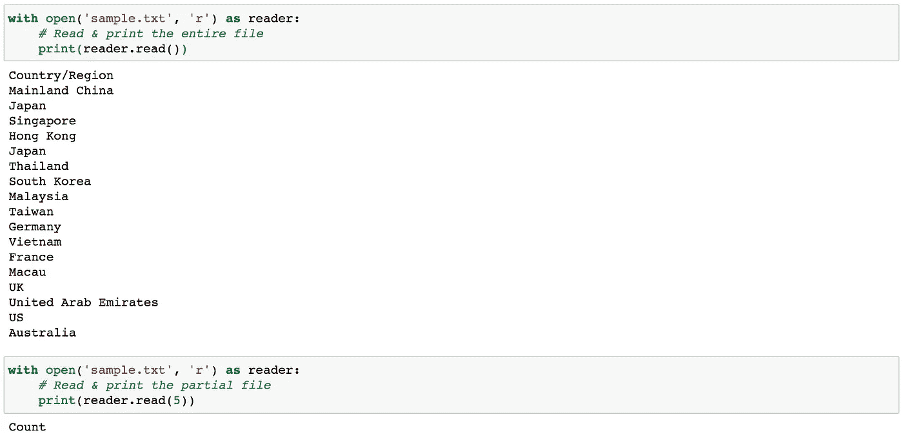
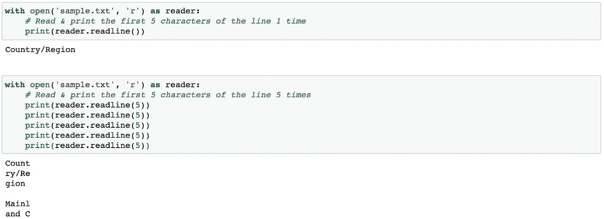
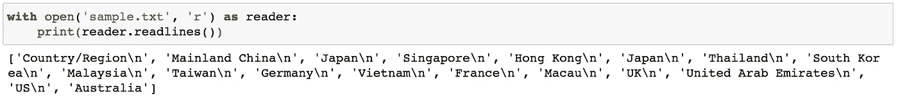
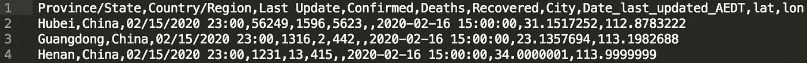
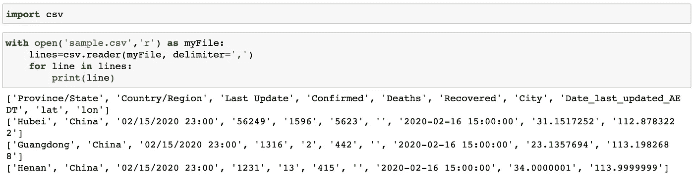
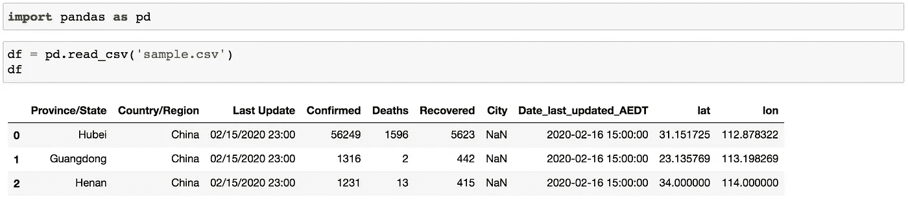
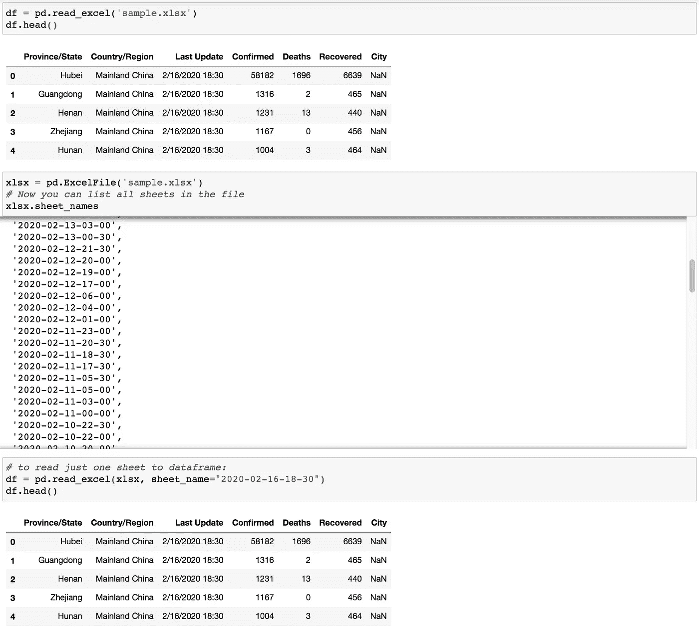
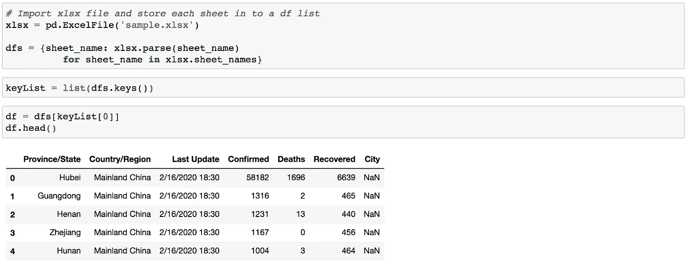

# 在 Python 中导入数据概述

> 原文：<https://towardsdatascience.com/an-overview-of-importing-data-in-python-ac6aa46e0889?source=collection_archive---------1----------------------->


库特萨山的暴风雨景象

## 了解应该使用哪种方法

在 Python 中进行任何与数据相关的操作，比如数据清理、数据聚合、数据转换和数据可视化，先决条件是将数据加载到 Python 中。取决于数据文件的类型(如`.csv`、`.txt`、`.tsv`、`.html`、`.json`、Excel 电子表格、关系数据库等)。)和它们的大小，应该相应地应用不同的方法来处理这个初始操作。在这篇文章中，我将列出一些在 Python 中导入数据的常用方法。

像往常一样，所有需要的数据和笔记本都可以从 [my Github](https://github.com/Perishleaf/data-visualisation-scripts/tree/master/data_import_python) 中访问。

1.  **Python 内置函数(** `**read()**` **、** `**readline()**` **、** `**readlines()**` **)**

一般来说，文本文件(`.txt`)是我们要处理的最常见的文件。文本文件由一系列行组成，每一行都包含一系列字符。假设我们需要在 Python 中导入下面的文本文件(`sample.txt`)。

```
Country/Region
Mainland China
Japan
Singapore
Hong Kong
Japan
Thailand
South Korea
Malaysia
Taiwan
Germany
Vietnam
France
Macau
UK
United Arab Emirates
US
Australia
```

要将其内容导入 Python，我们需要首先打开它。这一步就像在我们的计算机系统中双击一个文件打开它一样。然而，在 Python 中，这是通过调用`open()`内置函数来完成的。`open()`具有作为文件路径的必需参数和指示模式的可选参数(即，默认参数‘r’:打开读取；w ':打开以供写入)。通过这些设置，`open()`然后返回给我们一个文件对象。

有三种读取内容的方法(即`read()`、`readline()`、`readlines()`)可以在这个 file 对象上单独或组合调用。

*   `read(size=-1)`:根据`size`字节数从文件中读取。如果没有传递参数或者传递了`None`或`-1`，则读取整个文件。



图 1 |读取示例()

*   `readline(size=-1)`:如果没有参数被传递或者`None`或`-1`被传递，则读取整行(图 2 上部面板)。或者如果用`size`传递，则从该行读取`size`个字符。此外，可以顺序调用多个`readline()`功能(图 2 下面板)，其中下一个`readline()`功能将从上一个`readline()`功能的结束位置继续。注意，第三个`readline()`的输出附加了一个额外的换行符(\n，显示为新行)。这可以通过使用`print(reader.readline(5), end=’’)`来避免。



图 2 | readline()示例

*   `readlines()`:这将从 file 对象中读取所有的行或剩余的行，并将它们作为一个列表返回(图 3)。



图 3 |示例`readines()`

您可能会注意到以上所有代码都有`with`语句。`with`语句提供了一种确保文件在打开后总是关闭的方法。如果没有`with`语句，我们需要显式地为 file 对象调用`close()`。例如:

```
file = open("sample.txt")
data = file.read()
print**(**data)
file.close()
```

由于很容易忘记关闭文件，我们应该始终使用`with`语句。这也提供了更好的语法和异常处理。

2. **Python** `**csv**` **库**

我们刚刚处理的`sample.txt`每行只有一个字段，这使得只使用内置函数(`read()`、`readline()`和`readlines()`)进行处理非常方便。然而，更常见的情况是，我们将处理一个每行有多个字段的文件(又名**表格数据**)，如图 4 所示。



图 4 |逗号分隔文件

正如我们看到的，每行的每个字段都用逗号分隔，表示一个字段的结束和下一个字段的开始。我们称这种类型的文件为**分隔文件**。这些文件通常以逗号分隔(`.csv`)或制表符分隔(`.tsv`或`.txt`)。在极少数情况下，您可能还会遇到其他分隔符，如冒号(`:`)、分号(`;`)和字符。

尽管内置函数仍然可以处理这些文件，但它很可能会出错，尤其是在某些情况下，当每行有数百个文件时。或者，我们可以使用 [Python 的](https://docs.python.org/3/library/csv.html) `[csv](https://docs.python.org/3/library/csv.html)` [库](https://docs.python.org/3/library/csv.html)来读取分隔文件。这里让我们从这个模块中学习两个常用函数。

*   `csv.reader()`:读取给定文件中的所有行，并返回一个 reader 对象。那么每一行都可以作为字符串列表返回。



图 5 | csv.reader()

*   `csv.DictReader()`:如果文件有标题(通常是标识每个数据字段的第一行)，这个函数将每一行读为`dict`，标题为`keys`(图 6，上图)。然后我们可以通过调用它的*字段名*来访问每一列的数据(图 6，下面的面板)


图 6 | csv。字典阅读器()

3.**使用熊猫导入数据**

在 Python 中导入数据的另一个非常流行的选项是必须去 [**Pandas**](https://pandas.pydata.org/getting_started.html) ，尤其是当数据量很大时(比如几百 MB)。我们不会深究`pandas`如何工作或如何使用的细节。有很多优秀的[教程](https://www.datacamp.com/community/tutorials/pandas-read-csv)和书籍(如[用于数据分析的](https://amzn.to/2KI5JJw)Python，作者 [Wes McKinney](https://wesmckinney.com/) ，熊猫的创造者)。这里我只是展示一下`pandas`在读取`csv`和`excel`文件时的一些威力。

*   `pd.read_csv()`:将一个`csv`文件读入`DataFrame`对象。这里重要的一点是，pandas 足够智能，可以自动判断每个字段的标题行和数据类型，这使得下游分析更加高效。



图 7 | PD . read _ CSV()的示例

*   `pd.read_excel()`:将 excel 文件(`.xls`、`.xlsx`、`.xlsm`、`.xlsb`、`.odf`文件扩展名)读入熊猫`DataFrame`。默认情况下，它只导入 excel 文件内的第一张数据表(`sample.xlsx`有多张)，如图 8 所示。



图 8 | PD . read _ excel()的示例

为了能够访问 excel 文件中的特定工作表，我们可以首先使用`pd.ExcelFile()`导入整个 excel 文件，然后在调用`pd.read_excel()`时指定工作表名称(图 8)。

此外，为了更方便地访问所有工作表，我们可以将所有工作表作为`dataframe`对象存储在`dict` 中，而不是多次调用`pd.read_excel()`(图 9)。在这篇[帖子](/build-a-dashboard-to-track-the-spread-of-coronavirus-using-dash-90364f016764)中也可以找到一个实际的例子。



图 9 | PD 示例。ExcelFile()

**4。导入大尺寸数据的选项**

在大数据时代，有时，我们需要从客户或同事那里导入文件，这些文件可能太大(千兆字节或兆兆字节)而无法加载到内存中。那么，我们应该如何解决这个瓶颈呢？

幸运的是，Pandas 提供了`chunksize`选项来解决这个问题。本质上，我们不是一次性导入整个文件，而是导入部分内容。

此外，我发现了一个非常有用的[帖子](https://medium.com/casual-inference/the-most-time-efficient-ways-to-import-csv-data-in-python-cc159b44063d)，作者是[米哈伊尔·扬切夫](https://medium.com/@yanchev.mihail?source=follow_footer--------------------------follow_footer-)，他提供了多种方法，并比较了他们在处理这种情况时的效率。在这里，我只是列出了他的帖子中提到的那些方法，如果这是你正在寻找的，你可以阅读他的帖子。

*   [dask.dataframe()](https://docs.dask.org/en/latest/dataframe.html) :大型并行数据帧，由许多较小的熊猫数据帧组成，沿索引拆分。一个好的方面是，大多数与熊猫一起使用的功能也可以与 dask 一起使用。
*   [datatable](https://github.com/h2oai/datatable) :一个 Python 包，用于操作大型二维表格数据结构(又名数据帧，高达 100GB)。

好了，现在我们知道了用 Python 导入数据的基础。当然，在 Python 中导入数据还有许多其他情况，我无法在此一一列举，比如使用 [BeautifulSoup](https://www.crummy.com/software/BeautifulSoup/bs4/doc/) 解析`html`和使用`pd.read_sql_query()`读取 sql 表。我希望这篇文章能让你从基础开始，探索更多的可能性。

以下是您可能感兴趣的链接:

*   [在 Python 备忘单中导入数据](https://www.datacamp.com/community/blog/importing-data-python-cheat-sheet)
*   [用 Python 读写文件(指南)](https://realpython.com/read-write-files-python/)
*   [用 Python 读写 csv 文件](https://realpython.com/python-csv/)
*   [在 Python 中读写 json 数据](https://realpython.com/python-json/)
*   [在熊猫中使用 chunk size](http://acepor.github.io/2017/08/03/using-chunksize/)
*   [如何使用熊猫导入各种数据](https://www.listendata.com/2017/02/import-data-in-python.html)
*   [Python 的数据表包概述](/an-overview-of-pythons-datatable-package-5d3a97394ee9)

和往常一样，我欢迎反馈、建设性的批评以及听到关于您的数据科学项目的信息。你可以在 Linkedin 和我的网站上找到我。