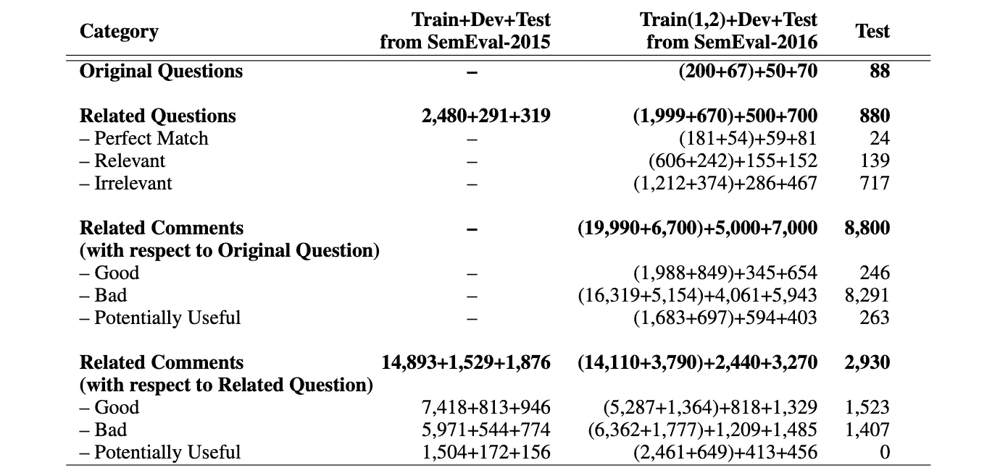
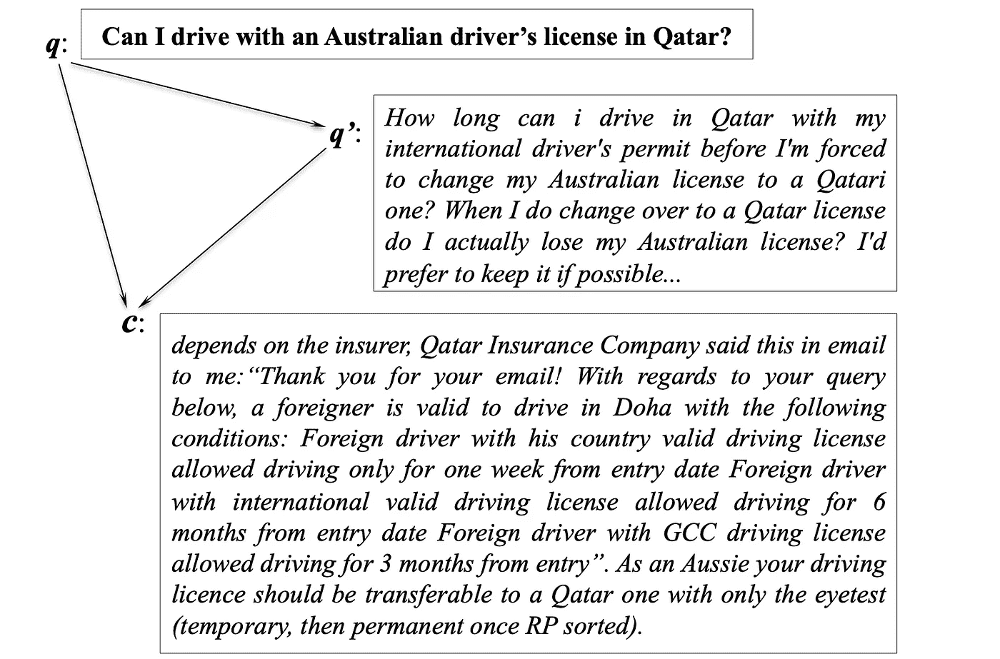

# SemEval-2017 任务 3 概述:社区问答

> 原文：<https://towardsdatascience.com/an-overview-of-semeval-2017-task-3-community-question-answering-8cfe69133e5a?source=collection_archive---------62----------------------->

## SemEval-2017 的任务 3 由五个问答子任务组成，使用数万个问题和评论的数据集

SemEval 是评估 NLP 模型的主要方法之一，由几个不同的任务组成。今天我们将讨论 [2017 版本的任务 3](https://www.aclweb.org/anthology/S17-2003.pdf) ，包括它的数据是如何收集的，以及它呈现的五个独特的问答子任务。

SemEval-2017 任务 3 数据集概述。今年的任务包括该任务往年版本的数据，这些数据显示在第二列和第三列中。以前的数据用作训练数据，新收集的数据用作测试数据(第四列)。图片鸣谢纳科夫等人，SemEval-2017 Task 3 论文的原作者。

**数据。由于 SemEval 是一个相当大的竞赛，它的数据来源收集得很好，并且有完整的注释。总而言之，数据是以三种方式收集和注释的——评论与它应该回答的问题的相关程度，提议的“相关问题”与原始问题的相关程度，以及提议的“相关问题”的评论对原始问题的回答程度。**

1.  首先，数据是从[卡塔尔生活论坛](https://www.qatarliving.com/forum)收集的，这是一个基于社区的论坛，以线程组织，其中一个问题开始一个线程，对该问题的评论将继续该线程。
2.  对于每个问题，该主题的注释被标注为“好”、“潜在有用”或“坏”。
3.  接下来，每个问题都与谷歌搜索交叉引用(过滤，只包括也来自卡塔尔生活的结果)，以找到相关的问题。这些相关的问题然后根据它们与原始问题的关系被标注为“完全匹配”、“相关”或“不相关”。
4.  最后，相关问题线索中的评论根据其回答原始问题的能力被标注为“好”、“潜在有用”或“坏”。

从卡塔尔生活论坛(q)收集的问题示例、对问题(c)的评论以及来自卡塔尔生活论坛(q’)的相关问题。图片鸣谢纳科夫等人，SemEval-2017 Task 3 论文的原作者。

**子任务。收集的数据允许任务 3 呈现五个主要的子任务。**

*   子任务#1:问题-评论相似度。在第一个子任务中，模型被要求确定一个评论实际上如何回答它应该解决的问题。具体来说，给定一个问题，目标是根据问题线索中的前十条评论与所提问题的相关性对它们进行排序。为了检查模型预测的准确性，指南简单地要求模型将所有“好”的评论放在“潜在有用”和“坏”的评论之上。“潜在有用的”评论不必排在“坏的”评论之上，因为它们在评估期间都被认为是“坏的”。
*   **子任务 2:问题与问题的相似性。**在第二个子任务中，要求模型确定原始问题与提议的“相关问题”的关联程度这里的目标是根据与原始问题的相似性对论坛中的前十个相关问题进行排名(如 Google 所示)。为了实现这一点，模型只需将“完全匹配”和“相关”问题排在“不相关”问题之上，因为评估过程不区分“完全匹配”和“相关”问题。
*   **子任务#3:问题-外部评论相似性。**在第三个子任务中，模型被要求确定来自相关问题线索的评论能够在多大程度上回答原始问题。这里的具体目标是，给定一个原始问题，根据其与原始问题的相关性，对前十个相关问题中的前十个评论(总共 100 个评论)进行排序。同样，该模型只需将“好的”评论排在“潜在有用的”和“坏的”评论之上。此外，只考虑这 100 个评论中的前 10 个结果，这里的理由是现实世界的用户并不真正关心后面的位置会发生什么。就像你从来没有点击过谷歌的第二页一样！
*   子任务#4:对新问题的答案重新排序。在这里，模型被要求根据它们对原始问题的回答程度来排列相关问题的正确答案。具体来说，给定原始问题，为模型提供前 30 个相关问题中的每一个问题的单一正确答案(总共 30 个正确答案),并要求模型根据它们对原始问题的回答程度对这些问题进行排序。同样，只考虑前 10 个结果。
*   子任务#5:重复问题检测。这是 SemEval 的 Task 3 的 2017 版本中引入的一个新的子任务，它实际上与子任务 b 非常相似，注意，这个子任务使用的是从 StackExchange 子论坛而不是卡塔尔生活论坛收集的数据。不过，请放心，这些数据仍然是以与其他子任务相同的格式收集的。因此，在这个任务中，给定一个原始问题，一个模型应该从 50 个建议的候选问题列表中删除项目，以便只保留重复的问题。为了清楚起见，下面是作者提供的一个原始问题和一个重复问题的例子:*为什么面包公司要在面包里加糖？*和*糖在烘焙普通面包中的作用是什么？*

希望你在 SemEval-2017 中学到了很多关于任务 3 的基础知识。对于问答任务来说，这是一个很好的数据集，所以如果你正在寻找这方面的一些评估，我肯定会建议查看原始论文[[链接这里](https://www.aclweb.org/anthology/S17-2003.pdf)。SemEval 中的一些其他任务更受欢迎，但我肯定地说，任务 3 是问答系统中最好的任务，因为它提出了五个基本的子任务，在任何现实世界的问答系统中都非常有用。

此外，我建议总体上检查一下 SemEval。对于分析模型如何评估语言中的语义，这是一个很大的竞争，并且在未来也可能继续是一个顶级的竞争。