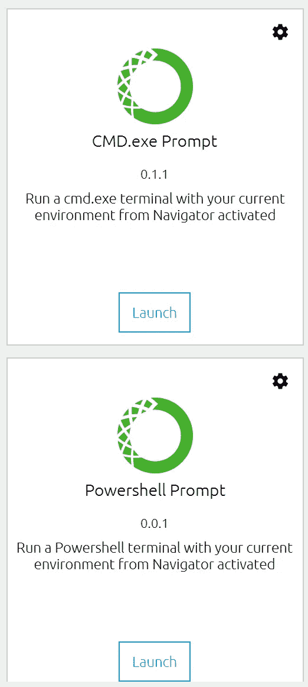

# Anaconda 发行版概述

> 原文：<https://towardsdatascience.com/an-overview-of-the-anaconda-distribution-9479ff1859e6?source=collection_archive---------31----------------------->

将改变这种方式的科学 Python 发行版…由[大卫·克洛德](https://unsplash.com/@davidclode?utm_source=medium&utm_medium=referral)在 [Unsplash](https://unsplash.com?utm_source=medium&utm_medium=referral) 上拍摄

## 科学 Python 发行版将改变你研究数据科学的方式。

Anaconda 是科学 Python 包、工具、资源和 ide 的惊人集合。这个包包括许多重要的工具，数据科学家可以使用这些工具来驾驭 Python 的强大力量。Anaconda 个人版是免费和开源的。这使得使用 Anaconda 变得容易和容易。只需到网站上下载发行版。

 [## Anaconda |世界上最受欢迎的数据科学平台

### 数据科学的现代世界是极其动态的。每天都有新的挑战出现，不可思议的挑战也是如此…

www.anaconda.com](https://www.anaconda.com/) 

拥有超过 2000 万用户，覆盖 235 个地区，超过 24 亿次包下载；Anaconda 已经成长为一个异常庞大的社区。Anaconda 使得连接几个不同的科学、机器学习和数据科学包变得很容易。

**关键特性:**

*   神经网络
*   机器学习
*   预测分析
*   数据可视化
*   偏差缓解

如果您对数据科学感兴趣，那么您应该了解这个 Python 发行版。Anaconda 非常适合深度模型和神经网络。您可以构建模型，部署它们，并与该领域的领先技术集成。Anaconda 针对机器学习任务进行了优化，可以高效运行，并且在开发优秀的算法时可以节省您的时间。发行版中包含 250 多个软件包。可以用`conda install`通过 Anaconda 终端安装其他第三方包。他们基于云的存储库中有超过 7500 个数据科学和机器学习包，您需要的几乎任何包都可以轻松访问。Anaconda 提供个人版、团队版和企业版。还包括对 R 编程语言的支持。

Anaconda 发行版附带了可以在 Windows、Linux 和 MacOS 上使用的包。个人版包括流行的包名，如`numpy`、`pandas`、`scipy`、`sklearn`、`tensorflow`、`pytorch`、`matplotlib`等等。Anaconda 提示符和 PowerShell 使得在文件系统中工作变得容易和易于管理。此外，Anaconda Navigator 上的 GUI 界面使得一切工作异常流畅。如果您正在寻找一个蓬勃发展的数据科学家社区和业内不断增长的支持，Anaconda 是一个很好的选择。在这样的伟大工具的帮助下，开展数据科学项目变得越来越简单。

# 包括在 Anaconda Navigator 中

## Anaconda 提示符和 Powershell

作者图片

## Jupyter 笔记本电脑和 Jupyter 实验室

 [## Jupyter 项目

### Jupyter 笔记本是一个基于网络的交互式计算平台。该笔记本结合了现场代码，方程式…

jupyter.org](https://jupyter.org/) 

允许数据科学家管理工作流并有效实现科学和计算解决方案的开源软件。Jupyter 笔记本强调演示和可读性，是合作项目和有见地的出版物的明智选择。Jupyter 笔记本是开源的，由 Jupyter 社区在 GitHub 上公开开发。

## 皮查姆

 [## py charm:JetBrains 为专业开发人员提供的 Python IDE

### 在 PyCharm 处理日常事务时节省时间。专注于更大的事情，拥抱以键盘为中心的方法…

www.jetbrains.com](https://www.jetbrains.com/pycharm/) 

一个顶级的 Python IDE，它包含了所有的特性和预安装的包。凭借舒适的环境管理和易于设置的工作站，PyCharm 在 Python 中独树一帜。无论是社区版、专业版还是企业版，都有适合每个人的版本。

## Visual Studio 代码

 [## Visual Studio 代码-代码编辑。重新定义的

### Visual Studio Code 是一个重新定义和优化的代码编辑器，用于构建和调试现代 web 和云…

code.visualstudio.com](https://code.visualstudio.com/) 

您可以为编程选择的最佳开源解决方案之一。这个文本编辑器是初学者和高级程序员的绝佳选择。Visual Studio 代码提供了 IntelliSense，一个内置的调试器，一个令人难以置信的可定制环境，以及与流行扩展的集成。

## Qt 控制台

 [## Jupyter 的 Qt 控制台- Jupyter Qt 控制台 4.7.7 文档

### 2020 年 9 月 3 日发布 4.7.7 版，启动 Qt 控制台:Qt 控制台是一个非常轻量级的应用程序…

qtconsole.readthedocs.io](https://qtconsole.readthedocs.io/en/stable/#) 

一个轻量级的程序，就像一个充气的控制台。它提供了语法高亮、内嵌图形、呼叫提示、REPL 等等。

## Spyder

 [## Home - Spyder IDE

### Spyder 是一个强大的科学环境，用 Python 编写，为 Python 服务，由科学家设计，为科学家服务…

www.spyder-ide.org](https://www.spyder-ide.org/) 

高度先进的数据科学 Python 平台。这个 IDE 是用 Python 为 Python 创建的，拥有一些非常健壮的工具集。凭借编辑器、IPython 控制台、变量资源管理器、高级绘图功能、内置调试器和对象文档助手工具，Spyder IDE 是大量数据科学任务的理想选择。

## Glueviz

 [## 粘合:多维关联数据探索

### Glue 是一个开源的 Python 库，用于探索相关数据集内部和之间的关系。使用 Glue，用户可以…

glueviz.org](https://glueviz.org/) 

使用 Glueviz 将您的数据集和数据链接到单个图表或图形。这个 Python 库允许您通过组合数据集并使用其中的逻辑链接来查看数据可视化。

## 橙色 3

 [## 数据挖掘

### 通过巧妙的数据可视化执行简单的数据分析。探索统计分布、箱线图和散点图…

橘子生物实验室](https://orange.biolab.si/) 

如果数据挖掘是你的目标，那么 Orange 3 已经覆盖了你。Orange 3 是为数据挖掘而构建的工具集。它们提供了优秀的 GUI、可扩展的附加功能、数据管理和交互式数据可视化。此外，因其引人入胜的可视化效果、数字和图表而受到教师和学生群体的喜爱。

## r 工作室

 [## RStudio |面向数据科学团队的开源专业软件

### 控制您的 R 和 Python 代码一个 R 和 Python 的集成开发环境，带有一个控制台…

rstudio.com](https://rstudio.com/) 

使用 R 编程语言的推荐环境。R Studio 有两个版本，R Studio 桌面版和 R Studio 服务器版。智能语法解决方案、编辑器中的 R 执行、助手工具、目录管理、集成的 R 文档和帮助、内置调试器以及包工具只是 R Studio Desktop 提供的部分功能。R Studio Desktop 和 R Studio Server 有开源版和专业版。

# 结论

如果您是数据科学的新手，想要获得 Python 的完整体验，或者如果您是一位经验丰富的数据科学家，正在寻找更多的功能和效率，我真的建议您看看这个惊人的发行版。它使包的管理和部署变得快速而简单。Anaconda 打包了工具、ide、包和库，对于数据科学来说是一个真正可信的决策。因为 Anaconda 的受欢迎程度似乎在许多新的行业和领域中不断扩大，而这些行业和领域又刚刚开始使用这种高级功能，所以现在开始使用这个不断增长的工具和资源包是再好不过了。我希望这篇文章有助于详细介绍 Anaconda 发行版，帮助那些想了解它带来了什么和包含了什么的人。感谢您的阅读和快乐编码！