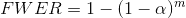
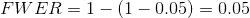
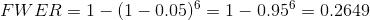
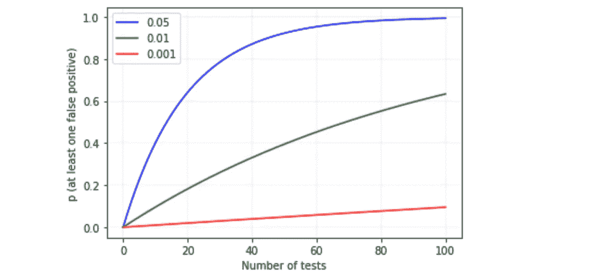
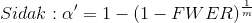
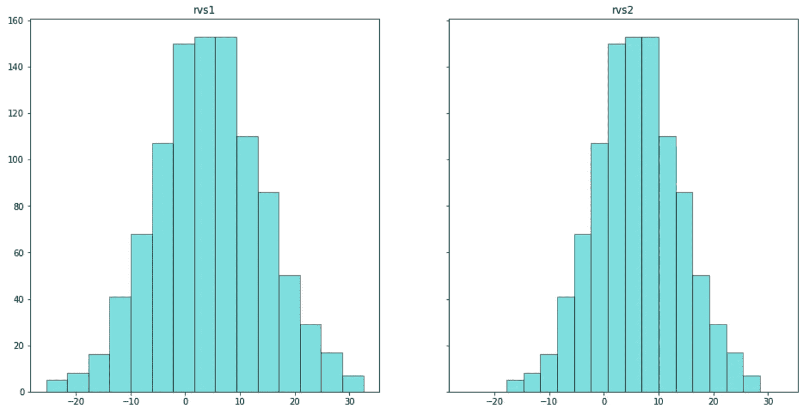
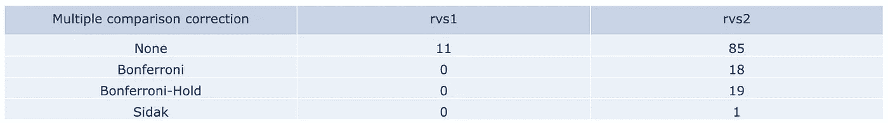

# 多重比较问题概述

> 原文：<https://towardsdatascience.com/an-overview-of-the-multiple-comparison-problem-166aa5fcaac5?source=collection_archive---------19----------------------->

## 本文通过介绍相关问题、描述可能的修正以及使用 python 代码展示一个可视化示例，对多重比较问题进行了概述。

在[像素](https://www.pexels.com/photo/person-about-to-catch-four-dices-1111597/)上由[摄影师拍摄](https://www.pexels.com/@fotografierende)

2012 年， [IgNobel 奖](https://en.wikipedia.org/wiki/Ig_Nobel_Prize)被授予了一项对一条死鲑鱼的功能磁共振成像研究[1],因为在对体素进行多次测试后，他们在一条死鲑鱼的大脑中发现了显著的活动。

这项研究是所谓多重校正问题的一个例子，在[维基百科](https://en.wikipedia.org/wiki/Multiple_comparisons_problem)中定义为“*当一个人同时考虑一组统计推断或推断基于观察值选择的参数子集*时出现的问题。换句话说，这是在同一实验中进行大量统计测试时出现的问题，因为我们做的测试越多，获得至少一个具有统计显著性的测试的概率就越高。

在对死亡鲑鱼的研究中，作者研究了典型 fMRI 体积中 130，000 个体素的大脑活动。由于大量的测试，获得至少一个假阳性的概率几乎是确定的(正如它发生的那样)。

因此，当运行多个测试时，意识到这个问题是很重要的。因此，为了警告数据科学家，本文旨在:

1.  讲授如何根据α和检验次数计算两组间获得统计显著性的概率。
2.  呈现多个比较校正。
3.  使用 python 代码运行实验并显示结果。

**1。根据α和测试次数计算两组间获得统计显著性的概率的公式**

这个概率被称为[家族错误率](https://www.statisticshowto.datasciencecentral.com/familywise-error-rate/) (FWER)，其公式为:

其中“α”是单独测试的α水平(例如 0.05)，而“m”是测试次数

该错误率表示在执行多个假设测试时做出一个或多个错误发现的概率。

如果我们运行一个测试(α = 0.05)来评估两组之间是否有统计学显著性差异，则 FWER 为:

然而，如果我们运行相同的测试六次，FWER 将不再是 5%,而是增加到大约 26%。

图 1 显示了根据α和测试次数的 FWER 图。

图一。对于不同的α值，FWER 或 I 型错误率如何随着测试次数的增加而增加的图表。来源:作者照片

**2。多重比较校正**

有不同的方法可以防止这个问题发生。本文介绍了三种多重比较校正:Bonferroni、Bonferroni-Hold 和 idák。

*   [邦费罗尼校正](https://en.wikipedia.org/wiki/Bonferroni_correction)

Bonferroni 校正是最简单和最保守的方法，它将整组比较的α值设置为单个测试的α值除以执行的测试次数。

其中“α”是单个试验的α水平,“m”是进行试验的次数

“α”是一个新的阈值，需要达到该阈值才能将单个测试归类为显著性。

*   [邦费罗尼-霍姆校正](https://en.wikipedia.org/wiki/Holm%E2%80%93Bonferroni_method)

Bonferroni 方法的代价是，通过防止假阳性错误，无法拒绝一个或多个假零假设的风险增加了。因此，该另一种方法通过将获得的 p 值从最低到最高排序并将它们与α/m 到α的标称α水平进行比较来改进上述方法

最低 p _ value

*   [idák 校正](https://en.wikipedia.org/wiki/%C5%A0id%C3%A1k_correction)

该方法还定义了一个新的α'来达到。该阈值使用 FWER 和测试次数来定义。

其中“FWER”是家族误差率,“m”是测试次数

**3。多重比较问题及例题纠正**

本例旨在通过比较两个具有不同平均值( *rvs1* 为 5，rvs2 为 6.5)和标准偏差( *rvs1* 为 10， *rvs2* 为 8)的正态分布( *rvs1* 和 *rvs2* )与 100 个具有类似于 *rvs1 的平均值和标准偏差的正态分布来说明上述所有术语*

常识告诉我们 rvs1 应该**没有统计学意义，**但是 rvs2 应该**有统计学意义。**

导入 Python 库

用随机数创建两个正态分布。rvs1 的平均值为 5，rvs2 的平均值为 6.5。rvs1 的标准偏差为 10，rvs2 的标准偏差为 8

图二。左边是正态分布 rvs1 的图。右边是正态分布 rvs2 的图。

*t 检验分析功能*:

*Bonferroni 校正功能*:

*Bonferroni-Hold 校正功能*:

*idák 校正功能*:

通过 *rvs1* 和 *rvs2* 运行上述四个函数的代码。对于本实验，α为 0.05。

结果是:

表 1

表 1 中的数字表示具有统计显著性的测试次数。

正如所观察到的，t 检验结果表明 rvs1 和 rvs2 在统计上是显著的，无论所有的校正方法如何显示 rvs2 是唯一显著的分布。

***如果你喜欢这篇文章，请考虑*** [***订阅***](https://javiferfer.medium.com/membership) ***。你将获得我所有的内容+所有其他来自牛逼创作者的文章！***

**参考文献**

[1] Craig M. Bennett 等人，[大西洋鲑鱼死后物种间视角的神经相关性:适当多重比较校正的论证](https://teenspecies.github.io/pdfs/NeuralCorrelates.pdf) (2009)，《偶然发现和意外结果杂志》。