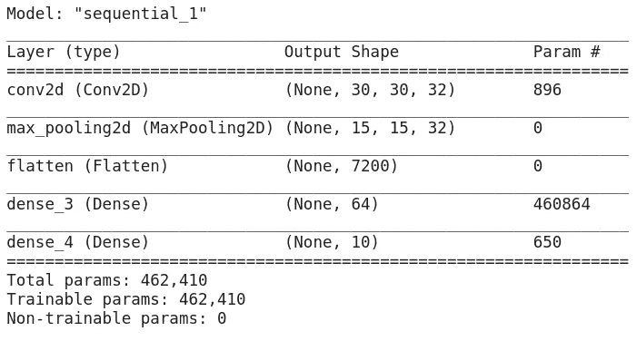
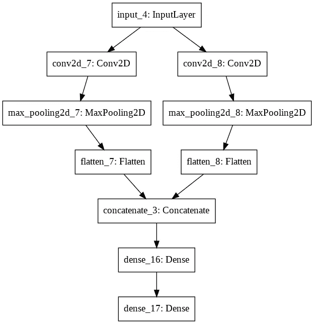

# TensorFlow 2.0 使用概述

> 原文：<https://towardsdatascience.com/an-overview-of-using-tensorflow-2-0-8d841748e680?source=collection_archive---------42----------------------->

## 一个想法的显现。

[透明 tensor flow Logo Png@pngkit.com](https://www.pngkit.com/bigpic/u2e6e6q8y3q8t4w7/)

Tensorflow 已经成为最受欢迎的深度学习库之一。程序员、数据科学家和研究人员可以使用它，通过使用 API 或从头开始编写东西来创建开箱即用的模型。它和你的需求一样抽象。

解决机器学习问题所需的基本步骤序列包括拥有数据集、创建模型、训练和评估模型以及最终部署它。我们将详细讨论这些步骤。不过，在此之前，让我们讨论一些与 TensorFlow 2 相关的有用更新。

## 急切的执行

TensorFlow 2 默认启用了急切执行。在 TensorFlow 的早期版本中，即使是打印张量这样最简单的任务也要创建一个会话。急切执行使代码更加直观。

打印张量 z 值的旧方法。它不是直观的。

更新更直观的方式打印张量(TF2)。

## 比如 Numpy

Numpy 是一个流行的 Python 库，专注于涉及矩阵的数学运算。由于急切的执行，TensorFlow 2 感觉更像 numpy。张量上的“numpy”方法也允许张量转换成 numpy 数组。

TensorFlow 更像 Numpy。

## tf .函数装饰

这个装饰器加速了函数在后续调用中的执行。它允许使用 TensorFlow 使用的底层图模型的性能优势。装饰器告诉 TensorFlow 跟踪函数的计算并提高性能。

@ tf.function decorator 用来提升性能。

## 清洁剂 API

TensorFlow API 已经过清理，其中添加了 tf.keras.layers 和 TF . keras . loss 等命名空间。为了更好地组织，许多命名空间都被重命名，例如 tf.mod 被重命名为 tf.math.mod。少数端点(如 tf.rint)已被弃用。有关所有变更的详细列表，请参考 [TensorFlow 名称空间](https://github.com/tensorflow/community/blob/master/rfcs/20180827-api-names.md)。

# 数据设计

随着时间的推移，机器学习社区已经整合了许多有用的数据集，其中一些可以与深度学习库一起使用。很明显，您可以使用自己的数据并创建一个输入管道来进行训练。例如，“flow_from_directory”可用于高效地读取图像并动态地对其进行扩充。也可以使用 CSV 等文件中存储的数据。然而，在 TensorFlow 2 中，在数据集方面有两个选项—

## 使用 Keras 数据集

Keras datasets 提供回归数据集(如 boston housing)、图像分类数据集(如 mnist)和情感分类数据集(如 imdb)。这些数据集以 numpy 格式提供，并适合内存。

从 keras 数据集导入 MNIST 数据集。**文档** [tf.keras.datasets](https://www.tensorflow.org/api_docs/python/tf/keras/datasets) 。

## 使用张量流数据集

Tensorflow 数据集是使用数据的更快、更有效的方式。这是一种高性能的数据集格式。使用 TensorFlow 数据集读取的数据不是 numpy 格式，而是 tf.data 格式。它由大量面向研究的数据集组成，这些数据集被分类为音频、图像、图像分类、对象检测、结构化、摘要、文本、翻译和视频。这些数据集更加真实。

使用张量流数据集导入 MNIST 数据集。阅读数据集 [TensorFlow 数据集的完整目录。](https://www.tensorflow.org/datasets/catalog/overview) **文档** [张量流 _ 数据集。](https://www.tensorflow.org/datasets)

# 模型设计

TensorFlow 2 已经推荐使用 Keras 作为其官方 API。在 Tensorflow 中设计模型就像插入内置层一样简单，从零开始为研究应用程序编写一切。

## 顺序 API

顺序 API 用于制作线性模型，一层一层的堆叠在另一层的顶部。使用 add()方法将不同的层(如 Dense、Flatten 和 Conv2D)添加到模型中。一旦你创建了你的模型，你就可以看到模型的概要。顺序 API 是创建模型最常用的 API。基本思想是堆叠一堆层来创建一个模型，该模型随后被编译和进一步训练以得出推论。

顺序卷积神经网络。

模型摘要。**文档**[TF . keras . sequential .](https://www.tensorflow.org/api_docs/python/tf/keras/Sequential)

## 功能 API

顺序 API 建立线性模型，而函数 API 用于建立非线性模型。这些模型的架构类似于有向图(DAG)。这些模型具有接受多个输入、产生多个输出和共享层的能力。

使用函数式 API 创建的模型。

用图形表示模型。**文档** : [Keras 功能 API](https://www.tensorflow.org/guide/keras/functional)

## 子类

子类化允许从头开始写所有的东西。它对创建模型的各个方面提供了更好的控制。框架给出了一个类，其中构造函数定义了要使用的层，调用方法将这些层按顺序放在一起。如果您想了解事情在幕后是如何工作的，推荐使用这种方法。

__init__ 方法定义层。call 方法定义了如何使用已定义的层。您可以打印第 12 行生成的“x”值。你可以得到 x 的值，并对它应用各种数学函数。**文档** : [编写自定义图层和模型](https://www.tensorflow.org/guide/keras/custom_layers_and_models)

# 培训设计

## 使用拟合方法

拟合是用于训练模型的最常用方法。它适用于使用上述任何策略创建的模型。当数据集很小并且适合内存时使用它。

在使用 fit 方法训练模型之前，模型被编译，在此期间为模型指定损失函数、优化器和度量。

使用拟合方法训练模型。**文档** [model.fit()](https://www.tensorflow.org/api_docs/python/tf/keras/Model#fit) 。

## 使用回调

各种图表用于在训练期间监控模型的进度。或者，可以使用回调来监控各种评估指标的状态，并做出决定，例如停止训练、定期保存模型、安排学习速率、可视化训练进度等。它们在训练期间的不同点被调用，例如一个时期的开始、一批的结束等等。回调作为列表传递给 fit 方法。

EarlyStopping 的回调示例，它根据某个条件停止训练。**文档** [回调。](https://www.tensorflow.org/api_docs/python/tf/keras/callbacks)

## 使用 Fit 生成器

这是训练模型的另一种方式。当数据集太大而无法放入内存时，使用拟合生成器方法。fit generator 的一个常见用例是从目录中读取图像，同时对它们应用数据扩充。

fit_generator()的示例。这些图像是从/tmp/data(第 3 行)中读取的，batch_size 为 20(第 16 行)。您还可以在从目录流动时应用放大，如缩放和剪切。**文档** : [fit_generator](https://www.tensorflow.org/api_docs/python/tf/keras/Model#fit_generator)

## 批量使用列车

分批训练在分批水平上工作。它将单个批次作为输入，并在执行反向传播后更新模型参数。它允许我们在每批之间做额外的事情。一个用例是根据您可能稍后收集的一批新样本来更新预训练模型。它也用于 LSTM，其中 LSTM 的状态通常需要在每个数据系列之后复位。

批量训练的一个例子。**文件** : [批量培训](https://www.tensorflow.org/api_docs/python/tf/keras/Model#train_on_batch)

## 编写自定义训练循环

在训练模型时，fit 和 fit_generator 函数抽象了许多细节。但是，如果需要，TensorFlow 2 允许您使用“GradientTape”查看网络的梯度。您还可以看到权重如何使用这些渐变进行更新。基本上，它可以让你更好地控制如何更新权重。讨论自定义训练循环的完整示例可能会让人不知所措。这里已经讨论过[的一个详细例子。](https://www.tensorflow.org/tutorials/customization/custom_training)

## 分布式培训

在训练深度学习模型时，可扩展性至关重要。TensorFlow 2 允许在不对代码进行重大更改的情况下扩大学习任务的规模，以加快学习速度。训练过程可以扩展到多个 GPU、TPU 和机器。定义了多种策略来满足不同的用例。例如，MirroredStartegy 支持在一台机器上对多个 GPU 进行训练，而 MultiWorkerMirroredStrategy 支持在多台机器上进行同步分布式训练，每台机器都可以有多个 GPU。

使用 MirroredStrategy 的示例。代码中只添加了第 4 行和第 6 行，以支持分布式培训。其中的函数是分布式感知的。**文档** : [tf.distribute](https://www.tensorflow.org/api_docs/python/tf/distribute)

# 序列化

一旦模型被训练，它需要被保存以便在生产中使用。在 TensorFlow 2 中，保存模型已使用 SavedModel 格式标准化，该格式保存完整的模型及其权重。SavedModel formal 使使用 TensorFlowJS、TensorFlowLite 或 TensorFlow Serving 部署模型变得更加容易。

使用 saved_model 保存张量流模型。**文档:** [已保存的模型](https://www.tensorflow.org/guide/saved_model)

加载模型以备将来使用。

# 部署

## 使用 TensorFlow 服务

TensorFlow 服务允许机器学习模型作为 REST 或 gRPC(远程过程调用)客户端 API。通过提供 docker 文件，TensorFlow 中的服务变得更加容易。这里已经讨论了一个实现。

## 使用 TensorFlow Lite

移动和物联网设备也可用于部署 TensorFlow 模型。然而，这些设备具有诸如功耗和电池寿命的限制。TensorFlow 提供了一种方法，用于将最初训练的模型转换为它们的轻量级版本，这些版本可以部署在具有功率和处理约束的设备上。它是一个适用于 Android、iOS 和嵌入式系统的轻量级解决方案。

将 SavedModel 转换为较简单的格式。**文档** : [TFLite](https://www.tensorflow.org/lite/guide/get_started)

## 使用 TensorFlowJS

TensorFlowJS 已经能够使用 NodeJS 在浏览器或服务器端直接使用机器学习。一旦保存了模型，就可以使用 TensorFlowJS 轻松地部署它。该模型首先被转换成 TensorFlowJS web 格式，然后被加载用于部署。

用于将 SavedModel 格式转换为 TensorFlow 的脚本。JS web 格式。**文档** : [导入一个模型 TensorFlowJS](https://www.tensorflow.org/js/tutorials/conversion/import_saved_model)

导入转换后的模型并将其用于预测。

# 结论

在 tf.keras 命名空间下整合不同的优化器、度量、损失函数和层之后，我能够在 TensorFlow 2 中编写更一致的代码。急切执行简化了调试。我现在可以使用 python 的标准 print 函数打印出来，而不是创建一个会话来获取张量的值。tf.function decorator 的加入使得使用标准 python 编写的函数能够通过 TensorFlow 进行性能优化。我可以使用 tf.distribute 提供的策略轻松调整我的模型的训练，而无需对代码进行重大更改。

此外， [TensorFlow hub](https://www.tensorflow.org/hub) 允许我通过使用迁移学习来重用机器学习模型，从而加快训练过程。总的来说，TensorFlow 已经成长为一个开发者友好而强大的人工智能库。