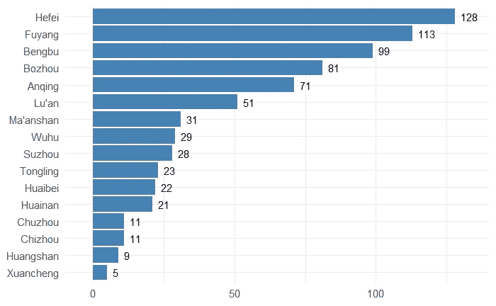
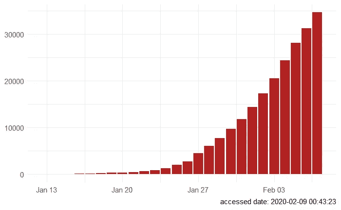
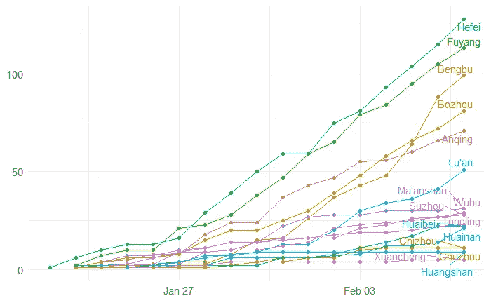
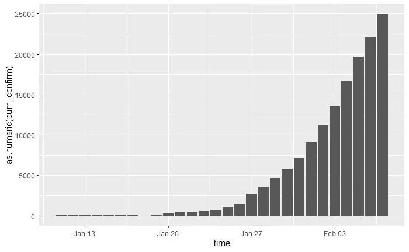
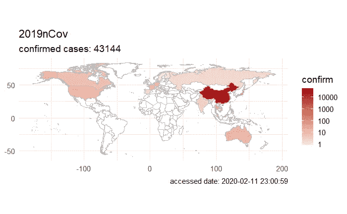
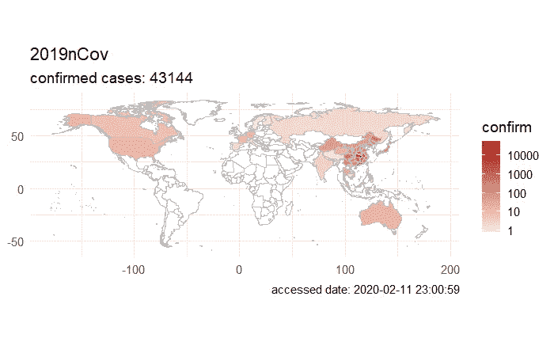
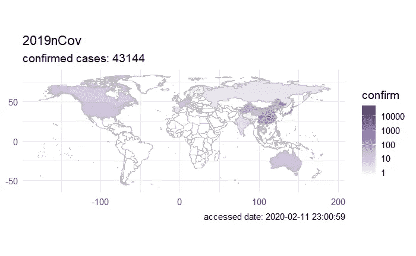
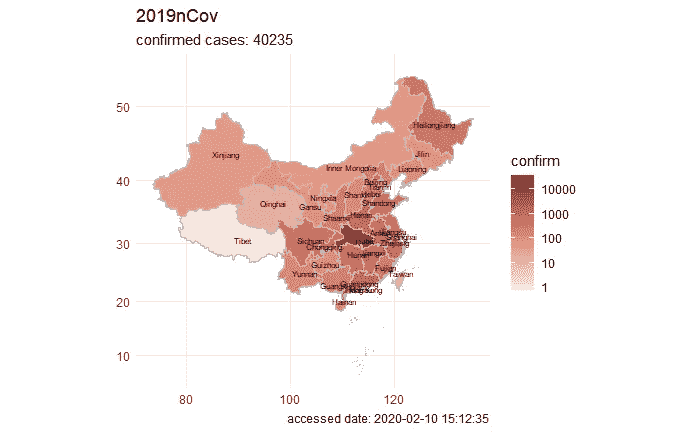

# 探索新型冠状病毒的 R 包

> 原文：<https://towardsdatascience.com/an-r-package-to-explore-the-novel-coronavirus-590055738ad6?source=collection_archive---------7----------------------->

冠状病毒(CoV)是一个大的病毒家族，可导致从普通感冒到更严重疾病的疾病，如中东呼吸综合征(MERS-CoV)和严重急性呼吸综合征(SARS-CoV)。一种新型冠状病毒(nCoV)是一种新的毒株，此前尚未在人类中发现。

最近发现南方医科大学生物信息学教授于广创的一篇博文，讲的是一个 R 包，里面包含了中国乃至全世界最新的 nCov 数据之一。在过去的几天里，我一直在把这个包从中文翻译成英文，以便让每个人都更容易理解。

**注:这篇博文是对于博士的原帖的尝试性英文翻译。我会在页面底部用中文链接他的博文。*

# 第一部分—快速入门

首先，您可以通过在 R 中运行以下命令来轻松安装:

```
remotes::install_github("GuangchuangYu/nCov2019")
```

要获取最新数据，可以用`get_nCov2019()`载入。

```
**library**(nCov2019)
x <- get_nCov2019(lang='en')
```

确保您包含了参数`lang='en'`，否则，数据默认为中文(如果您能阅读中文，这没问题)。

如果打印数据，会显示中国确诊病例总数，以及最新更新时间:

```
> x
China (total confirmed cases): 40235
last update: 2020-02-10 15:12:35
```

*此数据收集自腾讯，at*[*https://news.qq.com/zt2020/page/feiyan.htm*](https://news.qq.com/zt2020/page/feiyan.htm)*，包含冠状病毒的最新公开信息之一。*

## 全局数据

要查看全局数据，您可以运行代码`x['global', ]`:

```
> x['global', ]
                   name confirm suspect dead heal showRate deadRate healRate
1                 China   40235   23589  909 3371    FALSE     2.26     8.38
2                 Japan      96       0    0    1    FALSE     0.00     1.04
3             Singapore      43       0    0    2    FALSE     0.00     4.65
4              Thailand      32       0    0    8    FALSE     0.00    25.00
5     Republic of Korea      27       0    0    3    FALSE     0.00    11.11
6              Malaysia      18       0    0    3    FALSE     0.00    16.67
7             Australia      15       0    0    5    FALSE     0.00    33.33
8               Germany      14       0    0    0    FALSE     0.00     0.00
9               Vietnam      14       0    0    3    FALSE     0.00    21.43
10    United States USA      12       0    0    1    FALSE     0.00     8.33
11               France      11       0    0    0    FALSE     0.00     0.00
12               Canada       7       0    0    0    FALSE     0.00     0.00
13 United Arab Emirates       7       0    0    0    FALSE     0.00     0.00
14       United Kingdom       4       0    0    0    FALSE     0.00     0.00
15                Italy       3       0    0    0    FALSE     0.00     0.00
```

## 中国省市数据

因为数据来源主要集中在中国，你有能力真正深入挖掘中国的案例。比如你有能力看到四川某个城市确诊病例数。

通过`x[]`，您可以轻松查看中国各省的数据。

```
> x[]
             name confirm suspect dead heal showRate deadRate healRate
1           Hubei   29631       0  871 1795     TRUE     2.94     6.06
2       Guangdong    1151       0    1  148    FALSE     0.09    12.86
3        Zhejiang    1092       0    0  215    FALSE     0.00    19.69
4           Henan    1073       0    6  181    FALSE     0.56    16.87
5           Hunan     879       0    1  201    FALSE     0.11    22.87
6           Anhui     830       0    3   89    FALSE     0.36    10.72
7         Jiangxi     771       0    1  102    FALSE     0.13    13.23
8         Jiangsu     492       0    0   80    FALSE     0.00    16.26
9       Chongqing     468       0    2   61    FALSE     0.43    13.03
10       Shandong     466       0    1   64    FALSE     0.21    13.73
11        Sichuan     405       0    1   79    FALSE     0.25    19.51
12        Beijing     337       0    2   44    FALSE     0.59    13.06
13   Heilongjiang     331       0    7   20    FALSE     2.11     6.04
14       Shanghai     299       0    1   48    FALSE     0.33    16.05
15         Fujian     261       0    0   36    FALSE     0.00    13.79
```

如果您想获得更精细的数据，您可以进入每个省，将数据分解到各个城市。例如，如果您想查看湖北省内的案例，您可以使用`x[1,]`或`x['Hubei',]`。

```
> x['Hubei', ] # replace Hubei with any province
           name confirm suspect dead heal showRate deadRate healRate
1         Wuhan   16902       0  681 1044     TRUE     4.03     6.18
2       Xiaogan    2541       0   33   81     TRUE     1.30     3.19
3     Huanggang    2252       0   45  189     TRUE     2.00     8.39
4       Suizhou    1049       0   10   23     TRUE     0.95     2.19
5      Jingzhou    1045       0   15   46     TRUE     1.44     4.40
6     Xiangyang    1019       0    9   42     TRUE     0.88     4.12
7      Huangshi     805       0    3   67     TRUE     0.37     8.32
8       Yichang     749       0    8   43     TRUE     1.07     5.74
9         Ezhou     725       0   24   48     TRUE     3.31     6.62
10      Jingmen     641       0   20   63     TRUE     3.12     9.83
11     Xianning     507       0    4   44     TRUE     0.79     8.68
12       Shiyan     481       0    0   46     TRUE     0.00     9.56
13      Xiantao     416       0    7   16     TRUE     1.68     3.85
14      Tianmen     217       0   10   10     TRUE     4.61     4.61
15        Enshi     187       0    0   24     TRUE     0.00    12.83
```

当然，也可以将这些数据用于可视化。这里有一个安徽的例子。

```
library(forcats)
library(ggplot2)
d = x['Anhui',] # replace Anhui with any province
d$confirm=as.numeric(d$confirm)
d$name = fct_reorder(d$name, d$confirm)ggplot(d, aes(name, confirm)) + 
  geom_col(fill='steelblue') + coord_flip() +
  geom_text(aes(y = confirm+2, label=confirm), hjust=0) +
  theme_minimal(base_size=14) + 
  scale_y_continuous(expand=c(0,10)) +
  xlab(NULL) + ylab(NULL)
```



## 每日数据

您已经在上面看到了如何获得总的累积数据，但是如果您有兴趣查看新添加的案例的数量呢？一种方法是使用参数`by='today'`。要查看中国所有省份新增的数量，您可以运行以下命令:

```
> head(x[by='today'], 10)
        name confirm suspect dead heal isUpdated
1      Hubei    2618       0    0    0      TRUE
2  Guangdong      31       0    0    0      TRUE
3   Zhejiang      29       0    0    0      TRUE
4      Henan      40       0    0    0      TRUE
5      Hunan      41       0    0    0      TRUE
6      Anhui      51       0    0    0      TRUE
7    Jiangxi      32       0    0    0      TRUE
8    Jiangsu      24       0    0    0      TRUE
9  Chongqing      22       0    0    0      TRUE
10  Shandong      31       0    0    0      TRUE
```

类似地，要获得更细粒度的视图，您可以通过运行以下命令来获得数据:

```
> x['Hubei', by='today'] # replace Hubei with any province
           name confirm suspect dead heal isUpdated
1         Wuhan    1921       0    0    0      TRUE
2       Xiaogan     105       0    0    0      TRUE
3     Huanggang     115       0    0    0      TRUE
4       Suizhou      65       0    0    0      TRUE
5      Jingzhou      48       0    0    0      TRUE
6     Xiangyang      57       0    0    0      TRUE
7      Huangshi      52       0    0    0      TRUE
8       Yichang      45       0    0    0      TRUE
9         Ezhou      89       0    0    0      TRUE
10      Jingmen      12       0    0    0      TRUE
11     Xianning      14       0    0    0      TRUE
12       Shiyan      14       0    0    0      TRUE
13      Xiantao      37       0    0    0      TRUE
14      Tianmen      20       0    0    0      TRUE
15        Enshi      21       0    0    0      TRUE
16    Qianjiang       3       0    0    0      TRUE
17  Shennongjia       0       0    0    0      TRUE
18 Location TBD       0       0    0    0      TRUE
```

**注:第二部分中关于每日/历史数据的更多细节。*

## 每日数据摘要

要获得每日数据的累积摘要，可以使用`x`上的`summary`函数。

```
> summary(x)
   confirm suspect dead heal deadRate healRate  date
1       41       0    1    0      2.4      0.0 01.13
2       41       0    1    0      2.4      0.0 01.14
3       41       0    2    5      4.9     12.2 01.15
4       45       0    2    8      4.4     17.8 01.16
5       62       0    2   12      3.2     19.4 01.17
6      198       0    3   17      1.5      8.6 01.18
7      275       0    4   18      1.5      6.5 01.19
8      291      54    6   25      2.1      8.6 01.20
9      440      37    9   25      2.0      5.7 01.21
10     571     393   17   25      3.0      4.4 01.22
11     830    1072   25   34      3.0      4.1 01.23
12    1287    1965   41   38      3.2      3.0 01.24
13    1975    2684   56   49      2.8      2.5 01.25
14    2744    5794   80   51      2.9      1.9 01.26
15    4515    6973  106   60      2.3      1.3 01.27
```

类似地，如果您想查看新的每日案例，您可以使用`today`参数:

```
> summary(x, by="today")
   confirm suspect dead heal deadRate healRate  date
1       77      27    0    0      0.0      0.0 01.20
2      149      53    3    0      2.0      0.0 01.21
3      131     257    8    0      6.1      0.0 01.22
4      259     680    8    6      3.1      2.3 01.23
5      444    1118   16    3      3.6      0.7 01.24
6      688    1309   15   11      2.2      1.6 01.25
7      769    3806   24    2      3.1      0.3 01.26
8     1771    2077   26    9      1.5      0.5 01.27
9     1459    3248   26   43      1.8      2.9 01.28
10    1737    4148   38   21      2.2      1.2 01.29
11    1982    4812   43   47      2.2      2.4 01.30
12    2102    5019   46   72      2.2      3.4 01.31
13    2590    4562   45   85      1.7      3.3 02.01
14    2829    5173   57  147      2.0      5.2 02.02
15    3235    5072   64  157      2.0      4.9 02.03
```

如果您想要可视化累积汇总数据，示例图如下:

```
library(ggplot2)
ggplot(summary(x), aes(as.Date(date, "%m.%d"), as.numeric(confirm))) +
  geom_col(fill='firebrick') + theme_minimal(base_size = 14) +
  xlab(NULL) + ylab(NULL) + 
  labs(caption = paste("accessed date:", time(x)))
```



# 第二部分—历史数据

第一部分只能显示最新的数据，但大多数人真正关心的是每天的历史数据。

*如果要分析一些详细的历史数据怎么办？不要害怕，* `*load_nCov2019()*` *是来救援的。*

```
> x <- load_nCov2019(lang='en')
> x
nCov2019 historical data 
last update: 2020-02-07
```

同样，如果你想使用中文版本，你可以删除`lang='en'`的说法。

注:该数据仅包含中国的病例。不幸的是，您将无法获得全球历史数据。

## 中国的历史数据

使用与`get_nCov2019()`相同的方法，我们可以使用`[`查询所有省级明细数据。

```
> head(x[][c(1:6, 9:11)])
  province          city       time cum_confirm cum_heal cum_dead confirm dead heal
1 Shanghai      Shanghai 2020-02-08         292       41        1           NA     
2   Yunnan        Yunnan 2020-02-08         140       17        0           NA     
3   Yunnan       Kunming 2020-02-08          41        6        0           NA     
4   Yunnan Xishuangbanna 2020-02-08          15        2        0           NA     
5   Yunnan          Yuxi 2020-02-08          14        2        0           NA     
6   Yunnan      Zhaotong 2020-02-08          12        1        0           NA
```

我们可以只选择累积的和新添加的数据。相关列是`province, city, time, cum_confirm, cum_heal, cum_dead, confirm, dead, heal`，所以`x['Hubei', c(1:6,9:11)]`就足够了。

## 中国各省市的详细信息

与上面类似，如果您想更深入地获取特定于省份的数据，那么您只需要包括省份名称:

```
> head(x['Hubei', c(1:6, 9:11)]) # replace Hubei with any province
    province      city       time cum_confirm cum_heal cum_dead confirm dead heal
250    Hubei     Wuhan 2020-02-08       14982      877      608           NA     
251    Hubei   Xiaogan 2020-02-08        2436       45       29           NA     
252    Hubei Huanggang 2020-02-08        2141      137       43           NA     
253    Hubei  Jingzhou 2020-02-08         997       34       13           NA     
254    Hubei Xiangyang 2020-02-08         988       40        7           NA     
255    Hubei   Suizhou 2020-02-08         984       23        9           NA
```

如果您想更深入地挖掘特定于城市的数据，那么您可以在省内指定一个`city`。例如，如果您想查看武汉的数据，您可以执行以下操作:

```
> head(subset(x['Hubei',], city == "Wuhan"))[c(1:6, 9:11)]
     province  city       time cum_confirm cum_heal cum_dead confirm dead heal
250     Hubei Wuhan 2020-02-08       14982      877      608           NA     
612     Hubei Wuhan 2020-02-07       13603      698      545           NA     
972     Hubei Wuhan 2020-02-06       11618      535      478           NA     
1084    Hubei Wuhan 2020-02-05       10117      432      414           NA     
1464    Hubei Wuhan 2020-02-04        8351      369      362    1967   49   65
1976    Hubei Wuhan 2020-02-03        6384      303      313    1242   48   79
```

然后，您可以将这些数据用于可视化。例如:

```
library(ggplot2)
require(ggrepel)d <- x['Anhui',] # replace Anhui with any provinceggplot(d, aes(time, as.numeric(cum_confirm), group=city, color=city)) +
  geom_point() + geom_line() +
  geom_text_repel(aes(label=city), data=d[d$time == time(x), ], hjust=1) +
  theme_minimal(base_size = 14) + theme(legend.position='none') +
  xlab(NULL) + ylab(NULL)
```



## 中国的汇总结果

与`get_nCov2019()`类似，您也可以对数据调用`summary()`函数。

```
> head(summary(x)[,1:5])
         province       time cum_confirm cum_heal cum_dead
1        Shanghai 2020-02-07         281       30        1
2          Yunnan 2020-02-07         138       12        0
17 Inner Mongolia 2020-02-07          52        5        0
29        Beijing 2020-02-07         315       34        2
30         Taiwan 2020-02-07          16        1        0
31          Jilin 2020-02-07          69        4        1
```

如果您想查看特定省份的汇总，您只需将省份名称添加到`summary`中，如下所示:

```
> summary(x, 'Hubei')[,1:5]
     province       time cum_confirm cum_heal cum_dead
251     Hubei 2020-02-07       24953     1119      699
611     Hubei 2020-02-06       22112      818      618
723     Hubei 2020-02-05       19665      651      549
1103    Hubei 2020-02-04       16678      520      479
1615    Hubei 2020-02-03       13522      396      414
1792    Hubei 2020-02-02       11177      295      350
2325    Hubei 2020-02-01        9074      215      294
2482    Hubei 2020-01-31        7153      166      249
2820    Hubei 2020-01-30        5806      116      204
3452    Hubei 2020-01-29        4586       90      162
3673    Hubei 2020-01-28        3554       80      125
3803    Hubei 2020-01-27        2714       47      100
4225    Hubei 2020-01-26        1423       44       76
4488    Hubei 2020-01-25        1052       42       52
4710    Hubei 2020-01-24         729       32       39
```

这是另一个快速可视化的例子:

```
ggplot(summary(x, 'Hubei'), aes(time, as.numeric(cum_confirm))) +
  geom_col()# or city-specific
# ggplot(subset(x['Hubei',], city == "Huanggang"), aes(time, as.numeric(cum_confirm))) + geom_col()
```



# 第三部分—地图绘制

## 世界地图

得到世界地图的一个情节真的很简单。只需要三行代码:

```
require(nCov2019)
x = get_nCov2019(lang='en')
plot(x)
```



如你所见，与其他地方相比，中国确诊病例的数量高得吓人。你现在可能会想，有没有一种方法可以分解中国的案例？当然可以，但是你必须先安装`chinamap`，才能得到中国地图。

```
remotes::install_github("GuangchuangYu/chinamap")
```

安装后，您可以运行以下代码来查看中国各地的确诊病例。

```
require(chinamap)cn = get_map_china()
## translate province 
cn$province <- trans_province(cn$province)plot(x, chinamap=cn)
```

**注意:为了给中国着色，省份必须如上翻译。*



如果红色不适合你，你可以使用`palette`参数随意改变它:

```
plot(x, chinamap=cn, palette="Purples")
```



## 中国地图

为了更好地了解中国的情况，你可以在情节中添加一个`region = ‘china'`参数。我建议使用`font.size=2`,这样省的文本就不会太大。

```
plot(x, region='china', chinamap=cn, font.size=2)
```



如果到目前为止你已经看完了所有的内容，非常感谢！这是我的第一篇博客，但绝对不是最后一篇。如果你正在寻找余博士的中文帖子，我会在本页底部链接它们。

任何评论、问题或总体反馈总是。请随时通过我的[*LinkedIn*](https://www.linkedin.com/in/patricktung/)*联系我。*

*Thank you Dr. Yu for the package, as well as allowing me to contribute. And special thanks to Tencent and 新一线城市研究所×8 点健闻 for making the data available in the first place.*

## 于博士文章的链接:

*   [检索疫情数据的 R 包来了！](https://mp.weixin.qq.com/s/_0D8ENb-4lGm4UV16Ok28A)
*   [各省市的疫情历史数据来了！](https://mp.weixin.qq.com/s/lrQWGKj-mReWrxfi_4Sw9A)
*   [疫情地图全搞定，小白都会画！](https://mp.weixin.qq.com/s/bPXdOGFzFK5dWLTEOEJB3g)