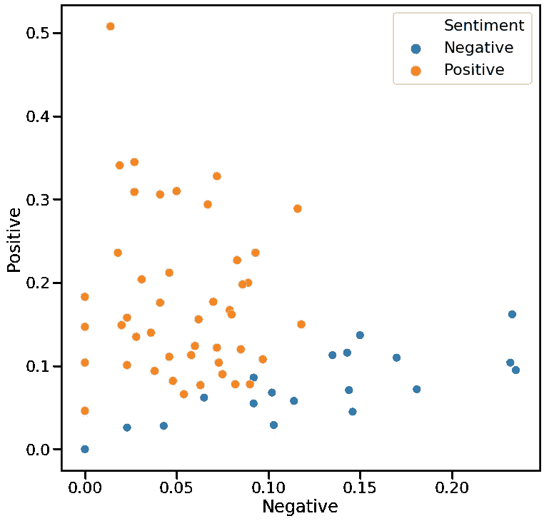

# VADER 简介

> 原文：<https://towardsdatascience.com/an-short-introduction-to-vader-3f3860208d53?source=collection_archive---------46----------------------->

## 对我在 Spotify 上播放最多的歌曲进行半监督情感分析。

[让-菲利普·德尔伯格的照片](https://unsplash.com/photos/WP7V0s8-8Ls)

答几周前，我写了一篇[文章](/become-a-lyrical-genius-4362e7710e43)，讲述如何通过几行代码获得任何 Spotify 播放列表的歌词。在过去的两年里，Spotify 进行了一场聪明的营销活动，它编辑了一份年度最佳 100 首歌曲的播放列表。这通常会在社交媒体上传播，因为人们会分享他们在过去 365 天里在淋浴时摇头晃脑和唱歌的内容。我认为这将是我尝试一些半监督情绪分析的完美播放列表，同时希望发现一些关于我自己的收听习惯的有趣事实。

# nltk .情操.维德

**价觉词典和情感推理机(VADER)**

## 它是什么。

VADER 是`nltk.sentiment` Python 库中的一个模块，它是专门为处理社交媒体环境中产生的文本而创建的，然而，它当然也可以处理源自其他上下文的语言。当被分析的数据未被标注时，VADER 能够检测出给定文本的情感极性(积极或消极)。在传统的情感分析中，算法有机会从标记的训练数据中学习。一个经典的例子是根据给定评论家的书面评论来预测电影评论的星级。星级将是目标变量，文本将是预测变量。

在歌词的情感分析中，我们没有任何标签。歌词没有按 0 到 10 分(0 为负面，10 为正面)评分。那么，VADER 如何判断市场情绪呢？

VADER 使用情感相关词汇词典来确定给定文本的整体情感。下面是词典结构的一个例子，每个单词都有一个配价等级:

VADER 利用亚马逊的机械土耳其人(Mechanical Turk)建立了这个标签化的词典，这是一个众包平台，向“众包工作者”支付报酬，让他们一起完成任务，从而产生了一种令人印象深刻的高效方法。

## 预处理。没有。

VADER 令人难以置信的是，它不需要大量的预处理工作。与 NLP 的一些有监督的方法不同，不需要预处理，例如记号化和词干化/词尾化。你几乎可以插入任何文本，它将决定情绪。

VADER 甚至聪明到能够理解非常规文本的化合价，包括表情符号(即:-()、大写(即 sad vs SAD)和扩展标点符号(即？vs？？？).这就是该模块如此擅长分析社交媒体文本的原因。此外，VADER 删除停止字自动，所以没有必要这样做你自己。

## 与 VADER 合作

我们可以在命令行中使用`pip install nltk`在我们的设备上安装这个库。然后，我们需要使用下面截取的第一行代码将 VADER 导入到我们的编程环境中。

然后，我们可以初始化情感分析对象，并使用`polarity_scores()`方法来确定字符串的情感。其输出是四个标准化的分数:

1.  { ' neu ':0–1 }—陈述的中立程度。
2.  { ' neg ':0–1 }—陈述的负面程度。
3.  { ' pos ':0–1 }—陈述的积极程度。
4.  { ' compound ':-1–1 }—陈述的总体情绪。

# 我的 2019 音乐品味

我们开始吧。在我去年播放最多的 100 首歌曲中，有 66 首歌词是我用我在[之前的一篇文章](/become-a-lyrical-genius-4362e7710e43)中概述的方法获得的(我的音乐库中有很大一部分是电子版的，没有歌词元素)。

下面的图表显示了每首歌歌词中积极和消极的“数量”。积极情绪多于消极情绪的歌曲会有一个正的复合分数，因此会有积极的情绪，反之亦然。

令我惊讶的是，45 首(68%)歌曲被认为是积极向上的。在进行这种分析时，我预计我的大多数歌曲都会有负面情绪。

这很可能是因为一首歌的歌词显然没有描绘出全貌。例如，对“爱”有强烈感情的句子可能看起来是积极的，然而，在它们后面有悲伤的旋律，它们可能会坚定地属于悲伤的情歌类别。

展望未来，看看这些年来我的听力习惯是如何改变的会很有趣。不幸的是，Spotify 只向用户提供了过去两年中播放次数最多的 100 首歌曲的播放列表，但当有更多数据可用时，我认为可以进行一些有趣的分析。尤其是如果 Spotify 将自己对歌曲的评级包括在内，比如通过其 API 提供的“可跳舞性”和“活力”。

*谢谢你读到这里！我希望您喜欢这个关于 VADER 的简短介绍，并可以继续在您自己的数据集上尝试它。我很想听听你在评论里想说些什么。如果你想直接联系我，请在 LinkedIn***上给我留言。**