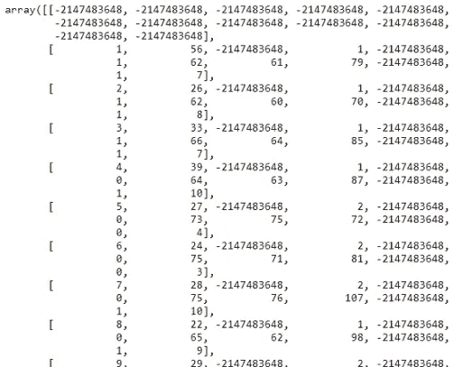

# Numpy 的终极备忘单

> 原文：<https://towardsdatascience.com/an-ultimate-cheat-sheet-for-numpy-bb1112b0488f?source=collection_archive---------33----------------------->


由 [Unsplash](https://unsplash.com?utm_source=medium&utm_medium=referral) 上的 [Pietro Jeng](https://unsplash.com/@pietrozj?utm_source=medium&utm_medium=referral) 拍摄

## 日常工作所需的所有 Numpy 功能

Numpy 是一个开源的 Python 库。这个库对于使用 python 的数据科学家来说是必不可少的。其他一些重要的库，如 Pandas、Scipy，都是在 Numpy 库的基础上构建的。所以我决定做一个小抄。在这里，我包含了迄今为止我使用过的所有 Numpy 函数。我相信这些功能足以满足您作为数据科学家或数据分析师的日常工作需求。

> 我将从最基本的 Numpy 函数开始，慢慢向更高级的函数发展。但是使用 Numpy 很容易。你在这里找不到任何复杂的编码技巧。

## [Numpy 是什么？](https://numpy.org/doc/stable/user/whatisnumpy.html)

在 Numpy 文档中，Numpy 是这样定义的:

> NumPy 是 Python 中科学计算的基础包。这是一个 Python 库，它提供了一个多维数组对象、各种派生对象(如掩码数组和矩阵)以及一系列对数组进行快速操作的例程，包括数学、逻辑、形状操作、排序、选择、I/O、离散傅立叶变换、基本线性代数、基本统计操作、随机模拟等等。

我每天都使用这个图书馆。如果是 python 用户，大多数数据科学家都会这么做。它快速、易用、易懂、简单。我不想写太多关于它如何以及为什么这么好。因为当你阅读这篇文章的时候，你会亲眼看到。

> 我的目标是记录 Numpy 每天使用的方法。

如题，是 Numpy 指南。它也可以用作备忘单。如果您正在使用 Numpy 库，或者计划在将来使用，或者试图学习，这个页面可以成为您日常生活的一个很好的资源。

> **这些是这里将要涉及的主题:**

1.  Numpy 数组基础
2.  重复
3.  数学
4.  统计数字
5.  初始化不同类型的数组
6.  重新排列或重组数组
7.  数组的索引和切片
8.  添加行或列
9.  追加、插入、删除和排序
10.  随意
11.  文件导入、保存和加载

开始吧！！

# Numpy 数组基础

这部分是

我在整个练习中使用了一个 Jupyter 笔记本。第一个导入数字。

```
import numpy as np
```

制作一个 Numpy 数组。为此，我们需要传递一个 Python 列表。

输入:

```
a = np.array([1,2,3])
a
```

输出:

```
array([1, 2, 3])
```

在数组 a 中，我使用了所有的整数。现在，制作一个浮点数组:

输入:

```
b = np.array([[9.0, 10.0, 6.0], [6.0,1.0,7.0]])
b
```

输出:

```
array([[ 9., 10.,  6.],
       [ 6.,  1.,  7.]])
```

让我们试着做一个既有整型又有浮点型的数组:

输入:

```
np.array([1, 3.0, 0.004, -2])
```

输出:

```
array([ 1\.   ,  3\.   ,  0.004, -2\.   ])
```

注意，Numpy 自动将整数转换成浮点数！

找出数组 a 和 b 的维数:

输入:

```
a.ndim
```

输出:

```
1
```

输入:

```
b.ndim
```

输出:

```
2
```

数组“a”是一维数组，数组 b 是二维数组。

现在，找出数组‘a’和‘b’的形状:

输入:

```
a.shape
```

输出:

```
(3,)
```

输入:

```
b.shape
```

输出:

```
(2, 3)
```

数组“a”是一维数组。所以，它在形状上只有一个值。但是数组“b”是一个二维数组。所以，它的形状是 2 x 3。这意味着它有 2 行 3 列。

> **求数组的长度:**

输入:

```
len(a)
```

输出:

```
3
```

输入:

```
len(b)
```

输出:

```
2
```

数组“a”的长度为 3，因为它包含 3 个元素。数组“b”是一个二维数组。所以，数组的长度并不意味着数组中元素的数量。长度是指其中一维数组的个数或其中的行数。它有两排。所以，长度是 2。

# 重复

有几种不同的方法来重复数组的元素。如果你想重复整个数组，

输入:

```
np.array([2,4,6]*4)
```

输出:

```
array([2, 4, 6, 2, 4, 6, 2, 4, 6, 2, 4, 6])
```

看，数组[2，4，6]重复了 4 次。

这里是如何做元素方面的重复，

输入:

```
np.repeat([1,2,3], 3)
```

输出:

```
array([1, 1, 1, 2, 2, 2, 3, 3, 3])
```

这次每个元素重复 3 次。

让我们用这个来表示一个二维数组，

输入:

```
arr = np.array([[2, 4, 6]])
arr
```

输出:

```
array([[2, 4, 6]])
```

现在，对它重复使用:

输入:

```
np.repeat(arr,3,axis=0)
```

输出:

```
array([[2, 4, 6],
       [2, 4, 6],
       [2, 4, 6]])
```

这里，我们提到了轴= 0。因此，重复发生在轴 0 方向或行方向。

输入:

```
np.repeat(arr,3,axis=1)
```

输出:

```
array([[2, 2, 2, 4, 4, 4, 6, 6, 6]])
```

轴 1 表示列的方向。因此，重复发生在列的方向。

# 数学

在这一部分，我将展示数学运算。大多数操作都是不言自明的。我将从一个数组的数学运算开始。

输入:

```
a = np.array([1,2,3,4])
a
```

输出:

```
array([1, 2, 3, 4])
```

输入:

```
a+2
```

输出:

```
array([3, 4, 5, 6])
```

它给数组的每个元素加 2。

输入:

```
a-2
```

输出:

```
array([-1,  0,  1,  2])
```

您可以简单地以这种方式使用类似的操作，例如:

输入:

```
a/2
```

输出:

```
array([0.5, 1\. , 1.5, 2\. ])
```

输入:

```
a**2
```

输出:

```
array([ 1,  4,  9, 16], dtype=int32)
```

两个星号表示指数。a 中的每个元素都是平方的。

输入:

```
np.sqrt(a)  #square root
```

输出:

```
array([1\.        , 1.41421356, 1.73205081, 2\.        ])
```

我们还可以执行一些三角运算:

输入:

```
np.cos(a)
```

输出:

```
array([ 0.54030231, -0.41614684, -0.9899925 , -0.65364362])
```

输入:

```
np.sin(a)
```

输出:

```
array([ 0.84147098,  0.90929743,  0.14112001, -0.7568025 ])
```

输入:

```
np.tan(a)
```

输出:

```
array([ 1.55740772, -2.18503986, -0.14254654,  1.15782128])
```

现在看看我们如何在两个数组或矩阵中做一些数学运算。首先，再做一个数组，

输入:

```
b = np.array([3,4,5,6])
```

输出:

```
array([3, 4, 5, 6])
```

提醒一下，我们的数组“a”是这样的:

```
array([1, 2, 3, 4])
```

现在，我们有两个数组，a 和 b。让我们做同样的数学运算。同样，它简单明了，

输入:

```
a + b
```

输出:

```
array([ 4,  6,  8, 10])
```

同样，您可以执行以下操作:

```
a - b
a*b
a/b
a**b
```

另一个广泛使用的操作是，

输入:

```
a.dot(b)
```

输出:

```
50
```

什么是 a.dot(b)？它是逐元素的乘法，然后像这样加法，

```
1*3 + 2*4 + 3*5 + 4*6
```

其中数组“a”是[1，2，3，4]，数组 b 是[3，4，5，6]。

您也可以编写稍微不同的语法，

```
np.dot(a, b)
```

这是一样的。输出将是 50。

我们可以在多维数组中使用这种点过程。让我们做两个多维数组，

输入:

```
c = np.array([[3, 5, 1], [6, 4, 9]])
c
```

输出:

```
array([[3, 5, 1],
       [6, 4, 9]])
```

输入:

```
d = np.array([[5,2], [7,9], [4, 3]])
d
```

输出:

```
array([[5, 2],
       [7, 9],
       [4, 3]])
```

我们准备对多维数组进行“点”操作，

输入:

```
c.dot(d)
```

输出:

```
array([[54, 54],
       [94, 75]])
```

> 当输入为 2D 阵列时，“点”函数的行为类似于矩阵乘法。

这意味着只有当第一个数组的列数与第二个数组的行数匹配时，才能执行“点”操作。

如果第一个数组是 m x n，第二个数组应该是 n x p。

矩阵乘法有另一种表达方式，

输入:

```
np.matmul(c, d)
```

输出:

```
array([[54, 54],
       [94, 75]])
```

> *‘NP . mat mul’在一维数组中不起作用*

> 记住，这个乘法法则不适用于其他运算，如加、减或除。我们需要相同形状和大小的数组来对一个矩阵进行加法、减法或除法运算。

# 统计数字

Numpy 也有基本的统计操作。这里有一些例子。

先做一个新的数组。

输入:

```
x = np.array([1,3,4,6,-3,-2])
x.sum()
```

输出:

```
9
```

输入:

```
x.max()
```

输出:

```
6
```

输入:

```
x.min()
```

输出:

```
-3
```

输入:

```
x.mean()
```

输出:

```
1.5
```

输入:

```
x.std()  #standard deviation
```

输出:

```
3.2015621187164243
```

还有另外两个非常有用的函数，它们不完全是统计函数，

输入:

```
x.argmin()
```

输出:

```
4
```

输入:

```
x.argmax()
```

输出:

```
3
```

什么' argmin()'或者' argmax()'？

“argmin()”给出数组最小元素的索引，“argmax()”返回数组最大值的索引。

数组“x”的最小元素是-3，最大元素是 6。现在检查他们的索引是否与结果匹配。

# 初始化不同类型的数组

Numpy 中有很多不同的方法来初始化一个数组。在这里我将讨论一些常用的方法:

输入:

```
np.arange(10)
```

输出:

```
array([0, 1, 2, 3, 4, 5, 6, 7, 8, 9])
```

这是初始化数字序列的方法。注意它从 0 开始，到 9 结束。上限始终被排除在外。这里的上限是 10。所以，它停在 9 点。

我们还可以给它添加一个数学运算:

输入:

```
np.arange(10)**2
```

输出:

```
array([ 0,  1,  4,  9, 16, 25, 36, 49, 64, 81], dtype=int32)
```

在这种情况下，我们要求 10 平方的范围，我们在输出数组中得到 0 到 9 的平方。

我们可以按一定的间隔排列数列。

```
np.arange(0, 15, 3)
```

输出:

```
array([ 0,  3,  6,  9, 12])
```

这里，0 是下限，15 是上限，3 是区间。

另一种方法给出的序列稍有不同:

输入:

```
np.linspace(0, 3, 15)
```

输出:

```
array([0\.        , 0.21428571, 0.42857143, 0.64285714, 0.85714286,
       1.07142857, 1.28571429, 1.5       , 1.71428571, 1.92857143,
       2.14285714, 2.35714286, 2.57142857, 2.78571429, 3\.        ])
```

这里，0 是下限，3 是上限，15 是元素数。在这种情况下，Numpy 自动生成 15 个从 0 到 3 等间距的元素。

还有一些其他类型的数组:

输入:

```
np.ones((3, 4))
```

输出:

```
array([[1., 1., 1., 1.],
       [1., 1., 1., 1.],
       [1., 1., 1., 1.]])
```

输入:

```
np.zeros((2, 3))
```

输出:

```
array([[0., 0., 0.],
       [0., 0., 0.]])
```

你可以启动一个三维数组:

输入:

```
np.ones((4,3,2), dtype='int32')
```

输出:

```
array([[[1, 1],
        [1, 1],
        [1, 1]],[[1, 1],
        [1, 1],
        [1, 1]],[[1, 1],
        [1, 1],
        [1, 1]],[[1, 1],
        [1, 1],
        [1, 1]]])
```

这里，(4，3，2)表示 4 个二维数组，每个数组有 3 行 2 列。

输入:

```
np.full((2,2), 30)
```

输出:

```
array([[30, 30],
       [30, 30]])
```

还有另一个名为 full_like 的方法可以替换数组中的元素:

输入:

```
ar = np.array([[2,3], [4,5]])
ar
```

输出:

```
array([[2, 3],
       [4, 5]])
```

输入:

```
np.full_like(ar, 4)
```

输出:

```
array([[4, 4],
       [4, 4]])
```

还有另一种称为单位矩阵的矩阵:

输入:

```
np.identity(5)
```

输出:

```
array([[1., 0., 0., 0., 0.],
       [0., 1., 0., 0., 0.],
       [0., 0., 1., 0., 0.],
       [0., 0., 0., 1., 0.],
       [0., 0., 0., 0., 1.]])
```

这是一个 5 乘 5 的矩阵，其中所有的元素都是 0，只有对角元素是 1。

还有一种叫做“眼睛”。它呈矩阵状:

输入:

```
np.eye(3,3)
```

输出:

```
array([[1., 0., 0.],
       [0., 1., 0.],
       [0., 0., 1.]])
```

输入:

```
np.eye(3,4)
```

输出:

```
array([[1., 0., 0., 0.],
       [0., 1., 0., 0.],
       [0., 0., 1., 0.]])
```

这些对角线数可以不同于 1。

输入:

```
a = np.array([2,4,5])
np.diag(a)
```

输出:

```
array([[2, 0, 0],
       [0, 4, 0],
       [0, 0, 5]])
```

# 重新排列或重组数组

有不同的方法来重新排列或调整一个数组。

我们来举例学习一下。首先，做一个数组，

输入:

```
x = np.arange(0, 45, 3)
x
```

输出:

```
array([ 0,  3,  6,  9, 12, 15, 18, 21, 24, 27, 30, 33, 36, 39, 42])
```

我在上一节解释了“arange”函数。让我们看看如何重塑它。

输入:

```
x.reshape(3, 5)
```

输出:

```
array([[ 0,  3,  6,  9, 12],
       [15, 18, 21, 24, 27],
       [30, 33, 36, 39, 42]])
```

我们通过了(3，5)。所以，它变成了一个有 3 行 5 列的二维数组。我们可以通过以下方式实现同样的目标:

```
x.resize(3,5)
```

如果我们想回到原来的一维数组呢？

方法是这样的，

输入:

```
x.ravel()
```

输出:

```
array([ 0,  3,  6,  9, 12, 15, 18, 21, 24, 27, 30, 33, 36, 39, 42])
```

看，我们找回了原来的数组！

注意另一件事。也就是说我们改变了数组的维度。数组“x”是一维数组。我们通过重塑使它成为一个二维数组。

现在，制作另一个数组来更好地理解它。这是另一个例子。

输入:

```
c = np.array([4,5,6])
c
```

输出:

```
array([4, 5, 6])
```

这次我将使用 resize。重塑也是如此。为了练习调整大小，让我们在这里使用 resize。

输入:

```
c.resize(3,1)
```

输出:

```
array([[4],
       [5],
       [6]])
```

看，我们提供(3，1)作为调整大小的参数。所以它有 3 行 1 列。这是一个 3x1 的矩阵。我们也可以有一个 1×3 的矩阵。

输入:

```
c.resize(1,3)
c
```

输出:

```
array([[4, 5, 6]])
```

原来 c 是一个一维数组。现在它是一个二维数组或矩阵。

> 不要认为你只能改变一维数组的形状。你也可以在一个更高维的数组中这样做。

这里我有一些例子:

输入:

```
x = np.array([[1,2,3,4], [5,6,7,8]])
x
```

输出:

```
array([[1, 2, 3, 4],
       [5, 6, 7, 8]])
```

现在重塑这个二维数组，

输入:

```
x.reshape(4,2)
x
```

输出:

```
array([[1, 2],
       [3, 4],
       [5, 6],
       [7, 8]])
```

你可以用我之前提到的“调整大小”来实现。还有另一种方法，

输入:

```
y = x.reshape(4, -1)
y
```

输出:

```
array([[1, 2],
       [3, 4],
       [5, 6],
       [7, 8]])
```

看起来很困惑？想象一下，你有一个巨大的数组或数据集。在重塑之前，你只知道一个维度。因此，在 reshape 方法中，传递一个维度，对另一个维度使用-1。这样 Numpy 自己就能找到另一个维度。

在上面的例子中，我传递了第一个维度 4。这意味着我告诉 Numpy 做 4 行。我不知道列数。所以我就在那里过了-1。因此，它自动知道要制作 2 列。

> 当我们处理大型数据集或数据帧，并且必须构建机器学习算法时，这是一个非常有用的技巧。

在上面所有的例子中，我们看到了如何重塑和改变尺寸。

这是改变维度的方法。上面的数组“y”是一个 4x2 的矩阵。我们再做一个 2×4 的矩阵。

输入:

```
y.T
```

输出:

```
array([[1, 3, 5, 7],
       [2, 4, 6, 8]])
```

这种方法被称为转置。当你在一个数组或矩阵上使用转置时，它只是改变了维度。2×3 矩阵变成 3×2，3×6 矩阵变成 6×3 或者 1×3 矩阵变成 3×1。

# 索引或切片

索引和切片是一项非常常见的日常任务。让我们来看几个例子:

输入:

```
a = np.array([2,5,1,7,6,3,9,0,4])
```

输入:

```
a[0]
```

输出:

```
2
```

a[0]给出数组的第一个元素。同样，我们可以从 a[1]，a[2]，一直到整个数组。

输入:

```
a[3]
```

输出:

```
7
```

我们也可以切一片，

输入:

```
a[1:5]
```

输出:

```
array([5, 1, 7, 6])
```

这就是解释。我们通过了[1:5]。因此，切片将从索引 1 开始，在索引 5 之前结束。记住，下界包含，上界排除。

在本文中，我不会深入探讨切片和索引。因为我已经写了另一篇文章详细解释了它。请检查。学好它很重要。

[](/indexing-and-slicing-of-1d-2d-and-3d-arrays-in-numpy-e731afff0bbe) [## Numpy 中 1D、2D 和 3D 数组的索引和切片

### 本文从基础到高级展示了 Numpy 数组的索引和切片。

towardsdatascience.com](/indexing-and-slicing-of-1d-2d-and-3d-arrays-in-numpy-e731afff0bbe) 

# 添加行或列

Numpy 有几种不同的方法来添加行或列。首先，我将开始一些堆叠技术。这里有一些例子。

这次我将使用一些列表或数组。Numpy 会在堆叠的时候自动把它们变成数组。

这里有两个列表:

```
x1 = [[2, 4, 3, 7], [2, 5, 3, 1]]
x2 = [1, 0, 9, 5]
```

现在把它们垂直堆叠起来。

输入:

```
np.vstack([x1, x2])
```

输出:

```
array([[2, 4, 3, 7],
       [2, 5, 3, 1],
       [1, 0, 9, 5]])
```

你想叠多少次都可以。

输入:

```
np.vstack([x1, x2, x2])
```

输出:

```
array([[2, 4, 3, 7],
       [2, 5, 3, 1],
       [1, 0, 9, 5],
       [1, 0, 9, 5]])
```

让我们做一些水平堆叠。我们需要行数相同的数组。

“x1”有 2 行。用它做一个数组。

输入:

```
np.array(x1)
```

输出:

```
array([[2, 4, 3, 7],
       [2, 5, 3, 1]])
```

制作另一个数组“x3”。

输入:

```
x3 = np.ones((2,3))
x3
```

输出:

```
array([[1., 1., 1.],
       [1., 1., 1.]])
```

水平堆叠的时间到了。

输入:

```
np.hstack([x1, x3])
```

输出:

```
array([[2., 4., 3., 7., 1., 1., 1.],
       [2., 5., 3., 1., 1., 1., 1.]])
```

> **串联**

添加列或行的另一种方式。但是与堆叠相反，这次我们需要两个相同维度的数组。记住，当我们做垂直堆叠时，我们有一个二维和一维列表。

这是我在这个例子中的两个列表。

```
x1 = [[2, 4, 3, 7], [2, 5, 3, 1]]
x2 = [[1, 0, 9, 5]]
```

串联操作，

输入:

```
np.concatenate((x1, x2), axis=0)
```

输出:

```
array([[2, 4, 3, 7],
       [2, 5, 3, 1],
       [1, 0, 9, 5]])
```

现在，水平连接。但是我们需要两个行数相同的数组。

```
x3 = [[2,4], [7,5]]
```

连接 x1 和 x3。

输入:

```
np.concatenate((x1, x3), axis=1)
```

输出:

```
array([[2, 4, 3, 7, 2, 4],
       [2, 5, 3, 1, 7, 5]])
```

# 追加、插入、删除和排序

你可能知道这些操作的名字。

> **追加**

输入:

```
np.append([2,3], [[4,5], [1, 3]])
```

输出:

```
array([2, 3, 4, 5, 1, 3])
```

输入:

```
np.append([2, 3, 1], [[4, 5], [1,3]])
```

输出:

```
array([2, 3, 1, 4, 5, 1, 3])
```

在这些例子中，我们没有提到任何轴。所以，默认情况下，他们取轴 1 或列方向或水平方向。现在，做一个垂直方向的附加操作。

输入:

```
np.append([[1,3,5], [4,3,6]], [[1,2,3]], axis=0)
```

输出:

```
array([[1, 3, 5],
       [4, 3, 6],
       [1, 2, 3]])
```

> **插入**

这次我们将在某个位置插入一个元素。从新数组开始。

输入:

```
a = np.array([[2, 2], [3, 4], [5, 6]])
a
```

输出:

```
array([[2, 2],
       [3, 4],
       [5, 6]])
```

在数组的开头插入元素 5。

输入:

```
np.insert(a, 0, 5)
```

输出:

```
array([5, 2, 2, 3, 4, 5, 6])
```

首先，了解输入。在(a，0，5)中，a 是数组，0 是我们想要插入元素的位置，5 是要插入的元素。

注意，插入是如何发生的。首先，二维数组“a”被展平为一维数组。然后在索引 0 处添加 5。

我们也可以沿轴插入。

输入:

```
np.insert(a, 0, 5, axis=1)
```

输出:

```
array([[5, 2, 2],
       [5, 3, 4],
       [5, 5, 6]])
```

看，一列 5 被添加到数组“a”中。我们也可以添加一排 5。

输入:

```
np.insert(a, 0, 5, axis=0)
```

输出:

```
array([[5, 5],
       [2, 2],
       [3, 4],
       [5, 6]])
```

> **删除**

我会像以前一样做一个新的数组。

输入:

```
a= np.array([[1,3,2,6], [4,1,6,7], [9, 10, 6, 3]])
a
```

输出:

```
array([[ 1,  3,  2,  6],
       [ 4,  1,  6,  7],
       [ 9, 10,  6,  3]])
```

输入:

```
np.delete(a, [1, 2, 5])
```

输出:

```
array([ 1,  6,  4,  6,  7,  9, 10,  6,  3])
```

像插入操作一样，删除操作也会展平数组。在输入[1，2，5]中是我们想要删除的索引列表。为了看清楚，让我们把原来的数组‘a’展平。

输入:

```
a.flatten()
```

输出:

```
array([ 1,  3,  2,  6,  4,  1,  6,  7,  9, 10,  6,  3])
```

现在检查一下，索引 1、2 和 5 的元素被删除了。

像插入一样，我们可以删除特定的行或列。

删除列索引 1。

输入:

```
np.delete(a, 1, 1)
```

输出:

```
array([[1, 2, 6],
       [4, 6, 7],
       [9, 6, 3]])
```

在输入(a，1，1)中，a 是数组，1 是我们要删除的列的索引，最后一个 1 是轴。

输入:

```
np.delete(a, 1, 0)
```

输出:

```
array([[ 1,  3,  2,  6],
       [ 9, 10,  6,  3]])
```

> **排序**

这里是数组“a”:

```
array([[ 1,  3,  2,  6],
       [ 4,  1,  6,  7],
       [ 9, 10,  6,  3]])
```

输入:

```
np.sort(a)
```

输出:

```
array([[ 1,  2,  3,  6],
       [ 1,  4,  6,  7],
       [ 3,  6,  9, 10]])
```

看，它是双向分类的。我们可以指定轴并在特定的轴上排序。

输入:

```
np.sort(a, axis=None)
```

输出:

```
array([ 1,  1,  2,  3,  3,  4,  6,  6,  6,  7,  9, 10])
```

当坐标轴为 None 时，它将数组展平并排序。现在，在 0 轴和 1 轴排序。

输入:

```
np.sort(a, axis=0)
```

输出:

```
array([[ 1,  1,  2,  3],
       [ 4,  3,  6,  6],
       [ 9, 10,  6,  7]])
```

输入:

```
np.sort(a, axis=1)
```

输出:

```
array([[ 1,  2,  3,  6],
       [ 1,  4,  6,  7],
       [ 3,  6,  9, 10]])
```

> **翻转**

听起来确实如此。翻转数组和行。

这是一个数组。

```
arr
```

输出:

```
array([[ 1,  2,  3,  4],
       [ 5,  6,  7,  8],
       [ 9, 10, 11, 12]])
```

现在，在轴 0 和 1 的方向翻转这个数组。

输入:

```
np.flip(arr, 0)
```

输出:

```
array([[ 9, 10, 11, 12],
       [ 5,  6,  7,  8],
       [ 1,  2,  3,  4]])
```

输入:

```
np.flip(arr, 1)
```

输出:

```
array([[ 4,  3,  2,  1],
       [ 8,  7,  6,  5],
       [12, 11, 10,  9]])
```

# 随意

Numpy 拥有优秀的随机数生成功能。它们在机器学习、研究或统计中非常有用。这里有一些例子。

输入:

```
np.random.rand()
```

输出:

```
0.541670003513435
```

它生成一个 0 到 1 之间的数字。我们可以像这样从随机数中得到一个数组或矩阵。

输入:

```
np.random.rand(3)
```

输出:

```
array([0.6432591 , 0.78715203, 0.81071309])
```

输入:

```
np.random.rand(2, 3)
```

输出:

```
array([[0.91757316, 0.74438045, 0.85259742],
       [0.19826903, 0.84990728, 0.48328816]])
```

它不一定是从 0 到 1 的数字。我们可以生成随机整数。

输入:

```
np.random.randint(25)
```

输出:

```
20
```

它产生一个 0 到 25 之间的随机数。我们可以指定想要生成多少个数字。

输入:

```
np.random.randint(1, 100, 10)
```

输出:

```
array([96, 44, 90, 13, 47, 16,  9, 46, 49, 20])
```

这里，我们要求 Numpy 生成 1 到 100 范围内的 10 个数字。

现在，生成一个范围为 1 到 100 的 3x3 矩阵。

输入:

```
np.random.randint(1, 100, (3,3))
```

输出:

```
array([[25, 80, 42],
       [95, 82, 66],
       [64, 95, 55]])
```

您可以提供一个数组，并要求 Numpy 使用您提供的数组中的数字制作一个 3x3 的矩阵，而不是一个范围。

输入:

```
np.random.choice([1,2,3,4,5,6,7,8,9,10], size=(3,3))
```

输出:

```
array([[ 7,  9,  2],
       [ 6,  4,  6],
       [ 3, 10,  6]])
```

另一个有用的功能是“随机播放”。让我们做一个新的数组，然后洗牌。

输入:

```
a = np.array([3,6,3,1,0, 11])
np.random.shuffle(a)
a
```

输出:

```
array([ 3,  0,  6,  3, 11,  1])
```

看，我们有相同的元素，只是洗牌后重新排列。

# 保存、加载和导入文件

我们可以将数组“arr”保存在一个文件中。

输入:

```
np.save('arrfile', arr)
```

这里，我们创建一个名为“arrfile”的文件来保存数组“arr”。该文件将以扩展名'保存。npy。

我们可以加载该文件，并带回来进一步使用这样的数组，

输入:

```
np.load('arrfile.npy')
```

输出:

```
array([[ 1,  2,  3,  4],
       [ 5,  6,  7,  8],
       [ 9, 10, 11, 12]])
```

我们可以使用 Numpy 作为数组导入 CSV 文件或文本文件。我有一个名为“Cartwheeldata.csv”的文件，与我处理这些示例的 Jupyter 笔记本放在同一个文件夹中。现在，将文件导入到这里。

输入:

```
filedata = np.genfromtxt('Cartwheeldata.csv', delimiter=',')
filedata=filedata.astype('int32')
filedata
```

输出:



我在这里展示了数组的一部分。因为文件很大。这是那个文件的信息。

这些类型的数组在机器学习中非常有用。

# 结论

这就是我想在本文中分享的所有 Numpy 功能。Numpy 是一个大图书馆。它有很多可用的方法。但是这些功能对于日常使用来说已经足够好了。如果你认为我错过了这里的任何主题或者需要添加更多的功能，请告诉我。我会添加它们。

## 更多阅读:

[](/an-ultimate-cheat-sheet-for-data-visualization-in-pandas-4010e1b16b5c) [## 熊猫数据可视化的终极备忘单

### 熊猫的所有基本视觉类型和一些非常高级的视觉…

towardsdatascience.com](/an-ultimate-cheat-sheet-for-data-visualization-in-pandas-4010e1b16b5c) [](/efficient-data-summarizing-and-analysis-using-pandas-groupby-function-7b2cc9eff186) [## 使用 Pandas 的 Groupby 功能进行有效的数据汇总和分析

### 学习使用聚合函数，数据转换，过滤，映射，在数据框架中应用

towardsdatascience.com](/efficient-data-summarizing-and-analysis-using-pandas-groupby-function-7b2cc9eff186) [](/best-free-courses-for-computer-science-software-engineering-and-data-science-50cd88cafd74) [## 编程、软件工程和数据科学的最佳免费资源

### 麻省理工、哈佛和斯坦福等顶尖大学的免费课程

towardsdatascience.com](/best-free-courses-for-computer-science-software-engineering-and-data-science-50cd88cafd74) [](/how-to-present-the-relationships-amongst-multiple-variables-in-python-70f1b5693f5) [## 如何在 Python 中呈现多个变量之间的关系

### 了解如何使用 Python 中的多元图表和绘图来呈现要素之间的关系

towardsdatascience.com](/how-to-present-the-relationships-amongst-multiple-variables-in-python-70f1b5693f5) [](/inexperienced-data-scientists-guide-to-meet-the-opportunity-9e8078e5ad74) [## 无经验的数据科学家如何抓住机遇

### 当技能遇到机会时，成长就会发生

towardsdatascience.com](/inexperienced-data-scientists-guide-to-meet-the-opportunity-9e8078e5ad74) [](/great-quality-free-courses-to-learn-machine-learning-and-deep-learning-1029048fd0fc) [## 学习机器学习和深度学习的优质免费课程

### 顶级大学高质量免费课程的链接

towardsdatascience.com](/great-quality-free-courses-to-learn-machine-learning-and-deep-learning-1029048fd0fc)