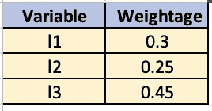

# 无监督数学评分模型

> 原文：<https://towardsdatascience.com/an-unsupervised-mathematical-scoring-model-f4f56a756f?source=collection_archive---------18----------------------->

## 释放数学模型的力量


图片由[杰洛特](https://pixabay.com/users/geralt-9301/)在 [Pixabay](https://cdn.pixabay.com/photo/2016/07/11/12/16/mathematics-1509559_960_720.jpg) 上拍摄

一个[数学模型](https://en.wikipedia.org/wiki/Mathematical_model)是使用数学方程对一个系统的描述。该系统由一组数学方程控制，这些方程可以是线性的、非线性的、静态的或动态的。该模型可以从可用数据中学习方程的参数，甚至预测未来。

在这篇博客中，我将讨论一个这样的实用数学模型，它可以在缺乏带有一些领域知识的标记数据的情况下用于各种问题。本博客中使用的所有代码和数据集都可以在[这里](https://github.com/samread81/Mathematical-Modeling)找到。

# 我们的数学模型:逻辑函数

逻辑函数俗称 [**Sigmoid 函数**](https://en.wikipedia.org/wiki/Sigmoid_function) 是一种具有特征“S”形曲线或 **sigmoid 曲线**的[数学函数](https://en.wikipedia.org/wiki/Function_(mathematics))。


逻辑函数可以取-∞到+∞ [源](https://wikimedia.org/api/rest_v1/media/math/render/svg/9e26947596d387d045be3baeb72c11270a065665)之间的任何 x 值

在哪里，

X₀ =乙状结肠中点的 x 值

L =曲线的最大值

k =曲线的逻辑增长率或陡度。

> 逻辑函数可以取-∞到+∞之间的任何 x 值。对于 x 接近+∞，f(x)接近 L，对于 x 接近-∞，f(x)接近 0。

标准 sigmoid 函数返回 0 到 1 范围内的值。该等式由下式给出


Sigmoid 可以取-∞到+∞之间的任何 x 值[来源](https://wikimedia.org/api/rest_v1/media/math/render/svg/9537e778e229470d85a68ee0b099c08298a1a3f6)

> 对于 x = 0，S(x=0) = 0.5
> 
> x < 0, S(x<0) < 0.5 and x > 0，S(x>0) > 0.5
> 
> 所以，Sigmoid 函数是以 0 为中心的。


来源:[维基](https://upload.wikimedia.org/wikipedia/commons/thumb/8/88/Logistic-curve.svg/640px-Logistic-curve.svg.png)

# 问题陈述

我们有客户的财务数据。其中一个特征是信用额度，即客户名下的信用额度。现在，根据信用额度，我们打算生成一个介于 0-1 之间的风险评分。


客户和现有信贷金额数据的快照

在不同的数据集和不同的要素中，数据的分布会有所不同。我们来看看 credit_amount 的分布。


贷方金额直方图

credit_amount 向右倾斜。在不同的数据集和用例中，数据的偏斜度或分布可能会有所不同。

> 我们希望提出一个评分机制，更多地惩罚离群值。

在我们的例子中，我们将提出一个理想的行为，并尝试学习最能模拟理想行为的逻辑函数的参数。让我们定义一下理想行为:

1.  风险分值在 0 到 1 的范围内。
2.  数据以第 65 个百分位为中心。(假设，因为我们希望更多地惩罚异常值)
3.  理想情况下，我们希望第 65 百分位的分数为 0.50，第 75 百分位的分数为 0.65，第 80 百分位的分数为 0.70，第 85 百分位的分数为 0.75。对于其余的数据，我们希望分数有相应的变化。
4.  不同的特征可能具有不同的分布和范围，因此我们希望提出一种技术，能够学习逻辑函数的参数，以匹配步骤 3 中定义的理想行为。

对于我们使用逻辑函数为 credit_amount 定义风险分值的问题，让我们解码参数。


逻辑函数可以取-∞到+∞ [源](https://wikimedia.org/api/rest_v1/media/math/render/svg/9e26947596d387d045be3baeb72c11270a065665)之间的任何 x 值

在哪里，

X₀ =乙状结肠中点的 x 值

L =曲线的最大值

k =曲线的逻辑增长率或陡度。

因为我们希望风险分值范围在 0 到 1 之间，所以 L = 1。

因为我们希望逻辑函数以第 65 个百分点的数据为中心，所以 X₀ =信用额的第 65 个百分点

增长率 k，我们将通过[随机搜索](https://en.wikipedia.org/wiki/Random_search)来学习，它可以从步骤 3 中定义的理想行为中以最小的[均方误差](https://www.google.com/search?q=mean+square+error&oq=mean+square+&aqs=chrome.0.0l3j69i57j0l4.4441j0j7&sourceid=chrome&ie=UTF-8)最佳地模仿理想行为。

```
# Logistic function ~ b denotes X₀ and c denotes k(growth rate)
def sigmoid(x,b,c):
    return 1 / (1 + math.exp(-c * (x-b)))
```

可能增长率“k”的计算误差

```
# Mean Squared error between ideal and observed behavior
# b denotes X₀ and c denotes k(growth rate)
def cal_error(c,pcts,values_expected):
    error = math.pow(sigmoid(pcts[0],pcts[3],c) - values_expected[0],2) + math.pow(sigmoid(pcts[1],pcts[3],c) - values_expected[1],2) + math.pow(sigmoid(pcts[2],pcts[3],c) - values_expected[2],2) + math.pow(sigmoid(pcts[3],pcts[3],c) - values_expected[3],2)
    return error
```

随机搜索以找到最佳“k”，增长率

```
def find_best_decay_parameter(pcts,values_expected):
    best_error = 999999
    best_c = 1.0
    iterations = 5000
    for i in range(iterations):
        tmp = random.random()
        error = cal_error(tmp,pcts,values_expected)
        if error<best_error:
            best_error = error
            best_c = tmp
    return best_c
```

调用函数

```
percentiles =     [85,80,75,65]
values_expected = [0.75,0.70,0.65,0.50]
b,c = find_decay_parameter(df.credit_amount,values_expected)
```

输出

```
Best value of Growth rate 'k' =  0.00047
Value of L = 1
value of X₀ = 3187
                   **65th  75th  80th  85th**
**Value              3187  3972  4720  5969**
**Expected Score     0.50  0.65  0.70  0.75
Observed Score     0.50  0.59  0.67  0.79**
```

我检查了分数是如何随着不同的信用额度而变化的

```
credit_amounts = [100,500,1200,3000,4000,5200,6000,7500,10000,12000,20000,25000]
risk = []
mp_values = {}
for credit_amount in credit_amounts:
    mp_values[credit_amount] = round(sigmoid(credit_amount,b,c),2)
```

输出:


不同信用额度的观察风险评分


信用金额的风险分值在 0 到 1 范围内的变化

找到参数“l”、“'X₀'”和“k”的正确值后，我们拟合了一个数学模型，使风险得分接近我们想要的理想得分行为，即更多地惩罚异常值。

# 提高

在上一节中，我们看到风险评分是一个变量的函数，即 credit_amount。但是，如果我们有不止一个变量，并且我们希望风险分数是所有这些变量的函数，那该怎么办呢？

> 在这种情况下，我们可以首先找到每个变量的权重/重要性，使得权重总和为 1。然后，我们可以为每个变量拟合一个单独的逻辑函数，最后对个体风险评分进行加权求和。

让我们以 3 个变量及其风险分值和权重为例。


变量和风险分数



变量和权重

最终风险得分= 0.72 * 0.3+0.65 * 0.25+0.81 * 0.45 = 0.743

# 结论

通过这篇博客，我们了解了什么是数学模型，并使用逻辑函数研究了一个这样的数学模型。这种模型可以在缺乏带有一些先验领域知识(如特征的重要性和特征的分布)的标记数据的各种问题中使用。本博客中使用的所有代码和数据集都可以在[这里](https://github.com/samread81/Mathematical-Modeling)找到。

> *如果你有任何疑问，请联系我。我很想知道你是否认为你有一个可以利用这种数学模型的用例。*

***我的 Youtube 频道更多内容:***

[](https://www.youtube.com/channel/UCg0PxC9ThQrbD9nM_FU1vWA) [## 阿布舍克·蒙戈利

### 嗨，伙计们，欢迎来到频道。该频道旨在涵盖各种主题，从机器学习，数据科学…

www.youtube.com](https://www.youtube.com/channel/UCg0PxC9ThQrbD9nM_FU1vWA) 

> ***关于作者-:***
> 
> Abhishek Mungoli 是一位经验丰富的数据科学家，拥有 ML 领域的经验和计算机科学背景，跨越多个领域并具有解决问题的思维方式。擅长各种机器学习和零售业特有的优化问题。热衷于大规模实现机器学习模型，并通过博客、讲座、聚会和论文等方式分享知识。
> 
> 我的动机总是把最困难的事情简化成最简单的版本。我喜欢解决问题、数据科学、产品开发和扩展解决方案。我喜欢在闲暇时间探索新的地方和健身。关注我的 [**中**](https://medium.com/@mungoliabhishek81) 、**[**Linkedin**](https://www.linkedin.com/in/abhishek-mungoli-39048355/)**或**[**insta gram**](https://www.instagram.com/simplyspartanx/)**并查看我的[往期帖子](https://medium.com/@mungoliabhishek81)。我欢迎反馈和建设性的批评。我的一些博客-********

*   ******[降维:PCA 与自动编码器](/dimensionality-reduction-pca-versus-autoencoders-338fcaf3297d)******
*   ******[体验遗传算法的威力](/experience-the-power-of-the-genetic-algorithm-4030adf0383f)******
*   ******每个数据科学家都应该避免的 5 个错误******
*   ******[以简单&直观的方式分解时间序列](/decomposing-a-time-series-in-a-simple-and-intuitive-way-19d3213c420b?source=---------7------------------)******
*   ******[GPU 计算如何在工作中拯救了我？](https://medium.com/walmartlabs/how-gpu-computing-literally-saved-me-at-work-fc1dc70f48b6)******
*   ******信息论& KL 分歧[第一部分](/part-i-a-new-tool-to-your-toolkit-kl-divergence-5b887b5b420e)和[第二部分](/part-2-a-new-tool-to-your-toolkit-kl-divergence-736c134baa3d)******
*   ******[使用 Apache Spark 处理维基百科，创建热点数据集](/process-wikipedia-using-apache-spark-to-create-spicy-hot-datasets-1a59720e6e25)******
*   ******[一种基于半监督嵌入的模糊聚类](/a-semi-supervised-embedding-based-fuzzy-clustering-b2023c0fde7c)******
*   ******[比较哪个机器学习模型表现更好](/compare-which-machine-learning-model-performs-better-4912b2ed597d)******
*   ******[分析 Fitbit 数据，揭开疫情封锁期间身体模式变化的神秘面纱](/analyzing-fitbit-data-to-demystify-bodily-pattern-changes-amid-pandemic-lockdown-5b0188fec0f0)******
*   ******[神话与现实围绕关联](/myths-and-reality-around-correlation-9b359456d8e1)******
*   ******[成为面向商业的数据科学家指南](/a-guide-to-becoming-business-oriented-data-scientist-51da5c829ffa)******