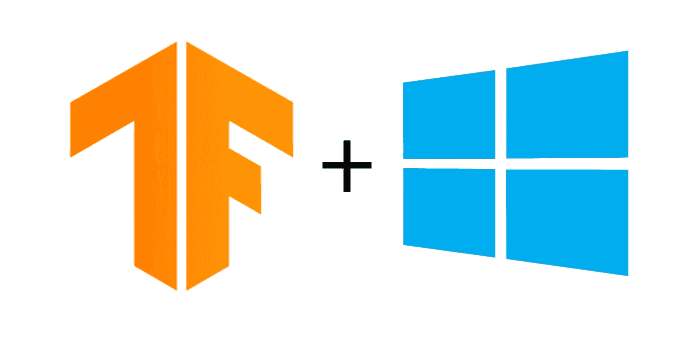
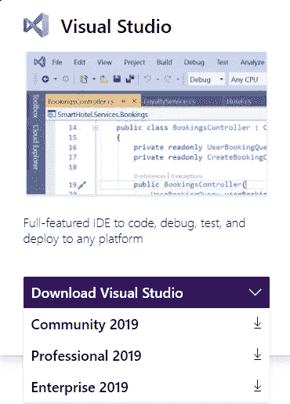
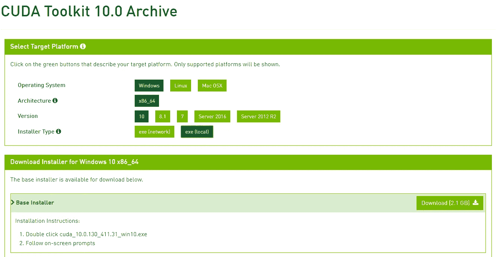
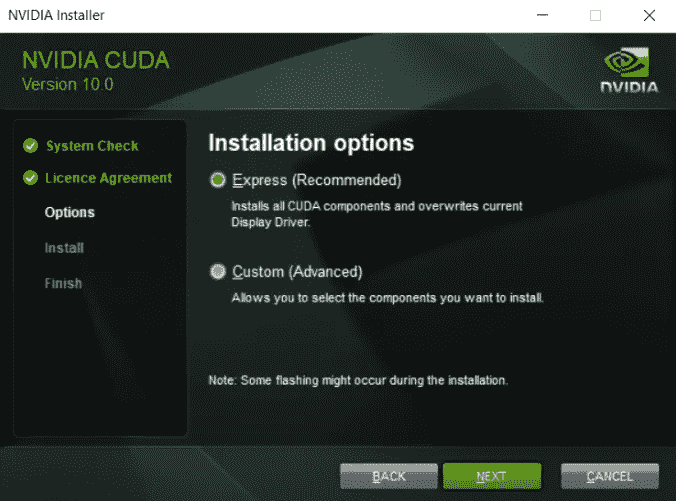
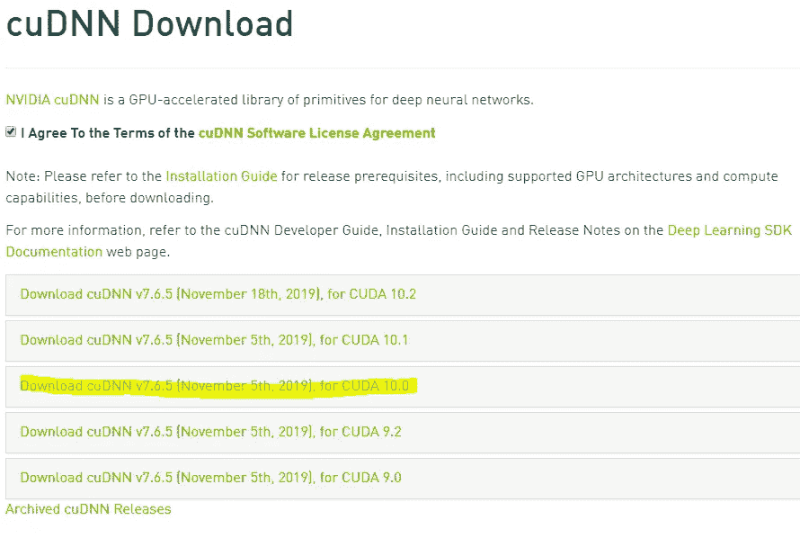
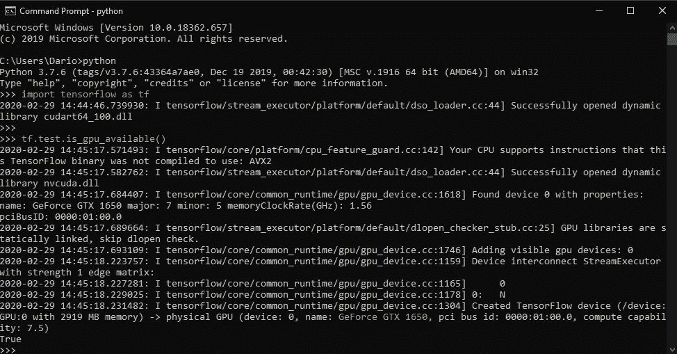

# 在 Windows 10 上安装 Tensorflow-GPU 2.0 的简单指南

> 原文：<https://towardsdatascience.com/an-utterly-simple-guide-on-installing-tensorflow-gpu-2-0-on-windows-10-198368dc07a1?source=collection_archive---------12----------------------->

## 根据你的网速，不会超过 15 分钟。

TensorFlow 是谷歌的开源库，使您能够开发和训练深度学习模型。虽然大多数安装指南侧重于安装 CPU 版本，这是您的常规`pip install`，但今天我想重点安装它的更大、更强大的兄弟 GPU 版本。



你想要使用 GPU 版本而不是 CPU 版本的主要原因是**速度**——如果你决定在 GPU 上训练模型，速度会有令人难以置信的提高，我不会去解释原因——因为这是一个*如何*指南，而不是*为什么*指南。

最重要的是，安装将在 Windows 10 x64 机器上完成。所以这里没有 Linux，因为我知道在 Linux 上安装是相当简单的。

事不宜迟，让我们直接开始吧。下一节将简要讨论您需要什么。

# 要求

在整个过程中，我们需要下载并安装三个工具:

1.  [**微软 Visual Studio**](https://visualstudio.microsoft.com/) (如果没有专业版的话社区版也可以)
2.  [**Nvidia CUDA 工具包**](https://developer.nvidia.com/cuda-10.0-download-archive?) (我用的是 10.0 版本)
3.  [**Nvidia cud nn**](https://developer.nvidia.com/rdp/cudnn-download)(7 . 6 . 5 版本即可)

下面几节将重点介绍如何安装每个工具。

# Microsoft Visual Studio

现在我们不会真正使用 Visual Studio，但 Nvidia CUDA 工具包的一些组件需要它，所以它就是这样。

Visual Studio 可以从[这个链接](https://visualstudio.microsoft.com/)下载，从这里很容易下载社区版:



安装时，你不需要检查任何额外的组件——让一切保持原样，点击几次**下一个**。大约 5 到 10 分钟后，安装应该完成。在 Tensorflow 方面，您将不再需要接触 Visual Studio。

# Nvidia CUDA 工具包

该工具包使您能够创建高性能 GPU 加速的应用程序。在可以从[下载此链接的](https://developer.nvidia.com/cuda-10.0-download-archive?)中，只需确保选择我已经选择的所有内容，然后点击下方的**下载**按钮即可。



它的大小略超过 2 GB，所以根据你的网速，可能需要一段时间。

下载后，您可以运行**。exe** 文件，它会要求你将内容解压到某个临时文件夹中。一旦安装开始，你可以坚持使用 **Express** 选项:



几分钟后，Nvidia CUDA Toolkit 将安装完毕！

接下来，Nvidia cuDNN。

# Nvidia cuDNN

Nvidia cuDNN 是一个用于深度神经网络的 GPU 加速库。可以从[这个链接](https://developer.nvidia.com/rdp/cudnn-download)下载。请记住，你需要创建一个帐户，但你可以登录谷歌，你就可以走了。

登录后，您将被重定向至以下页面—点击**下载 cuDNN 7.6.5 for CUDA 10.0** :



这是一个 ZIP 文件，大小可能为 250MB，所以应该可以快速下载。下载完成后，你可以将 contents˛(that 解压到你的 CUDA 安装目录中，该目录位于:

```
C:\Program Files\Nvidia GPU Computing Toolkit\CUDA\v10.0
```

如果您在安装时没有做任何更改。仅此而已。设置完成！

# 在 GPU 上安装 TensorFlow 2.0

我们已经完成了繁琐的安装过程，现在只需要做一个简单的 pip 安装。在撰写本文时，最新的支持 GPU 的 TensorFlow 版本是 2.0.0 RC1。

要安装它，打开命令提示符并执行以下命令(我假设您已经安装了 Python):

```
pip install tensorflow-gpu=2.0.0-rc1
```

如果你不能提供版本，它将安装 1.14 版，这是我们不想要的。

就这样，下载需要一些时间(300+ MB)，但是 TensorFlow 现在应该已经安装在你的机器上了。让我们快速验证一下这个说法:



如你所见，我在命令提示符下打开 Python shell，导入 TensorFlow 并检查 GPU 是否可用。这个函数调用了 return True，你也可以在提示符的底部看到我的 GPU 是黄色的。

# 在你走之前

拥有一台轻薄的笔记本电脑是很好的——你可以去任何地方而不会弄乱你的背。但比没有背部问题更酷的是拥有一台能够在 GPU 上训练神经网络的强大笔记本电脑。

如果你有一个合适的网速，这篇文章不应该花费你超过 5 分钟来阅读，15 分钟来安装和配置一切。

感谢阅读。玩得开心——我知道我会的。

*喜欢这篇文章吗？成为* [*中等会员*](https://medium.com/@radecicdario/membership) *继续无限制学习。如果你使用下面的链接，我会收到你的一部分会员费，不需要你额外付费。*

[](https://medium.com/@radecicdario/membership) [## 通过我的推荐链接加入 Medium-Dario rade ci

### 作为一个媒体会员，你的会员费的一部分会给你阅读的作家，你可以完全接触到每一个故事…

medium.com](https://medium.com/@radecicdario/membership)