# Anaconda:从这里开始学习 Python 中的数据科学！

> 原文：<https://towardsdatascience.com/anaconda-start-here-for-data-science-in-python-475045a9627?source=collection_archive---------8----------------------->

## 在 Python 虚拟环境中使用 Anaconda


照片由[国家癌症研究所](https://unsplash.com/@nci?utm_source=medium&utm_medium=referral)在 [Unsplash](https://unsplash.com?utm_source=medium&utm_medium=referral) 上拍摄

如果你一直关注我或者读过我的一些文章，你一定知道我是 Python 虚拟环境的忠实粉丝。我以前也写过这方面的文章，你可以在这里阅读从那以后，我几乎所有的项目都包含了`requirements.txt`文件，其他人可以很容易地复制我的作品。

我和几个虚拟环境经理一起工作过，但是从来没有真正关注过 Anaconda。然而，现在我需要在康达环境下进行日常的大学工作。这里，推荐的工作方式是使用虚拟环境，我的同事使用 Anaconda。所以，我决定试一试！

Anaconda 就像任何其他虚拟环境管理器一样，但是它不仅仅是管理环境。它有自己的名为`conda`的 Python 包管理器，也支持`pip`。它并不局限于 Python，也可以用于其他语言。但是也有一些警告，比如一些包只能用`pip`安装，而不能用`conda`。因此，在这篇文章中，我们将探索一些关于 Anaconda 的知识，然后查看一些最有用的命令，这些命令是您成为虚拟环境专家所需要的。

# 什么是蟒蛇？为什么要用？

> 以一条蛇命名一个项目听起来很荒谬，但是，嘿，我们知道 Python 也是一条蛇

Anaconda 完全是关于数据科学的。它侧重于包含帮助数据科学家拥有一个可以完成所有工作的工作台的特性和包。它从一开始就托管了几个数据科学包，使数据科学家能够快速起步。凭借环境的额外优势，它成为任何人迈向数据科学之旅的理想起点。

听起来很有趣！但是，与其他虚拟环境管理器相比，您为什么更喜欢它呢？我已经使用了一段时间，以下是我发现它真正吸引人的地方:

*   **不需要目录:**与其他类似`virtualenv`的目录不同，您不需要指定某个目录来安装环境。这使您能够在系统的任何地方激活虚拟环境，而不必担心位置问题。
*   **选择任意 Python 版本:**只要服务器上存在 Python 的一个版本，它是否安装在您的系统上并不重要。Anaconda 的`conda`可以通过从服务器获取 Python 的精确版本来轻松创建环境。
*   **conda 包管理器:**虽然`pip`擅长管理 Python 包，但是`conda`在检索包并将它们安装到环境中也做了类似的工作。额外的好处是，它与 Anaconda 发行版捆绑在一起，使之变得容易。

但是，我还是觉得没有`pip`的`conda`是不完整的。如果你试图通过`conda`安装一些软件包，它可能会给出一个错误，但同样的软件包可以很容易地使用`pip`安装。

> 在 Python 环境中使用 conda 和 pip。

# 关于 Python3 和 Python2 的注记


由 [Kelly Sikkema](https://unsplash.com/@kellysikkema?utm_source=medium&utm_medium=referral) 在 [Unsplash](https://unsplash.com?utm_source=medium&utm_medium=referral) 上拍摄的照片

Python2 不再被开发，所有的开发工作都是针对 Python3 的。然而，有几个包和项目仍然依赖于 Python2，所以不要与它失去联系是一个好习惯。查看下面基于 Python 2 的项目。创造了一些非凡的艺术品。

[](https://github.com/lengstrom/fast-style-transfer) [## lengstrom/快速式转移

### 在几分之一秒内将名画的风格添加到任何照片中！你甚至可以设计视频！在…上需要 100 毫秒

github.com](https://github.com/lengstrom/fast-style-transfer) 

本文适用于 Python2 和 Python3，因为在设置环境时，它们在选择 Python 版本上只有本质上的不同，但我们现在将使用 Python3 发行版。

> 在 Python3 中启动任何新项目都是面向未来的。

# 安装 Anaconda

如果你以前安装过任何软件，你会有宾至如归的感觉。转到[这里](https://www.anaconda.com/distribution/#download-section)，选择你的操作系统(我用的是 Mac ),然后选择 Python 3.x 版本`Download`按钮，它会将安装程序下载到你的机器上。

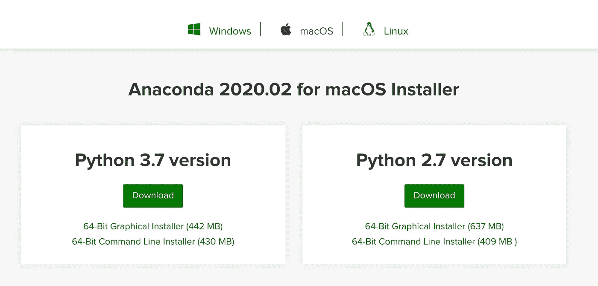

选择 Python 3.7 版本下方的“下载”按钮

然后，打开机器上的安装程序，按照所有步骤进行操作，同时阅读并同意协议。您不需要修改任何东西，因为所有的东西都是自己设置好的，一旦完成，您就可以在您的机器上使用 Anaconda 了。

# 使用 Python 包


照片由[王思然·哈德森](https://unsplash.com/@hudsoncrafted?utm_source=medium&utm_medium=referral)在 [Unsplash](https://unsplash.com?utm_source=medium&utm_medium=referral) 上拍摄

正如我之前提到的，Anaconda 包附带了`conda`管理器，它允许你安装包，创建和激活虚拟环境等等。

## 开放终端

我使用 iTerm2 作为我的主要终端，这是我根据自己的喜好设计的。按照我在 Medium 上发布的指南，您可以创建一个类似的(甚至更好的)终端视图。

[](/customising-the-mac-terminal-to-increase-productivity-and-improve-the-interface-894f6d86d573) [## 定制 Mac 终端以提高生产率和改善界面

### 简单的外壳定制技术

towardsdatascience.com](/customising-the-mac-terminal-to-increase-productivity-and-improve-the-interface-894f6d86d573) 

您会注意到终端现在在计算机名前面写有`(base)`。这意味着您的基本 conda 环境已经设置好了(意味着您正在为整个用户而不是一个特定的环境工作)。

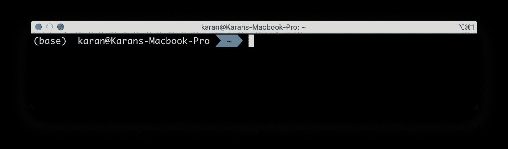

(基地)在司令部前面

我将首先描述这个基础环境中的几个命令，但是它们也可以在任何特定的环境中工作。我们将在本文后面看到如何设置和使用环境。

## 查看已安装的软件包

一个最基本的命令是知道您的环境中所有已安装软件包的列表。请注意，Anaconda 内置了许多包，因此您将看到比预期多得多的包。该命令如下所示:

```
conda list
```

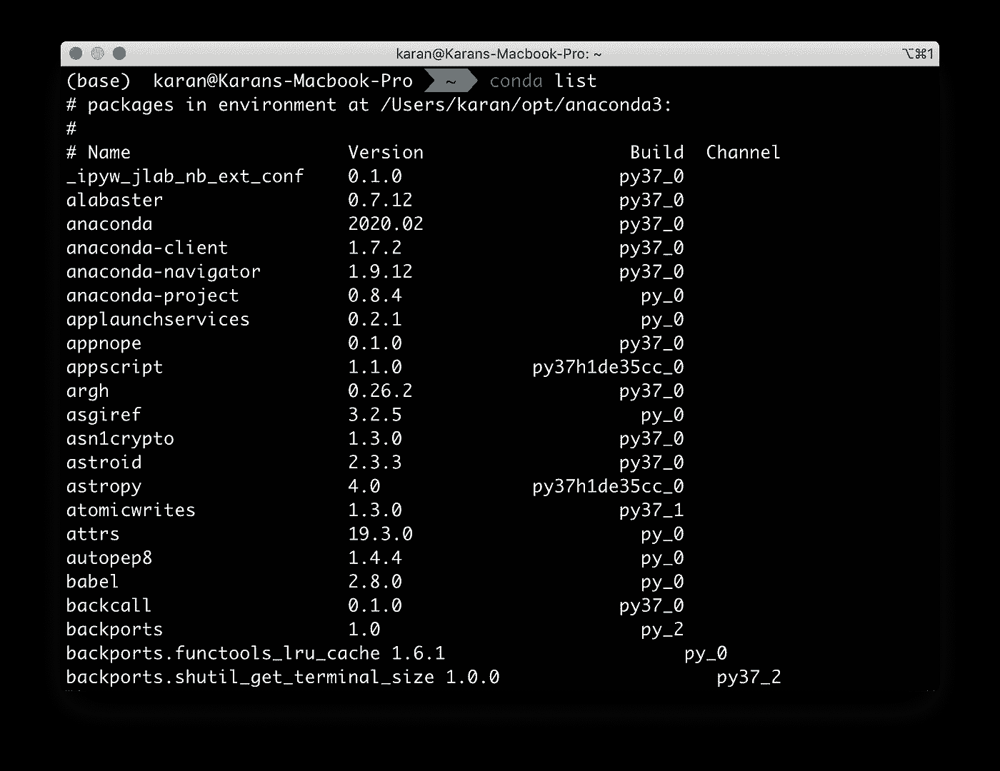

已安装软件包列表

## 搜索并安装软件包

`conda`非常直观，因为您想要做的正是该命令可能看起来的样子。假设我们想安装`numpy`，但是我们不知道版本。我们可以使用以下命令来搜索它的版本:

```
conda search numpy
```

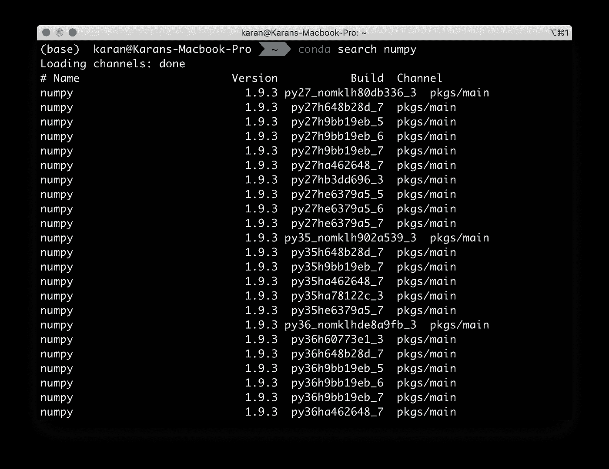

在康达搜索一个包

假设我们计划安装版本为`1.18.1`的`numpy`，我们将使用以下命令来完成:

```
conda install numpy==1.18.1
```

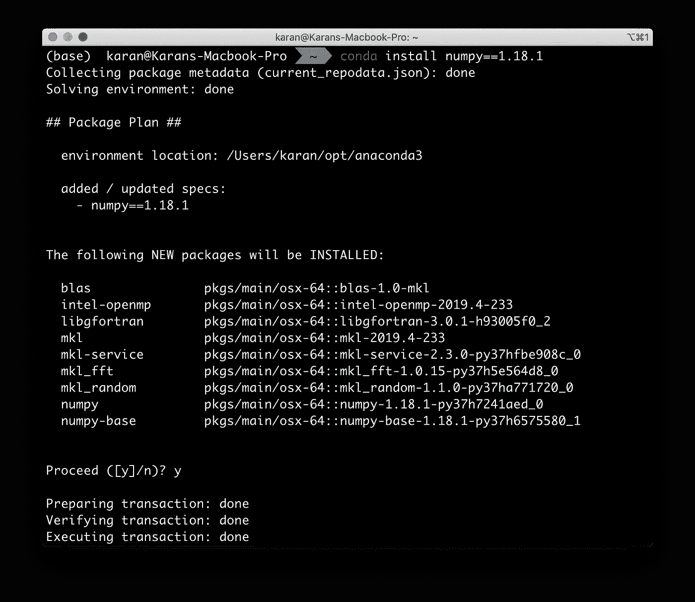

安装 numpy 版本 1.18.1

## 移除包

假设在某种情况下，您不再需要某个特定的包，或者您安装了一个错误的版本，您可以简单地使用下面的命令来删除它。用`numpy`来做吧。

```
conda remove numpy
```

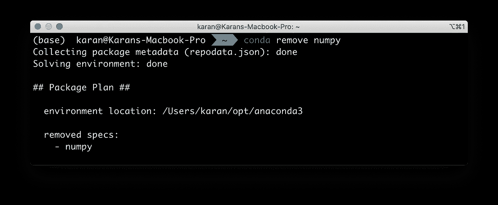

拆卸数字

# 使用 Python 环境


由[卡尔文·汉森](https://unsplash.com/@calvinhanson?utm_source=medium&utm_medium=referral)在 [Unsplash](https://unsplash.com?utm_source=medium&utm_medium=referral) 上拍摄的照片

`conda`您还可以根据需要创建、激活和停用虚拟环境。所有这些环境都是相互隔离的，可以托管非常不同的包和包版本组合，而不会相互干扰。

## 创建虚拟环境

可以使用以下命令创建虚拟环境，并选择在创建环境时直接安装几个软件包:

```
conda create -n env_name python=3.7.6 <list_of_packages>
```

`-n`后面的字就成了环境的名字。在我们这里，它是`env_name`。然后，我们按照上面的定义指定 python 的版本。然后，我们可以指定在创建环境时要安装的软件包列表。这意味着包将在`<list_of_packages>`处列出。例如，要创建环境并安装`numpy`和`pandas`，我们将使用以下命令:

```
conda create -n env_name python=3.7.6 numpy pandas
```

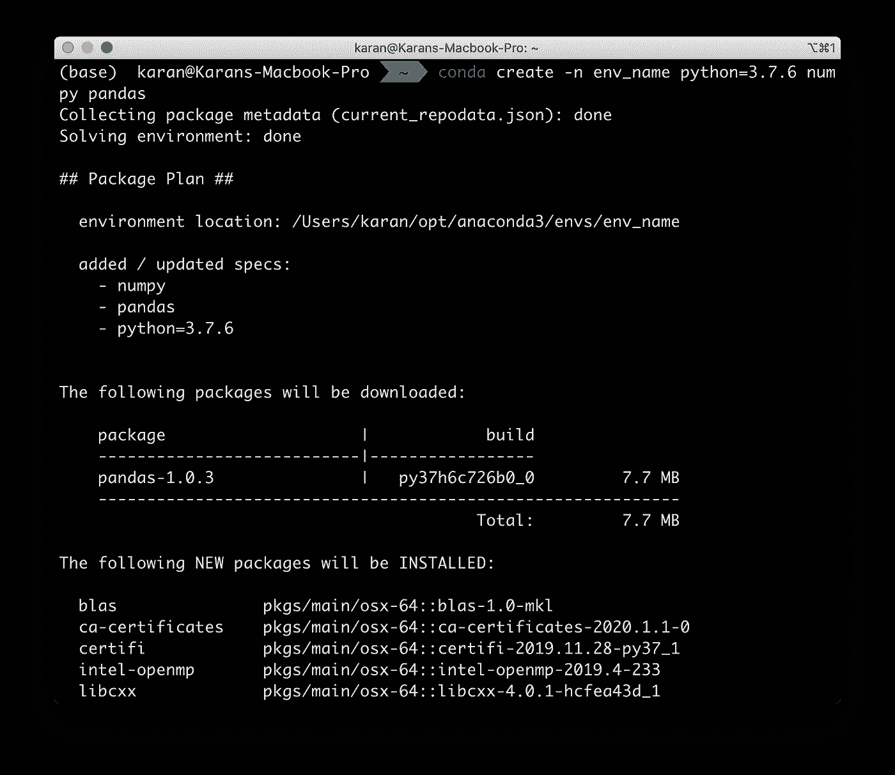

创建名为“环境名称”的虚拟环境

## 激活环境

激活环境非常容易。只需使用以下命令:

```
conda activate env_name
```

如果您碰巧使用了先前版本的`conda`，您将需要在 Linux/MacOS 上使用命令`source activate`或者在 Windows 上使用命令`activate`。

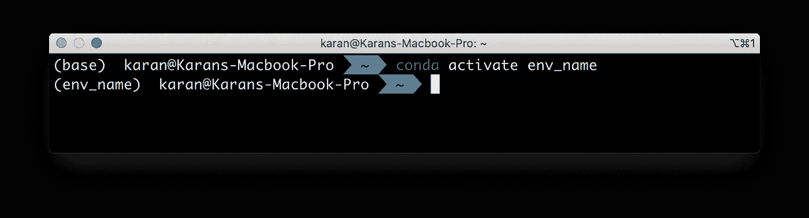

激活环境

正如我们在上面的图像中看到的，环境的名称在命令行的前面，表明我们在环境中。

现在，我们可以使用`conda install`或`pip install`按需安装软件包，它们不会干扰这个环境之外的任何软件包。

## 停用环境

停用同样简单。使用命令

```
conda deactivate
```

同样，如果您使用的是先前版本的`conda`，请在 Linux/MacOS 上使用`source deactivate`或在 Windows 上使用`deactivate`。

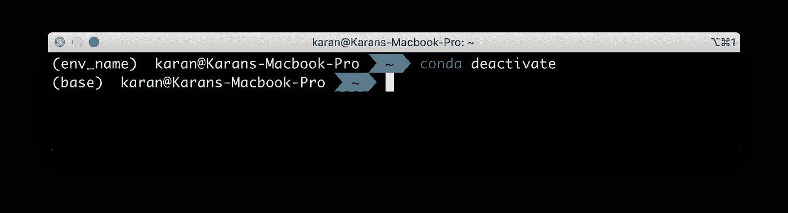

停用环境

你会注意到前面的文字变回了`(base)`，表明我们已经不在我们的环境中了。

## 共享环境

使用环境的主要原因之一(除了管理隔离的环境之外)是能够与他人共享精确的 Python 包及其精确的版本。`conda`使用 YAML 文件来共享环境信息，而`requirements.txt`通常与`pip`一起使用。为了导出所有包，无论是通过`conda`还是`pip`安装的，我们在环境中使用以下命令:

```
conda env export > environment.yml
```

该文件将类似于下图:

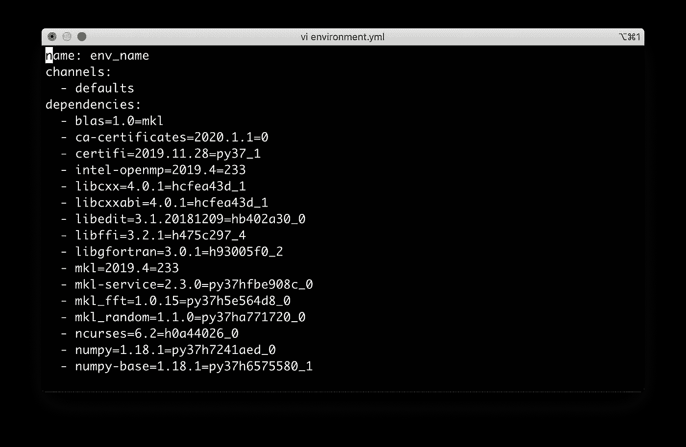

environment.yml

我建议我们也创建`requirements.txt`文件，这样不使用`conda`的用户仍然可以使用我们的环境配置。为此，请在环境中使用以下命令:

```
pip freeze > requirements.txt
```

您可以简单地与您的项目共享文件`environment.yml`和`requirements.txt`，以便于复制。

一旦你有了一个`environment.yml`文件，你就可以在创建环境时简单地使用它，并像下面这样设置它以备使用:

```
conda create env --file environment.yml
```

## 列出所有环境

当您处理多个项目时，您会创建许多环境。您可能会忘记您可能已经创建的环境。有一个快速命令可以查看所有可用的环境:

```
conda env list
```

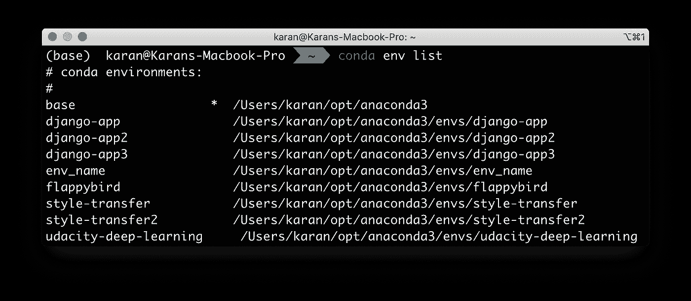

所有环境的列表

正如你所看到的，我有相当多的环境有我们通常有的特殊的`base`。

## 移除环境

一旦您不再处理某个项目，您可能还想删除它的环境。使用命令来执行此操作:

```
conda env remove -n env_name
```

这里，`env_name`应该替换为被删除的环境的名称。我正在删除`env_name`，所以我将保持不变。

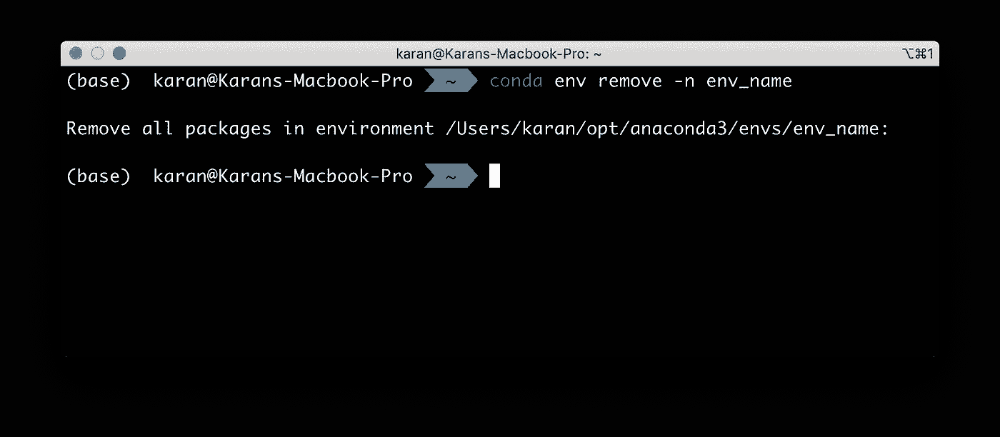

正在删除“环境名称”环境

# 结论

在本文中，我们探讨了什么是 Anaconda，以及它如何优于其他虚拟环境管理器。我们探索了使用`conda`处理包以及创建和运行 Python 虚拟环境的方法。

一旦你熟悉了本文中的基础知识，你也可以参考 [conda 备忘单](https://docs.conda.io/projects/conda/en/latest/user-guide/cheatsheet.html)。

我希望你喜欢我的作品。如果你有任何建议、想法或者你面临任何问题，请在评论中告诉我。也可以在 [LinkedIn](https://www.linkedin.com/in/bhanotkaran22/) 上联系我。