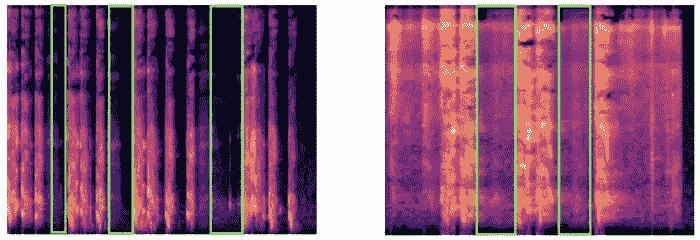

# 分析和分类真实的患者咳嗽声

> 原文：<https://towardsdatascience.com/analysing-and-classifying-real-patient-cough-sounds-65323f8082ac?source=collection_archive---------49----------------------->

阴性(左)和阳性(右)新冠肺炎咳嗽谱图——分析吸入剂

## [冠状病毒:使用机器学习对新冠肺炎患者进行分类](/coronavirus-using-machine-learning-to-triage-covid-19-patients-980e62489fd4)

作者[劳里·威廉姆斯](https://medium.com/u/e98db206e1b3?source=post_page-----65323f8082ac--------------------------------) — 7 分钟阅读

在近 5 个月内，当前的新型冠状病毒(新冠肺炎)将爆发一年。尽管我们还远远不知道如何全面应对这种病毒，但我们已经看到了一些非常酷的社交距离技术解决方案(如点餐应用)，以及医疗领域的解决方案(如自动检测肺部 x 光片中的肺炎样迹象)。

Alexander Sinn 在 Unsplash 上拍摄的照片

## [创业公司需要问的关于人工智能的三个问题](/google-expert-tips-for-artificial-intelligence-startups-three-questions-about-ai-that-startups-need-to-ask-308924cb5324)

维亚切斯拉夫·波隆斯基博士——8 分钟阅读

数十亿美元的人工智能投资正在蓬勃发展。这对那些指望人工智能来获得创新和竞争优势的初创公司来说意味着什么？这个策略看起来很简单:用机器学习解决人类的一个长期问题。谷歌、脸书、网飞和优步做到了。一个显而易见的问题是为什么不使用人工智能？

## [数据仓库综合指南](/data-warehouse-68ec63eecf78)

妮可·珍妮薇的账单 — 7 分钟阅读

作为一名数据科学家，了解一些基本的数据仓库概念是很有价值的。我们所做的大部分工作都涉及到在需要清晰易懂的数据集上增加企业价值。