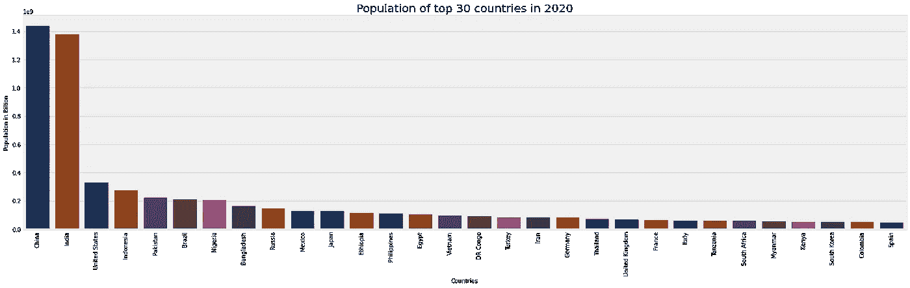
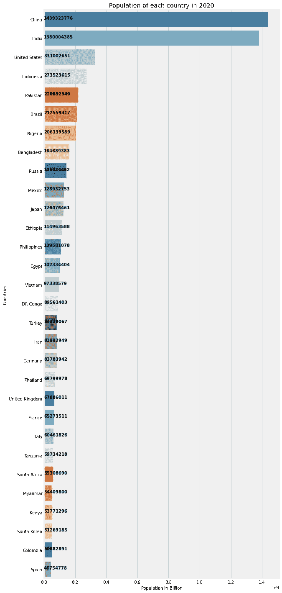
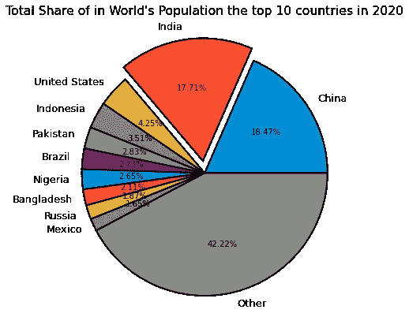
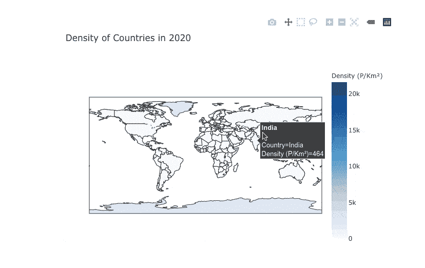
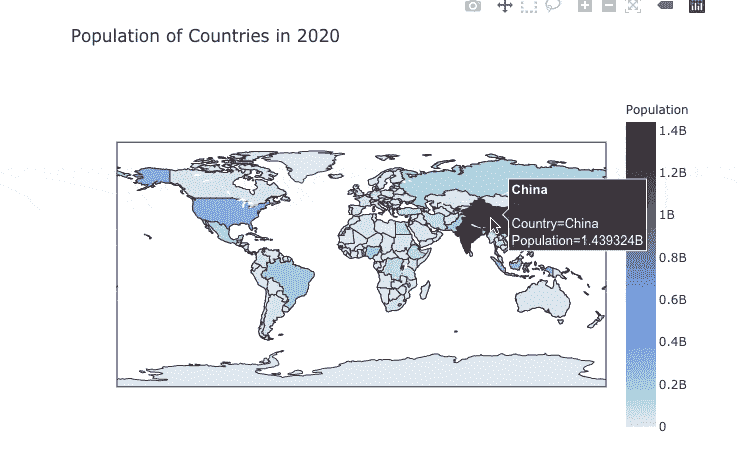
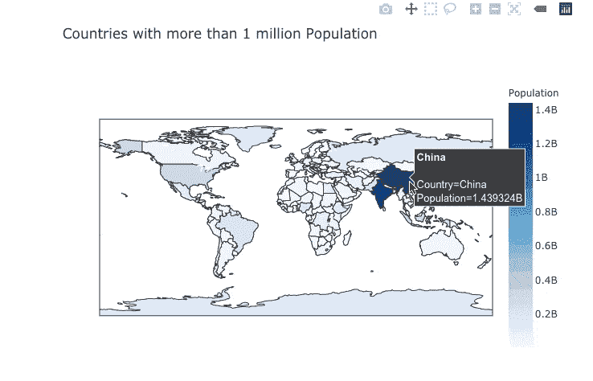
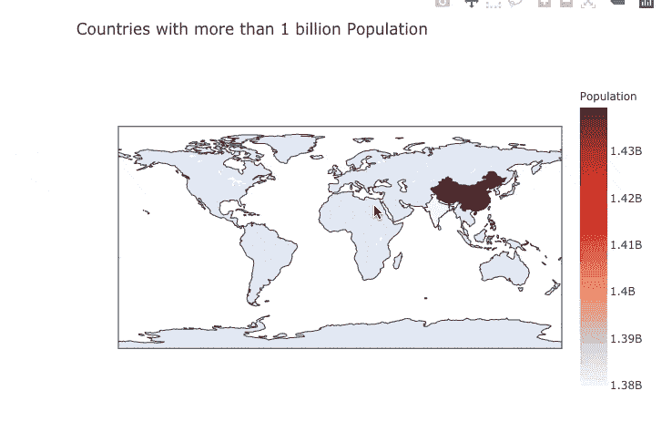

# 使用 Pandas、Matplotlib、Seaborn 和 Plotly 分析和可视化 1955 年至 2020 年的乡村人口

> 原文：<https://towardsdatascience.com/analysing-and-visualising-the-country-wise-population-from-1955-to-2020-with-pandas-matplotlib-70b3614eed6b?source=collection_archive---------16----------------------->

## 100 天数据科学的第 1、2、3 天。


[凯尔西·奈特](https://unsplash.com/@kelsoknight?utm_source=medium&utm_medium=referral)在 [Unsplash](https://unsplash.com?utm_source=medium&utm_medium=referral) 上的照片

2020 年 8 月 12 日，我开始了 100 天的数据科学挑战。这项挑战的主要目标是在 100 天内每天学习 1 小时数据科学并编写代码。我打算学习和编码项目，以提高我的技能和获得实践经验。我将在 GitHub、Instagram 和 Medium 上分享我的旅程。别忘了在社交媒体上关注我。

前三天，我在 Kaggle 上研究一个国家的人口数据集。每天我都会用数据分析和可视化回答一些问题。

首先要做的事。让我们导入所有需要的库。对于这个项目来说， [Pandas](https://pandas.pydata.org/pandas-docs/stable/index.html) ， [Matplotlib](https://matplotlib.org) ， [Seaborn](https://seaborn.pydata.org) ，和 [Plotly](https://plotly.com) 库就足够了。

先导入吧。

```
# data analysis
import pandas as pd# data visualization
import matplotlib.pyplot as plt
import seaborn as sns
import plotly.express as pxplt.style.use('fivethirtyeight')%matplotlib inline
```

我用了`fivethirtyeight`的剧情风格。点击查看更多款式[。](https://matplotlib.org/tutorials/introductory/customizing.html)

现在让我们导入数据。你可以从 [kaggle](https://www.kaggle.com/themlphdstudent/countries-population-from-1955-to-2020) 下载数据集。从 kaggle 下载数据后，我们有一个 csv 文件— `Countries Population from 1995 to 2020.csv`。现在让我们在 dataframe 中导入数据。

```
# load dataset
population = pd.read_csv('./Countries Population from 1995 to 2020.csv')
```

关于数据集:

```
Year — Year detail in which population data is recordedCountry — Name of CountryPopulation — Population of Country in a given yearYearly % Change — Change in population since last year (in %)Yearly Change — Change in population since last yearMigrants — Number of migrantsMedian Age — Median age of the populationFertility Rate — Fertility rate (in %)Density (P/Km²) — Density of countryUrban Pop % — % of the population is living in an Urban areaUrban Population — Net population living in Urban areaCountry’s Share of World Pop % — Country’s share in Total World PopulationWorld Population — World PopulationCountry Global Rank — Global rank of country
```

现在让我们来看一些例子。

```
population.head() 
```

是时候进行一些数据分析了。

让我们看看数据的形状。

```
population.shape# output
(4195, 14)
```

我们有 4195 个样本和 14 个特征。

让我们检查数据集的信息。

```
population.info()# output<class 'pandas.core.frame.DataFrame'>
RangeIndex: 4195 entries, 0 to 4194
Data columns (total 14 columns):
 #   Column                          Non-Null Count  Dtype  
---  ------                          --------------  -----  
 0   Year                            4195 non-null   int64  
 1   Country                         4195 non-null   object 
 2   Population                      4195 non-null   int64  
 3   Yearly % Change                 4195 non-null   float64
 4   Yearly Change                   4195 non-null   int64  
 5   Migrants (net)                  3600 non-null   float64
 6   Median Age                      3600 non-null   float64
 7   Fertility Rate                  3600 non-null   float64
 8   Density (P/Km²)                 4195 non-null   object 
 9   Urban Pop %                     4082 non-null   float64
 10  Urban Population                4082 non-null   float64
 11  Country's Share of World Pop %  4195 non-null   float64
 12  World Population                4195 non-null   int64  
 13  Country Global Rank             4195 non-null   int64  
dtypes: float64(7), int64(5), object(2)
memory usage: 459.0+ KB
```

通过查看上面的输出，我可以说一些事情。

1.  国家和密度(P/Km)是对象类型。所以我会把它们分别换成 String 和 integer。
2.  密度(P/Km)在数值上有额外千个逗号。例 1111。所以让我们先去掉它。
3.  很少有丢失的值，但是现在我将忽略它们。

```
# remove extra symbol
population['Density (P/Km²)'] = population['Density (P/Km²)'].replace(',','')
```

现在让我们更改国家类型和密度值。

```
population['Density (P/Km²)'] = population['Density (P/Km²)'].astype(int)population['Country'] = population['Country'].astype(str)
```

现在我们来看看描述性统计。

```
population.describe()
```

# 数据分析和可视化

## 问题 1:2020 年人口排名前 30 的国家。

```
*# 2020 population data*
current_population = population[population['Year'] == 2020][:30]

plt.rcParams['figure.figsize'] = (25, 7)
ax = sns.barplot(x = current_population['Country'][:30], y = current_population['Population'][:30], palette = 'dark')
ax.set_xlabel(xlabel = 'Countries', fontsize = 10)
ax.set_ylabel(ylabel = 'Population in Billion', fontsize = 10)
ax.set_title(label = 'Population of top 30 countries in 2020', fontsize = 20)
plt.xticks(rotation = 90)
plt.show()
```



2020 年前 30 个国家的人口。

```
plt.figure(figsize=(9,25))
ax = sns.barplot(x="Population", y="Country",
                 data=current_population, palette="tab20c",
                 linewidth = 1)
for i,j **in** enumerate(current_population["Population"]):
    ax.text(.5, i, j, weight="bold", color = 'black', fontsize =10)
plt.title("Population of each country in 2020")
ax.set_xlabel(xlabel = 'Population in Billion', fontsize = 10)
ax.set_ylabel(ylabel = 'Countries', fontsize = 10)
plt.show()
```



## 问题 2:2020 年前 10 个国家在世界人口中的总份额。

```
unique_countries = population['Country'].unique()
plt.style.use("seaborn-talk")

*# set year*
year = 2020df_last_year = population[population['Year'] == year]series_last_year = df_last_year.groupby('Country')['Population'].sum().sort_values(ascending=False)

labels = []
values = []
country_count = 10
other_total = 0
for country **in** series_last_year.index:
    if country_count > 0:
        labels.append(country)
        values.append(series_last_year[country])
        country_count -= 1
    else:
        other_total += series_last_year[country]
labels.append("Other")
values.append(other_total)

wedge_dict = {
    'edgecolor': 'black',
    'linewidth': 2        
}

explode = (0, 0.1, 0, 0, 0, 0, 0, 0, 0, 0, 0)

plt.title(f"Total Share of in World's Population the top 10 countries in **{**year**}**")
plt.pie(values, labels=labels, explode=explode, autopct='**%1.2f%%**', wedgeprops=wedge_dict)
plt.show()
```



*   中国是世界人口最多的国家，其次是印度。

## 问题 3:世界上人口最多的五个国家。

```
population_top5_2020 = population[population['Year'] == 2020][:5]
top_5_countries = population_top5_2020['Country'].unique()top5_popultion = population[population['Country'].isin(top_5_countries)][['Year', 'Country', 'Population']]
top5_popultion_pivot = top5_popultion.pivot(index='Year', columns='Country', values='Population')
top5_popultion_pivot.style.background_gradient(cmap='PuBu')# Please note, in medium I am unable show the gradient color. 
```

```
fig,ax = plt.subplots(figsize=(20, 10))
sns.despine()
sns.set_context("notebook", font_scale=1.5, rc={"lines.linewidth": 2})

sns.barplot(x="Year", y="Population", data=top5_popultion, hue='Country')
ax.set_ylabel(ylabel = 'Population in Billion', fontsize = 10)
ax.set_xlabel(xlabel = 'Year', fontsize = 10)
ax.set_title('Top 5 most populated countries in the World')
ax.legend();
```


## 问题 4:2020 年哪个国家人口密度高？

```
population_2020 = population[population['Year'] == 2020]fig = px.choropleth(population_2020, locations="Country", 
                    locationmode='country names', color="Density (P/Km²)", 
                    hover_name="Country", range_color=[1,1000], 
                    color_continuous_scale="blues", 
                    title='Density of Countries in 2020')
fig.update(layout_coloraxis_showscale=True)
fig.show()
```



```
*# highest dense country by population*
population_2020[population_2020['Density (P/Km²)']==population_2020['Density (P/Km²)'].max()][['Country','Density (P/Km²)']]
```

```
*# lowest dense country by population*
population_2020[population_2020['Density (P/Km²)']==population_2020['Density (P/Km²)'].min()][['Country','Density (P/Km²)']]
```

## 问题 5:哪个国家人口众多？

```
*# highly populated country*
population_2020[population_2020['Population']==population_2020['Population'].max()][['Country','Population']]
```

```
fig = px.choropleth(population_2020, locations="Country", 
                    locationmode='country names', color="Population", 
                    hover_name="Country",
                    color_continuous_scale="dense", 
                    title='Population of Countries in 2020')
fig.update(layout_coloraxis_showscale=True)
fig.show()
```



## 问题 6:人口超过 100 万的国家数量。

```
population_more_than_one_million = population[(population['Population'] >= 1000000) & (population['Year']==2020)]number_of_countries = population_more_than_one_million.shape[0]
print("There are **{}** countries in the world with more than 1 million population.".format(number_of_countries))## Output
There are 159 countries in the world with more than 1 million population.
```

让我们看看世界地图，那里的国家人口超过 100 万。

```
fig = px.choropleth(population_more_than_one_million, locations="Country", 
                    locationmode='country names', color="Population", 
                    hover_name="Country",
                    color_continuous_scale="blues", 
                    title='Countries with more than 1 million Population')
fig.update(layout_coloraxis_showscale=True)
fig.show()
```



## 问题 7:人口超过 10 亿的国家数目。

```
population_more_than_one_billion = population[(population['Population'] >= 1000000000) & (population['Year']==2020)]number_of_countries = population_more_than_one_billion.shape[0]
print("There are **{}** countries in the world with more than 1 Billion population.".format(number_of_countries))# output
There are 2 countries in the world with more than 1 Billion population.
```

让我们看看世界地图，上面有超过 10 亿人口的国家。

```
fig = px.choropleth(population_more_than_one_billion, locations="Country", 
                    locationmode='country names', color="Population", 
                    hover_name="Country",
                    color_continuous_scale="reds", 
                    title='Countries with more than 1 billion Population')
fig.update(layout_coloraxis_showscale=True)
fig.show()
```



只有两个国家中国和印度的人口超过 10 亿。

# 最后的话

我希望这篇文章对你有帮助。我尝试用数据科学来回答几个问题。还有很多问题要问。现在，明天我将转向另一个数据集。所有数据分析和可视化的代码都可以在这个 [GitHub 库](https://github.com/themlphdstudent/100DaysofDataScience)或者 [Kaggle 内核](https://www.kaggle.com/themlphdstudent/country-wise-population-from-1955-to-2020#Data-Analysis-and-Visualization.)中找到。

感谢阅读。我感谢任何反馈。

如果你喜欢我的工作并想支持我，我会非常感谢你在我的社交媒体频道上关注我:

*   支持我的最好方式就是跟随我上 [**中级**](/@themlphdstudent) 。
*   订阅我的新 [**YouTube 频道**](https://www.youtube.com/c/themlphdstudent) 。
*   在我的 [**邮箱列表**](http://eepurl.com/hampwT) 报名。